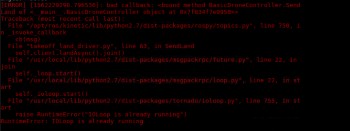

## 前言

> 本篇博客，将对前面的Airsim仿真平台开发过程中遇到过的一系列问题进行记录，并尽可能的记录其中的解决方法。

## 问题一：安装过程中的问题

### 1.1 Windows下ROS的安装（已解决）

> 在机器人控制这一方面，不可避免的会想通过ros对机器人进行控制，而ros在ubuntu下的安装非常方便，在WIndows上安装不如Linux下方便；至少，在接触Airsim之前，我没有在Windows下安装过ros。

第一次在Windows上装ros的时候，还真没有安装成功，在安装一些安装包时，并没有按照其默认路径进行安装，然后也由于刚开始不熟的原因，没有安装成功。因此，后来专门记录写了一篇博客，来记录ros在windows上的安装，其安装过程见[Windows下ROS安装配置](https://ldgyyf.cn/2019/06/27/Airsim/%E5%88%9D%E8%AF%86Airsim%EF%BC%88%E4%BA%8C%EF%BC%89%E4%B9%8BWindows%E4%B8%8BROS%E5%AE%89%E8%A3%85%E9%85%8D%E7%BD%AE/)。

注：如果要使用ros控制，则还是在Ubuntu下控制比较好。我后来记录了Airsim在Ubuntu下的安装笔记。

### 1.2 Ubuntu终端科学上网（已解决）

> Airsim仿真平台开发，与Ubuntu科学上网有什么关系呢？
>
> 有关系，并且是很大的关系，因为Airsim就是微软开发的，其资源很多都是国外的，国内很难下载到。

如果你的Airsim只是在Windows上进行开发，可能更方便，因为Windows下科学上网更简单，但是在下载资源这方面可能还是不如Ubuntu，因为Windows上更多的是网页端下载，在网页端下载一些国外的资源时，有时会很慢，很难下载~

因此，在Ubuntu下进行开发时，保证终端科学上网是一个很重要的前提。这个也是为了后面的Airsim在Ubuntu上的安装做准备。

其安装过程见[Ubuntu终端科学上网](https://ldgyyf.cn/2019/06/27/Linux/ubuntu%E4%B8%8B%E7%A7%91%E5%AD%A6%E4%B8%8A%E7%BD%91/)。

### 1.3 Ubuntu下GPU Tensorflow安装（已解决）

> 在用Airsim做人工智能（深度学习、强化学习）的算法验证这一方面，大部分是用Tensorflow库来验证，当然也有其他的一些，如Keras、pytorch等。但是这些方面这里不考虑，主要以Tensorflow为主。

Ubuntu下安装GPU的Tensorflow时，很容易碰到的一个问题，就是登陆界面重复登陆，这个可能是安装了不合适的版本导致的。因此，我记录了一个稍微比较详细一些的安装文档。

其安装过程见[Ubuntu16下GPU-Tensorflow安装步骤](https://ldgyyf.cn/2019/07/05/Linux/Ubuntu16%E4%B8%8BGPU-Tensorflow%E5%AE%89%E8%A3%85%E8%AF%A6%E7%BB%86%E6%AD%A5%E9%AA%A4/)

### 1.4 Ubuntu下，ros相关报错（已解决）

> 不确定是卸载了一些ros的相关依赖还是什么其他的误操作，在终端执行sudo apt-get update时，提示Hash Sum Minbatch错误。

在网上查找过其解决方法，如：换源、终端翻墙update、换网络、删除/var/list文件都未能解决，最后通过重装系统解决的。虽然重装系统能解决该问题，但并不是一个好方法~

## 问题二：开发过程中的问题

### 2.1 自定义ros后，python线程锁的问题（已解决）

> 自定义了ros，并且同时进行sub和pub时，容易出现python线程锁的问题，具体错误信息如下图：

**解决方法：添加python线程锁**，[参考](https://morvanzhou.github.io/tutorials/python-basic/threading/6-lock/)

### 2.2 Airsim中无人机的控制问题（已解决）

> 默认的，无人机的控制坐标系是NED坐标系，即+x永远朝着正北方飞行，也就是绝对方向控制~
>
> 但是，我们在正常的控制无人机时，采用的坐标系是BODY坐标系，即+x永远朝着机头方向飞行，也就是相对控制~

因此，在真正控制时，需要做一个转换，我这里暂时只考虑了东南西北四个方向。

**解决方法：每次控制时，首先获取无人机的当前角度angle，然后根据angle的角度，确定当前机头朝向~**

**即下图所示，这样就完成了+x永远朝着机头方向前行**

| 机头朝向 |  x轴   |  y轴   |
| :------: | :----: | :----: |
|  North   | x = x  | y = y  |
|   West   | x = y  | y = -x |
|  South   | x = -x | y = -y |
|          |        | y = -x |

### 2.3 Airsim中使用期望速度进行控制的问题（已解决）

> 2.2节说明了Airism中的无人机相对控制的问题（一般给定固定速度），而本节则要说明的是：初始时，设置一个期望速度值，当给定轨迹点时，根据当前距离与目标轨迹点之间的差值，进行速度求解并且归一化，在这其中就会涉及到坐标系转换的一些问题~

举例（暂不考虑Z轴）：无人机起始点（0,0），轨迹点1（10,0），轨迹点2（10，-20），期望速度：2m/s，时间t：1s

- 起始点->轨迹点1：dx = 10 -0 =10，vx = dx / t = 10 / 1 = 10m/s，归一化 vx‘  约等于2m/s，按照2.2的控制方式，此时 vx' = vx'， vy' = vy'，此时机头朝北
- 转向：到达轨迹点1后，左转，左转完成后，此时机头朝西
- 轨迹点1->轨迹点2：dy = -20 - 0 = 20，vy = dy / t = -20m/s，归一化vy' 约等于2m/s，按照2.2的控制方式，此时 vx' = vy'，vy' = vx'（机头朝西）,此时，无人机会朝着South方向运动，并不是West方向。

这样就会存在问题，在轨迹点1到轨迹点2的过程中，我按照了2.2的控制方式，但是无人机却并不是朝着我想要的West方向前行，因此，需要采用坐标系转换的方法来解决该问题：

**说明：**在获取Airsim中无人机的坐标时，我们获取的都是NED坐标系下的xyz值，而我们所采用的这种期望速度方法，实际上是BODY坐标系下的方法，即每次根据BODY坐标系下的xyz值，来进行差值求解，并且进行归一化~

具体的，可以参见[Airsim（六）之多机控制](https://ldgyyf.cn/2019/08/19/Airsim/初始Airsim（六）之多机控制/)中的代码注释部分。

### 2.4 自定义ROS间的通信问题（已解决）

> 其主要问题是，使用ros指令发送消息的时候，需要考虑其中的通信频率问题

ros不同于api控制的地方在于：api控制可以等到该条指令结束后，在执行下一条指令。而ros则会将指令全部寄存在缓存中，也是会执行其发布的每一条命令，但是如果通信频率不一致的话，airsim中的无人机响应其ros指令时可能会出现问题。

目前，测试的是在ros的驱动程序中，设置频率为250HZ，在其控制程序中，设置频率为1HZ，差不多能保证其发送接收一致。

### 2.5 UDP通信间的大图像传输（未解决）

> 尝试了在两台电脑间使用UDP来进行控制，但是在获取Airsim的图像时，如果设置的图像分辨率较大，这时，图像大小会超出的默认最大值，会报错~

会出现这种情况的原因是设置的图像分辨率较大，因此可以将分辨率设置为合适的值，这样是不会报错的，并且可以在接收端的一方，重新对图像的大小进行修改，这样也能达到最初想要的效果，但是如何利用UDP进行大数据传输，这个问题仍然没有解决。

在网上有搜过相关代码，其思想一般都是先将大文件进行打包，然后传输前加一个文件头，另一端接收时，对文件头进行解析，然后进行分段接收。但其python代码较少，并且依靠网上的代码，并没有测试成功过~

## 问题三：相关配置问题

### 3.1 Pixhawk配置（HITL配置）（已解决）

> 参考网上的教程，其Pixhawk大多都是在Windows下配置的，Linux的很少，但是基本也都差不多

总之，在配置Pixhawk的过程中，很花费了一些功夫，主要就是其很容易爆No GPS相关的错误，后来，经过尝试，终于解决了该问题。

其配置过程见[Pixhawk配置（Ubuntu16下HITL配置）](https://ldgyyf.cn/2019/08/22/Airsim/%E5%88%9D%E8%AF%86Airsim%EF%BC%88%E4%B9%9D%EF%BC%89%E4%B9%8BPixhawk%E9%85%8D%E7%BD%AE%EF%BC%88Ubuntu16%E4%B8%8BHITL%E9%85%8D%E7%BD%AE%EF%BC%89/)

## 问题四：各种未解决的问题

### 4.1 Airsim图像，转化成ros的topic之后，和原图有些区别？（未解决）

> 通过API，获取Airsim中的无人机图像，并将其转化为ros后，和原图有些区别，但是不是很大

这里暂时找不到原先的记录了，总之，这个地方是存在问题的~

### 4.2 自定义ROS，强化学习训练不好？（未解决）

> 同样的逻辑，在用api进行强化学习训练测试时，经过30小时左右的训练，大概能训练好，但是添加了自定义的ros，却不行？

暂时也不清楚，是为什么训练不好效果，可能与获取的深度图像不一致有关系，可能与无法用ros进行pause和unpause函数控制有关，可能通信频率设置的不太对。

总之，在github上面很少找到用ros来进行强化学习训练的，或者这种方法就根本不好，也是存在问题~

### 4.3 SITL模式下与.sh文件不兼容（未解决）

> 若在Airsim中使用SITL模式，则只能用UE4提供的环境，如创建的Rolling环境，这时与封装好的sh文件时不兼容的，即启动会报错，无法打开界面~

之所以没有解决，是因为可能是需要下载对应的sh的uproject文件，而这个文件环境是需要在UE4的商店中进行购买的，没有购买，因此这方面也存在问题，也就没有测试过~

### 4.4 SITL模式与Lidar传感器不兼容（未解决）

> 在json中，设置为了SITL模式，并添加Lidar传感器，结果界面可以出来，但是传感器出不来，不知道其原因

## 总结

> 由于主要是在对Airsim仿真平台进行开发研究，更多的是环境相关的配置问题，因此，其中的问题，也算不上什么难点，主要还是对Airsim不太熟悉，后面熟悉后就好了。
>
> 更多的记录的是开发过程中遇到的一些主要问题等

**其中，很多问题不是特别好用文字或图片的形式说明，当中，某些记录可能也不太清楚了，如果有问题，可以和我联系，我的邮箱是:  ldgcug@qq.com**

