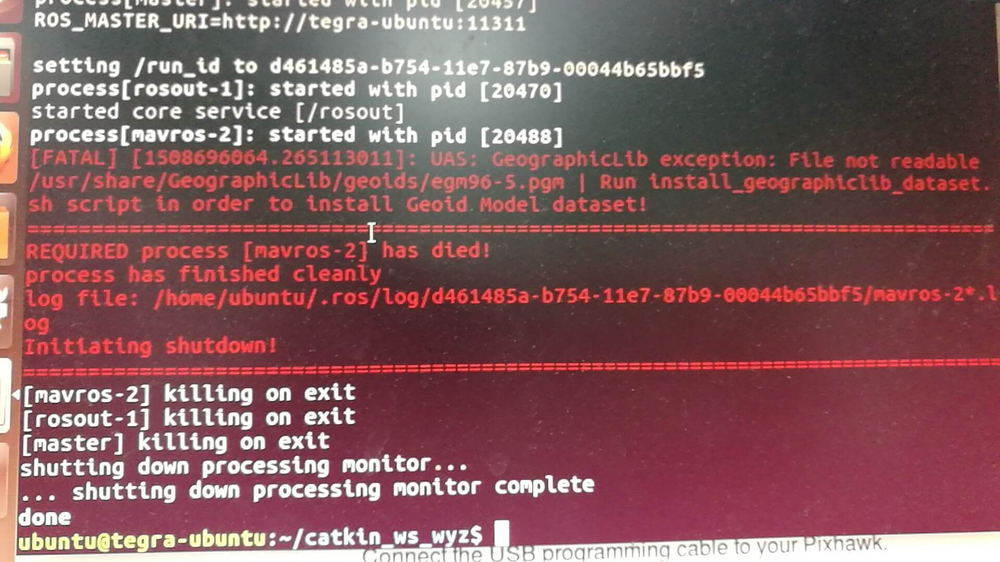
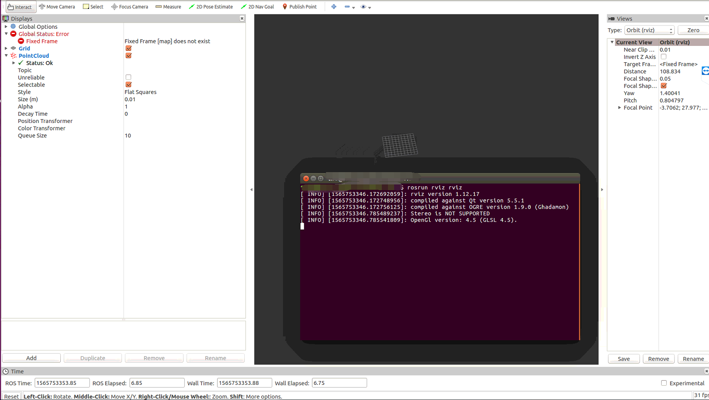
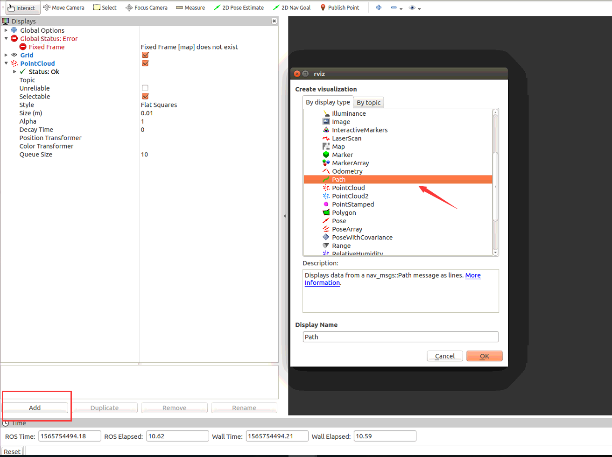
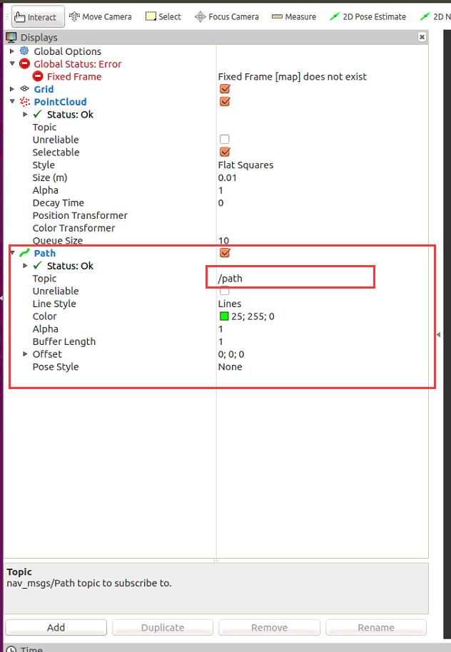
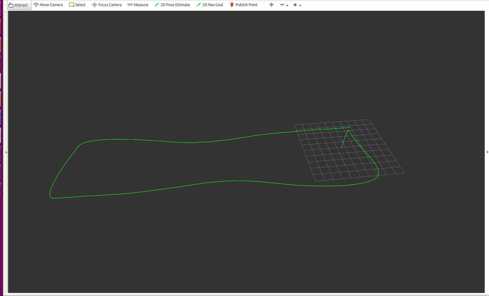
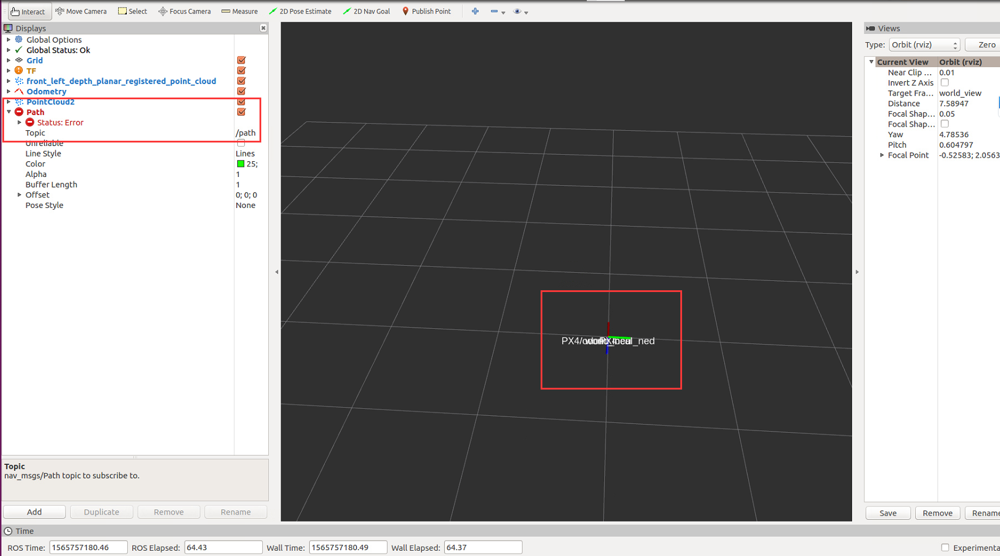
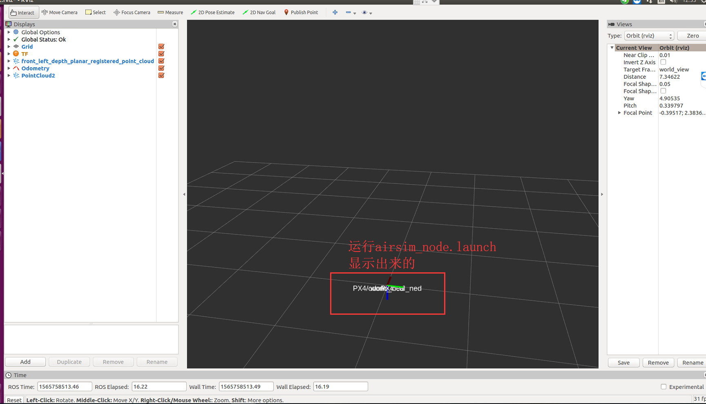
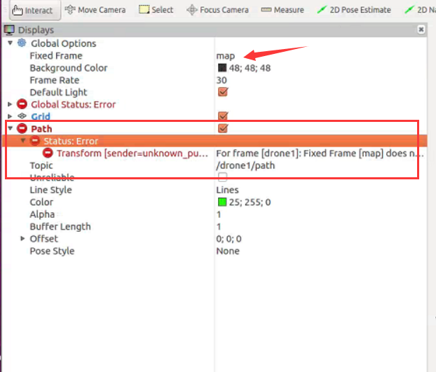
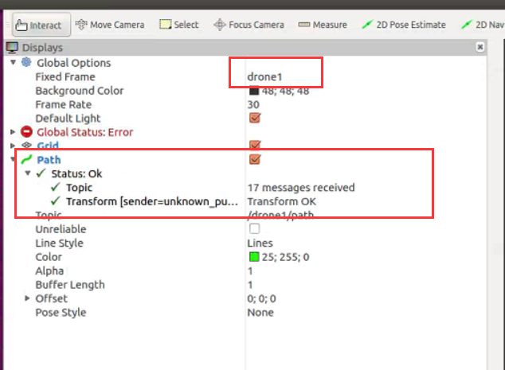
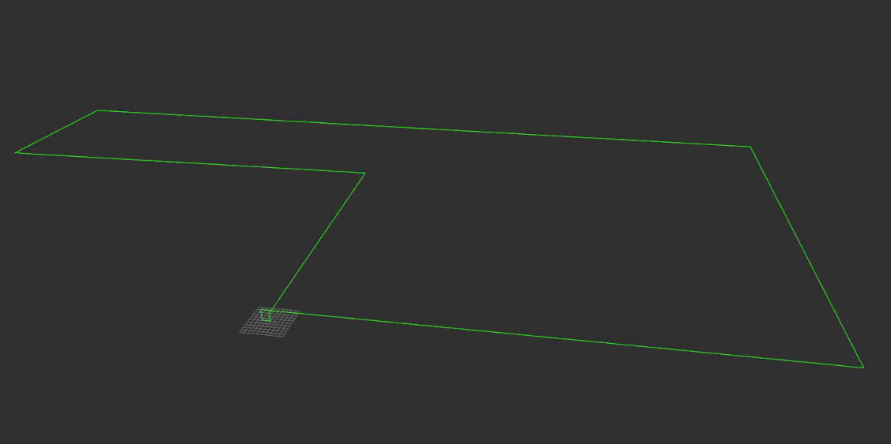

## 前言

> [mavros](http://wiki.ros.org/mavros#mavros.2BAC8-Plugins.sys_status)包允许在运行ROS的计算机、支持MAVLink的飞控板以及支持MAVLink的地面站之间通讯。MAVROS可以用来与任何支持MAVLink的飞控板通讯。
>
> 基于mavros和mavlink协议，实现对airsim的控制

## 说明

> 针对[上一节](https://ldgyyf.cn/2019/07/10/Airsim/%E5%88%9D%E8%AF%86Airsim%EF%BC%88%E5%9B%9B%EF%BC%89%E4%B9%8BQGC%E3%80%81SITL%E3%80%81%E6%88%B7%E5%A4%96UE4%E5%9C%BA%E6%99%AF%E9%85%8D%E7%BD%AE/)中mavros的配置，在安装**./install_geographiclib_datasets.sh（二进制安装）**或者**./src/mavros/mavros/scripts/install_geographiclib_datasets.sh（源码安装）**时，最好加上**proxychains4**，即翻墙安装，因为在重新测试的过程中，初始没有加proxychains4，启动launch文件时，一直报**GeographicLib exception**相关的错误。

**错误提示信息**

```python
[FATAL] [1455208235.573568497]: UAS: GeographicLib exception: File not readable /usr/share/GeographicLib/geoids/egm96-5.pgm | Run install_geographiclib_dataset.sh script in order to install Geoid Model dataset!

================================================================================REQUIRED process [mavros-2] has died!
process has died [pid 2396, exit code -6, cmd /home/ubuntu/catkin_ws_wyz/devel/lib/mavros/mavros_node __name:=mavros __log:=/home/ubuntu/.ros/log/c5fc1ef8-d0dc-11e5-89a3-00044b65bbf5/mavros-2.log].
log file: /home/ubuntu/.ros/log/c5fc1ef8-d0dc-11e5-89a3-00044b65bbf5/mavros-2*.log
Initiating shutdown!
================================================================================
[mavros-2] killing on exit
[rosout-1] killing on exit
[master] killing on exit
shutting down processing monitor...
... shutting down processing monitor complete
done
```



并且，参考网上的方法都没有作用：[参考1](https://blog.csdn.net/sinat_31135199/article/details/78329851)、[参考2](https://blog.csdn.net/abc869788668/article/details/78323395)，其实这两种方法说的都是同一种，即加权限重新安装。

最后在安装时，添加了proxychains4后，则没有报错，上一节也已经更新。

## 一、mavros控制

> 前提：已经按照[上一节](https://ldgyyf.cn/2019/07/10/Airsim/%E5%88%9D%E8%AF%86Airsim%EF%BC%88%E5%9B%9B%EF%BC%89%E4%B9%8BQGC%E3%80%81SITL%E3%80%81%E6%88%B7%E5%A4%96UE4%E5%9C%BA%E6%99%AF%E9%85%8D%E7%BD%AE/)的配置，安装了mavros、mavlink及PX4的编译等，且settings.json也配置为PX4

### 1.1 启动环境

**（1）编译PX4**

> 编译，等待UDP的连接

```python
cd PX4/Firmware
make posix_sitl_ekf2 none_iris
```

**（2）运行UE4Editor，启动UE4环境，加载airsim**

> **UE4Editor**文件在**~/UnrealEngine/Engine/Binaries/Linux/**目录下

双击运行UE4Editor即可

**（3）启动px4.launch文件**

```python
cd ~/catkin_ws
source devel/setup.bash
roslaunch mavros px4.launch fcu_url:="udp://:14540@127.0.0.1:14557"
```

### 1.2 mavros控制

> 基于UE4Editor启动，并加载的Rolling环境

**（1）起飞降落的命令控制**

> 根据GPS的坐标进行起飞降落控制，目前还不能通过命令实现drone的飞行

```python
rosservice call /mavros/cmd/arming true
rosservice call /mavros/cmd/takeoff -- 0 0 47.6420 -122.1404 126.1
rosservice call /mavros/cmd/land -- 0 0 47.6420 -122.1404 123
```

#### 1.2.1 代码组成

>主要是参考[darknight-007/docking](https://github.com/darknight-007/docking)的代码，并对他/她的代码进行测试，发现存在一点问题，于是在testVelocityControl.py中添加了自己的代码，目前飞行没有问题，主要基于速度控制实现了一个长方形的飞行控制，其轨迹图见3.4
>
>直接查看[所有代码](https://github.com/ldgcug/Airsim_Controller/tree/master/Mavros_Controller)

主要包含三部分，PID.py、VelocityController.py、testVelocityControl.py。其中PID.py和VelocityController.py和参考的代码完全一致，没有做改动，主要是修改testVelocityControl.py等

#### 1.2.2 testVelocityControl.py结构

> 目前起飞时通过设置的GPS坐标来起飞的，即不论drone在哪，都会在设置的GPS点处进行起飞，虽然降落同样也是设置的和起飞的GPS坐标差不多，但是它是当前位置降落
>
> 关于起飞和降落这一部分还存在一些问题

```python
#轨迹点（4个轨迹点，起飞后依次到达，实现长方形的飞行控制）
navigate = [
 [0,7,3],
 [30,7,3],
 [30,0,3],
 [0,0,3]
]
navigate_count = 0 #用于记录当前的目标点

class QuadController:
    #给target目标赋值
    target = Pose()
    target.position.x = navigate[navigate_count][0]
    target.position.y = navigate[navigate_count][1]
    target.position.z = navigate[navigate_count][2]
    
    def __init__(self):
        self.desire_v = 1.5 #设定期望速度
        while not rospy.is_shutdown():
            #起飞后，要将mode修改为OFFBOARD才能控制飞行
            set_mode = rospy.ServiceProxy('/mavros/set_mode',SetMode)
            mode = set_mode(custom_mode = 'OFFBOARD')
            print('change mode to OFFBOARD:',count)
            count += 1
            #且必须要发布topic才行，不发布修改mode不起作用（还不太明白是为啥）
            self.des_vel = vController.update(self.cur_pose)
            vel_pub.publish(self.des_vel)
            rate.sleep()
            
            if self.isReadyToFly:
                x1,y1,z1 = self.cur_pose.pose.position.x,self.cur_pose.pose.position.y,self.cur_pose.pose.position.z            

                if((x1 - self.target.position.x) **2 +(y1 - self.target.position.y)**2 +(z1 - self.target.position.z) **2) < 0.5**2:#设定一个阈值，使得无人机当前到达目标区域附近即可更新目标点
                    #通过切换mode为LOITER实现悬停，否则会执行之前的速度指令
                    set_mode = rospy.ServiceProxy('/mavros/set_mode',SetMode)
                    mode = set_mode(custom_mode = 'LOITER')
                    rate.sleep()
                    
                    #到达当前目标点后，更新目标点的下一个位置
          			global navigate_count
                    navigate_count += 1
                    if navigate_count < len(navigate):
                        self.target.position.x = navigate[navigate_count][0]
                        self.target.position.y = navigate[navigate_count][1]
                        self.target.position.z = navigate[navigate_count][2]
                        vController.setTarget(self.target)
                        print('cur_pose:',[x1,y1,z1])
                #速度归一化为期望速度
                self.des_vel = vController.update(self.cur_pose)
                vx,vy = self.des_vel.twist.linear.x,self.des_vel.twist.linear.y
                vx_ = 1.0 * vx / (math.sqrt(vx**2 + vy**2)) *self.desire_v
                vy_ = 1.0 * vy / (math.sqrt(vx**2 + vy**2)) *self.desire_v

                self.des_vel.twist.linear.x,self.des_vel.twist.linear.y = vx_,vy_
                
                vel_pub.publish(self.des_vel)#发布速度指令
           #到达所有轨迹点后，降落，同样要先悬停，进行速度清0
           if navigate_count >= len(navigate):
                set_mode = rospy.ServiceProxy('/mavros/set_mode',SetMode)
                mode = set_mode(custom_mode = 'LOITER')
                rate.sleep()
                self.land()
                break
                
     def arming(self): #解锁
     def takeoff(self):#起飞
     def land(self):#降落
```


## 二、rviz安装及测试

> 安装rviz，是为了实时显示drone的飞行轨迹，轨迹也可以用QGC来显示，但是没有rviz好

### 2.1 rviz安装

**安装rviz**

```python
sudo apt-get install ros-kinetic-rviz
```

**环境检测及安装**

在使用**rosmake rviz**命令的时候，提示我没有rosmake，因此在第2步，先安装了rosmake

```python
rosdep install rviz
sudo apt-get install python-rosmake
rosmake rviz
```

### 2.2 运行rviz

**在新终端运行roscore，启动rosmaster**

```python
roscore
```

**在另一个新终端运行rviz**

```python
rosrun rviz rviz
```



## 三、rviz实时显示mavros控制飞行轨迹

### 3.1 启动UE4环境

> 参照**1.1节**

### 3.2 mavros控制代码里面发布相关topic

通过使用**nav_msgs/Path**来实现，其结构为

```python
std_msgs/Header header
	uint32 seq
	time stamp
	string frame_id
geometry_msgs/PoseStamped[] poses
	std_msgs/Header header
		uint32 seq
		time stamp
		string frame_id
	geometry_msgs/Pose pose
		geometry_msgs/Point position
			float64 x
			float64 y
			float64 z
		geometry_msgs/Quaternion orientation
			float64 x
			float64 y
			float64 z		
			float64 w
```

（1）添加相关代码（不完整）

> 主要是先获取drone的当前姿态数据，其数据结构见上，然后将该数据用nav_msgs/Path发布出去

```python
from geometry_msgs.msg import Pose, PoseStamped
from nav_msgs.msg import Path

path = Path()
class QuadController:
    
    def __init__(self):
        pos_sub = rospy.Subscriber('/mavros/local_position/pose', PoseStamped, callback=self.pos_cb)#通过该topic获取其相对位置坐标
        self.path_pub = rospy.Publisher('/path',Path,queue_size=10)#发布topic
        

    def pos_cb(self, msg):
        # print msg
        self.cur_pose = msg
        global path
        path.header = msg.header
        pose = PoseStamped()
        pose.header = msg.header
        pose.pose = msg.pose 
        path.poses.append(pose)
        self.path_pub.publish(path)
```

### 3.3 启动rviz

> 目前是通过在终端输入命令来启动rviz的，其实也可以写在launch文件里面

**（1）命令启动rviz**

​	由于**3.1节**里启动了px4.launch文件，因此不需要再启动roscore

```
rosrun rviz rviz
```

**（2）添加代码中发布的相关的topic**

在打开的rviz界面中，点击Add，然后选择添加Path



则会看到，左边多出了Path的相关信息，然后在Topic的右侧写入刚才发布的topic（/path）



### 3.4 运行mavros控制代码

**rviz显示**

则在rviz里面能看到飞行轨迹了，我这里设置的mavros是飞行一个长方形的轨迹



### **3.5 说明**：

​	airsim里面也自带了一些rviz.launch文件，进行启动，我之前有测试过，启动launch之后，然后显示飞行轨迹时有报错，因此不采用这种方法，也没有去解决该错误，下图左边框出部分是报错信息，也没有成功显示飞行轨迹



​	顺带介绍一下，运行airsim里自带的这些launch文件的步骤，[github详情](https://github.com/microsoft/AirSim/tree/master/ros/src/airsim_ros_pkgs)

​	**（1）升级cmake**（要求cmake3.10版本以上）

> <font color="red">注意一定不要先卸载cmake，即执行**sudo apt-get autoremove cmake**命令，执行该命令后，会把ros的一些相关依赖和mavros给卸载掉，若执行了则又需要重装ros</font>

​		首先，去[cmake官网](https://cmake.org/download/)手动下载cmake3.12.2，或者直接快捷跳到[github](https://github.com/Kitware/CMake/releases?after=v3.13.4)下载地址，我这里采用命令下载

```python
wget proxychains4 https://github.com/Kitware/CMake/releases/download/v3.12.2/cmake-3.12.2-Linux-x86_64.tar.gz
```

​		解压：

```python
tar zxvf cmake-3.12.2-Linux-x86_64.tar.gz 
```

​		创建软连接：

```python
sudo mv cmake-3.12.2-Linux-x86_64 /opt/cmake-3.12.2
sudo ln -sf /opt/cmake-3.12.2/bin/* /usr/bin
```

​		最后，查看cmake版本

```python
cmake --version

输出：
cmake version 3.12.2

CMake suite maintained and supported by Kitware (kitware.com/cmake).
```

​	**（2）编译**(catkin build或catkin_make都可以)

```python
cd Airsim/ros
catkin build
```

​	**（3）运行**

​		只是为了显示rviz，运不运行airsim_node.launch都无所谓，但是添加了airsim_node.launch之后，rviz界面会多出一个东西，具体见下图

```python
source devel/setup.bash
roslaunch airsim_ros_pkgs airsim_node.launch
roslaunch airsim_tutorial_pkgs rviz.launch 
```



**但是这个ros里面的airsim_node.launch，应该就发布了一些可以控制的命令topic，关于具体的控制，则没有去研究**

## 四、rviz实时显示自定义ros控制飞行轨迹

> 这个关于自定义的ros控制，然后用rviz去显示器轨迹的时候，真的耗了我不少的功夫，原因在于网上的教程或说明更多的是教你如何写代码，并且用的是别人创建好的ros包，而且没有去获取机器人的位置。关于自己定义的ros包，没有什么说明。总之与我所面临的问题不太一样，后来经过测试，终于发现了其问题所在。

由于对ros和rviz不太熟，甚至最开始一度觉得自定义的ros，需要发布tf信息即可。而我的ros发布的消息并没有tf。直接说问题吧

**原来的mavros控制下，其rviz相关代码如下，然后在rviz里面输入发布的topic就可以了**

```python
from geometry_msgs.msg import Pose, PoseStamped
from nav_msgs.msg import Path

path = Path()
class QuadController:
    
    def __init__(self):
        pos_sub = rospy.Subscriber('/mavros/local_position/pose', PoseStamped, callback=self.pos_cb)#通过该topic获取其相对位置坐标
        self.path_pub = rospy.Publisher('/path',Path,queue_size=10)#发布topic
        

    def pos_cb(self, msg):
        self.cur_pose = msg
        global path
        path.header = msg.header
        pose = PoseStamped()
        pose.header = msg.header
        pose.pose = msg.pose 
        path.poses.append(pose)
        self.path_pub.publish(path)
```

自定义ros的rviz显示，按照道理，和上面代码差不多，但有部分需要修改，最开始按照上面的代码运行后，在rviz里显示下面的错误（这个错误其实就是一直在提示map的Fixed Frame不对，不存在，在mavros是不需要这个地方的）



后来，将其代码进行修改，代码参考了[玩转四旋翼无人机](http://www.yanglajiao.com/article/wendox/53905501)，但是并不需要进行tf广播，而且里面的tf广播好像还存在问题。修改后的代码如下：

```python
#!/usr/bin/env python
# -*-coding:utf-8 -*-

import rospy
from nav_msgs.msg import  Path
from geometry_msgs.msg import PoseStamped

class path(object):
    def __init__(self):
        self.pose_sub = rospy.Subscriber('/drone1/airsimPose',PoseStamped,self.add_pose_path)
        self.path_pub = rospy.Publisher('/drone1/path', Path, queue_size=10)
        self.path = Path()
        
    def add_pose_path(self,msg):
        self.path.header = msg.header
        self.path.header.frame_id = 'drone1' #这个frame_id很重要
        pose = PoseStamped()
        pose.header = msg.header
        pose.pose = msg.pose
        #下面的取相反值，是因为airsim的坐标和rviz的坐标不太一样，相反就刚好是其轨迹
        #否则，airsim里向上值是负的，而rviz会显示的向下飞
        pose.pose.position.z = -pose.pose.position.z
        pose.pose.position.y = -pose.pose.position.y
        self.path.poses.append(pose)
        self.path_pub.publish(self.path)
        print('path',[msg.pose.position])

if __name__=='__main__':
    rospy.init_node('airsim_path')
    mpath = path()
    while not rospy.is_shutdown():
        rospy.spin()
```

然后，在rviz里面，将Fixed Frame修改为自定义的frame_id，这样就不会报错。



**最后，显示自定义的ros控制的飞行轨迹**



## 总结

> 关于mavros，现在理解的还不太多，但对其控制逻辑也有了一个基本的了解，其逻辑如下

（1） **解锁：**首先完成解锁动作

（2） **起飞：**控制起飞（从特定的经纬度处起飞，暂时还没有对起飞进行优化）

（3） **模式切换：**起飞后，若要执行飞行命令，则需要将mode切换为OFFBOARD（并且在切换的过程中，必须要发布命令，否则切换无效）。

（4） **给定轨迹点：**通过距离差值给速度，并且设定期望速度，最后对速度进行归一化。

（5） **悬停：**到达目标点后，需要进行悬停操作，否则，之前的速度还会存在影响，即对速度进行清零操作。Mavros的悬停操作为切换模式，将mode切换为LOITER即可实现悬停。

（6） **降落：**降落前，最好也先悬停一下，在进行降落。同样，和起飞类似，也是给定经纬度进行降落，不过降落好像并不是在特定位置降落。

若要实现多个轨迹点的操作，则在到达目标点并悬停后，重新给定一个轨迹点即可。

## 参考链接

- [rviz python代码](https://answers.ros.org/question/278616/how-to-create-a-publisher-about-trajectory-path-then-show-it-in-rviz/)

- [ros的可视化工具rviz的安装与运行](https://blog.csdn.net/baidu_38485156/article/details/81201079)

- [cmake升级](https://www.linuxidc.com/Linux/2018-09/154165.htm)


