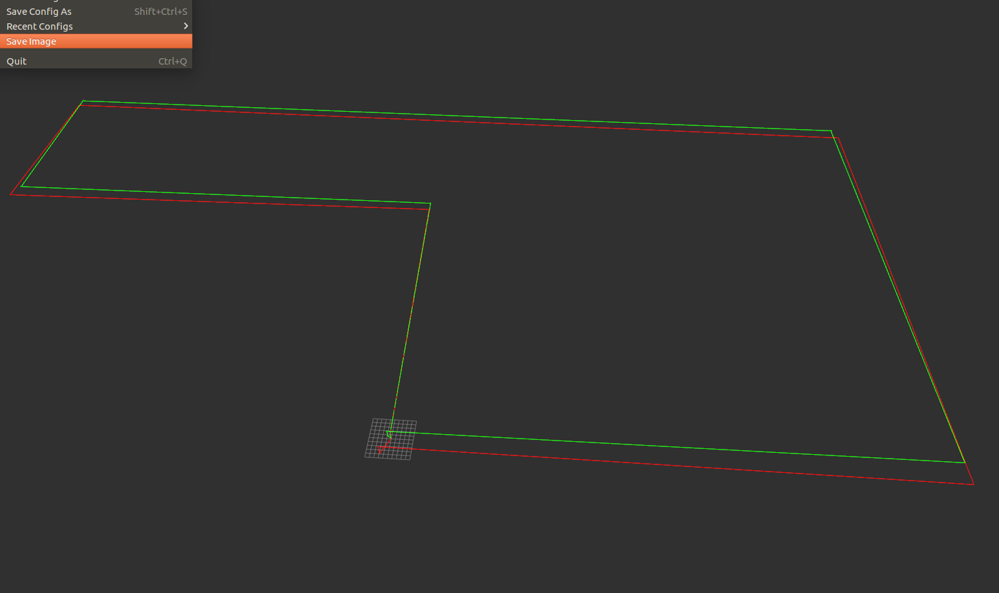
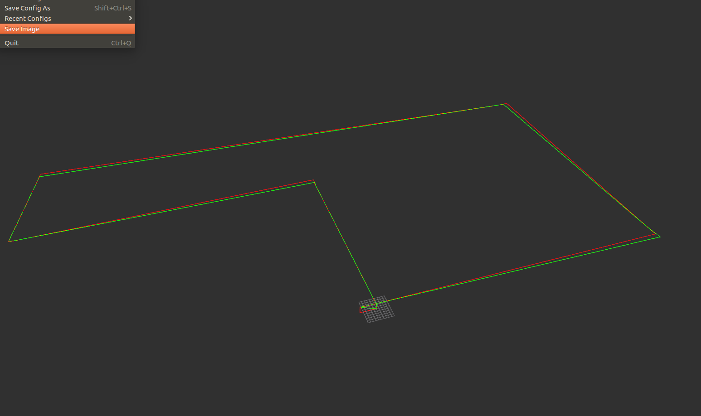

## 前言

> 之前的控制部分都是在单个drone或car的条件下进行控制的，本篇博客将基于多个drone进行控制

## 一、settings.json设置

> 多机的配置如下，其中如果要设置某一个drone的初始角度，则只需要修改Yaw的值即可。
>
> Yaw的值一般取**[0,90,-90,180]**这4个值中的一个
>
> 这里的drone2的Yaw设置的为180，通过api获取的yaw为-3.14

```json
{
  "SeeDocsAt": "https://github.com/Microsoft/AirSim/blob/master/docs/settings.md",
  "SettingsVersion": 1.2,
  "SimMode":"Multirotor",

  "Vehicles":{
  	"Drone1":{
      "VehicleType":"SimpleFlight",
      "X":0,"Y":0,"Z":0,
      "Pitch":0,"Roll":0,"Yaw":0
	},

    "Drone2":{
      "VehicleType":"SimpleFlight",
      "X":4,"Y":0,"Z":0,
      "Pitch":0,"Roll":0,"Yaw":180
    }
  }
}
```

## 二、代码部分

> 直接查看[所有代码](https://github.com/ldgcug/Airsim_Controller)

### 2.1 API控制

 **connect_simulator.py**

> 下面只展示一些比较核心的代码

```python
class Connect(object):
    def __init__(self,vehicle_name):
		if vehicle_name is None:
			vehicle_name = 'Drone1'

		self.vehicle_name = vehicle_name

		# connect simulator
		self.client = airsim.MultirotorClient()
		self.client.confirmConnection()
		self.client.enableApiControl(True,vehicle_name)
		self.client.armDisarm(True,vehicle_name)
    
    # get data from airsim
	#获取drone1的姿态信息 
	def getQuadrotorPose_Drone1(self): #(x,y,z)
		init_drone1_x,init_drone1_y,init_drone1_z = 0,0,0#由于在settings.json里面可能会给drone设置坐标，因此这里的xyz的值要与json文件里的值进行对应，之所以这样做，是因为不论在json文件中给drone设定何处的xyz坐标值，实际获取的drone的初始坐标都是（0,0,0），因此才加上了初始值
		state = self.client.simGetVehiclePose(vehicle_name=self.vehicle_name)
		state.position.x_val += init_drone1_x
		state.position.y_val += init_drone1_y
		state.position.z_val += init_drone1_z
		print('position:',[state.position.x_val,state.position.y_val,state.position.z_val])
		return state
    
    #获取drone2的姿态信息
    def getQuadrotorPose_Drone2(self): #(x,y,z)
		init_drone2_x,init_drone2_y,init_drone2_z = 4,0,0 #这里的x=4就对应于json中的drone2的x坐标值
		state = self.client.simGetVehiclePose(vehicle_name=self.vehicle_name)
		state.position.x_val += init_drone2_x
		state.position.y_val += init_drone2_y
		state.position.z_val += init_drone2_z
		print('position:',[state.position.x_val,state.position.y_val,state.position.z_val])
		return state
```


#### 2.1.1位置控制

**Drone1控制**

```python
from connect_simulator import Connect  
class Navigate(object):
    def __init__(self):
        self.keyControl = Connect(vehicle_name='Drone1')
        # 这里又设定了一个初始坐标值，是为了后面的计算，并且这里的初始值也与json里对应
		self.init_drone1_x,self.init_drone1_y,self.init_drone1_z = 0,0,0
    
    def auto_navigate(self,navigate_point,direction):
		x,y,z,v = navigate_point[0],navigate_point[1],navigate_point[2],navigate_point[3] #轨迹点目标值
		# 这里之所以要减去初始值，是因为在使用moveByPosition的API时，无人机并不是到目标值就停止
        # 例如，xyz的初始坐标为（0,0,0），目标点（20,0,-3），无人机会在起飞后，最终到达（20,0,-3）停止
        # 若xyz的初始坐标为(10,0,0)，目标点（20,0,-3），无人机最终会到达（30,0,-3）处停止
        # 因此，在获取到目标点之后，减去xyz的初始值即可
        x -= self.init_drone1_x
		y -= self.init_drone1_y
		z -= self.init_drone1_z
		self.keyControl.moveByPosition(x,y,z,v)
		self.keyControl.getQuadrotorPose_Drone1()
		if direction == "left":
			self.keyControl.yaw_left()
		elif direction == "right":
			self.keyControl.yaw_right()
		print('direction',self.keyControl.direction)

if __name__ == "__main__":

	control = Navigate()
	# 设定轨迹点
	navigate_point = [
		[78,-1.5,-3,5],
		[78,-126,-3,5],
		[124,-130,-3,5],
		[124,124,-3,5],
		[3,124,-3,5],
		[0,0,-3,5]
	]
    # 设定转角方向
	direction =[
		"left",
		"right",
		"right",
		"right",
		"right",
		"right"
	]

	control.keyControl.takeoff()

	control.keyControl.getQuadrotorPose_Drone1()

	for i in range(len(navigate_point)):
		control.auto_navigate(navigate_point[i],direction[i])

	control.keyControl.land()

	control.keyControl.reset()
```

**Drone2控制**

和Drone1的控制代码基本完全一样，只是xyz的初始坐标值可能需要更换

```python
from connect_simulator import Connect  
class Navigate(object):
    def __init__(self):
		self.keyControl = Connect(vehicle_name='Drone2')
		self.init_drone2_x,self.init_drone2_y,self.init_drone2_z = 4,0,0
    
    def auto_navigate(self,navigate_point,direction):
		x,y,z,v = navigate_point[0],navigate_point[1],navigate_point[2],navigate_point[3]
		x -= self.init_drone2_x
		y -= self.init_drone2_y
		z -= self.init_drone2_z
```

#### 2.1.2 速度控制

**Drone1控制**

关于下面代码中的坐标系转换问题，[坐标转换参考](https://zhuanlan.zhihu.com/p/22597258)

```python
NED = Body * A (yaw，直接获得的偏航角)
Body = NED * A(-yaw，获得的偏航角取负)
```

```python
from connect_simulator import Connect  
class Move(object):
	def __init__(self):
		self.keyControl = Connect(vehicle_name='Drone1')
		self.desire_v = 2 #期望速度
		self.thr = 2  # 半径阈值
    
    # NED坐标转换为BODY坐标
    # 在实际控制过程中，从airsim中获取的姿态信息是属于NED坐标，而我们控制drone则属于BODY坐标控制
    # BODY坐标控制，即以drone的机头为前方，+x表示正前方飞行，+y表示正右方飞行，不论机头朝向何方，都是该控制规则
    def NED_TO_BODY(self,ned_x,ned_y,ned_z):
		imu = self.keyControl.getImuInfo() # 获取drone的imu信息
		self.hudu = -imu[2] # imu:(pitch,roll,yaw)，获取的yaw取值范围为（-3.14，+3.14），即实际获取的为弧度信息；这里为什么添加了一个“-”，取相反值，是因为 NED = BODY * A (A表示转换矩阵)，如果要获取BODY坐标，则  BODY = NED * A^(-1)，这里涉及到了逆矩阵，还要考虑矩阵是否可逆；因此可以用  BODY = NED * A ，A里面的参数为-yaw即可
		self.angle = round(self.hudu,2) / 3.14 * 180 #将弧度转换为角度
		NED = np.array([ned_x,ned_y,ned_z]) #转换为数组形式，方便后面矩阵相乘
		matrix_B_N = np.array([[round(math.cos(self.hudu),2),round(math.sin(self.hudu),2),0],
							   [round(-math.sin(self.hudu),2),round(math.cos(self.hudu),2),0],
							   [0,0,1]]) #转换矩阵A
		Body = NED.dot(matrix_B_N) # 矩阵乘法
		return Body
    
    def auto_movebyvelocity(self,target_position,direction):

		# 这里获取的xyz,x1,y1都是属于NED坐标
		x,y,t = target_position[0],target_position[1],target_position[3]
		state = self.keyControl.getQuadrotorPose_Drone1() #获取的实际坐标值已经在connect中进行了添加初始化坐标值操作
		x1,y1 = state.position.x_val,state.position.y_val

		delta_x ,delta_y = x-x1,y-y1 # 获取xy方向的差值
		vx,vy = delta_x / t,delta_y / t  # 设定t=1，根据distance得到v

		body = self.NED_TO_BODY(vx,vy,0) #将NED坐标转换为BODY坐标
		vx,vy = body[0],body[1] #BODY
		
        # 对速度进行归一化，并用vx_,vy_表示真正要输入的速度控制值
		vx_ = vx / (math.sqrt(pow(delta_x,2) + pow(delta_y,2))) * self.desire_v
		vy_ = vy / (math.sqrt(pow(delta_x,2) + pow(delta_y,2))) * self.desire_v
		vz = 0

		
		while math.sqrt(pow((x - x1),2) + pow((y-y1),2)) > self.thr:#判断是否到达目标区域

			if math.sqrt(pow((x - x1),2) + pow((y-y1),2)) <= self.thr:
				self.keyControl.moveByVelocity(0,0,0,1) # 到达目标区域，速度赋值为0
			else:
				delta_x ,delta_y = x-x1,y-y1
				vx,vy = delta_x / t,delta_y / t

				print('target position:',[x,y],'current position:',[x1,y1])
				print('vx:',vx,'vy:',vy)


				body = self.NED_TO_BODY(vx,vy,0)
				vx,vy = body[0],body[1] #BODY

				
				vx_ = vx / (math.sqrt(pow(delta_x,2) + pow(delta_y,2))) * self.desire_v
				vy_ = vy / (math.sqrt(pow(delta_x,2) + pow(delta_y,2))) * self.desire_v

				temp_vx_,temp_vy_ = vx_,vy_
                
				# 根据不同的方向，实现+x永远朝着drone的机头正前方飞行
				if self.direction == "North":
					print('North')
					vx_,vy_ = temp_vx_,temp_vy_ # x,y
				elif self.direction == "West": 
					print('West')
					vx_,vy_ = temp_vy_,-temp_vx_ # y -x
				elif self.direction == "South":
					print('South')
					vx_,vy_ = -temp_vx_,-temp_vy_  # -x -y
				elif self.direction == "East":
					print('East')
					vx_,vy_ = -temp_vy_,temp_vx_ # -y x
				print('vx_:',vx_,'vy_:',vy_)
				print('\n')
				self.keyControl.moveByVelocity(vx_,vy_,vz,t)# 发送归一化后的速度控制指令，这里的t=1，即实现每秒飞行 1 * self.desire_v 米，因此不需要添加sleep操作

			state = self.keyControl.getQuadrotorPose_Drone1()#获取新的坐标值
			x1,y1 = state.position.x_val,state.position.y_val
        # 进行转角操作
        if direction == "left":
			self.keyControl.yaw_left()
		elif direction == "right":
			self.keyControl.yaw_right()

		self.direction = self.keyControl.direction #获取新的无人机机头朝向

		print('direction',self.keyControl.direction)

if __name__ == "__main__":
	control = Move()

	cmd_vel = [
		[78.0,-1.5,-3,1.0],
		[78.0,-127.0,-3,1.0],
		[125.0,-127.0,-3,1.0],
		[125.0,125.5,-3,1.0],
		[1.5,124.0,-3,1.0],
		[0.0,0.0,-3,1.0]
	]
	direction = [
		"left",
		"right",
		"right",
		"right",
		"right",
		"right"
	]

	control.keyControl.takeoff()
	control.direction = control.keyControl.direction
	print('init direction',control.direction)

	for i in range(len(cmd_vel)):
		control.auto_movebyvelocity(cmd_vel[i],direction[i])

	control.keyControl.land()
	control.keyControl.reset()
```

**Drone2控制**

```python
from connect_simulator import Connect  
class Move(object):

	def __init__(self):
		self.keyControl = Connect(vehicle_name='Drone2')
		self.desire_v = 2
		self.thr = 2
其余的部分基本完全一样，只是在获取坐标的时候，将state = self.keyControl.getQuadrotorPose_Drone1()换成state = self.keyControl.getQuadrotorPose_Drone2()即可
```

### 2.2 UDP控制

> 目前暂时不考虑两台机器间的UDP通信控制，和API控制差不多的思想
>
> 但在UDP的单机控制代码中，还没有将速度控制修改为2.1里面的坐标系转换和期望速度控制，这点需要注意

#### 2.2.1 位置控制

#### 2.2.2 速度控制

### 2.3 ROS控制

 **connect_simulator.py**

> 更多的介绍和API控制中，稍微有些区别的地方，公共的地方将不再显示

```python
import threading
class Connect(object):
    def __init__(self,vehicle_name):
        self.count = 0 # 添加了计数器，用于判断ros的发送与接收频率是否接近一致
        self.lock = threading.Lock() # 添加线程锁
    
    # control command 
    # 例如，在起飞的过程中，添加了一个线程锁，确保该指令执行完成
	def takeoff(self):
		self.lock.acquire()
		self.client.takeoffAsync(vehicle_name=self.vehicle_name).join()
		print('takeoff finished')
		self.lock.release() 
    
    #在进行速度控制，通过count判断，这边接收到了多少天来自控制程序中的ros命令
    def moveByVelocity(self,data):
		self.lock.acquire()
		vx,vy,vz,t = data.vx,data.vy,data.vz,data.t
		self.client.moveByVelocityAsync(vx,vy,vz,t,vehicle_name=self.vehicle_name).join()
		self.count += 1
		#self.client.moveByVelocityAsync(0,0,0,0.01).join()
		print('linear velocity is:',vx,vy,vz)
		self.lock.release() 
		print('\n')
		print('count:',self.count)
		print('\n')
    
    # get data from airsim
    # 和之前有点不同的是，在这里获取drone的坐标值时，没有在加上初始坐标值
    def getQuadrotorPose(self): #(x,y,z)
		state = self.client.simGetVehiclePose(vehicle_name=self.vehicle_name)
		#print('position:',[state.position.x_val,state.position.y_val,state.position.z_val])
		return state
```

**drone1_pub_topic.py**

```python
from connect_simulator import Connect
class AirsimPubTopic(object):
	def __init__(self):
		self.vehicle_name = 'Drone1'
		self.client = Connect(vehicle_name=self.vehicle_name)
        #在发布的时候，一定要注意topic名称，这里为/drone1/airsimPose，要将drone1和drone2区分开
        self.rotor_pose_pub 	=	rospy.Publisher('/drone1/airsimPose',PoseStamped,queue_size=1)
        
        # init difference coordinates (x,y,z)
		# =========  when I set the (x,y,z) in settings.json ,I got the coordinates will be (0,0,0) ==========
		'''
			"Drone1":{
			      "VehicleType":"SimpleFlight",
			      "X":0,"Y":0,"Z":0
    		}
		'''
        # 在这里设定了初始的对应于json的xyz坐标，但是设置的都为0，即相当于没有设置，在控制程序中进行了相关操作
		self.ue4_x = 0
		self.ue4_y = 0
		self.ue4_z = 0
        self.rate = rospy.Rate(250)  # 频率设定的为250hz
    
    def GetAirsimPose(self):

		multirotor_state = self.client.getQuadrotorPose()
		pose = multirotor_state.position
		orientation = multirotor_state.orientation

		self.simPose = PoseStamped()
        # 在该处加上了xyz的初始坐标，而不是在connect里面添加
		self.simPose.pose.position.x = pose.x_val + self.ue4_x
		self.simPose.pose.position.y = pose.y_val + self.ue4_y
		self.simPose.pose.position.z = pose.z_val + self.ue4_z
		self.simPose.pose.orientation.w = orientation.w_val
		self.simPose.pose.orientation.x = orientation.x_val
		self.simPose.pose.orientation.y = orientation.y_val
		self.simPose.pose.orientation.z = orientation.z_val
		self.simPose.header.stamp = rospy.Time.now()
		self.simPose.header.seq = 1
		self.simPose.header.frame_id = "airsim_pose"
```

**drone1_sub_topic.py**

```python
from connect_simulator import Connect

class AirsimSubTopic(object):

	def __init__(self):

		self.vehicle_name = 'Drone1'
		self.client = Connect(vehicle_name=self.vehicle_name)
		self.direction = self.client.direction
        # 这里订阅的topic的名称也为drone1
        self.subTakeoff = rospy.Subscriber("/drone1/airsim/takeoff",Empty,self.SendTakeoff)
        self.rate = rospy.Rate(250)  # 250hz
    
    #在这里进行了转换，即保证+x永远朝着机头正前方飞行
    def SendVelocity(self,data):
		#self.client.moveByVelocity(data.vx,data.vy,data.vz,data.t)
		vx,vy,vz,t = data.vx,data.vy,data.vz,data.t
		print('velocity direction',self.direction)
		if self.direction == "North":
			data.vx ,data.vy = vx,vy # x,y
		elif self.direction == "West":
			data.vx ,data.vy = vy,-vx # y,-x
		elif self.direction == "South": 
			data.vx ,data.vy = -vx,-vy # -x,-y
		elif self.direction == "East":
			data.vx ,data.vy = -vy,vx # -y,x
		self.client.moveByVelocity(data)
```

**drone2_pub_topic.py**

```python
from connect_simulator import Connect
class AirsimPubTopic(object):
	def __init__(self):
		self.vehicle_name = 'Drone2'
		self.client = Connect(vehicle_name=self.vehicle_name)
        #这里的名称为/drone2/airsimPose
        self.rotor_pose_pub 	=	rospy.Publisher('/drone2/airsimPose',PoseStamped,queue_size=1)
        
        # 这里设置了drone2的坐标，其实相当于没有设置
        self.ue4_x = 0
		self.ue4_y = 0
		self.ue4_z = 0

		self.rate = rospy.Rate(250)  # 10hz
其他部分基本一样
```

**drone2_sub_topic.py**

```python
from connect_simulator import Connect
class AirsimSubTopic(object):
	def __init__(self):
		self.vehicle_name = 'Drone2'
		self.client = Connect(vehicle_name=self.vehicle_name)
		self.direction = self.client.direction
		#subScriber
        # 名称不一样，为drone2
		self.subTakeoff = rospy.Subscriber("/drone2/airsim/takeoff",Empty,self.SendTakeoff)
        self.rate = rospy.Rate(250)  # 250hz
```

**ros_airsim.launch**

```python
<launch>
	<group ns = "Drone1">
		<node pkg="ros_controller" name="airsim_sub_topic" type="airsim_sub_topic.py" output="screen" />
		<node pkg="ros_controller" name="airsim_pub_topic" type="airsim_pub_topic.py" />
	</group>

	<group ns = "Drone2">
		<node pkg="ros_controller" name="drone2_sub_topic" type="drone2_sub_topic.py" />
		<node pkg="ros_controller" name="drone2_pub_topic" type="drone2_pub_topic.py" />
	</group>
</launch>
```

#### 2.3.1 位置控制

**drone1控制**

```python
class Drone1Controller(object):
	def __init__(self):
        # 半径阈值
		self.thr = 2
		# 这里设定的初始坐标才有用，在pub里面设定的是没有用到的，pub中都设为0，即没有设置
		self.init_drone1_x,self.init_drone1_y,self.init_drone1_z = 0,0,0
    
    def auto_navigate(self,navigate_point,direction):
		x,y,z,v = navigate_point[0],navigate_point[1],navigate_point[2],navigate_point[3]
		x1,y1 = self.pose.x,self.pose.y # 利用sub订阅时刻获取drone的值
        # 在这里进行了相减，得到真实的实际值
		x -= self.init_drone1_x
		y -= self.init_drone1_y
		z -= self.init_drone1_z
		self.moveByPosition(x,y,z,v)
        # 由于ros的通信机制，在发布指令后，必须等待该指令响应完成，因此用阈值来进行判断，这是和API控制中的一个区别，也是ros的特性导致的
		while math.sqrt(pow((x - x1),2) + pow((y-y1),2)) > self.thr:
			self.rate.sleep() # 隔1秒发布一次指令
			x1,y1 = self.pose.x,self.pose.y
            # 输出当前位置时，需要加上初始值
			print('current position',x1+self.init_drone1_x,y1 + self.init_drone1_y)

		if direction == "left":
			print('left')
			self.pubYawLeft.publish(Empty())
		elif direction == "right":
			print('right')
			self.pubYawRight.publish(Empty())
		# 这里添加响应时间，是为了使转向动作完成，否则，在转向过程中，ros已经发布了下一条指令了
		time.sleep(2)
		self.hover()
		time.sleep(8)
        
if __name__ =="__main__":
	drone1_controller = Drone1Controller()
	rospy.init_node('drone1_controller')
	drone1_controller.rate = rospy.Rate(1)
```

**drone2控制**

```python
class Drone1Controller(object):
	def __init__(self):
        # 设定xyz的初始值和json中保持一致，不在pub中进行设置
        self.init_drone2_x,self.init_drone2_y,self.init_drone2_z = 4,0,0
        
if __name__ =="__main__":
	drone1_controller = Drone1Controller()
	rospy.init_node('drone2_controller')
	drone1_controller.rate = rospy.Rate(1)
```

#### 2.3.2 速度控制

**drone1控制**

```python
class Drone1Controller(object):
	def __init__(self):
        self.desire_v = 2
		self.thr = 2

		self.count = 0 #计数，判断发送与接收的频率是否接近一致
		self.init_drone1_x,self.init_drone1_y,self.init_drone1_z = 0,0,0
    
    # 坐标系转换，使用 BODY = NED * A，即将yaw要取负值
    def NED_TO_BODY(self,ned_x,ned_y,ned_z):
		self.hudu = -self.imu.yaw 
		self.angle = round(self.hudu,2) / 3.14 * 180
		NED = np.array([ned_x,ned_y,ned_z])
		#print('NED',NED)
		matrix_B_N = np.array([[round(math.cos(self.hudu),2),round(math.sin(self.hudu),2),0],
							   [round(-math.sin(self.hudu),2),round(math.cos(self.hudu),2),0],
							   [0,0,1]])
		# print('matrix',matrix_B_N)
		Body = NED.dot(matrix_B_N) # 
		#print('body',Body)
		return Body
    
    def auto_movebyvelocity(self,target_position,direction):

		# NED
		x,y,t = target_position[0],target_position[1],target_position[3]
        # 因为pub中，没有添加初始坐标，因此在这里添加了
		x1,y1 = self.pose.x + self.init_drone1_x,self.pose.y + self.init_drone1_y

		delta_x ,delta_y = x-x1,y-y1
		vx,vy = delta_x / t,delta_y / t  # NED 

		body = self.NED_TO_BODY(vx,vy,0)
		vx,vy = body[0],body[1] #BODY

		vx_ = vx / (math.sqrt(pow(delta_x,2) + pow(delta_y,2))) * self.desire_v
		vy_ = vy / (math.sqrt(pow(delta_x,2) + pow(delta_y,2))) * self.desire_v
		vz = 0

		
		while math.sqrt(pow((x - x1),2) + pow((y-y1),2)) > self.thr:
			if math.sqrt(pow((x - x1),2) + pow((y-y1),2)) <= self.thr:
				self.moveByVelocity(0,0,0,1)
			else:
				delta_x ,delta_y = x-x1,y-y1
				vx,vy = delta_x / t,delta_y / t

				print('target position:',[x,y],'current position:',[x1 + self.init_drone1_x,y1 + self.init_drone1_y])
				print('vx:',vx,'vy:',vy)


				body = self.NED_TO_BODY(vx,vy,0)
				vx,vy = body[0],body[1] #BODY

				
				vx_ = vx / (math.sqrt(pow(delta_x,2) + pow(delta_y,2))) * self.desire_v
				vy_ = vy / (math.sqrt(pow(delta_x,2) + pow(delta_y,2))) * self.desire_v

				print('vx_:',vx_,'vy_:',vy_)
				print('\n')
				self.moveByVelocity(vx_,vy_,vz,t)
			self.rate.sleep() # 隔1秒发一次，保持了发送与接收的频率接近一致
			x1,y1 = self.pose.x + self.init_drone1_x ,self.pose.y + self.init_drone1_y
			self.count += 1
			print('count:',self.count) # 显示发送次数

if __name__ =="__main__":
	drone1_controller = Drone1Controller()
	rospy.init_node('drone1_controller')
	drone1_controller.rate = rospy.Rate(1) # 频率设置为1秒
```

**drone2控制**

```python
class Drone1Controller(object):
	def __init__(self):
		self.desire_v = 2
		self.thr = 2

		self.count = 0
        # 这里的x设置为了4
		self.init_drone2_x,self.init_drone2_y,self.init_drone2_z = 4,0,0

if __name__ =="__main__":
	drone1_controller = Drone1Controller()
	rospy.init_node('drone2_controller')
	drone1_controller.rate = rospy.Rate(1)
```

### 2.4 rviz显示多条轨迹

```python
#!/usr/bin/env python
# -*-coding:utf-8 -*-

import rospy
from nav_msgs.msg import  Path
from geometry_msgs.msg import PoseStamped

class path(object):
    def __init__(self):
        self.pose1_sub = rospy.Subscriber('/drone1/airsimPose',PoseStamped,self.add_pose1_path)
        self.pose2_sub = rospy.Subscriber('/drone2/airsimPose',PoseStamped,self.add_pose2_path)
        self.path_pub1 = rospy.Publisher('/drone1/path', Path, queue_size=10)
        self.path_pub2 = rospy.Publisher('/drone2/path', Path, queue_size=10)
        self.path1 = Path()
        self.path2 = Path()
        
    def add_pose1_path(self,msg):
        self.path1.header = msg.header
        self.path1.header.frame_id = 'drone1'
        pose = PoseStamped()
        pose.header = msg.header
        pose.pose = msg.pose
        pose.pose.position.z = -pose.pose.position.z
        pose.pose.position.y = -pose.pose.position.y
        self.path1.poses.append(pose)
        self.path_pub1.publish(self.path1)
        print('path',[msg.pose.position])

    def add_pose2_path(self,msg):
        self.path2.header = msg.header
        self.path2.header.frame_id = 'drone1'
        pose = PoseStamped()
        pose.header = msg.header
        pose.pose = msg.pose
        pose.pose.position.z = -pose.pose.position.z
        pose.pose.position.y = -pose.pose.position.y
        self.path2.poses.append(pose)
        self.path_pub2.publish(self.path2)
        print('path',[msg.pose.position])

if __name__=='__main__':
    rospy.init_node('airsim_path')
    mpath = path()
    while not rospy.is_shutdown():
        rospy.spin()
```


## 三、ros控制的路径显示

> 在下面的两种控制中，drone2的坐标位置为（4,0,0），drone1的坐标位置为（0,0,0）
>
> 不论是位置控制还是速度控制，都是先让drone2起飞一会，稍等几秒后，drone1再起飞。并且drone1和drone2的目标轨迹点完全相同
>
> 红色的为drone2的运动轨迹，绿色的为drone1的运动轨迹

### 3.1 位置控制



### 3.2 速度控制



## 总结

> （1）在API控制这一块，其实是不需要考虑其下个指令的发布时间，直接发布位置控制或者速度控制，drone都会在到达目标点后执行下一个控制指令。而速度控制时，其实也是可以给定速度和时间，直接使其到达目标点左右，例如UDP的速度控制中，目前就是这种做法，但是该做法并不好，通过给定目标点和期望速度来控制，这样相对好很多
>
> （2）而在ros控制这一块，由于都是自定义的ros节点，进行发布。在进行速度控制和位置控制时，则不能像API控制那样，因为在ros的指令发布后，airsim响应需要时间，不能在这个响应时间内发布下一条ros命令（ros指令都会存储在缓存中，而airsim则会从缓存中响应的读取指令，于是最好保持发送和接收的一致），所以就添加了很多的操作。目前pub和sub中设置rate为250hz，控制程序中，设置频率为1hz，能保持其一致，但是为什么这样就保持一致了，还没怎么弄明白。