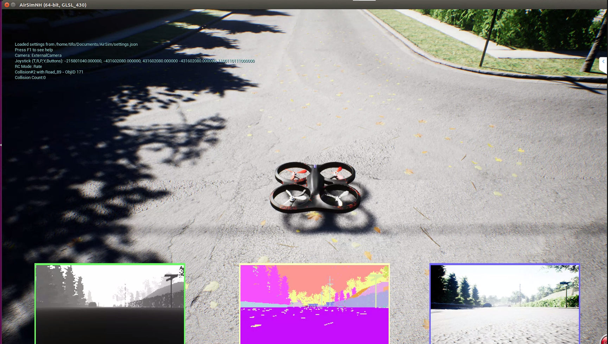
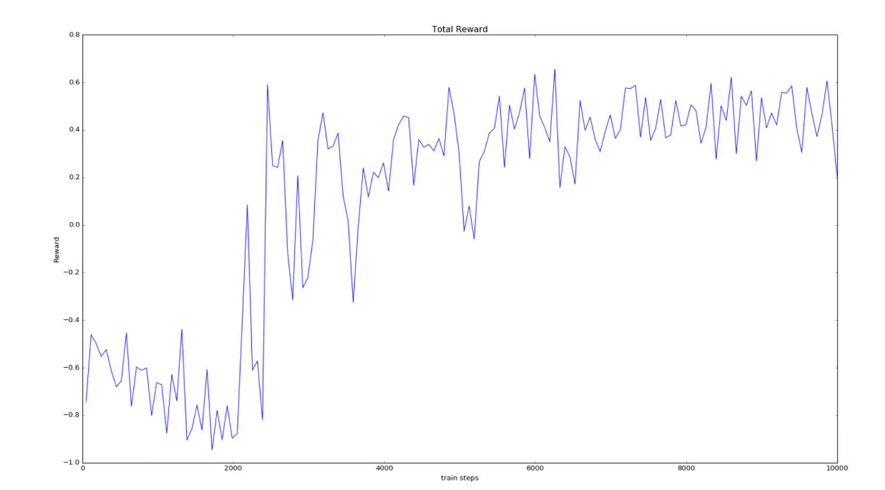

## 前言

> Airsim的官方github上面其实提供了一些强化学习的训练demo，如drone的[DQN训练](https://github.com/microsoft/AirSim/blob/master/PythonClient/multirotor/DQNdrone.py)、car的[DQN训练](https://github.com/microsoft/AirSim/blob/master/PythonClient/car/DQNcar.py)，但是都是基于cntk进行实现的，而这一块我不熟悉，还是用我熟悉的Tensorflow进行训练测试，与drone的DQN训练目标不同，甚至由于是cntk相关实现，也没有去细看其官方训练demo。
>
> 但是其思想都差不多，因为都是基于DQN进行训练

## 一、问题定义

> 在AirSimNH.sh的场景下进行训练



### 1.1 目标

>  训练一个agent，从起点出发，沿着道路中心线飞行到正前方6米处的地方

### 1.2 马尔科夫状态过程

- **状态集：**深度图像的灰度图集合（n种）
- **行为集：**前行、左行、右行（3种）
- **转换函数：**model free
- **奖励函数：**
  - 正面奖励：到达目标点范围：x属于[-4.5,7.5]，y属于[-0.8,0.8]，reward = 1
  - 负面奖励：超出边界：x > 7.5 或者 abs(y) >2，reward = -1
  - 生活成本：每走一步，reward = -0.01
- **起始状态：**（0，0，-3）
- **结束状态：**
  - 到达目标点
  - 超出边界
  - 20步强制结束当前episode

## 二、代码部分

> 直接查看[所有代码](https://github.com/ldgcug/Airsim_Controller/tree/master/DQN_Controller)

**（1）经验缓冲池：ReplayBuffer.py**

```python
from collections import deque
import random

class ReplayBuffer(object):
    def __init__(self,buffer_size):
        self.buffer_size = buffer_size # mini_batch大小
        self.num_experiences = 0 # 当前经验池中的个数
        self.buffer = deque() # 创建队列，用于存储数据
    
    def getBatch(self,batch_size): #从缓冲池中均匀随机采样
        
    def add(self,state,action,reward,new_state,done): # 存储数据
```

（2）**环境：AirsimEnv.py**

```python
goals = [6,2]
class Env():
    def __init__(self):
        self.client = airsim.MultirotorClient()
		self.client.confirmConnection()
    
    # 图片转换
    def transform_input(self,responses, img_height, img_width):
    
    # 重置，并完成无人机的起飞动作，中间有对环境的暂停和取消操作
    def reset(self):
    
    # 执行行为
    def step(self,quad_offset):
        reward , done = self.compute_reward(quad_pos) # 得到奖励
    
    # 计算奖励
    def compute_reward(self,quad_pos):
```

（3）**DQN训练：dqn.py**

```python
from AirsimEnv import Env
from ReplayBuffer import ReplayBuffer


def weight_variable(shape):
	initial = tf.truncated_normal(shape,stddev = 0.1)
	return tf.Variable(initial)

def bias_varialbe(shape):
	initial = tf.constant(0.1,shape = shape)
	return tf.Variable(initial)

def conv2d(x,w):
	return tf.nn.conv2d(x,w,strides = [1,2,2,1],padding = 'SAME')

def conv1d(x,w):
	return tf.nn.conv2d(x,w,strides = [1,1,1,1],padding = 'SAME')

class DQNAgent(object):
	def __init__(self,state_size,action_size,lr,gamma,batch_size,epsilon):
        self.createNet() #创建Q网络
        
        self.createtargetNet() #创建Target Q网络
        
        self.sess.run(tf.global_variables_initializer())# 初始化所有参数
        
        self.saver = tf.train.Saver(max_to_keep=1) #保存模型
        
        self.load() #加载模型
        
    def createNet(self):
        with tf.variable_scope("loss"):
			self.loss = tf.reduce_mean(tf.squared_difference(self.q_target,self.q_eval))

		with tf.variable_scope("train"):
			self.train_op = tf.train.RMSPropOptimizer(self.lr).minimize(self.loss)
    
    def createtargetNet(self):
        
    def save(self):
    
    def load(self):
        
    def get_action(self,state): #e-greedy策略选择行为
        
    def train_model(self,batch): # 训练网络
    
    def train_target(self): #Target网络更新

def interpret_action(action): # 得到真正的行为
    
if __name__ == '__main__':
    # argparse parser
	parser = argparse.ArgumentParser()
	parser.add_argument('--img_height',     type=int,      default=)
	parser.add_argument('--img_width', 	    type=int,      default=)
	parser.add_argument('--lr',		        type=float,    default=)
	parser.add_argument('--gamma',			type=float,    default=)
	parser.add_argument('--batch_size',	    type=int,      default=)
	parser.add_argument('--memory_size',	type=float,    default=)
	parser.add_argument('--epsilon',		type=float,    default=)
	parser.add_argument('--epsilon_end',	type=float,    default=)
	parser.add_argument('--update_target',	type=int,      default=)
	parser.add_argument('--explore',		type=int,      default=)
	parser.add_argument('--train_episode',	type=int,      default=)
	parser.add_argument('--max_steps',		type=int,      default=)

	args = parser.parse_args()
    
    # make RL agent
	buffer = ReplayBuffer(args.memory_size)
	env = Env()
	state_size = args.img_width*args.img_height
	action_size = 3
	start_time = time.asctime( time.localtime(time.time()))
	dqn = DQNAgent(
		state_size = state_size,
		action_size = action_size,
		lr = args.lr,
		gamma = args.gamma,
		batch_size = args.batch_size,
		epsilon = args.epsilon
		)
	step = 0
    
    for i in range(args.train_episode):

		s_t = env.reset()
		total_reward = 0
		episode_step = 0

		for j in range(args.max_steps):
			dqn.epsilon -= 1.0 / args.explore #epsilon衰减
			dqn.epsilon = max(dqn.epsilon,args.epsilon_end)
            
			a_t = dqn.get_action(s_t) # e_greedy得到行为
			real_action = interpret_action(a_t) #真实行为，转换为了元祖
			try:
				s_next_t,r_t,done,quad_pos = env.step(real_action)
				#s_next_t = transform_input(s_next_t,args.img_height,args.img_width)
			except Exception as e:
				print('Error :' ,e)

			buffer.add(s_t,a_t,r_t,s_next_t,done) #存储数据
			total_reward += r_t

			s_t = s_next_t
			step += 1
			episode_step += 1
			print('quadrotor position',quad_pos.x_val,quad_pos.y_val,quad_pos.z_val)
			print('\n')
			print("Episode",i,"episode_step",episode_step,"Action",a_t,"Reward",r_t,'step',step,'buffer',len(buffer.buffer),'done',done)
			print('\n')

			if step > 500: #大于500步，开始训练
				batch = buffer.getBatch(args.batch_size)
				dqn.train_model(batch)

			if step % args.update_target == 0: #更新target网络，并保存模型
				dqn.train_target()
				dqn.save()
			if done:
				print('episode %d is done'%i)
				break

		print('start_time',start_time)
		print('Episode',i,'total reward',total_reward)
		f1 = open(r"/home/tifo/tifo/DQN/data/car_total_reward"+str(int(i/1000))+".txt","a+")
		f1.write("Episode:"+str(i)+"    total_reward:"+str(total_reward)+"   episode_step:"+str(episode_step)+'\n')

	print('start_time',start_time)
	print('end_time',time.asctime( time.localtime(time.time())))
```

**（4）random_test.py：**

```python
from AirsimEnv import Env

def interpret_action(action):

if __name__ == '__main__':

	# argparse parser
	parser = argparse.ArgumentParser()
	parser.add_argument('--test_episode',	type=int,      default=1000)
	parser.add_argument('--max_steps',		type=int,      default=20)
	parser.add_argument('--actions',		type=int,      default=3)

	args = parser.parse_args()

	# make RL agent
	env = Env()
	start_time = time.asctime( time.localtime(time.time()))
	step = 0

	for i in range(args.test_episode):

		s_t = env.reset()
		total_reward = 0
		episode_step = 0

		for j in range(args.max_steps):
			a_t = np.random.choice(args.actions) #随机选择行为
			real_action = interpret_action(a_t)
			try:
				s_next_t,r_t,done,quad_pos = env.step(real_action)
				#s_next_t = transform_input(s_next_t,args.img_height,args.img_width)
			except Exception as e:
				print('Error :' ,e)

			total_reward += r_t

			s_t = s_next_t
			step += 1
			episode_step += 1
			print('quadrotor position',quad_pos.x_val,quad_pos.y_val,quad_pos.z_val)
			print('\n')
			print("Episode",i,"episode_step",episode_step,"Action",a_t,"Reward",r_t,'step',step,'done',done)
			print('\n')

			if done:
				print('episode %d is done'%i)
				break

		print('start_time',start_time)
		print('Episode',i,'total reward',total_reward)
		f1 = open(r"/home/tifo/tifo/DQN/data/random_test"+".txt","a+")
		f1.write("Episode:"+str(i)+"    total_reward:"+str(total_reward)+"   episode_step:"+str(episode_step)+'\n')

	print('start_time',start_time)
	print('end_time',time.asctime( time.localtime(time.time())))
```

**（5）dqn_test.py**

```python
from AirsimEnv import Env

def weight_variable(shape):
	initial = tf.truncated_normal(shape,stddev = 0.1)
	return tf.Variable(initial)

def bias_varialbe(shape):
	initial = tf.constant(0.1,shape = shape)
	return tf.Variable(initial)

def conv2d(x,w):
	return tf.nn.conv2d(x,w,strides = [1,2,2,1],padding = 'SAME')

def conv1d(x,w):
	return tf.nn.conv2d(x,w,strides = [1,1,1,1],padding = 'SAME')

class DQNAgent(object):
	def __init__(self,state_size,action_size):
		self.state_size = state_size
		self.action_size = action_size

		self.sess = tf.Session()

		self.createNet()
		self.sess.run(tf.global_variables_initializer())
		self.saver = tf.train.Saver(max_to_keep = 1)
		self.load()
	
    def createNet(self): #创建网络
    
    def load(self): #加载网络模型
    
    def get_action(self,state): # 从网络中选择最大值的行为

def interpret_action(action): #将行为转换为对应的元祖

if __name__ == '__main__':

	# argparse parser
	parser = argparse.ArgumentParser()
	parser.add_argument('--img_height',     type=int,      default=84)
	parser.add_argument('--img_width', 	    type=int,      default=84)
	parser.add_argument('--dqn_test_episode',	type=int,      default=1000)
	parser.add_argument('--max_steps',		type=int,      default=20)

	args = parser.parse_args()

	# make RL agent
	env = Env()
	state_size = args.img_width*args.img_height
	action_size = 3
	start_time = time.asctime( time.localtime(time.time()))
	dqn = DQNAgent(
		state_size = state_size,
		action_size = action_size
		)
	step = 0

	for i in range(args.dqn_test_episode):

		s_t = env.reset()
		total_reward = 0
		episode_step = 0

		for j in range(args.max_steps):
			a_t = dqn.get_action(s_t)
			real_action = interpret_action(a_t)
			try:
				s_next_t,r_t,done,quad_pos = env.step(real_action)
				#s_next_t = transform_input(s_next_t,args.img_height,args.img_width)
			except Exception as e:
				print('Error :' ,e)

			total_reward += r_t

			s_t = s_next_t
			step += 1
			episode_step += 1
			print('quadrotor position',quad_pos.x_val,quad_pos.y_val,quad_pos.z_val)
			print('\n')
			print("Episode",i,"episode_step",episode_step,"Action",a_t,"Reward",r_t,'step',step,'done',done)
			print('\n')

			if done:
				print('episode %d is done'%i)
				break

		print('start_time',start_time)
		print('Episode',i,'total reward',total_reward)
		f1 = open(r"/home/tifo/tifo/DQN/data/dqn_test"+".txt","a+")
		f1.write("Episode:"+str(i)+"    total_reward:"+str(total_reward)+"   episode_step:"+str(episode_step)+'\n')

	print('start_time',start_time)
	print('end_time',time.asctime( time.localtime(time.time())))
```

## 三、训练数据和测试数据

**（1）DQN训练数据**

| 迭代范围   | 正面奖励次数 | 负面奖励次数 | 强制截止次数 | 单位：千 |
| ---------- | ------------ | ------------ | ------------ | -------- |
| 1-1000     | 215          | 764          | 20           | 1        |
| 1000-2000  | 122          | 869          | 8            | 2        |
| 2000-3000  | 446          | 549          | 4            | 3        |
| 3000-4000  | 621          | 366          | 12           | 4        |
| 4000-5000  | 716          | 273          | 10           | 5        |
| 5000-6000  | 704          | 287          | 8            | 6        |
| 6000-7000  | 734          | 262          | 3            | 7        |
| 7000-8000  | 766          | 222          | 11           | 8        |
| 8000-9000  | 766          | 222          | 8            | 9        |
| 9000-10000 | 768          | 225          | 6            | 10       |
| 1-10000    | 5866         | 4044         | 90           | 总计     |

**训练过程中累积奖励图（每50个episode的reward取均值）**



**（2）随机飞行测试数据**

| 迭代范围 | 正面奖励次数 | 负面奖励次数 | 强制截止次数 | 单位：千 |
| -------- | ------------ | ------------ | ------------ | -------- |
| 1-1000   | 235          | 734          | 31           | 1        |

**（3）DQN网络测试数据**

| 迭代范围 | 正面奖励次数 | 负面奖励次数 | 强制截止次数 | 单位：千 |
| -------- | ------------ | ------------ | ------------ | -------- |
| 1-1000   | 999          | 1            | 0            | 1        |

训练过程中，其值稳定在770左右，而测试的时候，其值接近1000，可能是因为训练过程中存在10%的概率随机选择行为，因此训练的准确性没有测试的准确性高。

测试和训练的场景都是同一个场景

**在32GB 1080TI显卡上训练接近28个小时左右**

```python
episode 999 is done
('start_time', 'Fri Jul 19 20:01:46 2019')
('Episode', 999, 'total reward', 0.92)
('start_time', 'Fri Jul 19 20:01:46 2019')
('end_time', 'Fri Jul 19 23:21:02 2019')
```

## 总结

> 通过直接调用API完成了DQN算法的一个简单验证，训练的目标很简单。但将代码封装为ros后，训练效果却很差。在ros的控制下，使用RGB图训练过，也使用过深度图训练过，训练效果都不太好。暂时还没太弄清楚其原因。不过在ros的转换下，其深度图显示的有点问题。和原图不提啊一样