## 前言

> 微软推出的airsim对windows的支持更好，但是也能在Ubuntu下进行安装，由于本人习惯在ubuntu下进行开发，因此，参考了airsim的官方文档和网上的一些文章，在ubuntu下搭建成功

## 版本说明

- Ubuntu16.04
- Unreal Engine 4.18
- Airsim 1.2

## 一、安装Chrome浏览器

> 不是必须的，只是习惯用chrome浏览器而已

```
sudo wget http://www.linuxidc.com/files/repo/google-chrome.list -P /etc/apt/sources.list.d/
wget -q -O - https://dl.google.com/linux/linux_signing_key.pub | sudo apt-key add -
sudo apt-get update
sudo apt-get install google-chrome-stable
```

## 二、安装qt5 配置终端翻墙

> 需要有自己的vpn账号才行，配置这个，是为了终端翻墙，在下载一些文件的时候能够快速下载

```
sudo add-apt-repository ppa:hzwhuang/ss-qt5
sudo apt-get update
sudo apt-get install shadowsocks-qt5
```

ubuntu下，实现终端翻墙，请参考该[网址](https://ldgyyf.cn/2019/06/27/Linux/ubuntu%E4%B8%8B%E7%A7%91%E5%AD%A6%E4%B8%8A%E7%BD%91/#more)，进行相关配置

## 三、Unreal Engine 4.18下载配置

### 3.1 安装git

这里添加了proxychains4 是已经配置好第二步，即能实现终端翻墙后添加的翻墙操作

```
sudo proxychains4 apt-get install git
```

### 3.2 下载UE4

（1）如果没有UE4的账号，先去[官网](https://www.unrealengine.com)，注册一个账号，然后进行登录

（2）绑定github账号，在`用户`->`个人`->`链接的账户`中，与自己的github账号绑定，绑定之后，会发邮箱，然后确认即可

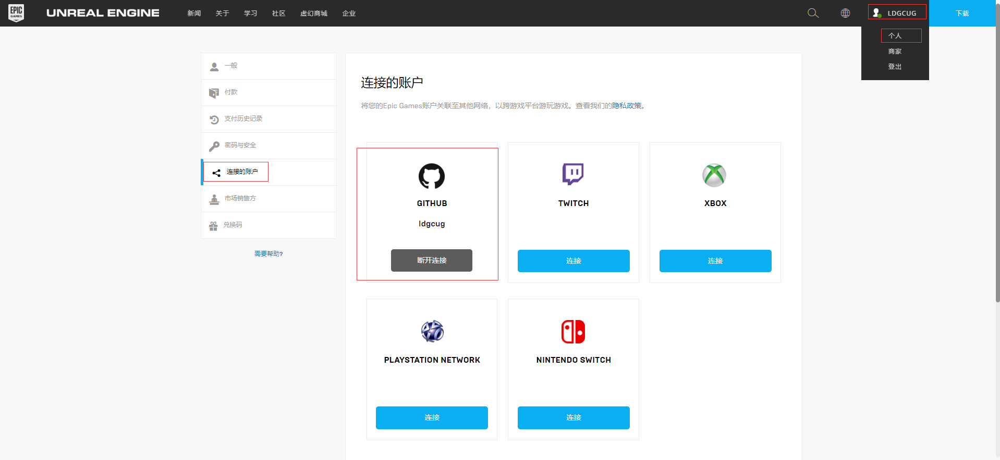

（3）如果是第一次下载需要先安装一些软件包

```
sudo apt-get install build-essential mono-mcs mono-devel mono-xbuild mono-dmcs mono-reference-assemblies-4.0 libmono-system-data-datasetextensions4.0-cil libmono-system-web-extensions4.0-cil libmono-system-management4.0-cil libmono-system-xml-linq4.0-cil cmake dos2unix clang-5.0 libfreetype6-dev libgtk-3-dev libmono-microsoft-build-tasks-v4.0-4.0-cil xdg-user-dirs
```

然后输入以下命令

```
sudo ln -s /usr/bin/clang-5.0 /usr/bin/clang
sudo ln -s /usr/bin/clang++-5.0 /usr/bin/clang++
clang -v
```

为了，防止后面编译出现下面的错误

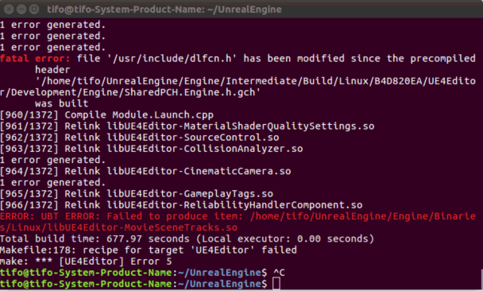

（4）下载UE4.18源码

在git的过程中，需要输入之前绑定的github的用户名和密码

```
git clone -b 4.18 https://github.com/EpicGames/UnrealEngine.git
```

### 3.3 编译UE4

```
 cd UnrealEngine
 ./Setup.sh
 ./GenerateProjectFiles.sh
 make
```

编译成功后，界面如下：

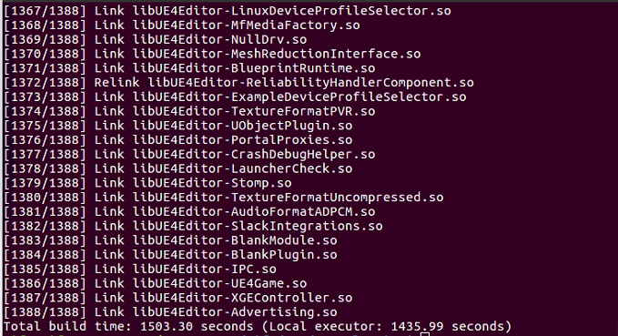

## 四、Airsim配置

### 4.1 下载Airsim

```
git clone https://github.com/Microsoft/AirSim.git
```

### 4.2 编译

> 有的命令前，加上proxychains4，可能会更快，如：proxychains4 ./setup.sh

```
cd AirSim
./setup.sh
./build.sh
```

./setup.sh成功后界面如下

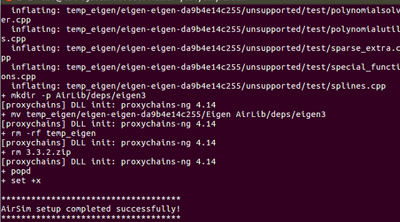

./build.sh成功后界面如下

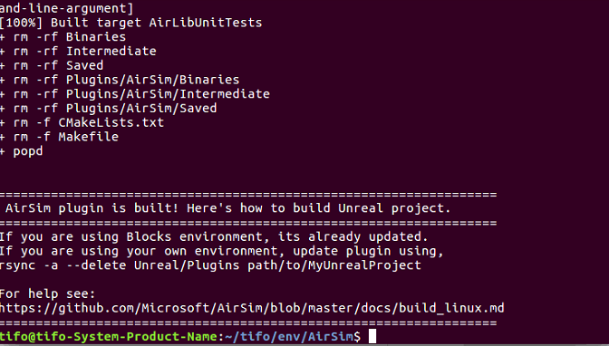

## 五、Airsim 使用方法

> 在Unreal Engine/Engine/Binaries/Linux/文件夹下，搜索UE4Editor，然后双击打开

### 5.1 创建工程

选择`新建项目`，`C++`，名称注意写英文，不要写中文

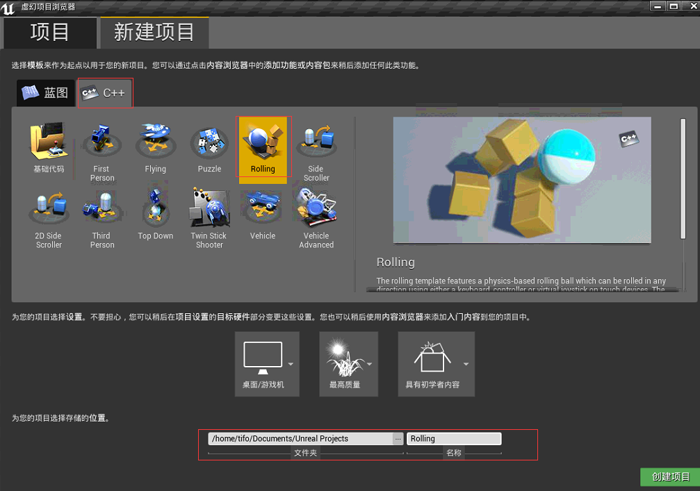

### 5.2 打开工程项目

创建完成后，在刚才创建的目录下，双击打开Rolling.uproject

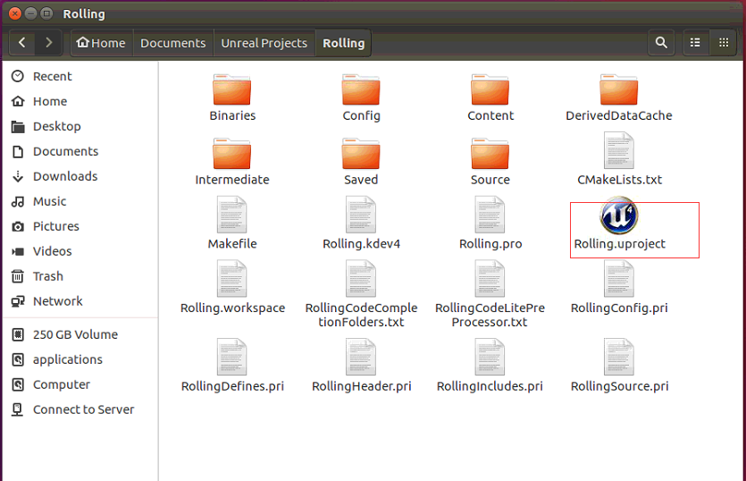

### 5.3 界面显示

打开后，会成功加载除UE4的场景界面，但是此时还没有无人机或车辆

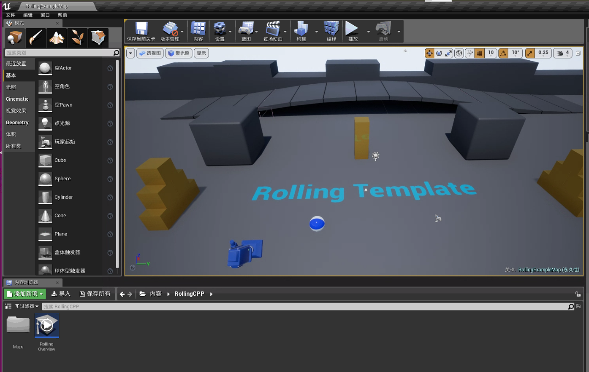

### 5.4 加载无人机或小车

在5.3的窗口框中，选择 `文件` -> `打开项目`，在弹出的框中选择浏览，找到 `AirSim/Unreal/Environments/Blocks` 文件下的`.uproject`文件

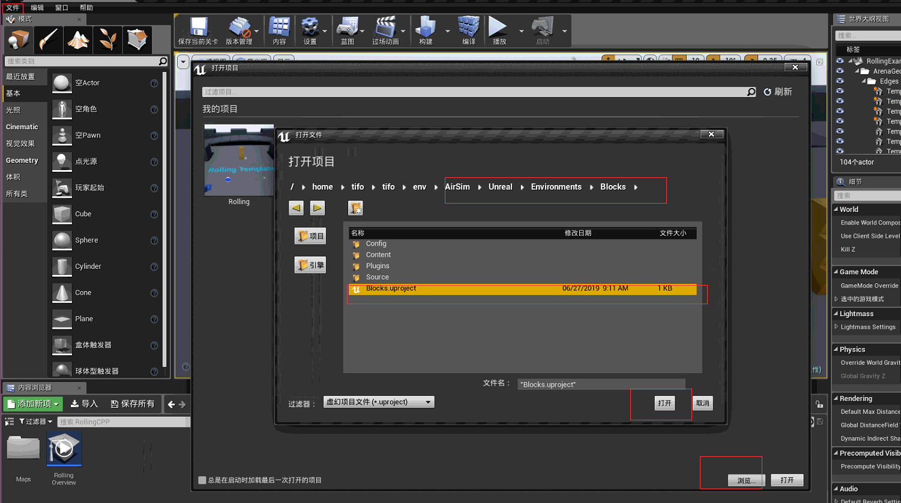

然后，点击`打开`，弹出提示需要转换副本时，选择`打开一个副本`


稍等一会，加载出来后，就能在UE4界面看到无人机了，当然需要设置

选择  `设置`->`世界设置`，在右侧栏`GameMode`这里选择`AirsimGameMode`

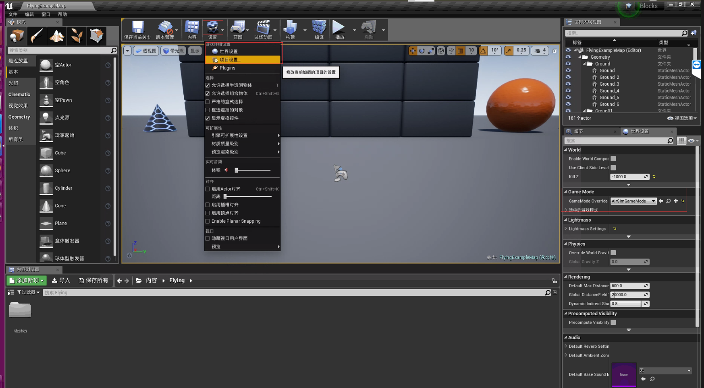

点击`播放`，在弹出的框中选择`不`，则能看到无人机加载出来

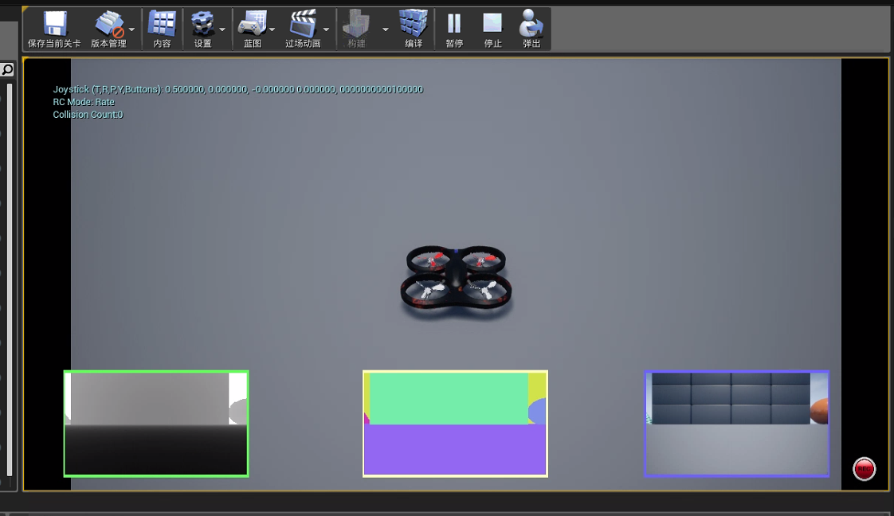

加载成功后，也能在Documents文件夹下多出一个Airsim文件夹，这个里面是settions.json文件，里面是它的配置信息

将其中的SimMode设为Car，则会加载出小车，设为Multirotor，则会是无人机，默认是Multirotor

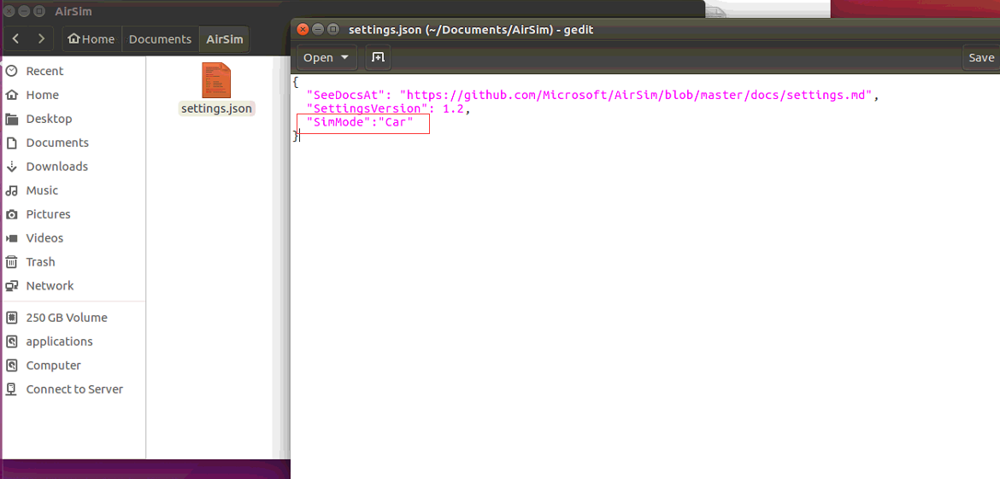

### 5.5 重新打开UE4，并带有无人机

> 关掉之前打开的UE4界面，重新在Unreal Engine/Engine/Binaries/Linux下双击UE4Editor

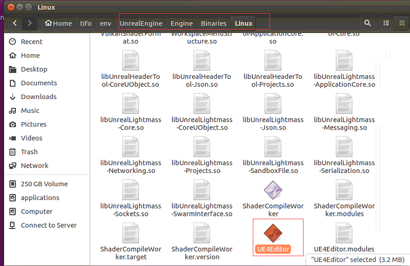

在弹出的项目中，选择我们之前加载的插件`Blocks`，打开

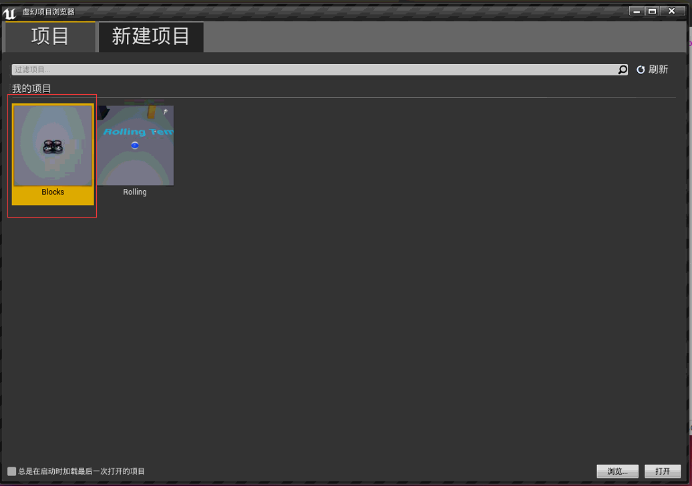

然后点击`播放`，就能看见小车出来，并且能够手动控制，这里出现小车，是因为我在`settiong.json`中将`SimMode`设置为了`Car`，而且小车是能在界面上进行控制的，无人机不行

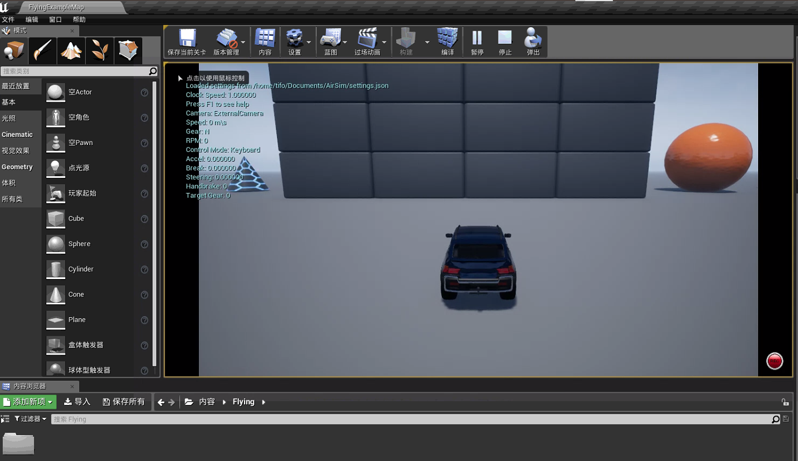

## 参考网址

- csdn博客，Ubuntu下安装Airsim，[传送门](https://blog.csdn.net/weixin_39059031/article/details/84028487)

- Airsim官方文档，[传送门](https://microsoft.github.io/AirSim/docs/build_linux/)

## 总结

> ubuntu下的Airsim配置还是Windows下的配置有些不一样，如Windows下需要安装VS2017，在VS2017中打开sln文件等，以及windows下有Epic Game Launch网上商店，而ubuntu下没有，如果要在ubuntu下加载网上商店上的一些场景，需要先在windows下进行下载才行