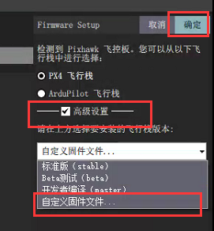
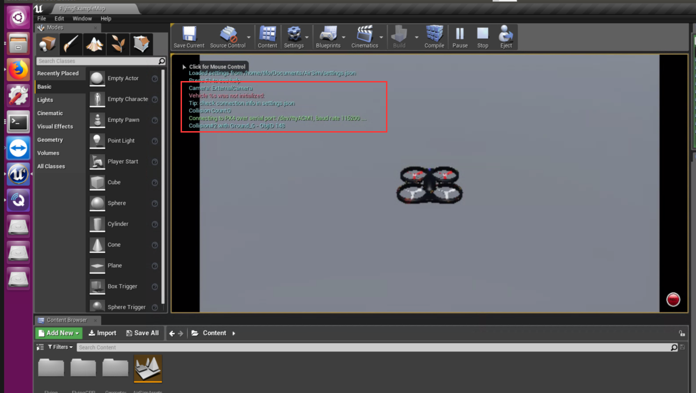

## 前言

> 在Airsim上做PX4的集成，并简单完成其算法验证
>
> <font color='red'>此配置是在Ubuntu16下配置，和前一篇的系统不同，但是大部分配置细节还是相同的</font>

## 准备工具

> - Pixhawk（我这里用的pixhawk如下图）
> - 一根micro usb数据线

## 一、启动Airsim环境

> 关于Airsim在Ubuntu16下的环境配置，请浏览[初识Airsim（三）](https://ldgyyf.cn/2019/07/02/Airsim/%E5%88%9D%E8%AF%86Airsim%EF%BC%88%E4%B8%89%EF%BC%89%E4%B9%8BUbuntu%E4%B8%8BAirsim%E5%B9%B3%E5%8F%B0%E6%90%AD%E5%BB%BA/)

### 1.1 启动UE4环境

> 在Unreal Engine/Engine/Binaries/Linux/文件夹下，搜索UE4Editor，然后双击打开
>
> 或者在该文件目录下，执行./UE4Editor命令打开
>
> 这两种方式一样，但我还是喜欢双击打开


### 1.2 加载插件

> 在弹出的界面中，选择Blocks插件，打开。这样通过其中的设置，就能加载出无人机


### 1.3 界面显示

> 加载出来后，先不要立刻点击Play，等后面的配置完成在进行点击


## 二、配置settings.json

> 在Documents\Airsim文件夹下，找到settings.json文件，并修改为PX4配置

```json
{
  "SeeDocsAt": "https://github.com/Microsoft/AirSim/blob/master/docs/settings.md",
  "SettingsVersion": 1.2,
  "SimMode":"Multirotor",
  "DefaultVehicleConfig":"PX4",
  "Vehicles":{
         "PX4":{
             	"VehicleType":"PX4Multirotor",
             	"UseSerial":true
        }
    }

}
```

## 三、QGC下载

### 3.1 QGC下载

> 下载QGC，请点击[此处](https://s3-us-west-2.amazonaws.com/qgroundcontrol/latest/QGroundControl.AppImage)

### 3.2 修改权限

```python
cd ~/Downloads
chmod +x ./QGroundControl.AppImage
```

## 四、pixhawk配置

### 4.1 打开QGC

```python
cd ~/Downloads
./QGroundControl.AppImage
```

### 4.2 连接pixhawk

> 将pixhawk通过USB线连接在测试电脑上

通常将pixhawk连接在电脑上后，打开QGC，QGC会自动连接上飞机。如果没有自动连接上，也可以采用手动连接的方式，手动连接操作如下：

​	在**应用设置**中找到**Comm Links**，点击正下方的**Add**进行添加，然后在新弹出的添加界面中，设置合适的端口和波特率，例如我这里的端口为**ttyACM1**，波特率设置为**115200**。


设置后，点击正下方的**Connect**，进行连接，连接成功后，如下图所示


### 4.3 刷新固件

#### 4.3.1 下载最新PX4固件

> 点击[PX4](https://github.com/PX4/Firmware/releases)下载Stable Release v1.9.2版本的px4_fmu-v2_default.px4

#### 4.3.2 刷新px4_fmu-v2_default.px4固件

> 这下面的步骤，是完全和Windows下一样，该小节下面的图片全部都来自于上一篇windows下的图片，Ubuntu中是一模一样的，只是Ubuntu中QGC是英文显示，Windows下是中文显示，其他没有区别。

（1）找到设置，选择固件板块

（2）然后将pixhawk先拔掉，然后重新插上

（3）最后将会发现固件模块变成如下界面


（4）点击高级设置，选择自定义固件文件，然后点击确定



（5）在弹出来的框中，找到刚才下载的px4_fmu-v2_default.px4固件，进行升级更新


#### 4.4 设置机身

> 在设置中，找到机架板块，设置其机架为**HIL Quadcopter X**，并应用重启
>
> 我没有遥控器，因此在刚开始设置时，下面的遥控器、飞行模式和电源其实都是红色有问题的，我这里是设置过后的，所以看着没问题


#### 4.5 修改参数值

> 在设置中，找到参数模块，搜索COM_RC，则会看到如下信息显示


（1）将其中的**COM_RC_IN_MODE**修改为 **Joystick/No RC Check**，因为我没有使用遥控器，因此修改的该值

（2）将其中的**NAV_RCL_ACT**修改为**Hold mode**或者**Disabled**

（3）将其中的**COM_RC_LOSS_T**修改为5s（非必须）

<font color='red'>其实，这这里可以看出，我修改过的值是标红了的</font>

> 在设置中，找到安全模块，将HITL Enabled设置为Enabled，即启用HITL模式


> 在应用程序设置中，找到常规部分，取消选中除UDP外的所有框
>
> 并且开启虚拟摇杆


## 五、测试pixhawk（HITL模式）

### 5.1 QGC连接Pixhawk

> 首先要确保QGC和Pixhawk是连接状态，如4.2节中连接成功后的图片

### 5.2 UE4中加载Airsim

> 此时会发现，UE4中的Airsim无人机没有初始化，图片中的红色提示部分



### 5.3 断开QGC连接

> 将QGC中的pixhawk连接，手动断开


### 5.4 重启UE4的Airsim环境

> 并不是要关掉UE4，重新打开，而是在当前UE4中按ESC键

（1）在UE4环境中，按**Esc键**，退出

可以看到UE4中，重新回到Play状态，并且QGC也没有连接上


（2）点击Play，重新加载Airsim环境

此时，将会看到UE4环境中，参数已经初始化，并且也会发现QGC中的Pixhawk也已经自动连接上


### 5.5 QGC起飞降落测试

> <font color='red'>在控制的模式中，发现起飞降落并没有效果（暂时还不太明白），但是也会发现终于没有那令人苦闷的 NO GPS的相关提示错误了</font>

点击起飞后，发现并没有无人机没有成功起飞（下面肿的红色路径是我之前飞行过的，还没有消除，并且也会发现，QGC上面显示的是Takeoff Armed）


将Takeoff修改为Manual模式，会发现无人机已经成功起飞，而且一直都没有停下来（下图中QGC的模式已经变换为Manual，不清楚为什么切换一下，才能成功飞起，并且还是乱飞的情况，UE4中显示的是无人机的第一视角，而且和上图相比，多了一条红色路线，该路线则是切换Manual模式后的起飞路线）


在Manual模式下，也能通过虚拟摇杆进行控制


**有时候切换模式能正常takeoff降落，有时候又不行，这就是控制方面的问题了**

### 5.6 <font color='red'>说明</font>

​	为什么前面需要先将QGC连接上Pixhawk后，UE4加载Airsim会报错？然后又重新断开QGC的连接，又重启UE4的AIrsim环境就好了？为什么要这样？我也不清楚，也有点迷糊。

​	不过这样设置了之后，在第二次的时候，就不需要这样操作了，可以直接

​	（1）打开QGC，确保QGC不是连接状态（如果自动连接上，请手动断开）

​	（2）打开UE4环境，直接点击Play

但是这时的QGC，好像保留了上次的效果


## 总结

> 总之，困扰了许久的Pixhawk在Linux下的HITL配置，终于解决了。虽然目前对其控制方式还不太了解，至少是能通信成功。（步骤说的有点啰嗦了~）
>
> 下一步，尝试一下用mavros控制是否可行

## 参考链接

- [参数没有初始化](https://github.com/microsoft/AirSim/issues/1988)

