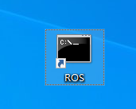
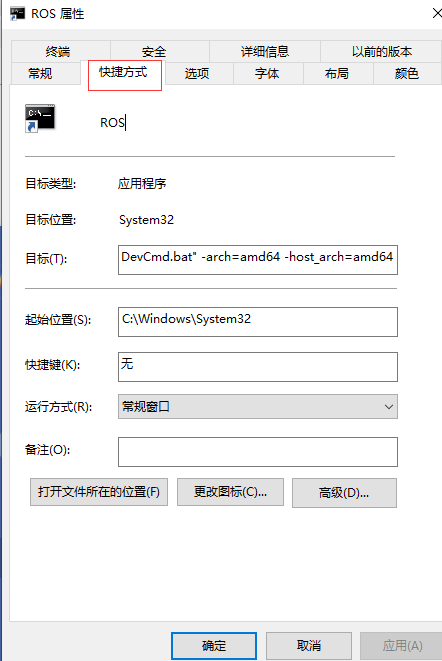
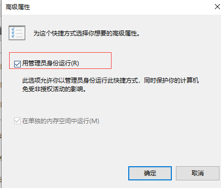
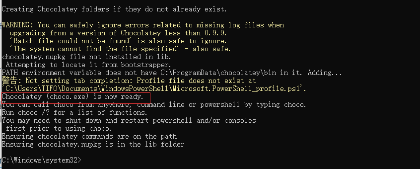
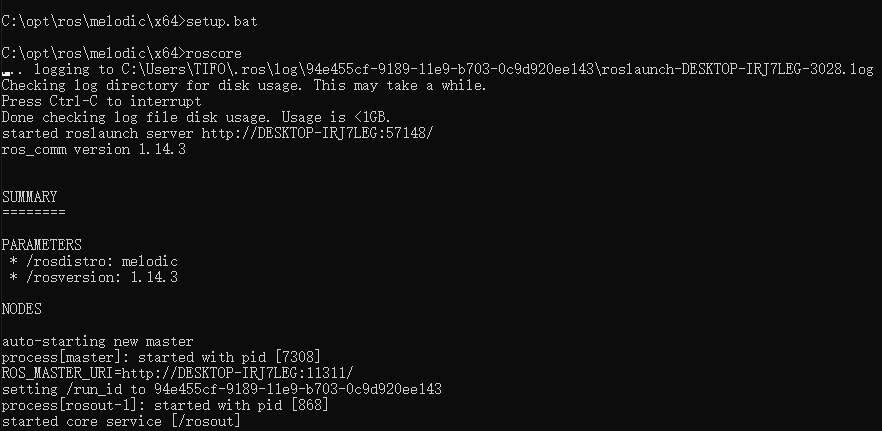
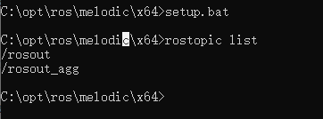
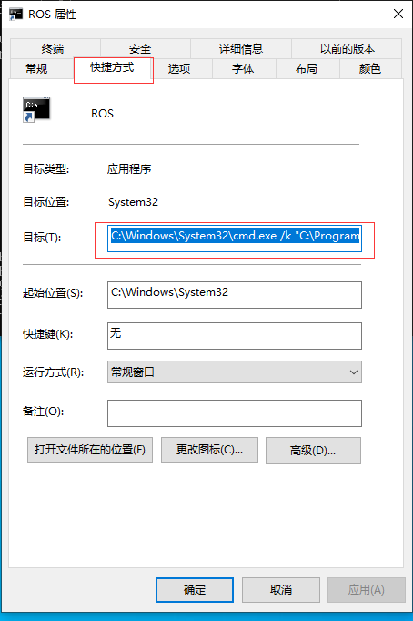
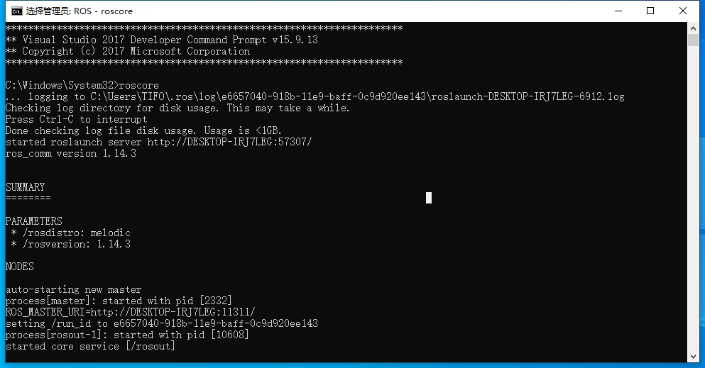

## 前言

> 在刚开始接触Airsim的过程中，其环境是在Windows下搭建的，而平常用的ros做机器人的开发已经习惯了，因此就尝试了在Windows下配置ROS环境

## 一、前提

- 已经装好Visual Studio 2017 社区版，并且安装路径是默认安装位置路径

> 因为最开始修改了默认安装位置路径，在安装过程中出现了一些小问题，后来按照默认安装路径安装测试的

## 二、ROS安装

### 2.1 创建快捷方式并配置

- 桌面空白处，右键，新建快捷方式

  

在输入框中，复制粘贴如下内容

```
C:\Windows\System32\cmd.exe /k "C:\Program Files (x86)\Microsoft Visual Studio\2017\Community\Common7\Tools\VsDevCmd.bat" -arch=amd64 -host_arch=amd64
```

- 命名快捷方式为ROS

  

- 将该快捷方式设置为Administrator

  - - 右键单击快捷方式，然后选择“属性”

    - 选择`快捷方式`选项卡

      

    - 点击`高级`按钮，在高级属性中选中`用管理员身份运行`

      

    - 在所有需要点击`确定`的地方点击`确定`，以进行保存


### 2.2 安装Chocolatey 和Git

（1）安装Chocolatey

> 在windows下，找到命令提示符，以管理员身份运行，然后输入如下代码，安装Chocolatey

```
@"%SystemRoot%\System32\WindowsPowerShell\v1.0\powershell.exe" -NoProfile -InputFormat None -ExecutionPolicy Bypass -Command "iex ((New-Object System.Net.WebClient).DownloadString('https://chocolatey.org/install.ps1'))" && SET "PATH=%PATH%;%ALLUSERSPROFILE%\chocolatey\bin"
```

最终，窗口出现Chocolatey is  now ready，则安装成功



（2）安装git

> 打开之前创建的ROS命令提示符


输入如下命令，安装git：

```
choco install git -y
```

安装完成后，关掉ros窗口，重新打开，输入

```
git --version
```

检查，git是否安装成功

### 2.3 ROS安装

> 输入如下命令，进行ros的安装，安装过程有点久

```
choco source add -n=ros-win -s="https://roswin.azurewebsites.net/api/v2" --priority=1
choco upgrade ros-melodic-desktop -y
```

在安装的过程中，可能会报错，然后多次输入

```
choco upgrade ros-melodic-desktop -y
```

进行重装，或者输入

```
choco upgrade ros-melodic-desktop --force
```

或者，输入

```
choco upgrade ros-melodic-desktop_full -y --execution-timeout = 0
```

最后，有点懵的就装好了，安装成功后，会在C盘根目录下有opt\ros的文件夹

## 三、ROS测试

（1）打开一个ROS窗口

> 首先要进入到x64的目录下，运行setup.bat，这个就有点类似于linux的source devel/setup.bash一样

```
cd C:\opt\ros\melodic\x64 
setup.bat
roscore
```

最终出现如下界面则安装成功



（2）查看rostopic

> 打开另一个ros窗口

```
cd C:\opt\ros\melodic\x64 
setup.bat
rostopic list
```



## 四、ROS命令简化配置

> 在第三步的测试过程中，每次输入ros相关的命令，都要先进入到x64目录下，然后运行setup.bat，甚是麻烦，因此才有了下面的简化配置，配置好后，直接在ros窗口输入命令即可

- 选中`ROS快捷方式`，右键，打开`属性`

- 选择`快捷方式`选项卡，找到`目标`

  

- 然后复制粘贴如下内容，进行替换

  ```
  C:\Windows\System32\cmd.exe /k "C:\Program Files (x86)\Microsoft Visual Studio\2017\Community\Common7\Tools\VsDevCmd.bat" -arch=amd64 -host_arch=amd64 && C:\opt\ros\melodic\x64\setup.bat
  ```

- 重新打开ros窗口，即可直接输入roscore，启动ros管理器



## 参考网址：

- ros wiki：[ros will 官网](http://wiki.ros.org/Installation/Windows)

- 博客：[古月居](http://www.guyuehome.com/2192)

## 总结

> 至此，windows下的ros环境就已经配好了，后续可以做其他的操作，但是需要安装一些软件包
>
> 如: msgpack-rpc-python 、airsim