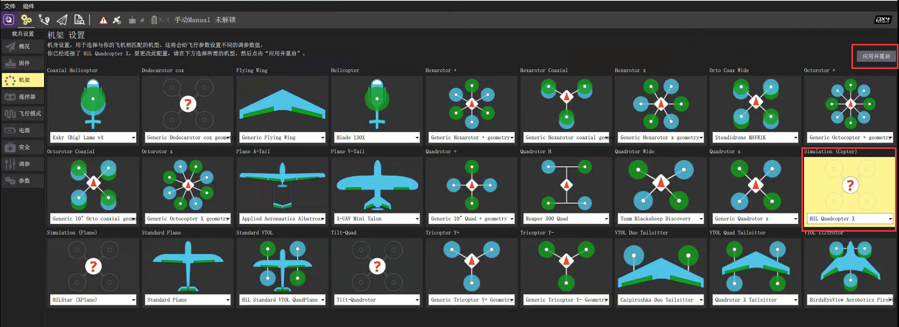

## 前言

> 在Airsim上做PX4的集成，并简单完成其算法验证
>
> <font color='red'>此配置是在Windows下配置，不是Ubuntu16</font>

## 准备工具

> - Pixhawk（我这里用的pixhawk如下图）
> - 一根micro usb数据线


## 一、启动Airsim环境

> 关于Airsim在windows下的环境配置，请浏览[初识Airsim（一）](https://ldgyyf.cn/2019/06/16/Airsim/%E5%88%9D%E8%AF%86Airsim%EF%BC%88%E4%B8%80%EF%BC%89%E4%B9%8BAirsim%E5%B9%B3%E5%8F%B0%E6%90%AD%E5%BB%BA/)

### 1.1 打开Rolling.sln文件

> 双击运行Rolling.sln文件，则会默认打开VS

### 1.2 检查相关配置

> 确保配置为：DebugGame Editor + win64

### 1.3 运行工程项目

> （1）可以先  点击 【生成】---->【重新生成解决方案】
>
> （2）按F5，运行工程项目

### 1.4 界面显示

> 做完前三步后，最终界面如下


## 二、配置settings.json

> 在Documents\Airsim文件夹下，找到settings.json文件，并修改为PX4配置

```json
{
  "SeeDocsAt": "https://github.com/Microsoft/AirSim/blob/master/docs/settings.md",
  "SettingsVersion": 1.2,
  "SimMode":"Multirotor",
  "Vehicles":{
    "PX4": {
      "VehicleType": "PX4Multirotor",
      "UseSerial": true
    }
    }
}
```

其中，UseSerial为true表示HIL模式，若为false，则为SITL模式

## 三、下载QGC

### 3.1 QGC下载

> 下载[QGroundControl](http://qgroundcontrol.com/)

### 3.2 QGC安装

> 双击下载好的exe文件，完成QGC的安装

## 四、pixhawk配置

### 4.1 打开QGC

> 菜单栏搜索QGC，打开即可

### 4.2 连接pixhawk

> 将pixhawk通过USB线连接在测试电脑上

连接成功后会看到QGC上面已经连接上，而不是等待连接


### 4.3 刷新固件

#### 4.3.1 下载最新固件

> 点击[PX4](https://github.com/PX4/Firmware/releases)下载Stable Release v1.9.2版本的px4_fmu-v2_default.px4

#### 4.3.2 刷新px4_fmu-v2_default.px4固件

（1）找到设置，选择固件板块

（2）然后将pixhawk先拔掉，然后重新插上

（3）最后将会发现固件模块变成如下界面


（4）点击高级设置，选择自定义固件文件，然后点击确定


（5）在弹出来的框中，找到刚才下载的px4_fmu-v2_default.px4固件，进行升级更新


我这里没有检测出自动连接，因此重新手动连接一下即可

### 4.4 设置机身

> 在设置中，找到机架板块，设置其机架为**HIL Quadcopter X**，并应用重启
>
> 我没有遥控器，因此在刚开始设置时，下面的遥控器、飞行模式和电源其实都是红色有问题的，我这里是设置过后的，所以看着没问题



### 4.5 修改参数值

> 在设置中，找到参数模块，搜索COM_RC，则会看到如下信息显示


（1）将其中的**COM_RC_IN_MODE**修改为 **Joystick/No RC Check**，因为我没有使用遥控器，因此修改的该值

（2）将其中的**NAV_RCL_ACT**修改为**Hold mode**或者**Disabled**

> 在设置中，找到安全模块，将HITL Enabled设置为Enabled，即启用HITL模式


> 在应用程序设置中，找到常规部分，取消选中除UDP外的所有框


## 五、测试pixhawk（SITL模式）

### 5.1 加载Airsim

> 在UE4界面中，选择播放，加载出无人机，此时可以看到，PX4已经成功连接
>
> 运行后，最后按shift + f1组合键，这样可以切换到其他窗口去


### 5.2 QGC起飞降落测试

> 在QGC中，选择起飞，并滑动确认，最终能看到UE4中的drone已经成功起飞


这里就不演示降落过程

### 5.3 QGC定点模式，虚拟摇杆测试

#### 5.3.1 设置虚拟摇杆

> 在应用设置部分，找到常规模块，在其中的FlyView部分，在虚拟游戏手柄前的框勾选上


#### 5.3.2 虚拟摇杆控制

> 首先将模式切换为定点Position，并且手动滑动却解锁。
>
> 然后使用左边的虚拟摇杆，完成上升、下降、转角等动作
>
> 右边的虚拟摇杆，完成前后左右控制等动作
>
> 最终将杆保持在中间，使其悬停

下图中drone的位置，则是我使用虚拟摇杆控制飞行到当前位置的。


## 总结

> 关于在Windows下配置pixhawk，还相对来说比较好配置，但是在Linux下，还没有配置成功，明天再去配置最后一次。

## 参考链接

- [设置HITL](https://dev.px4.io/v1.9.0/en/simulation/hitl.html)

- [QGC用户指南](https://docs.qgroundcontrol.com/en/PlanView/PlanView.html)