## 前言

> 在Airsim若要使用Lidar传感器并进行显示，一般都离不开rviz，使用rviz对ros的topic进行显示，但也因此，需要先将数据封装成ros的消息类型，我没有采用官方的airsim_ros包，而是自己进行封装创建。
>
> 那么目前导航功能包集只接受使用sensor_msgs/LaserScan或sensor_msgs/PointCloud及新出来的sensor_msgs/PointCloud2消息类型发布的传感器数据。
>
> 但我在google或者百度上也搜寻了很多LaserScan和PointCloud之间的区别，没怎么找到，更多的都是介绍如何使用这两个类型去发布ros数据。因此，也只有根据自己的理解去记录。

## 一、Airsim添加Lidar传感器

> 详情请点击官方[Lidar文档](https://github.com/microsoft/AirSim/blob/master/docs/lidar.md)

| Parameter          | Description                                                  |
| ------------------ | ------------------------------------------------------------ |
| NumberOfChannels   | 激光雷达线束（<font color='red'>单线或多线</font>），默认为16线 |
| Range              | 扫描范围（单位米）                                           |
| PointsPerSecond    | 每秒捕获的点数                                               |
| RotationsPerSecon  | 每秒轮换数                                                   |
| HorizontalFOVStart | 水平起始角度（以度为单位）                                   |
| HorizontalFOVEnd   | 水平结束角度（以度为单位）                                   |
| VerticalFOVUpper   | Vertical FOV upper limit for the lidar, in degrees           |
| VerticalFOVLower   | 垂直角度下限（以度为单位）                                   |
| X Y Z              | 激光雷达相对于车辆的位置（NED坐标，米为单位）                |
| Roll Pitch Yaw     | 激光雷达相对车车辆的方向（以度为单位）                       |
| DataFrame          | 输出中的点的框架                                             |

<font color='red'>那么**线束**到底代表什么意思呢？单线和多线又有什么区别？</font>

在[浅谈激光雷达](http://www.wangdali.net/lidar/)一文中解释了相关线束的含义，通过浏览，个人理解为：每个线束每秒捕获的点数都有个最大值，如100000，那么多线则能捕获更多的点数，因此多线可以捕获到上百万的点数。单线可以表示为单个圆，多线可以有多个圆。

**且多线激光中一般垂直方向角度的范围为40度（不超过40度），忘记是在哪篇文章上看到过**

### 1.1 settings.json默认配置

```json
{
    "SeeDocsAt": "https://github.com/Microsoft/AirSim/blob/master/docs/settings_json.md",
    "SettingsVersion": 1.2,

    "SimMode": "Multirotor",

     "Vehicles": {
		"Drone1": {
			"VehicleType": "simpleflight",
			"AutoCreate": true,
			"Sensors": {
			    "LidarSensor1": { 
					"SensorType": 6, # 6表示使用激光雷达传感器
					"Enabled" : true,
					"NumberOfChannels": 16, # 16线激光
					"RotationsPerSecond": 10,
					"PointsPerSecond": 100000,
					"X": 0, "Y": 0, "Z": -1,
					"Roll": 0, "Pitch": 0, "Yaw" : 0, # 定义位姿姿态
					"VerticalFOVUpper": -15,
					"VerticalFOVLower": -25, # 垂直方向角度范围
					"HorizontalFOVStart": -20, 
					"HorizontalFOVEnd": 20, # 水平方向角度范围
					"DrawDebugPoints": true, # 是否在环境中可视
					"DataFrame": "SensorLocalFrame" #垂直惯性坐标系"VehicleInertialFrame" or 传感器坐标系"SensorLocalFrame"
				},
				"LidarSensor2": {  # 可以定义多个雷达
				   "SensorType": 6,
					"Enabled" : true,
					"NumberOfChannels": 4,
					"RotationsPerSecond": 10,
					"PointsPerSecond": 10000,
					"X": 0, "Y": 0, "Z": -1,
					"Roll": 0, "Pitch": 0, "Yaw" : 0,
					"VerticalFOVUpper": -15,
					"VerticalFOVLower": -25,
					"DrawDebugPoints": true,
					"DataFrame": "SensorLocalFrame"
				}
			}
		}
    }
}
```

**如果调用getLidarData（）函数，则将返回点云数组、时间戳和雷达位姿，其中：**

**点云在雷达坐标系中（NED坐标系，以米为单位）**

**雷达位姿在车的坐标系中（NED坐标系，以米为单位）**

### 1.2 简单json配置，测试

```json
{
  "SeeDocsAt": "https://github.com/Microsoft/AirSim/blob/master/docs/settings.md",
  "SettingsVersion": 1.2,
  "SimMode":"Multirotor",

  "Vehicles":{
    "Drone1":{
      "VehicleType":"SimpleFlight",
      "X":0,"Y":0,"Z":0,  # 设定无人机的初始坐标
      "Sensors":
      {
        "MyLidar1":
        {
          "SensorType":6, # 激光雷达传感器为6
          "Enabled":true,
          "NumberOfChannels":16, # 16线激光
          "PointsPerSecond":10000,
          "X":0,"Y":0,"Z":-1,
          "DrawDebugPoints":true,
          "Roll": 0, "Pitch": 0, "Yaw" : 0, # 定义了雷达相对于无人机的位姿
          "VerticalFOVUpper": 0,
          "VerticalFOVLower": 0, # 垂直角度，一般不超过40度
          "HorizontalFOVStart": -20,
          "HorizontalFOVEnd": 20, # 水平角度范围
          "DrawDebugPoints": true, # 是否在环境中可视
          "DataFrame": "SensorLocalFrame" #垂直惯性坐标系"VehicleInertialFrame" or 传感器坐标系"SensorLocalFrame"
        }
      }
    }
  }
}
```

**环境中的显示（第一视角）**

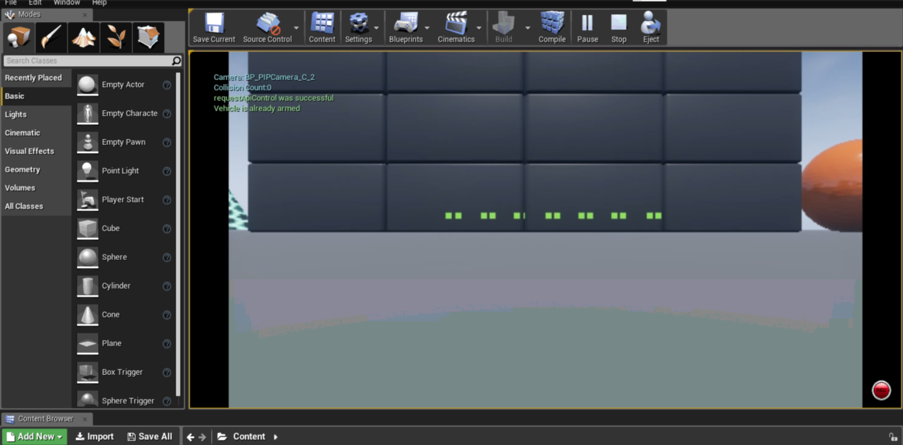

**Python代码编写，获取雷达数据**

```python
#!/usr/bin/env python
# -*-coding:utf-8 -*-

import cv2
import numpy as np

import airsim
import time
import datetime
import pprint


client = airsim.MultirotorClient()
client.confirmConnection()
client.enableApiControl(True)
client.armDisarm(True)

lidarData = client.getLidarData()
print('lidar',lidarData)

if len(lidarData.point_cloud) >3:
	points = np.array(lidarData.point_cloud,dtype=np.dtype('f4'))
	points = np.reshape(points,(int(points.shape[0]/3),3))
	print('number of points'),len(points)
else:
	print("\tNo points received from Lidar data")
```

这里不展示输出内容，因为输出内容比较多，占位置，在每次运行时，其获得的雷达点的个数可能会稍有不同，并且雷达探测到的点也会不一样，不相同才是正常的。

## 二、单线激光雷达设置

### 2.1 settings.json设置

> 为什么要将垂直角度设置为0？因为个人理解单线是水平的，即2维的，如果设置了垂直角度，则将变成三维，后面会显示设置了垂直角度后的区别

```json
{
  "SeeDocsAt": "https://github.com/Microsoft/AirSim/blob/master/docs/settings.md",
  "SettingsVersion": 1.2,
  "SimMode":"Multirotor",

  "Vehicles":{
    "Drone1":{
      "VehicleType":"SimpleFlight",
      "X":0,"Y":0,"Z":0,
      "Roll": 0, "Pitch": 0, "Yaw" : 0,
      "Sensors":
      {
        "MyLidar1":
        {
          "SensorType":6,
          "Enabled":true,
          "NumberOfChannels":1, # 设置为单线
          "PointsPerSecond":10000, # 10000个数据点
          "X":0,"Y":0,"Z":-0.5,
          "DrawDebugPoints":true,
          "Roll": 0, "Pitch": 0, "Yaw" : 0,
          "VerticalFOVUpper": 0,
          "VerticalFOVLower": 0, # 垂直角度为0 
          "HorizontalFOVStart": -90, 
          "HorizontalFOVEnd": 90, # 水平180度
          "DrawDebugPoints": true,
          "DataFrame": "SensorLocalFrame"
        }
      }
    }
  } 
}
```

**测试环境**

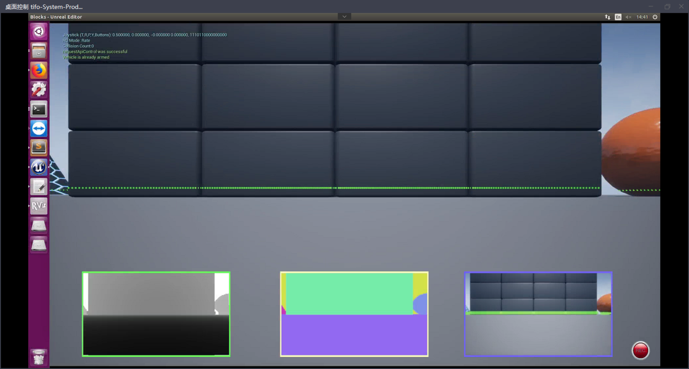

### 2.2 Python代码编写（LaserScan）

> LaserScan是一个二维结构，即垂直角度为0

**LaserScan消息定义**：[官方定义](http://docs.ros.org/api/sensor_msgs/html/msg/LaserScan.html)

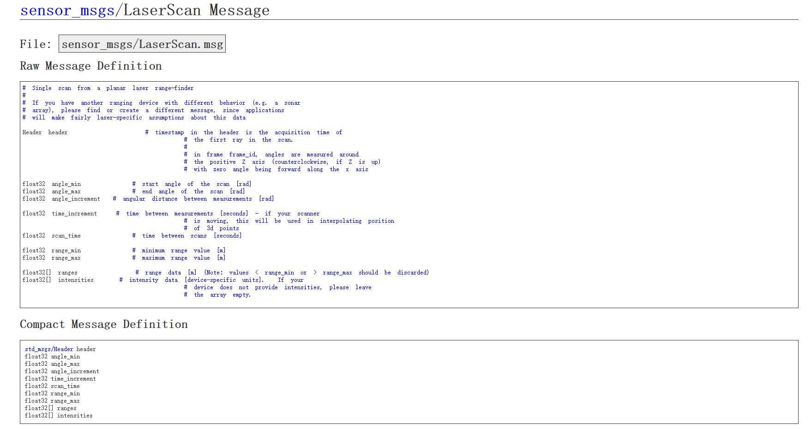

```python
Header head：
    uint32 seq //对应一个标识符，随着消息被发布，它会自动增加
    time stamp //时间戳，以激光扫描为例，stamp可能对应每次扫描开始的时间
    string frame_id //以激光扫描为例，它将是激光数据所在帧（坐标系）
    
float32 angle_min        # scan的开始角度 [弧度]
float32 angle_max        # scan的结束角度 [弧度]
float32 angle_increment  # 测量的角度间的距离 [弧度]
float32 time_increment   # 测量间的时间 [秒]
float32 scan_time        # 扫描间的时间 [秒]
float32 range_min        # 最小的测量距离 [米]
float32 range_max        # 最大的测量距离 [米]
float32[] ranges         # 测量的距离数据 [米] (注意: 值 < range_min 或 > range_max 应当被丢弃)
float32[] intensities    # 强度数据 [device-specific units]
```

**ros发布LaserScan消息（Python）**

```python
#!/usr/bin/env python
#-*- coding:utf-8 -*-

import math
import rospy
import airsim
import numpy  as np
from sensor_msgs.msg import LaserSca

# 获取无人机的xyz坐标，为后面计算距离做准备
def get_drone_position(client):
	position = client.getMultirotorState().kinematics_estimated.position
	return position

# 将点云数据转换成相应角度和距离
def point_cloud_to_angle_position(pos,points):
	obs_distance = []
	angles = []
	for i in range(len(points)):
		x = round(points[i][0],2)
		y = round(points[i][1],2)
		z = round(points[i][2],2)
		if x != 0:
			angle = math.atan(y/x) * 180 / 3.14 # 利用三角函数关系求当前角度
			angle = math.floor(angle) #向下取整
			angles.append(angle)
			distance = math.sqrt((pos.x_val -x) **2 + (pos.y_val-y) **2 +(pos.z_val - z)**2) # 根据激光点坐标和无人机当前点坐标求解距离
			obs_distance.append(distance)
		#print([i,angle,distance])
	angles,obs_distance = scale_point_cloud(angles,obs_distance) # 进行相应变换
	return angles,obs_distance

# 在180度范围内，每隔1度，取一个值，即将会取181个值（中间有0度）
# 对每个角度，求出其对应的下标有哪些，然后求均值，表示当前角度的激光点距离
def scale_point_cloud(angles,obs_distance):
	angle_min = -90.0
	angle_max = 90.0
	new_angles = []
	new_obs_distance = []
	# address_index = [x for x in range(len(list_position_name)) if list_position_name[x] == i]
	for i in range(int(angle_max - angle_min + 1)):
		address_index = [x for x in range(len(angles)) if angles[x] == angle_min + i ] # 求每个角度的下标
		if len(address_index) == 0: #如果某个角度没有值，则直接给最大值
			distance = 100.0
		else: # 否则，求均值
			total_dis = 0
			for j in range(len(address_index)):
				total_dis += obs_distance[address_index[j]]
			distance = total_dis / len(address_index)
		new_angles.append(angle_min + i)
		new_obs_distance.append(distance)
		#print(new_angles[i],new_obs_distance[i])
	return new_angles,new_obs_distance

# 发布ros数据
def pub_laserscan(obs_distance):
	laserscan = LaserScan()
	laserscan.header.stamp = rospy.Time.now()
	laserscan.header.frame_id = 'lidar'
	laserscan.angle_min = -1.57
	laserscan.angle_max = 1.57 # 对应180度
	laserscan.angle_increment = 3.14 / 180 #弧度的增量，这样就是隔1度取值
	laserscan.time_increment = 1.0  / 10   / 180 # 中间的10对应于json中的RotationsPerSecond
	laserscan.range_min = 0.0
	laserscan.range_max = 100.0
	laserscan.ranges = [] # 距离
	laserscan.intensities = [] # 强度
	for i in range(1,len(obs_distance)):
		laserscan.ranges.append(obs_distance[i])
		laserscan.intensities.append(0.0)
	print(laserscan)
	return laserscan

def main():

	# connect the simulator
	client = airsim.MultirotorClient()
	client.confirmConnection()
	client.enableApiControl(True)
	client.armDisarm(True)

	scan_pub = rospy.Publisher('/scan', LaserScan, queue_size=10)
	rate = rospy.Rate(1.0)

	while not rospy.is_shutdown():

		# get the lidar data
		lidarData = client.getLidarData()
		#print('lidar',lidarData)

		if len(lidarData.point_cloud) >3:

			points = np.array(lidarData.point_cloud,dtype=np.dtype('f4'))
			points = np.reshape(points,(int(points.shape[0]/3),3))
			#print('points:',points)
			pos = get_drone_position(client)
			angles,obs_distance = point_cloud_to_angle_position(pos,points)
			print('number of points'),len(points)
			laserscan = pub_laserscan(obs_distance)
			scan_pub.publish(laserscan)
			rate.sleep()
		else:
			print("\tNo points received from Lidar data")

if __name__ == "__main__":
	rospy.init_node('drone1_lidar',anonymous=True)
	main()
```

**rviz显示LaserScan数据**

要注意，在rviz界面中，将Style的类型设置为Points，否则可能会看不到点，具体的见PointCloud中的图片

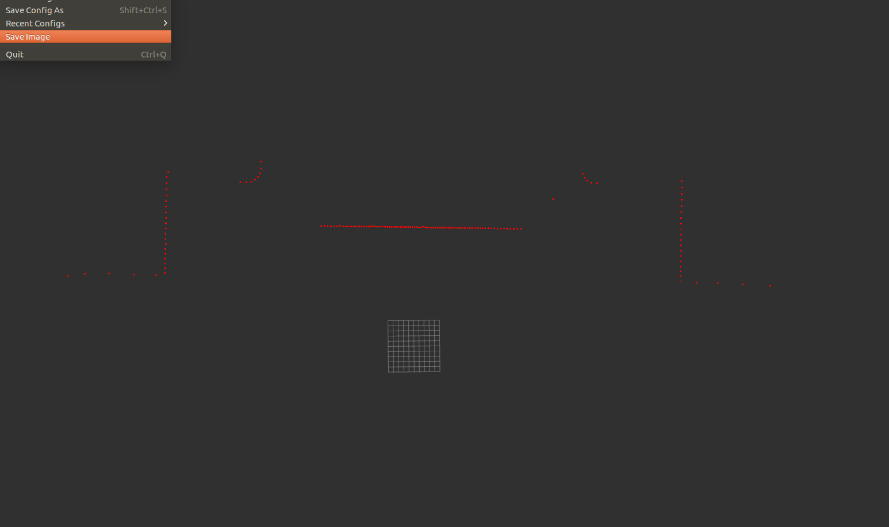

### 2.3 Python代码编写（PointCloud）

```python
#!/usr/bin/env python
#-*- coding:utf-8 -*-

import math
import rospy
import airsim
import numpy  as np
from geometry_msgs.msg import Point32
from sensor_msgs.msg import LaserScan,PointCloud

def pub_pointcloud(points):
	pc = PointCloud()
	pc.header.stamp = rospy.Time.now()
	pc.header.frame_id = 'lidar'

	for i in range(len(points)):
		pc.points.append(Point32(points[i][0],points[i][1],points[i][2]))
	print('pc:',pc)
	return pc

def main():

	# connect the simulator
	client = airsim.MultirotorClient()
	client.confirmConnection()
	client.enableApiControl(True)
	client.armDisarm(True)

	pointcloud_pub = rospy.Publisher('/pointcloud', PointCloud, queue_size=10)
	rate = rospy.Rate(1.0)

	while not rospy.is_shutdown():

		# get the lidar data
		lidarData = client.getLidarData()
		#print('lidar',lidarData)

		if len(lidarData.point_cloud) >3:

			points = np.array(lidarData.point_cloud,dtype=np.dtype('f4'))
			points = np.reshape(points,(int(points.shape[0]/3),3))
			#print('points:',points)
			pc = pub_pointcloud(points)
			pointcloud_pub.publish(pc)
			rate.sleep()
		else:
			print("\tNo points received from Lidar data")

if __name__ == "__main__":
	rospy.init_node('drone1_lidar',anonymous=True)
	main()
```

**rviz显示PointCloud数据**

其中的Style要设置为Points

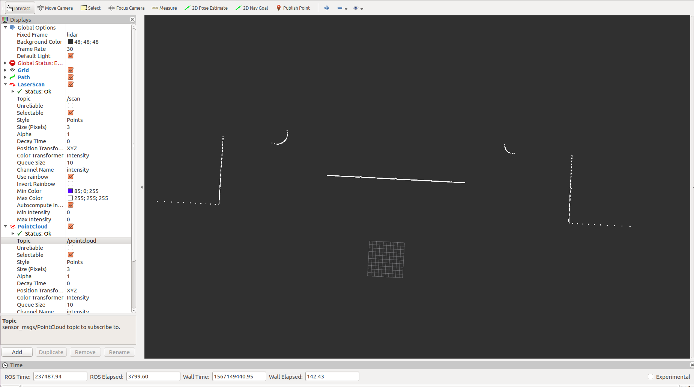

### 2.4 rviz同时显示LaserScan和PointCloud数据

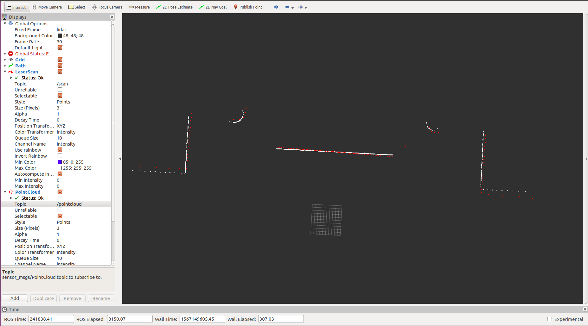

上图中，红色的为LaserScan数据，白色的为PointCloud数据，能够从图中看出，红色的和白色的点还是很接近的。为什么不一致呢？因为LaserScan是封装成了180个点，并且对相同的角度的距离求均值得出来的，而PointCloud直接获取的是points数据，没有做任何的修改。因此PointCloud数据更真实一点，但LaserScan目前来说也还行。

## 三、多线激光雷达设置

### 3.1 settings.json设置

```json
{
  "SeeDocsAt": "https://github.com/Microsoft/AirSim/blob/master/docs/settings.md",
  "SettingsVersion": 1.2,
  "SimMode":"Multirotor",

  "Vehicles":{
    "Drone1":{
      "VehicleType":"SimpleFlight",
      "X":0,"Y":0,"Z":0,
      "Roll": 0, "Pitch": 0, "Yaw" : 0,
      "Sensors":
      {
        "MyLidar1":
        {
          "SensorType":6,
          "Enabled":true,
          "NumberOfChannels":16, # 设置16线激光
          "PointsPerSecond":100000, # 这里将点的个数增加了，因为环境变得更复杂了一点
          "X":0,"Y":0,"Z":-0.5,
          "DrawDebugPoints":true,
          "Roll": 0, "Pitch": 0, "Yaw" : 0,
          "VerticalFOVUpper": -15,
          "VerticalFOVLower": 25, # 垂直设置40度范围
          "HorizontalFOVStart": -180, 
          "HorizontalFOVEnd": 180, # 水平设置360度
          "DrawDebugPoints": true,
          "DataFrame": "SensorLocalFrame"
        }
      }
    }
  }
}
```

**测试环境**（16线的显示）


### 3.2 PointCloud显示

> 代码和2.3节的代码一样

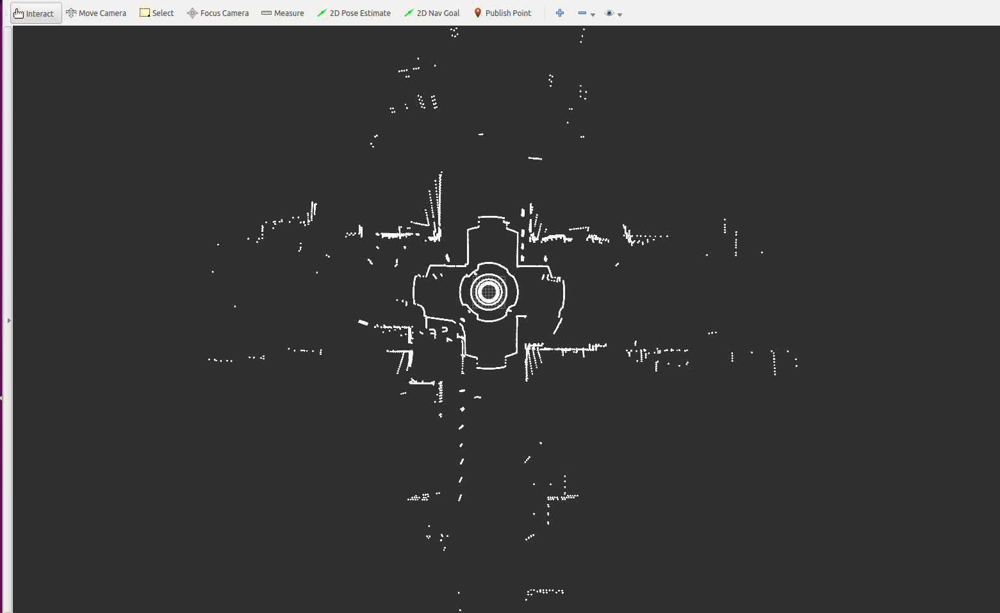

从上图中可以看出，由于channel修改为16，则会有圆圈产生，并且设置了垂直角度，因此，整个点云图看起来是3维的。

**（1）若将垂直角度还是设置为0，则其点云图将会是二维显示**

在json中，重新将垂直角度设为0，

```json
          "VerticalFOVUpper": 0,
          "VerticalFOVLower": 0, # 重新设置为0度
```

则其点云图显示如下，则将会二维显示

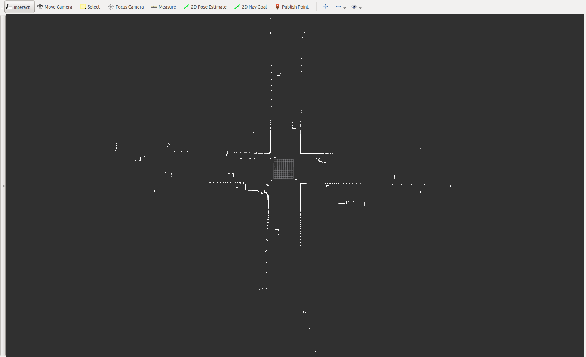

**（2）若垂直角度还是40度，增大channel，如增大为32或64时，显示效果如下：**

设置为32线时，其环境中可视化的激光圈数明显增加

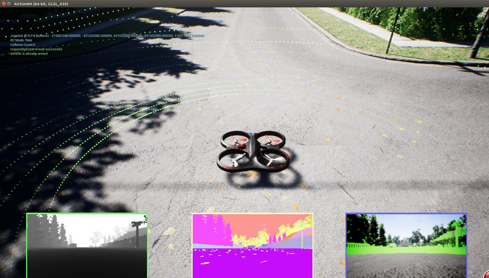

其rviz图为：

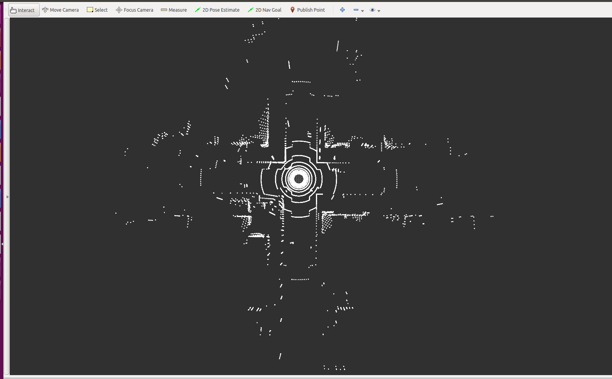

设置为64线时，环境中激光可视化

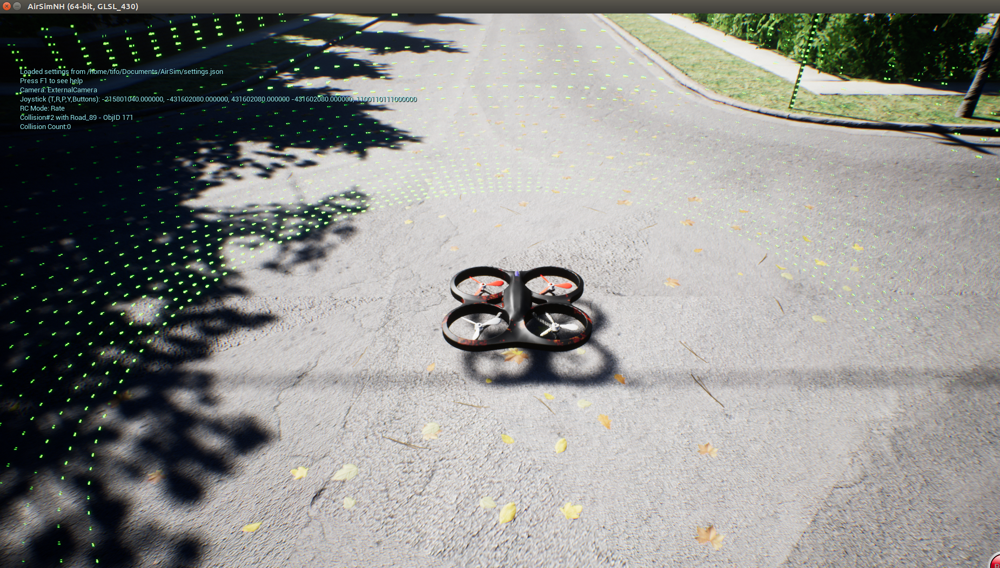

其rviz图：

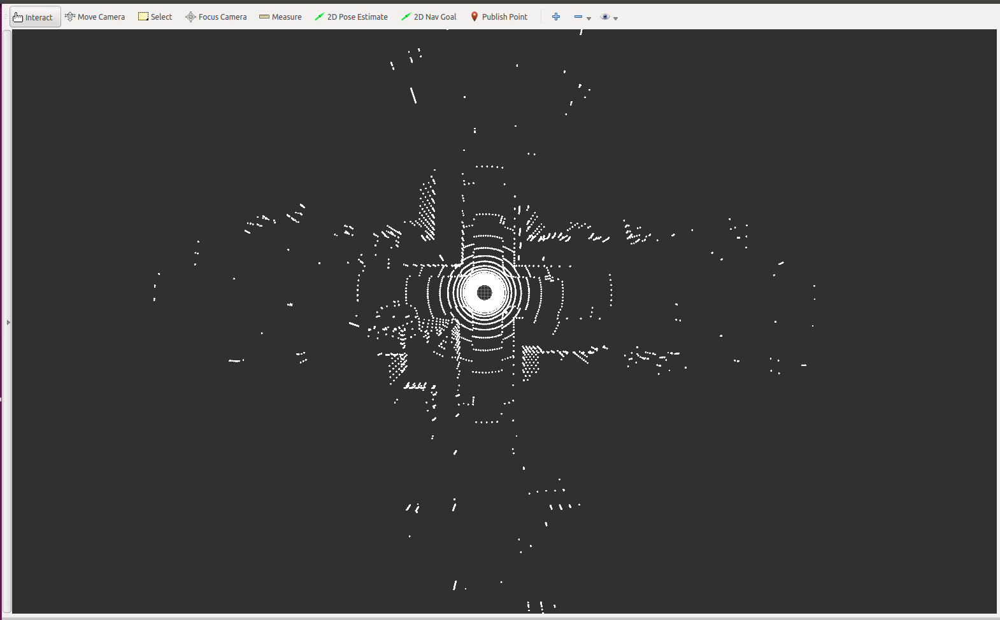

从这个中可以看出，随着channel的增加，其环境中可视化的激光圈数明显增加，并且rviz里面的探测距离明显变得更远。

**（3）垂直角度40度，64channel，并设置50w个点**

尝试过设置100w个点，但是在启动sh文件时，UE4左上角会提示Lidar capping number of points to scan信息，感觉还是有些问题的，但是100w个点，仍然能显示。因此后面修改为50w个点，没有该信息提示

rviz显示图为：

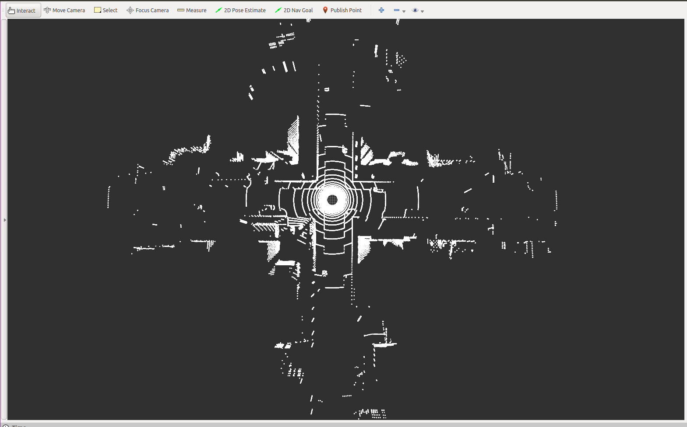

和上一张图比较，增加更多的点，其扫描出的物体能够更精确。

**rviz显示PointCloud并上色**

在Color Transformer一栏，设置为AxisColor，则其效果见下图

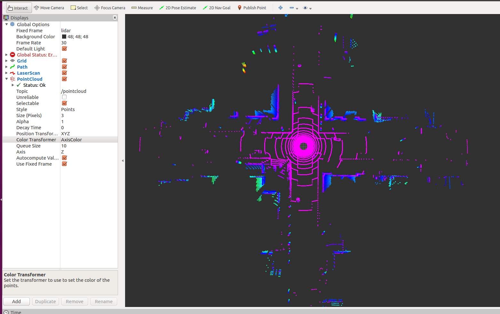

## 四、比较

### 4.1 单线，50w点，无垂直角度，水平角度范围180

**PointCloud显示**

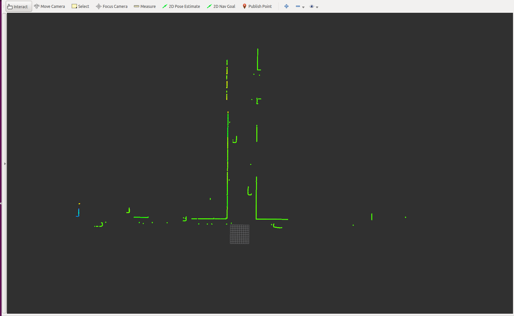

**LaserScan显示**

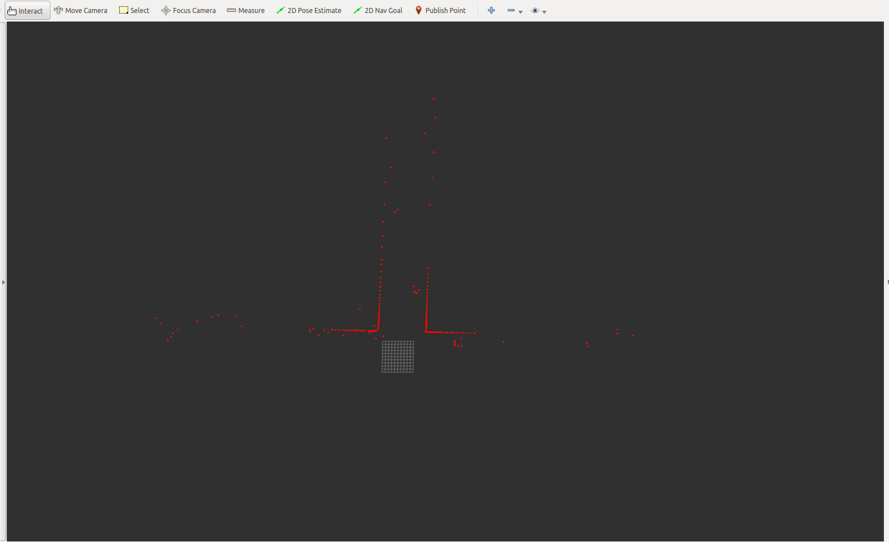

**LaserScan和PointCloud同时显示**

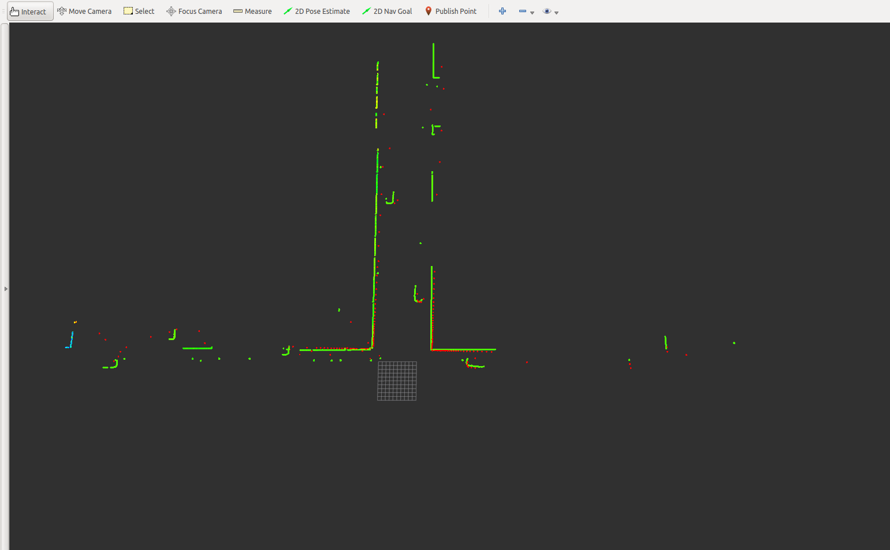

### 4.2 单线，50w点，垂直角度40度，水平角度范围180

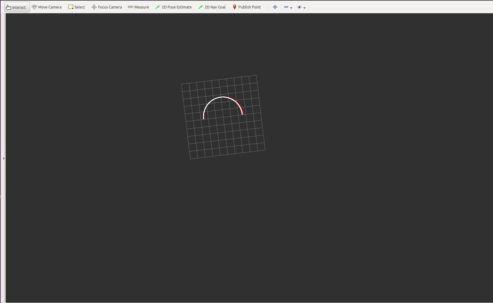

红色的LaserScan数据，白色的为PointCloud数据，看起来很接近，但是添加了垂直角度后，单线的激光检测就不对了

### 4.3 多线（16），50w点，垂直角度40度，水平角度范围180

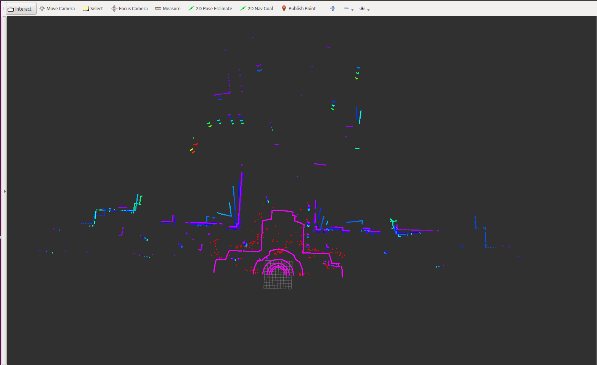

红色的为LaserScan，其他颜色的为PointCloud。

## 总结

> 通过从比较中可以看出，
>
> （1）单线激光雷达，不适合设置垂直角度，只适合二维。就连PointCloud在单线垂直角度下，都显示不对
>
> （2）多线激光雷达，一般设置垂直角度，显示三维点云数据
>
> 我目前设置的LaserScan，是对数据进行了处理，但是目前只考虑了180度的范围，没有考虑360度，因为360度中角度会发生相应的变化，后面会在继续进行处理~

## 参考链接

- [ros传感器消息及RVIZ可视化Laserscan和PointCloud（C++）](https://blog.csdn.net/yangziluomu/article/details/79576508)

- [浅谈激光雷达](http://www.wangdali.net/lidar/)

- [PointCloud参数详解](https://wiki.ros.org/rviz/DisplayTypes/PointCloud)

- [ros发布LaserScan和PointCloud（Python）](https://answers.ros.org/question/207071/how-to-fill-up-a-pointcloud-message-with-data-in-python/)

- [LaserScan转PointCloud2（Python）](http://wiki.ros.org/laser_geometry)

已经测试过的LaserScan转PointCloud2

```python
#!/usr/bin/env python
#-*- coding:utf-8 -*-

import sensor_msgs.point_cloud2 as pc2
import rospy
from sensor_msgs.msg import PointCloud2, LaserScan
import laser_geometry.laser_geometry as lg
import math

rospy.init_node("laserscan_to_pointcloud")

lp = lg.LaserProjection()
pc_pub = rospy.Publisher("test", PointCloud2, queue_size=1)

def scan_cb(msg):
	# convert the message of type LaserScan to a PointCloud2
	pc2_msg = lp.projectLaser(msg)

	pc_pub.publish(pc2_msg)

	# convert it to a generator of the individual points
	point_generator = pc2.read_points(pc2_msg)

	# we can access a generator in a loop
	sum = 0.0
	num = 0
	for point in point_generator:
		if not math.isnan(point[2]):
			sum += point[2]
			num += 1
	# we can calculate the average z value for example
	print(str(sum/num))

	# or a list of the individual points which is less efficient
	point_list = pc2.read_points_list(pc2_msg)

	print(point_list[len(point_list)/2].x)

rospy.Subscriber("/scan", LaserScan, scan_cb, queue_size=1)
rospy.spin()
```

