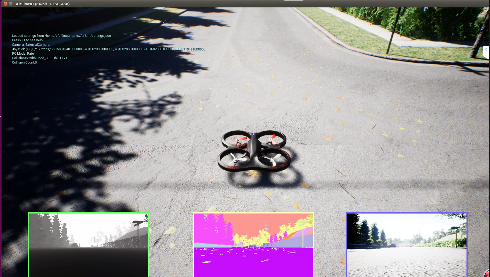

## 前言

> 这篇博客，更多的是记录一下ubuntu下QGC的安装及使用，Airsim的SITL配置以及如何添加UE4的定制场景等。但是在Airsim的HITL配置方面还没有成功过

## 相关关键词

- QGC
- SITL
- PX4

## 一、PX4 SITL配置

### 1.1 设置dialout用户

```
sudo usermod -a -G dialout $USER
```

执行完后，注销，重新登录，重启更好

### 1.2 安装Pixhawk/Nuttx（and JMAVSim）

> 在桌面新建sh文件，并命名为：`ubuntu_sim_nuttx.sh`

点击[此处](https://raw.githubusercontent.com/PX4/Devguide/v1.9.0/build_scripts/ubuntu_sim_nuttx.sh)，拷贝`ubuntu_sim_nuttx.sh`源代码，粘贴到刚才新建的`ubuntu_sim_nuttx.sh`文件中

修改权限，并执行sh文件

```python
chmod u+x ubuntu_sim_nuttx.sh
./ubuntu_sim_nuttx.sh
```

下载过程中，有些需要提示的地方进行确认，下载完成后，重启计算机


### 1.3 获取PX4源码

```python
mkdir -p PX4
cd PX4
git clone https://github.com/PX4/Firmware.git
cd Firmware
git checkout v1.8.2  
```

### 1.4 编译

> 要确保到 PX4/Fireware 目录下，然后执行如下命令进行编译

```
make posix_sitl_ekf2  none_iris
```

编译完成后，窗口会出现等待UDP连接的提示


## 二、QGC和Mavros的安装

### 2.1 QGC安装

（1）下载QGC

> 下载QGC，请点击[此处](https://s3-us-west-2.amazonaws.com/qgroundcontrol/latest/QGroundControl.AppImage)

（2）修改权限

```python
cd ~/Downloads
chmod +x ./QGroundControl.AppImage
```

（3）运行QGC

```python
./QGroundControl.AppImage 
```

最终，会弹出QGC窗口


### 2.2 mavros和mavlink的源码安装

#### 2.2.1 二进制安装方式

（1）安装mavros

```python
sudo apt-get install ros-kinetic-mavros ros-kinetic-mavros-extras
```

（2）安装GeographicLib

```python
wget https://raw.githubusercontent.com/mavlink/mavros/master/mavros/scripts/install_geographiclib_datasets.sh
chmod u+x ./install_geographiclib_datasets.sh
sudo su
proxychains4 ./install_geographiclib_datasets.sh
```

#### 2.2.2 源码安装

（1）创建工作空间

```python
mkdir -p ~/catkin_ws/src
cd ~/catkin_ws
catkin build
wstool init src
```

（2）安装mavlink

```python
rosinstall_generator --rosdistro kinetic mavlink | tee /tmp/mavros.rosinstall
```

（3）安装mavros

```python
rosinstall_generator --upstream mavros | tee -a /tmp/mavros.rosinstall
```

（3）更新

```python
wstool merge -t src /tmp/mavros.rosinstall
wstool update -t src -j4
rosdep install --from-paths src --ignore-src -y
```

（4）安装GeograohicLib

```python
sudo su
proxychains4 ./src/mavros/mavros/scripts/install_geographiclib_datasets.sh
```

（5）编译

```python
catkin build
```

（6）source

```python
source devel/setup.bash
```

### 2.3 安装相关依赖包

```python
sudo apt-get install python-catkin-tools
```

## 三、测试

> <font color="red">首先，将前面所打开的所有UE4界面和终端窗口全部关掉</font>

### 3.1 settions.json配置

> 需要将settion.json里面的配置修改为PX4配置
>
> settions.json文件在~/Documents/Airsim目录下

配置信息修改如下：

```python
{
  "SeeDocsAt": "https://github.com/Microsoft/AirSim/blob/master/docs/settings.md",
  "SettingsVersion": 1.2,
  "SimMode":"Multirotor",
  "Vehicles":{
         "PX4":{
             	"VehicleType":"PX4Multirotor",
             	"UseSerial":false
        }
    }
}
```

### 3.2 SITL连接和QGC连接

（1）编译posix_sitl

> 进入到PX4/Fireware目录下，编译

```python
make posix_sitl_ekf2  none_iris
```

编译完成后，等待UDP的链接

（2）打开QGC

> 进入到  QGroundControl.AppImage 所在目录，打开QGC

```python
./QGroundControl.AppImage
```

打开后，也会等待无人机的连接

（3）打开UE4Editor

> 双击运行  UnrealEngine/Engine/Binaries/Linux/UE4Editor 文件，选择之前添加的插件Blocks，原来的Rolling没有AirsimGameMode


点击打开后，点击播放，加载出来后，会发现PX4 的UDP已经连接上，QGC也已经连接上


### 3.3 测试

#### 3.3.1 QGC起飞测试

> 点击QGC的起飞按钮，并滑动确定，最终Multirotor会起飞


#### 3.3.2 Firmware窗口命令起飞降落测试

> 在之前的等待UDP连接的窗口上输入命令测试

```
commander takeoff
commander land
```


#### 3.3.3 ros命令测试

> 打开一个新终端，执行如下命令

```python
roslaunch mavros px4.launch fcu_url:="udp://:14540@127.0.0.1:14557"
```


此时，可以通过调用service服务，来实现起飞

> 打开新终端，执行下面命令，能执行起飞降落

```python
rosservice call /mavros/cmd/arming true
rosservice call /mavros/cmd/takeoff -- 0 0 47.6420 -122.1404 126.1
rosservice call /mavros/cmd/land -- 0 0 47.6420 -122.1404 123
```

> rostopic list信息查看


> rosservice 命令结果输出
>
> 输出要为true才有效


## 四、添加城市道路场景

> Airsim有一些关于UE4的城市道路场景，但是在linux下我成功加载的目前只有两个，总共没测试过几个，能成功加载的是Africa、和Neighborhood，其中有加载过关于City的，但是这是两个zip.001这样的文件组成的，目前还没有解压成功（Linux下），在windows下应该能成功解压

> <font color="red">在打开下载的这些场景时，setting.json的配置信息不能修改为SITL的配置，为最初始的默认配置即可</font>

（1）下载场景

> 下载场景，请点击[此处](https://github.com/Microsoft/AirSim/releases)


（2）加载场景

> 首先下载的场景，要为如下的文件结构才行
>
> windows的场景为exe文件，linux下的为sh文件，如果没有sh文件这样，则不能加载


在新终端执行如下命令加载（进入到AirSimNH.sh文件所在目录）

```python
./AirSimNH.sh
```



> 同理，Africa的场景也是同样的方式

## 五、SITL与.sh文件不兼容

> 如果下载了github上提供的AirSimNH.sh环境，并运行sh文件时，将会出现**第四部分**的图片，但是却不能设置SITL，这样就很难受

通过浏览多方资料，发现了其可能的解决办法（未尝试，但是应该是没问题的），[这个解释挺好的](https://github.com/microsoft/AirSim/issues/1359)。通过浏览Airsim上的[doc](https://github.com/microsoft/AirSim/blob/master/docs/unreal_custenv.md)文档，看到了其他的相关的UE4场景，并且有免费的可以下载，具体步骤参照[教学视频](https://www.youtube.com/watch?v=y09VbdQWvQY&feature=)。本来准备下载的，结果在windows没有下载下来，也就没有测试。其中的两个UE4场景下载网址分别为：

- [cgtrader](https://www.cgtrader.com/items/50844/download-page#)

- [TURBOSQUID](https://www.turbosquid.com/3d-model/city?min_price=0&max_price=0)

因此，只要在UE4的商城上，去下载[AirSimNH](https://www.unrealengine.com/marketplace/zh-CN/slug/modular-neighborhood-pack)的环境，这样就下载了AirSimNH.uproject插件，就可以在UE4Editor中添加uproject插件，并且配置SITL控制了。但是其环境，是需要购买的。消费就是另一个问题了。

## 参考网址

- PX4 SITL配置：[Airsim Github官网](https://github.com/microsoft/AirSim/blob/master/docs/px4_sitl.md)
- QGC安装：[QGC官网](https://docs.qgroundcontrol.com/en/getting_started/download_and_install.html)
- Mavros安装：[mavos官网](http://dev.px4.io/en/ros/mavros_installation.html)
- settings配置：[github文档](https://github.com/microsoft/AirSim/blob/master/docs/settings.md)
- roslaunch测试：[PX4官网](http://dev.px4.io/en/simulation/ros_interface.html)

## 总结

> 总的来说，Airsim的SITL配置没有问题，但是要使用SITL时，必须打开UE4Editor，然后自己定义场景，而不能使用已经下载好的.sh场景，这个已经测试过。如果要是用城市道路场景，则在setting.json里面一定不能配置PX4的信息。
>
> 目前Airsim的HITL配置没有成功，主要是用的Pixhawk进行的测试，并且没有使用遥控器，在linux下不能利用QGC完成起飞，但是在Windows下可以
>
> SITL或HITL都是利用mavros来完成通信的，这个可能会暂时告一段落，后面会自己利用Airsim提供的API，自己去写ROS节点，利用ROS来实现控制，并且可以利用ROS的通信机制，来完成另种方式的HITL控制