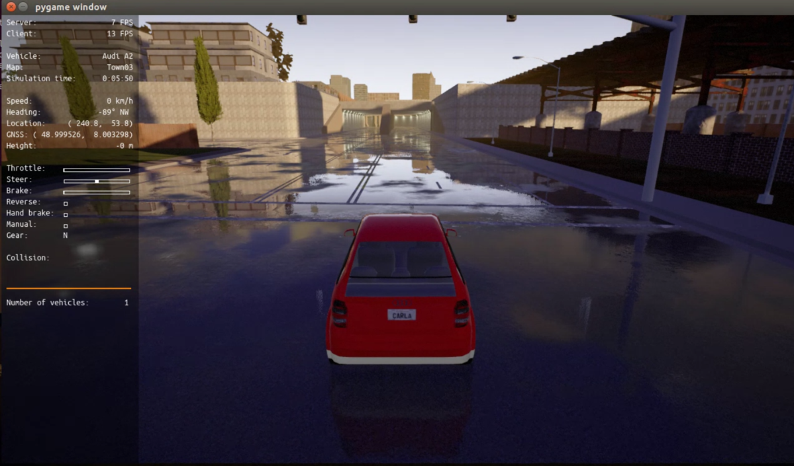

## 前言

> Carla和Airsim都是基于UE4引擎的仿真模拟器，但是经过安装笔记，Carla的源码安装是真的比Airsim复杂很多，因为之前源码安装的失败了，因此这里先记录如何使用预编译版的Carla

## 版本说明

- **Ubuntu16.04**
- **CARLA_0.9.6**

> 后面的安装步骤都是在刚装完ubuntu系统基础之上安装的，因此有一些基础的python包也会进行安装，并且**这里是已经配置了Ubuntu下终端翻墙的，所以在安装时最好也是已经配置好，这样在下载一个软件包什么的都比较快，能节省不少时间**

## 一、安装GPU显卡驱动

> 因为我这里用的是比较差的显卡，GT730，因此安装的是384驱动

```
sudo add-apt-repository ppa:graphics-drivers/ppa
sudo proxychains4 apt-get install nvidia-384 nvidia-settings nvidia-prime
sudo proxychains4 apt-get install mesa-common-dev
sudo proxychains4 apt-get install freeglut3-dev
sudo reboot
```

安装完并重启后，输入nvidia-smi则会有信息输出


## 二、下载Carla压缩文件

> [carla](https://github.com/carla-simulator/carla)官方github

点击[此处](https://github.com/carla-simulator/carla/releases)，进入到Carla的下载界面，此时有两种方式进行下载，下载Carla0.9.6，大概有3个G左右

- **网页下载：**直接点击CARLA_0.9.6.ta.gz，但是这种下载网络较慢

  

- **终端下载：**利用翻墙下载，速度快很多，能达到3M/s左右

  首先，右键CARLA_0.9.6.tar.gz，复制LinkLocation

  

  然后，打开终端，执行如下命令下载

```
proxychains4 wget http://carla-assets-internal.s3.amazonaws.com/Releases/Linux/CARLA_0.9.6.tar.gz
```


## 三、解压文件

> 用右键解压下载的CARLA_0.9.6.tar.gz文件，并解压到home目录

## 四、Carla使用

### 4.1 Python包的安装

#### 4.1.1 setuptools安装

> 采用源码安装方式，[下载地址](https://pypi.org/project/setuptools/#files)，下载zip文件，下载完后解压并进去到该解压目录

```
sudo python setup.py install
```

#### 4.1.2 pip安装

>  源码安装pip，[下载地址](https://pypi.org/project/pip/#files)，下载.tar.gz文件，下载完后解压，并进入到该解压目录

```
sudo python setup.py build
sudo python setup.py install
```

​		

#### 4.1.3 pip安装其他包

```
sudo proxychains4 pip install pygame
sudo proxychains4 pip install numpy
```

#### 4.1.4 安装libpng

```
sudo apt-get install libpng16-16
```

#### 4.1.5 安装PythonAPI依赖（Carla相关）

> 找到到之前解压的Carla文件夹，并进入到`~/CARLA_0.9.6/PythonAPI/carla/dist`目录下

```
sudo easy_install carla-0.9.6-py2.7-linux-x86_64.egg 
```

### 4.2 Carla验证使用

- 在Carla0.9.6文件夹下运行./CarlaUE4.sh

  全局视角

  

- 在PythonAPI/examples下运行 matual_control.py

  汽车的第三视角



在pygame windows上就能用键盘去控制了

## 五、Carla的五种城市地图切换

> 使用的是0.9.5版本，0.9.6版本的好像有点问题，只需要下载0.9.5，并且easy_install 0.9.5版本的PythonPAI依赖包就可以了

- **Town01** 

  ```
  ./CarlaUE4.sh  /Game/Carla/Maps/Town01
  ```


- **Town02**

  ```
  ./CarlaUE4.sh  /Game/Carla/Maps/Town02
  ```


- **Town03**

  ```
  ./CarlaUE4.sh  /Game/Carla/Maps/Town03
  ```

  

- **Town04**

  ```
  ./CarlaUE4.sh  /Game/Carla/Maps/Town04
  ```

  

- **Town05**

  ```
  ./CarlaUE4.sh  /Game/Carla/Maps/Town05
  ```

  

  

## 总结

> Carla的预编译版安装就比较简单，也不需要下载UE4，并进行编译等等。初步将Carla加载出来了，后面就可以写代码进行测试，并进行源码的安装测试

## 参考链接

- [Carla0.9.5简单高效安装方法](https://www.jianshu.com/p/a255bd23beb5)