# 一、系统环境配置

## 要使用Hexo，需要在系统中支持Nodejs以及Git

### 1、安装Node.js

[Node.js官网](<https://nodejs.org/zh-cn/download/>)

​		打开cmd命令行，输入node -v和npm -v，成功界面如下

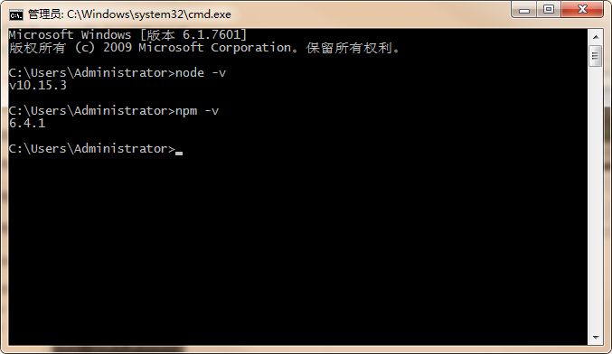

### 2、安装Git

[Git官网](<https://git-scm.com/download/>)

​		安装成功后，在电脑桌面任意空白位置，右键，出现以下界面（自行配置环境）

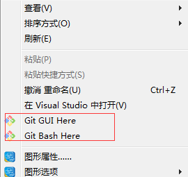

#   

# 二、Github配置

## 前提条件：已经拥有一个github账号，并已成功登陆

### 1、点击【New repository】，创建一个版本仓库

​		注：仓库名称必须为username.github.io，我这里的username为ldgcug

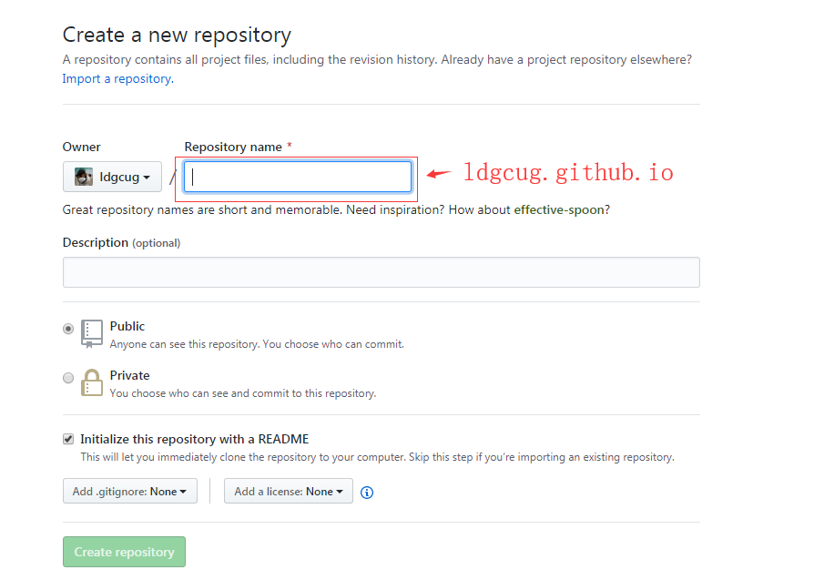

### 2、创建完成后，在项目右侧，有个【Settings按钮】，点击【Settings按钮】，向下滑到【GitHub Pages】位置，能在这里发现一个网址，并且可以通过外网访问

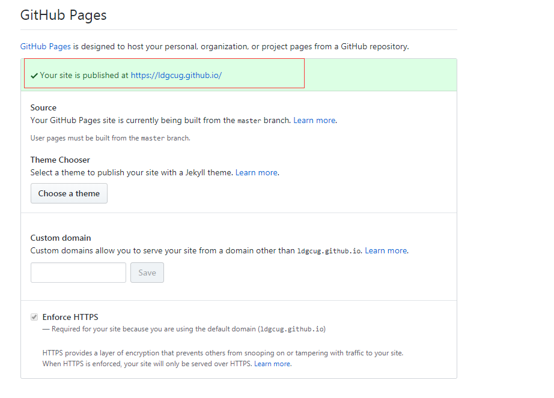

# 三、安装Hexo并配置

### 安装Hexo，在自己认为合适的地方创建文件夹，如：我是在D盘创建了一个blog文件夹，然后通过cmd命令行进入到该文件夹里面

​		输入  npm install hexo -g ，开始安装Hexo

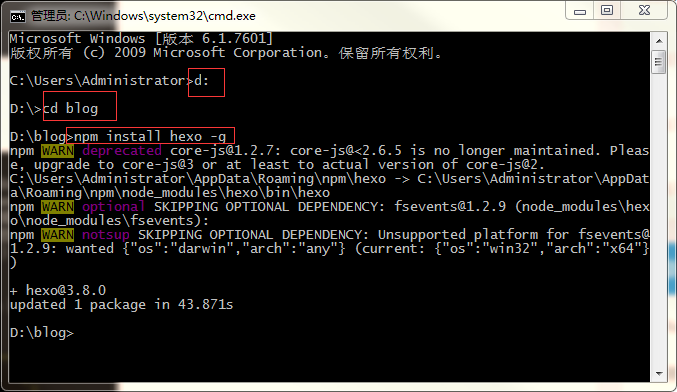

​		安装成功后，输入   hexo -v，能看到版本号

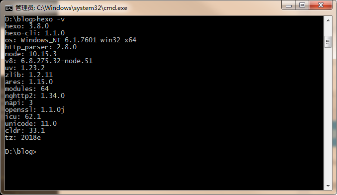

​		输入 hexo init，初始化该文件夹（此处不显示图片过程）

​		输入  npm install ，安装所需要的组件

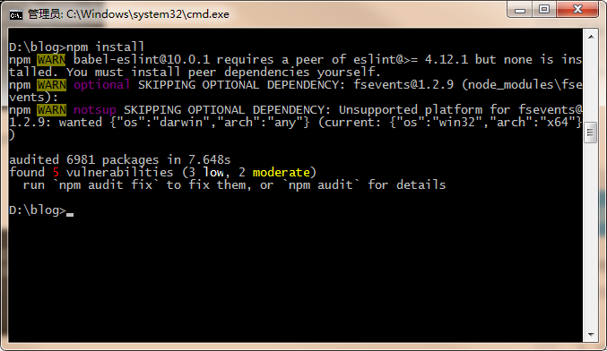

​		输入  hexo g，体验Hexo

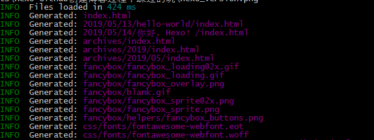

​		输入 hexo s，开启服务器，访问http://localhost:4000，正式体验Hexo

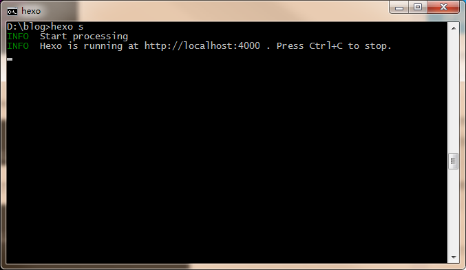

​		出现下图，则安装成功

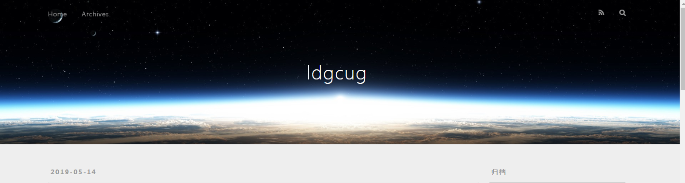

# 四、Hexo与Github Pages联系起来

> 说明：下面的所有操作都在博客根目录下执行，使用git bash窗口

### 1、设置Git的user name 和email（如果第一次配置）

​		注：将用户名和邮箱换成自己的用户名和邮箱

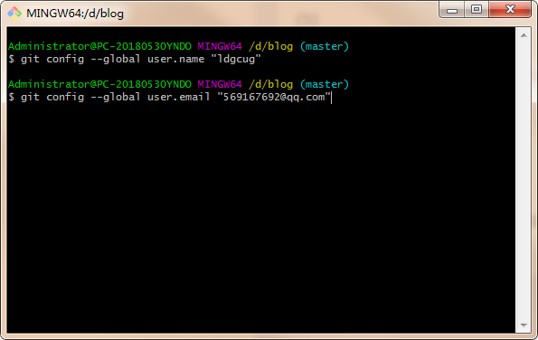

### 2、输入  ssh-keygen -t rsa -C “569167692@qq.com”，连续三个回车，生成密钥，查看自己的文件存储路径（默认路径为：C:\Users\Administrator\\.ssh）

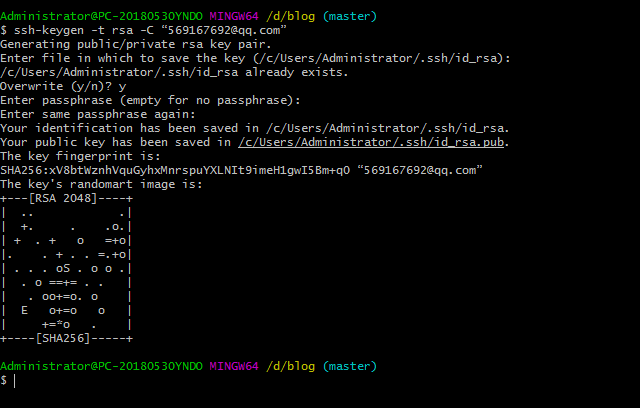

​		输入   eval "$(ssh-agent -s)"  ，添加密钥到 ssh-agent

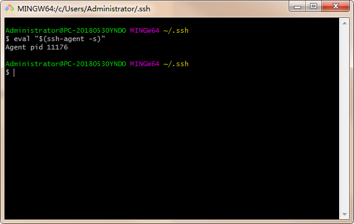

​		输入  ssh-add ~/.ssh/id_rsa  ，添加生成的SSH key 到 ssh-agent

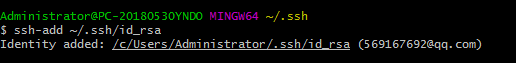

​		输入 cd ~/.ssh，检查是否有.ssh文件夹，若没有，则进入C:\Users\Administrator\\.ssh

​		输入 ls，查看.ssh文件夹下文件（第一次没有known_hosts文件）

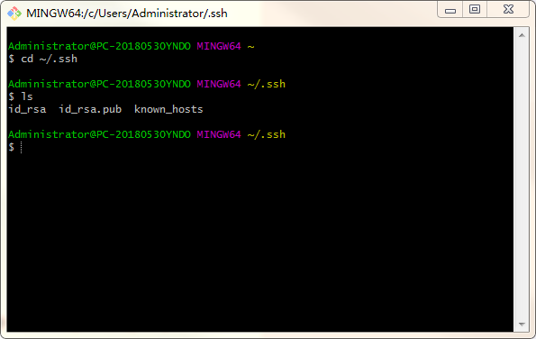

​		进入./ssh文件夹下，打开   id_rsa.pub文件，将其中的内容复制到缓存中

​		登陆Github，点击【头像】下的【setting】，点击左侧的【SSH  and GPG keys】，点击【New SSH key】，将刚才复制的 id_rsa.pub 文件复制到Key中，添加ssh

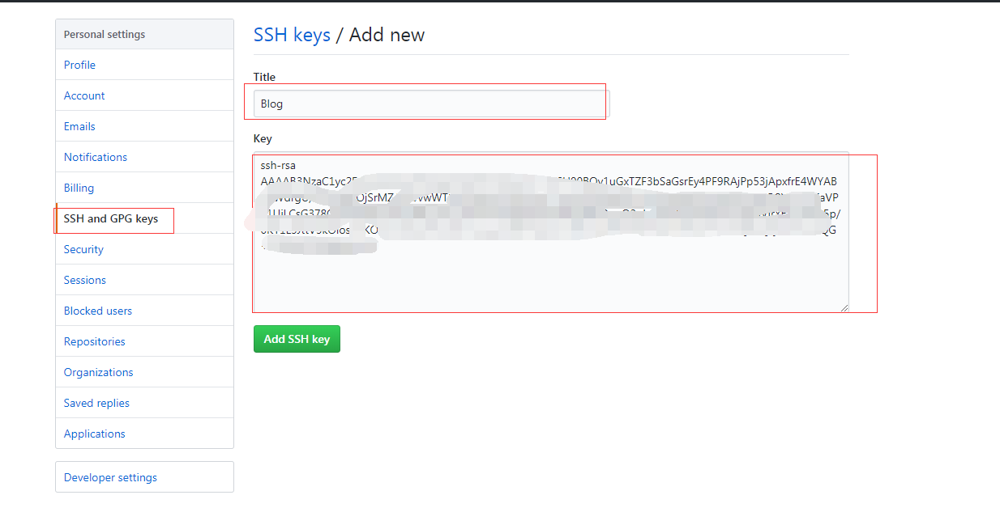

​		输入  ssh -T git@github.com  ，测试添加ssh是否成功，如果看到Hi 后面是你的用户名，则添加成功

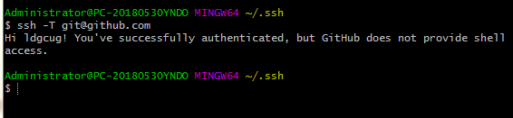

### 3、配置Deployment，在blog文件夹中，找到_config.yml文件，修改repo值（在文件末尾）

> 下图中，需要将repository更改为你自己的github.io

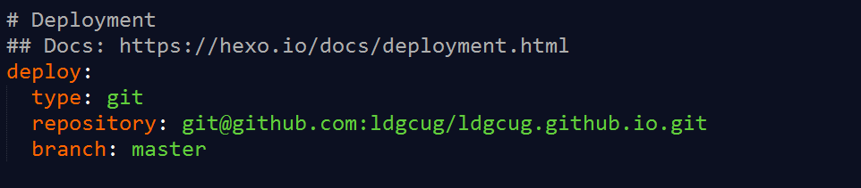

​		其中，repo的值在github项目里的ssh中（注意使用SSH，而不是HTTPS）

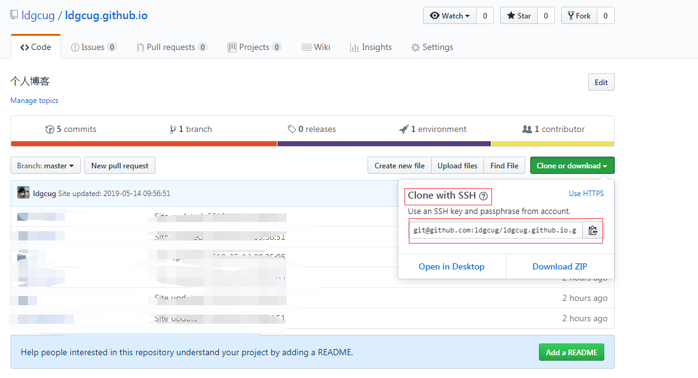

​		注：在_config_yaml文件中，type、repo、branch文件后面有一个空格，即上图中添加的代码会变成绿色，最开始没有空格时，遇到了很多的坑

# 五、新建博客  

> 所有的命令操作都在博客根目录下执行

### 1、在cmd 命令种安装扩展

​		输入 ：  npm install hexo-deployer-git --save

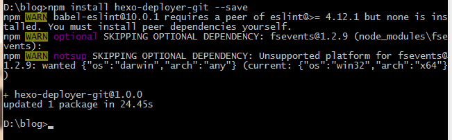

### 2、新建博客

​		在git bash窗口中，执行命令：  hexo new post "博客名"

​		会发现在soucrce\\_posts 文件下，多出刚创建的博客.md

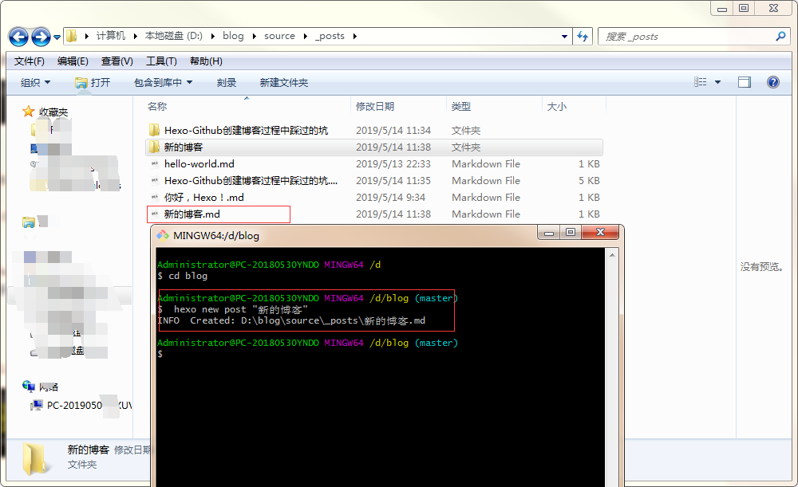

### 3、md编辑器（Typora编辑器）

>
>
>在[Typora官网](https://typora.io/)上下载Typora编辑器，使用Typora编辑器对md文件进行编辑  

### 4、部署发布

​		使用编辑器编辑好文章后，使用命令： hexo d -g ，就可以生成和部署了

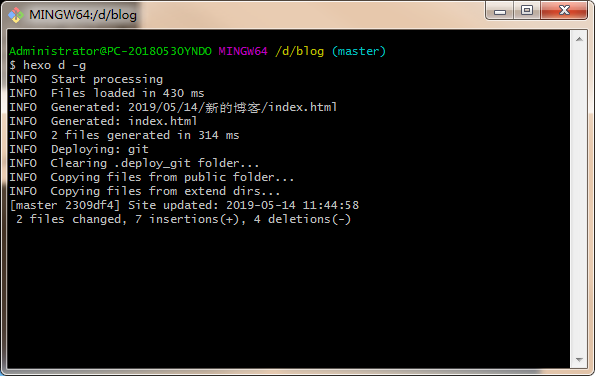

​		部署成功后，访问你的地址：http//用户名.github.io 。就能看到刚生成的文章。

