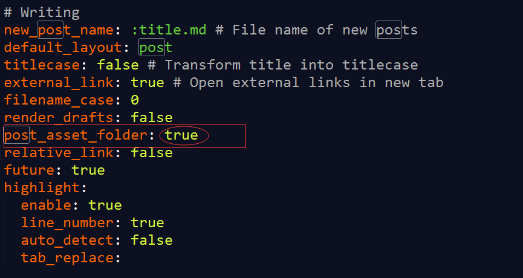

# 1、配置_config.yml文件

### 找到博客根目录下的 _config.yml，如我的文件路径为 D:\blog\\\_config.yml

### 打开_config.yml，查找 post_asset_folder字段，将post_asset_floder设置为true。如下图

# 2、post_asset_folder 设置为true和false的区别

### 当post_asset_folder设置为true后，使用命令：hexo new post "新博客名称" ，创建新博客时，Hexo会自动建立一个与文章同名的文件夹，如下图

# 3、安装插件

### 打开git bash，进入到博客的根目录下（如：cd d/blog/），执行命令：npm install [https://github.com/CodeFalling/hexo-asset-image](https://link.jianshu.com/?t=https%3A%2F%2Fgithub.com%2FCodeFalling%2Fhexo-asset-image)--save  ，完成插件的安装

# 4、图片存放

### 将所有图片资源都放到对应的文件夹下（如：Hexo图片显示和Github上图片显示的解决办法）

### 

# 5、本地查看显示效果

### 使用 hexo s 命令，运行本地博客，成功显示图片如下图

# 6、上传github并显示

### 使用 hexo g -d ，重新生成并上传，浏览器输入https://ldgcug.github.io 即可查看效果

# 遇到过的坑：

## （1）图片的路径问题

> 图片加载格式：由两部分组成（![图片描述]  + (图片路径)）

## 输入![logo] (图片路径)，（由于正确加载，前面的输入会变成一个图片，因此在[logo] （图片路径）中间加了一个空格，正确输入时，应去掉空格）会出现一个输入图片路径的提示，从文件中选择路径后如下图

## 此时，用该绝对路径上传到github后，输入<https://ldgcug.github.io/>，会发现，图片无法加载

## 解决方法：将绝对路径改为相对路径

## （2）图片的命名问题

> 不能使用"_"作为开头