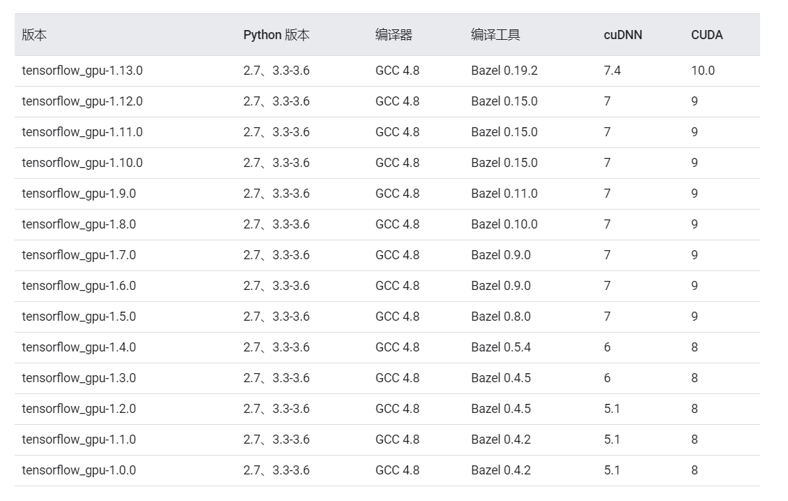
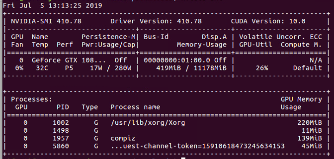
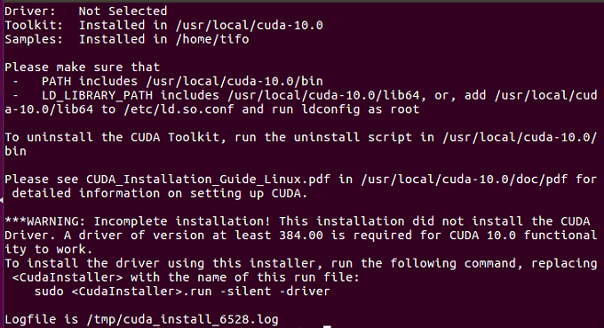
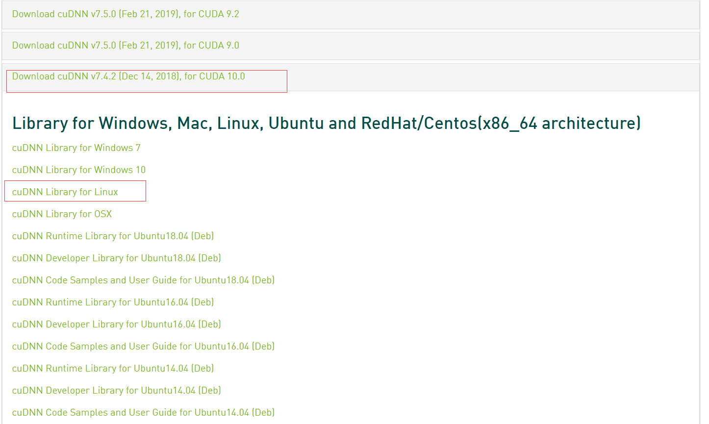
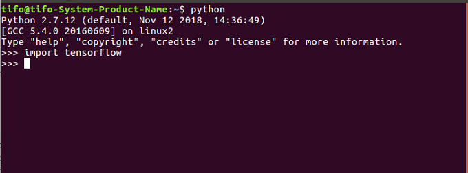
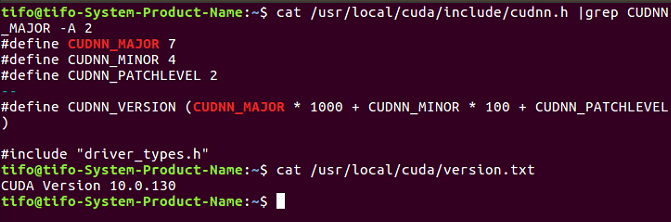
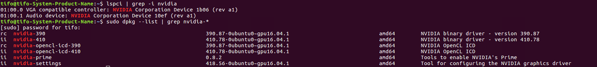
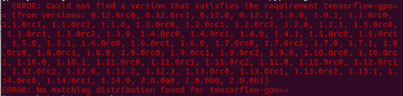
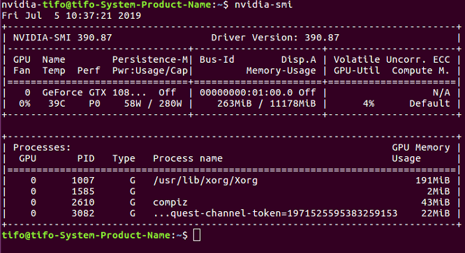

## 前言

> 以往的GPU Tensorflow安装都是在服务器上安装，并且步骤不太详细，这一次，是认为比较详细的一步步的安装方法，有了这个笔记，以后参照这个应该就能很快的安装好Tensorflow了

## 版本说明

- 系统：Ubuntu16.04
- CUDA版本：cuda10.0
- cuDNN版本：cudnn7.4.2
- Tensorflow版本：tensorflow1.13.1

## Linux下 CUDA cuDNN Tensorflow 对应关系



## 一、安装nvidia显卡驱动

```
sudo add-apt-repository ppa:graphics-drivers/ppa
```

## 二、查看可安装的驱动版本

```
ubuntu-drivers devices
```


安装nvidia-410，我这里安装的是410版本

```
sudo apt-get install nvidia-410 nvidia-settings nvidia-prime
```

> 说明：我最开始安装过推荐的430版本，结果安装完成后，重启，界面进不去，会有报错，因此安装的低版本，目前测试过的410和390版本都没有问题

安装一些必要软件

```
sudo apt-get install mesa-common-dev
sudo apt-get install freeglut3-dev
```

安装完成后，重启，以确认生效

```
sudo reboot
```

重启后，输入`nvidia-smi`，则能看到相关信息



## 三、安装cuda

### 3.1 下载cuda

点击[cuda官网](https://developer.nvidia.com/cuda-toolkit-archive)，下载CUDA10.0版本，下载runfile文件


### 3.2 安装cuda

```
cd ~/Downloads
sudo sh cuda_10.0.130_410.48_linux.run
```

运行后，稍等一会，会看见一些相关信息，此时需要按键，跳到100%浏览完成

按`空格键`跳到100%，直至出现如下界面


输入`accept`，等待下一个提示


是否安装410.48驱动，由于前面已经安装，这里选择否，输入`n`，等待下一个提示


提示，安装CUDA10.0 Toolkit，选择`y`，等待下一个提示


按`回车键`，选择默认路径，等待下一个提示


输入`y`，安装symbolic link，等待下一个提示


输入`y`，安装CUDA10.0 样例


最后，按`回车键`，选择默认路径，至此，已经CUDA安装步骤已经全部完成

安装完成后，界面显示如下：



## 四、安装cuDNN

### 4.1 下载cuDNN

点击[cuDNN官网](https://developer.nvidia.com/rdp/cudnn-archive)，下载cuDNN7.4.2版本，选择cuDNN7.4.2 for CUDA 10.0

下载时，选择cuDNN Library for linx，下载.tgz文件



### 4.2 安装cuDNN

首先，解压文件

```
cd ~/Downloads
tar -zxvf cudnn-10.0-linux-x64-v7.4.2.24.tgz 
```

安装配置

```
sudo cp cuda/include/cudnn.h /usr/local/cuda/include
sudo cp cuda/lib64/libcudnn* /usr/local/cuda/lib64
sudo chmod a+r /usr/local/cuda/include/cudnn.h /usr/local/cuda/lib64/libcudnn*
```

## 五、配置cuda环境

首先，需要打开~/.bashrc文件

```
sudo gedit ~/.bashrc
```

在文件末尾添加两行代码

```
export PATH=/usr/local/cuda-10.0/bin:$PATH
export LD_LIBRARY_PATH=/usr/local/cuda-10.0/lib64:$LD_LIBRARY_PATH
```

随后，source一下，以保存配置

```
source ~/.bashrc
```

## 六、安装gpu-tensorflow

我这里添加了proxychains4，是实现在终端翻墙的效果，这样下载安装会很快

```
sudo proxychains4 pip install tensorflow-gpu==1.13.1
```

## 七、测试

在终端输入python，进入python环境

然后 输入import tensorflow，不报错，即配置成功



## 八、帮助信息

### 8.1 查看cuda版本信息

```
cat /usr/local/cuda/version.txt
```

### 8.2 查看cuDNN版本信息

cat /usr/local/cuda/include/cudnn.h | grep CUDNN_MAJOR -A 2

> cuda和cuDNN版本信息如下图



### 8.3 查看GPU显卡信号和驱动版本信息

```
lspci | grep -i nvidia
sudo dpkg --list | grep nvidia-*
```



### 8.4 查看可安装的gpu-tensorflow版本信息

输入

```
 sudo proxychains4 pip install tensorflow-gpu==
```

这里是会报错，因为没有输入对应版本，但是提示的错误信息中，能查看所有的可安装的gpu版本

如

```
 sudo proxychains4 pip install tensorflow-gpu==1.13.1
 sudo proxychains4 pip install tensorflow-gpu==1.13.0rc0
```




## 九、安装过程中，遇到过的问题

### 9.1 nvidia-*版本覆盖安装

> 最开始我安装的是nvidia-390的版本，然后输入nvidia-smi时，出现如下信息，这里没有显示CUDA的版本



> 后来，我直接又安装了nvidia-410版本，没有删除之前的任何信息，此时输入nvidia-smi，出现如下信息


> 这样也可能导致，我在这里输入`sudo dpkg --list | grep nvidia-*`，查看信息的时候会有两个的原因吧


> 总的来说，最后Tensorflow导入是没有问题的

### 9.2  markdown3.1.1错误提示

> 在安装gpu-tensorflow1.13.1版本的过程中，提示markdown错误


> 原因：pip版本过低

> 解决方法：升级pip

```
python -m pip install --upgrade pip
```

## 参考链接

- GPU Tensorflow安装：[ldg个人博客](https://ldgyyf.cn/2019/05/21/Linux/GPU-Tensorflow-%E5%AE%89%E8%A3%85/)

- cuda、cuDNN、Tensorflow对应版本关系：[Tensorflow中文社区](https://tensorflow.google.cn/install/source)

## 总结

> 又重新在真机上安装配置了一遍GPU Tensorflow，并且笔记较之前更为详细，相信后面直接参考该教程是没有任何问题的了