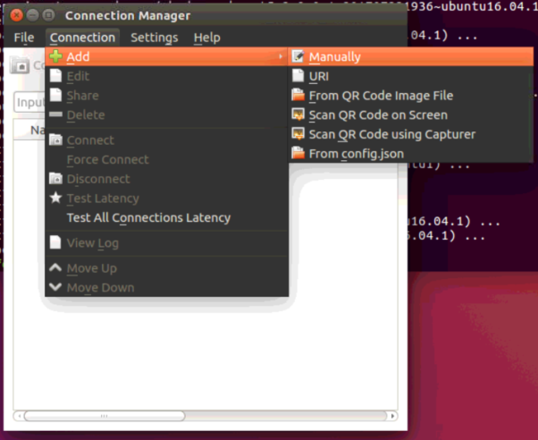
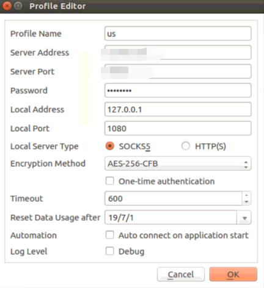
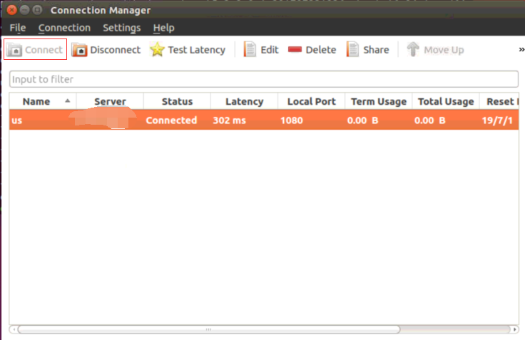
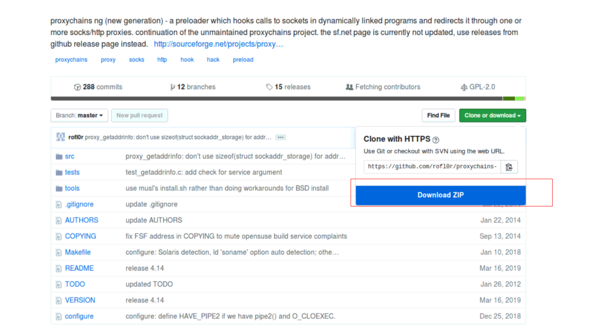
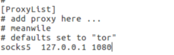
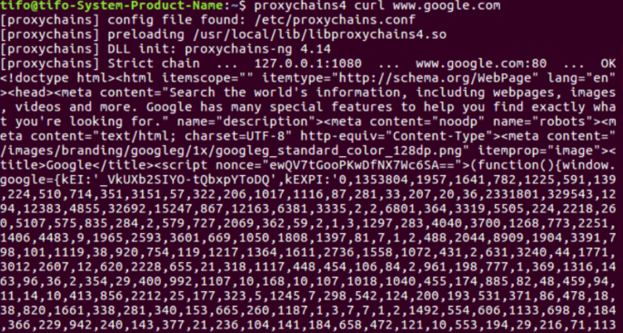
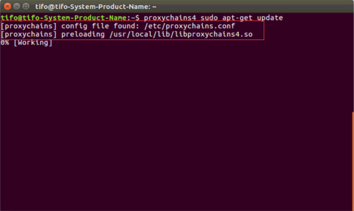
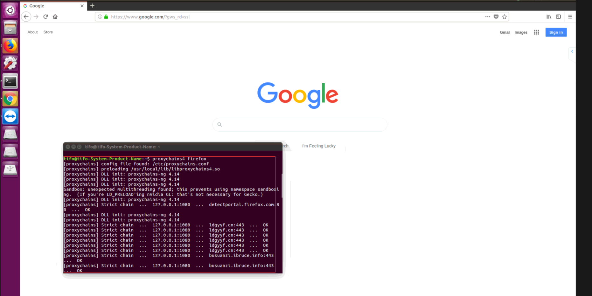
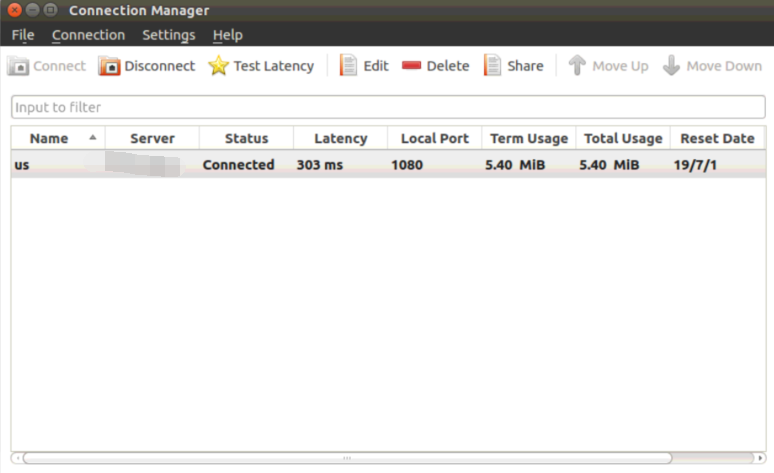

## 前言

> 其实这一个笔记和前面的笔记（[ubuntu16下翻墙搭建](https://ldgyyf.cn/2019/05/18/Linux/ubuntu16%E4%B8%8B%E7%BF%BB%E5%A2%99%E6%90%AD%E5%BB%BA/)）差不多，但是之前的笔记只记载了chrome浏览器下，网页端科学上网的方法，关于终端下如何科学上网，并没有记载，因此这篇笔记，更多的是说明如何在终端上科学上网，当然也能在firefox上，chrome浏览器上还没有测试

## 一、安装chrome浏览器

> 安装chrome浏览器，只是习惯用chrome，还有就是chrome浏览器的默认下载是在~/Downloads下，而firefox的默认下载是在一个tmp文件夹下，也懒得去修改，所以还是先安装了chrome浏览器，为后面的文件下载做铺垫

```
$ sudo wget http://www.linuxidc.com/files/repo/google-chrome.list -P /etc/apt/sources.list.d/
$ wget -q -O - https://dl.google.com/linux/linux_signing_key.pub | sudo apt-key add -
$ sudo apt-get update
$ sudo apt-get install google-chrome-stable
```

## 二、安装qt5并进行配置

### 2.1 安装shadowsocks-qt5

- 添加源

```
sudo add-apt-repository ppa:hzwhuang/ss-qt5
sudo apt-get update
```

- 安装qt5

  ```
  sudo apt-get install shadowsocks-qt5
  ```

- 安装完成后，在菜单栏搜索shadows，找到shadowsocks-qt5，打开并进行配置

  

### 2.2 shadowsocks-qt5配置

（1）添加连接

> 点击 `Connection` -> `Add` -> `Manually`



（2）设置IP、Port、加密方式

> ip 和port设置为自己的vpn账号和端口



（3）VPN连接



## 三、Proxychains安装并配置

> 下载文件时，使用chrome浏览器打开链接进行下载

### 3.1 下载zip文件：[github网址](https://github.com/rofl0r/proxychains-ng.git)



### 3.2 解压

```
cd ~/Downloads
unzip pro*.zip
```

### 3.3 安装proxychains

```
cd ~/Downloads
cd proxychains-ng-master/
./configure
sudo make && sudo make install
sudo cp ./src/proxychains.conf /etc/proxychains.conf
```

### 3.4 编辑proxychains配置

> 打开./conf文件进行配置

```
sudo gedit /etc/proxychains.conf 
```

将最后一行的 socks4 127.0.0.1 9050修改为socks5 127.0.0.1 1080，最终如下图



## 四、科学上网测试

### 4.1 测试

> 需要先安装curl

```
sudo apt-get install curl
proxychains4 curl www.google.com
```

出现下图，则配置成功



### 4.2 终端上网

> 输入下面命令

```
proxychains4 sudo apt-get update
```

或者

```
sudo proxychains4 apt-get update
```

出现下图信息，则成功，下图对应第一条命令



### 4.3 firefox科学上网

> 在终端输入如下命令

```
 proxychains4 firefox
```

接着会弹出一个firefox的界面，在url地址栏输入www.google.com即能google了



### 4.4 流量损耗

> 在能够科学上网后，也能看到shadowsocks5 里面的流量损耗



## 参考链接：

- [proxychains配置](https://blog.fazero.me/2015/08/31/%E5%88%A9%E7%94%A8proxychains%E5%9C%A8%E7%BB%88%E7%AB%AF%E4%BD%BF%E7%94%A8socks5%E4%BB%A3%E7%90%86/)
- [proxychains使用方法](https://www.cnblogs.com/hcbin/p/8489041.html)

- [ping 不通google说明](https://blog.csdn.net/JBlock/article/details/79584073)

## 总结

> 暂时还没有找到如何通过proxychains4 让chrome浏览器科学上网的方法，但是目前的设置，能够在firefox进行相应的搜索，但需要执行一次proxychains4的命令，另外终端执行命令前加上proxychains也能科学上网