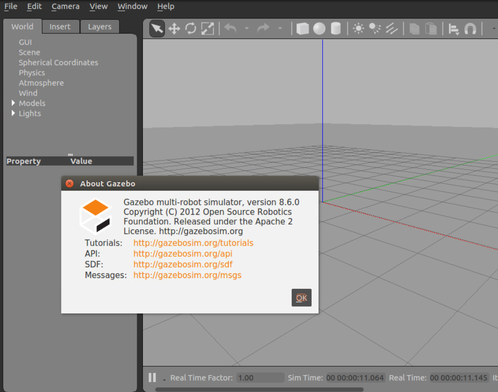
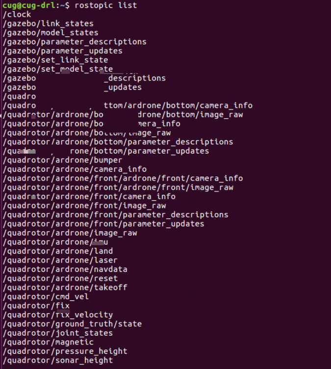
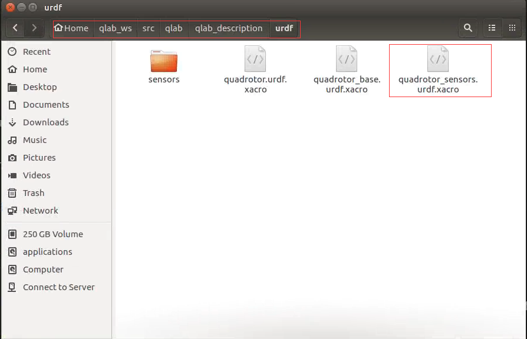
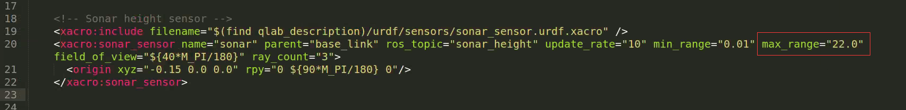
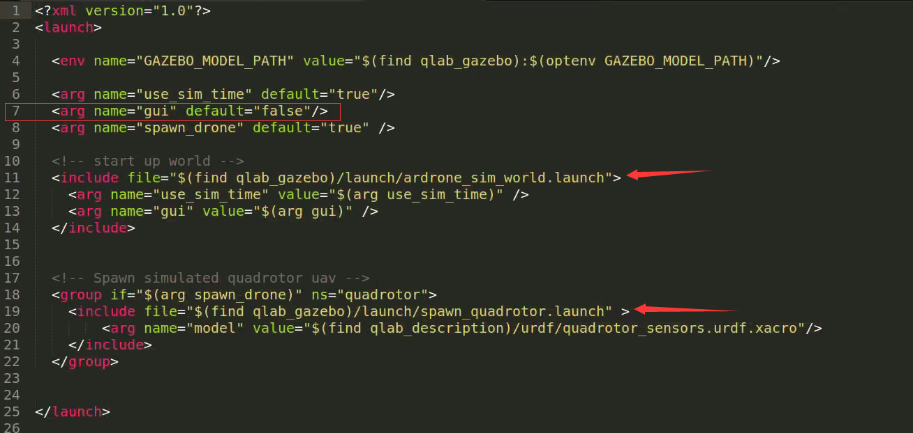
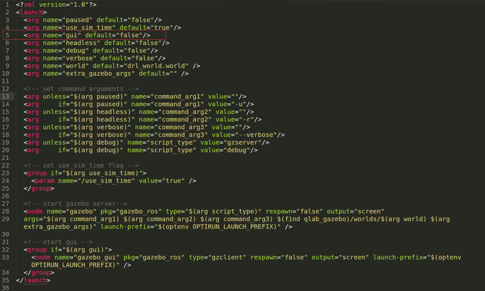
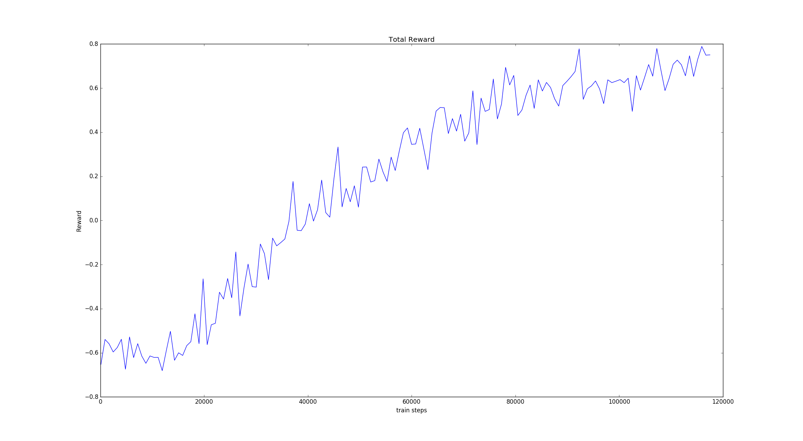
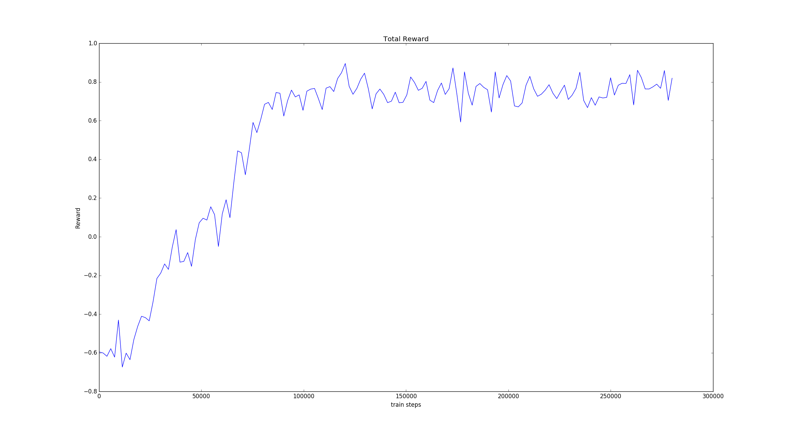

## 前言

> 本篇主要是针对[DRL论文阅读（一）](https://ldgyyf.cn/2019/07/17/%E8%AE%BA%E6%96%87/%E6%B7%B1%E5%BA%A6%E5%BC%BA%E5%8C%96%E5%AD%A6%E4%B9%A0/DRL%E8%AE%BA%E6%96%87%E9%98%85%E8%AF%BB%EF%BC%88%E4%B8%80%EF%BC%89%E4%B9%8BDQN%E6%96%B9%E6%B3%95/)中的论文题目来实现，其主要实现了第一部分标记检测，目前是只实现了单纹理下的训练。
>
> 其论文题目：**Autonomous Quadrotor Landing using Deep Reinforcement Learning**

## 一、基础环境搭建

### 1.1 版本说明

- **Ubuntu16.04**
- **ROS Kinetic**
- **Gazebo8.6**

### 1.2 Gazebo8.6安装

```python
sudo sh -c 'echo "deb http://packages.osrfoundation.org/gazebo/ubuntu-stable `lsb_release -cs` main" > /etc/apt/sources.list.d/gazebo-stable.list'
wget http://packages.osrfoundation.org/gazebo.key -O - | sudo apt-key add -
sudo apt-get update
sudo apt-get install gazebo8
sudo apt-get install libgazebo8-dev
```

安装好后，在终端输入**gazebo8**，出现如下界面，则安装成功



### 1.3 ros kinetic安装（不安装full版）

```python
sudo sh -c 'echo "deb http://packages.ros.org/ros/ubuntu $(lsb_release -sc) main" > /etc/apt/sources.list.d/ros-latest.list'
sudo apt-key adv --keyserver hkp://ha.pool.sks-keyservers.net:80 --recv-key 421C365BD9FF1F717815A3895523BAEEB01FA116
sudo apt-get update
sudo apt-get install ros-kinetic-desktop
sudo rosdep init
rosdep update
echo "source /opt/ros/kinetic/setup.bash" >> ~/.bashrc
source ~/.bashrc
sudo apt-get install python-rosinstall python-rosinstall-generator python-wstool build-essential
```

安装完后，终端输入**roscore**，输出的最后一行出现started core service [/roscore]，则ros安装成功

### 1.4 安装必要ros包

```python
sudo apt-get install ros-kinetic-gazebo8-msgs
sudo apt-get install ros-kinetic-gazebo8-ros-control
sudo apt-get install ros-kinetic-gazebo8-plugins
sudo apt-get install ros-kinetic-gazebo8-ros-pkgs
sudo apt-get install ros-kinetic-gazebo8-ros
sudo apt-get install ros-kinetic-image-view
```

### 1.5 已经安装默认的ros-kinetic？

> 如果机器已经默认安装了ros-kinetic-desktop-full，则会默认安装gazebo7版本。此时，需要先卸载gazebo7然后重新安装gazebo8

**卸载ros-kinetic-desktop-full**

```python
sudo apt-get remove ros-kinetic-desktop-full
```

**卸载gazebo7**

```python
sudo apt-get remove gazebo* 
```

然后重新按照**1.2节**和**1.3节**和**1.4节**在做一遍，在**1.3节**的步骤中，其实是可以只执行到第四步即可的。因为其他的之前已经安装过了

```python
sudo apt-get install ros-kinetic-desktop
```

## 二、搭建qlab实验环境

**安装ros-kinetic-ardrone-autonomy**

```python
sudo apt-get install ros-kinetic-ardrone-autonomy
```

### 2.1 创建ros工作空间

创建工作空间

```python
mkdir qlab_ws
cd qlab_ws
mkdir src
cd src
catkin_init_workspace
```

编译和source

```python
cd ~/qlab_ws
catkin_make
echo "source ~/qlab_ws/devel/setup.bash" >> ~/.bashrc
source ~/.bashrc
```

### 2.2 下载qlab源码

下载并拷贝完后，~/qlab_ws/src文件夹下将会有deep_reinforced_landing和qlab两个文件

```python
cd 
git clone https://github.com/pulver22/QLAB.git -b gazebo8
cp -r QLAB/deep_reinforced_landing/ QLAB/qlab/ ~/qlab_ws/src
```

编译和source

```python
cd qlab_ws
catkin_make
source devel/setup.bash
```

**注：每次ros工作空间下拷贝或新建了新的程序包，都需要重新编译和source**

### 2.3 启动测试

**相关配置**：因为在启动launch文件的时候，它里面会加载一些model模型，这些模型全部在qlab的文件夹下，因此需要在**~/.bashrc**文件下添加其路径，或者将modes文件夹全部拷贝到**.gazebo**文件夹下也可以.

（1）打开~/.bashrc文件

```python
sudo gedit ~/.bashrc
```

（2）在最后一行添加如下代码

下面的username要修改为对应的机器的用户名

```python
export GAZEBO_MODEL_PATH="/home/username/qlab_ws/src/qlab/qlab_gazebo/models"
```

（3）关闭~/.bashrc文件并source

```python
source ~/.bashrc
```

启动qlab.launch

```python
cd ~/qlab_ws
roslaunch qlab_gazebo qlab.launch
```

启动drl.launch

```
cd ~/qlab_ws
roslaunch deep_reinforced_landing drl.launch
```

**查看rostopic**



**常用的控制命令**

```python
rostopic pub -1 /quadrotor/ardrone/takeoff std_msgs/Empty
rostopic pub -1 /quadrotor/ardrone/land std_msgs/Empty
rosrun image_view image_view image:=/quadrotor/ardrone/front/ardrone/front/image_raw
rosrun image_view image_view image:=/quadrotor/ardrone/bottom/ardrone/bottom/image_raw
```

## 三、强化学习训练

### 3.1 修改相关配置

**（1）修改无人机最大高度**

> 因为在第一阶段训练的过程中，无人机的高度是固定在20m左右的，而其默认的最大高度为3m，因此需要先修改最大高度限定，可以修改为22m

在**~/qlab_ws/src/qlab/qlab_description/urdf**文件夹下找到**quadrotor_sensors.urdf.xacro**文件



然后在其中的第20行，将max_range的值由3.0修改为22.0



这样，无人机的最大高度就修改为了22

**（2）训练时，需要关闭clinet，即关闭gazebo图形界面，提升训练速度**

训练时，启动**qlab.launch**进行训练，则对**qlab.launch**文件进行修改

将其中的第七行的**gui**的值由**true**修改为**false**，如图所示



在该launch文件中，还引用了**ardrone_sim_world.launch**，因此也去这个launch文件中进行修改

同样的，找到第5行，将**gui**的值修改为**false**



**注：如果要关闭掉client的图像界面，则最好是在启动的相关的文件中，将所有的gui的值都设为false，这样比较保险**

### 3.2 安装相关包

- **gym**

  可以采用pip安装，也可以采用源码安装方式

  ```python
  sudo pip install gym
  ```

- **Tensorflow**：[详细安装](https://ldgyyf.cn/2019/07/05/Linux/Ubuntu16%E4%B8%8BGPU-Tensorflow%E5%AE%89%E8%A3%85%E8%AF%A6%E7%BB%86%E6%AD%A5%E9%AA%A4/)

### 3.3 DQN代码编写

> 现在重新整理了代码，正在训练过程中~
>
> 直接查看[所有代码](https://github.com/ldgcug/DQN_Ardrone)

<font color='red'>下面的代码是在32G RAM、1080TI机器上跑的</font>

#### 3.3.1 固定方向训练

> 在该机器上，训练了差不多24h，不知道什么原因，电脑关机了，于是就只训练了不到12w步
>
> 于2019-8-17 10:35:40开始训练，2019.8.18 10.20 左右结束，可能更早

**训练过程中的统计**

| 1           | 正面奖励次数 | 负面奖励次数 | 强制截止次数 | 正面百分比 |
| ----------- | ------------ | ------------ | ------------ | ---------- |
| 0-1(w)      | 872          | 5844         | 3284         | 8.72%      |
| 1-2         | 1183         | 5818         | 2999         | 11.83%     |
| 2-3         | 2757         | 4895         | 2348         | 27.57%     |
| 3-4         | 3952         | 3397         | 2651         | 39.52%     |
| 4-5         | 4564         | 2514         | 2922         | 45.64%     |
| 5-6         | 5724         | 2240         | 2036         | 57.24%     |
| 6-7         | 7055         | 1713         | 1232         | 70.55%     |
| 7-8         | 7597         | 1496         | 907          | 75.97%     |
| 8-9         | 7870         | 1435         | 695          | 78.70%     |
| 9-10        | 8128         | 1340         | 532          | 81.28%     |
| 10-11       | 8499         | 1166         | 335          | 84.99%     |
| 11-12(7504) | 6524         | 782          | 198          | 86.94%     |

**在训练场景下的dqn网络测试（后面会用其他不同场景测试，不用训练场景）**

> 开始时间：2019.8.18 12:59:30，结束时间：2019.8-18 14:12:04

| 1      | 正面奖励次数 | 负面奖励次数 | 强制截止次数 | 正面百分比 |
| ------ | ------------ | ------------ | ------------ | ---------- |
| 0-1(w) | 8933         | 815          | 252          | 89.33%     |

**在训练场景下的随机飞行测试**

> 开始时间：2019.8.18 10:27:21，结束时间：2019.8-18 12:25:23

| 1      | 正面奖励次数 | 负面奖励次数 | 强制截止次数 | 正面百分比 |
| ------ | ------------ | ------------ | ------------ | ---------- |
| 0-1(w) | 735          | 5316         | 3949         | 7.35%      |

**训练过程中的累积奖励图**



#### 3.3.2 随机方向训练

> 在该机器上，训练了接近2天的时间，总共训练了大概287000个episode，总飞行步数：2806854
>
> 从2019-8-22 11:42:55开始训练，到2019-8-24 09:58:30结束

**训练过程中的统计**

| 1      | 正面奖励次数 | 负面奖励次数 | 强制截止次数 | 正面百分比 |
| ------ | ------------ | ------------ | ------------ | ---------- |
| 0-1(w) | 886          | 5925         | 3189         | 8.86%      |
| 1-2    | 1469         | 5496         | 3035         | 14.69      |
| 2-3    | 2401         | 4611         | 2988         | 24.01%     |
| 3-4    | 3377         | 3362         | 3261         | 33.77%     |
| 4-5    | 4152         | 2970         | 2878         | 41.52%     |
| 5-6    | 4689         | 2721         | 2590         | 46.89%     |
| 6-7    | 6125         | 2529         | 1346         | 61.25%     |
| 7-8    | 8043         | 1846         | 111          | 80.43%     |
| 8-9    | 8569         | 1366         | 65           | 85.69      |
| 9-10   | 8777         | 1177         | 46           | 87.77%     |
| 10-11  | 9003         | 977          | 20           | 90.03%     |
| 11-12  | 9103         | 890          | 7            | 91.03%     |
| 12-13  | 9137         | 861          | 2            | 91.37%     |
| 13-14  | 9132         | 861          | 7            | 91.32%     |
| 14-15  | 9159         | 838          | 3            | 91.59%     |
| 15-16  | 9191         | 803          | 6            | 91.91%     |
| 16-17  | 9179         | 819          | 2            | 91.79%     |
| 17-18  | 9195         | 799          | 6            | 91.95%     |
| 18-19  | 9220         | 777          | 3            | 92.2%      |
| 19-20  | 9159         | 834          | 7            | 91.59%     |
| 20-21  | 9182         | 815          | 3            | 91.82%     |
| 21-22  | 9214         | 778          | 8            | 92.14%     |
| 22-23  | 9121         | 873          | 6            | 91.21%     |
| 23-24  | 9146         | 850          | 4            | 91.46%     |
| 24-25  | 9112         | 883          | 5            | 91.12%     |
| 25-26  | 9204         | 792          | 4            | 92.04%     |
| 26-27  | 9178         | 820          | 2            | 91.78%     |
| 27-28  | 9200         | 797          | 3            | 92%        |

**在训练场景下的dqn网络测试（后面会用其他不同场景测试，不用训练场景）**

> 开始时间：2019.8.24 10:05:04，结束时间：2019.8-24 11:11:34 总步数：59784

| 1      | 正面奖励次数 | 负面奖励次数 | 强制截止次数 | 正面百分比 |
| ------ | ------------ | ------------ | ------------ | ---------- |
| 0-1(w) | 9278         | 721          | 1            | 92.78%     |

**训练过程中的累积奖励图**



## **总结**

> 这是做的第一个DRL的强化学习代码训练，最开始确实花了很多功夫，并且状态空间很大，需要有一个好的机器，训练速度才会快，我最开始是在服务器上8G、CPU上进行的训练，耗费了一个多月才训练完单纹理的目标检测阶段。机器尤为重要。

## 参考链接

- [gazebo8安装](http://gazebosim.org/tutorials?cat=install&tut=install_ubuntu&ver=8.0)

- [QLAB源码](https://github.com/pulver22/QLAB)

