# 前言

> 有时候需要自己定制一些特定的msg消息类型，而原有的就不一定能满足，这时候就需要自己进行一些相关的设置了
>
> 对于自定义的ros节点，也能通过roslaunch启动节点（py程序）

# rosmsg相关设置

## 默认msg消息类型

> [官网](http://www.ros.org/browse/search.php?distro=melodic&q=msg)

如geometry_msgs：[msg API](http://docs.ros.org/diamondback/api/geometry_msgs/html/index-msg.html)

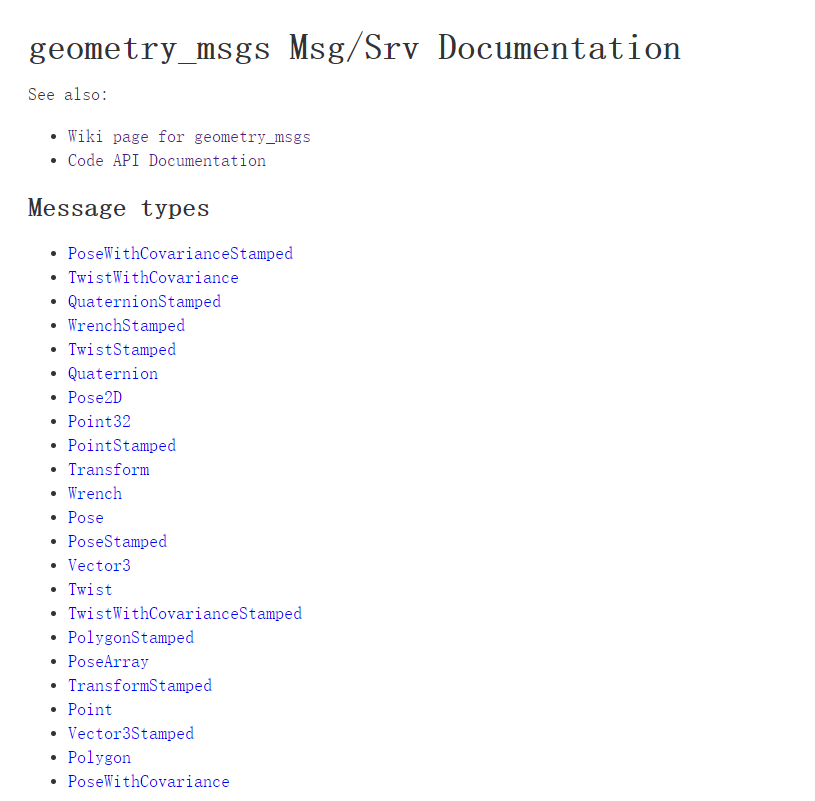

## 一、创建工作空间

> 我这里采用的编译方式是catkin build，而不是catkin_make，是因为一些需要，如mavros和mavlink的编译方式为catkin build，如果不需要下载这两个包，则采用哪一种编译方式都不影响

```python
mkdir -p catkin_ws/src
cd catkin_ws
catkin build
source devel/setup.bash
```

下图是我已经全部创建好后的所有ros包，也正是有mavlink和mavros，所有才采用catkin build编译

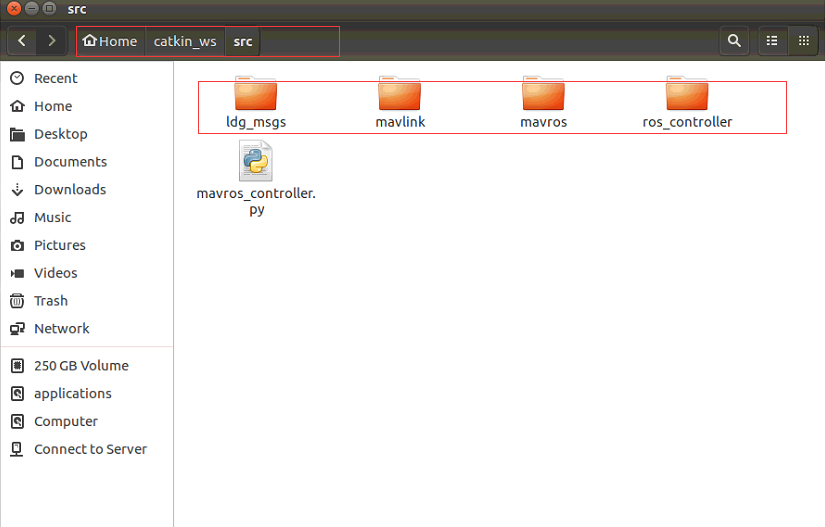

## 二、在工作空间创建新的ros消息包

```python
cd ~/catkin_ws/src
catkin_create_pkg ldg_msgs rospy std_msgs roscpp
cd ldg_msgs
mkdir msg
cd msg
touch Velocity.msg
```

然后打开Velocity.msg

```python
gedit Velocity.msg
```

将如下代码复制粘贴进去

```python
float32 vx
float32 vy
float32 vz
int32   t
```

文件结构如下图

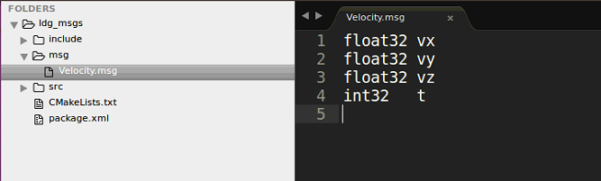

## 三、修改package.xml

> 因为需要message_generation生成C++或Python能使用的代码，所以向package.xml文件中添加如下两行：

```python
 <build_depend>message_generation</build_depend>
 <exec_depend>message_runtime</exec_depend>
```

在如下位置进行添加

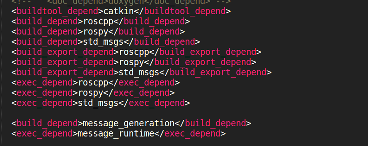

## 四、修改CMakeLists.txt

> CMakeLists.txt中有四个地方需要修改：

### 4.1 添加message_generation

> 向find_package()中添加message_generation

```python
find_package(catkin REQUIRED COMPONENTS
  roscpp
  rospy
  std_msgs
  message_generation
)
```

在如下位置进行修改为上面的代码

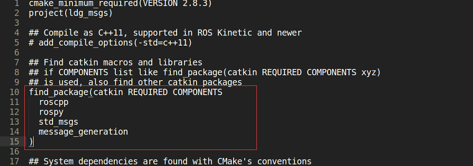

### 4.2 添加Velocity.msg

> 向add_message_files()中添加Velocity.msg

```python
add_message_files(
  FILES
  Velocity.msg
)
```

在如下位置进行修改为上面的代码

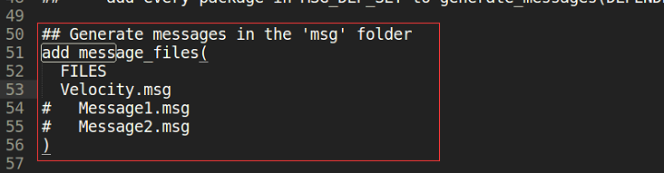

### 4.3 去掉generate_message（）注释

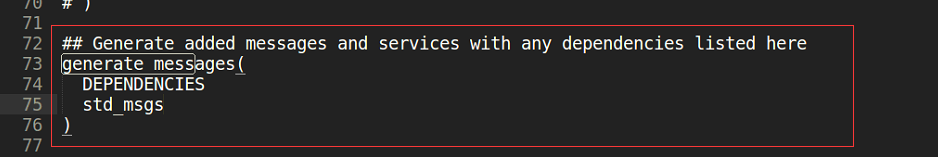

### 4.4 添加message_runtime

> 向catkin_package()添加message_runtime

```python
catkin_package(
   CATKIN_DEPENDS roscpp rospy std_msgs message_runtime
)
```

在如下位置进行修改为上面的代码

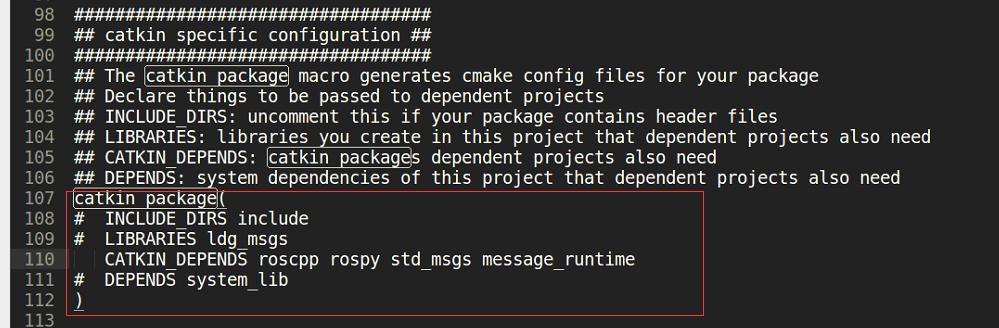

## 五、编译

```python
cd ~/catkin_ws
catkin build
source devel/setup.bash
```

## 六、测试

- 首先，要启动roscore

- 然后，在另一个新终端，执行如下命令

  ```python
  cd ~/catkin_ws
  source devel/setup.bash
  rosmsg show ldg_msgs/Velocity
  ```

  出现如下信息，则说明配置成功

  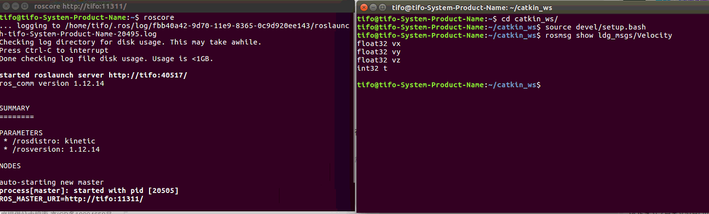

- python代码测试

  > 创建test.py程序，拷贝如下代码，不报错即可

```python
#!/usr/bin/env python
# -*-coding:utf-8 -*-

import rospy
import time
from ldg_msgs.msg import Velocity

msg = None

def receiveVel(data):
	#vel = Velocity()
	msg = data
	print('data',data)

test = rospy.Subscriber("/test",Velocity,receiveVel)

rospy.init_node('test')
while not rospy.is_shutdown():
	print('msg',msg)
	time.sleep(0.1)
```

## 七、添加多个自定义msg消息类型

### 7.1 创建多个msg文件

> `ldg_msgs`文件夹下中添加`VelocityZ.msg`、`Imu.msg`、`Position.msg`等文件

`ldg_msgs/msg`文件目录结构

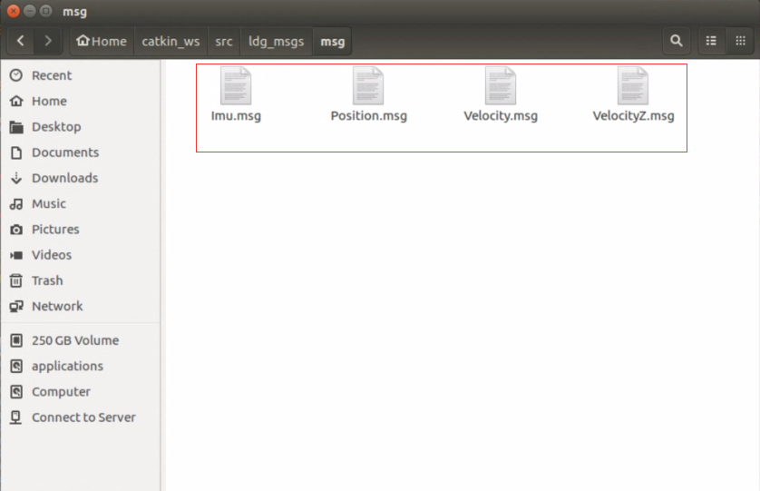

msg消息类型

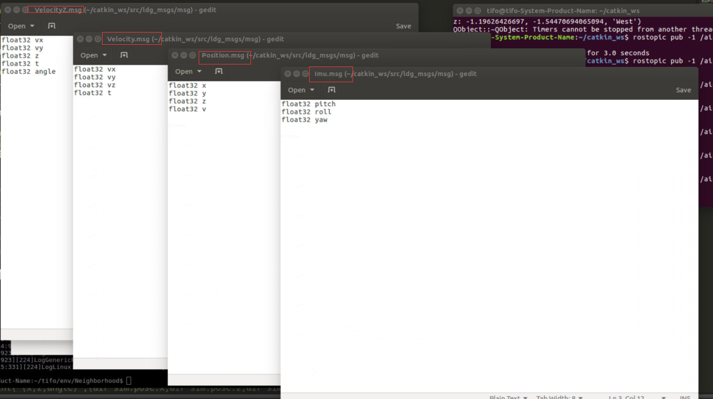

### 7.2 CMakeLists.txt添加msg

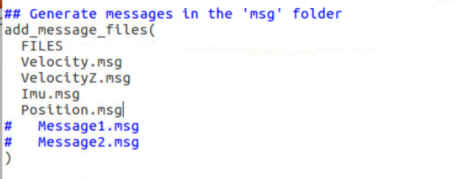

### 7.3 编译

```python
cd ~/catkin_ws
catkin build
source devel/setup.bash
```

> 已经定义过msg消息类型后，在此基础之上，只需要照着第七步就可以完成后面的多个msg消息类型的定制化了，同样的，也能参照第六步进行相关测试

# roslaunch相关设置

> 已经通过多个py程序定义了多个ros节点

## 一、文件结构

- 工作空间名：catkin_ws
- 编译方式：catkin build
- 自定义msg包名：ldg_msgs
- ros控制程序包名：ros_controller
- roslaunch启动文件：ros_airsim.launch
- ros节点对应驱动py：*_driver.py
- ros控制程序py：ros_controller.py

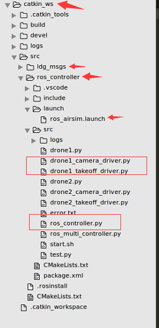

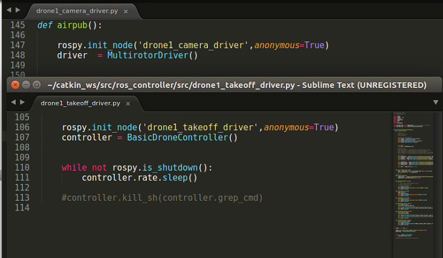

## 二、roslaunch文件编写

> 在catkin_ws/src文件夹下创建一个和include、src同级的launch文件夹，并在launch文件夹下创建`.luanch`文件，`.launch`文件内容如下

```python
<launch>

	<group ns = "Drone1">
		<node pkg="ros_controller" name="drone1_takeoff_driver" type="drone1_takeoff_driver.py" />
		<node pkg="ros_controller" name="drone1_camera_driver" type="drone1_camera_driver.py" />
	</group>


	<group ns = "Drone2">
		<node pkg="ros_controller" name="drone2_takeoff_driver" type="drone2_takeoff_driver.py" />
		<node pkg="ros_controller" name="drone2_camera_driver" type="drone2_camera_driver.py" output = "screen" />
	</group>

</launch>
```

> pkg是ros的程序包名，name是对节点重新进行命名，type是对应相应节点的py程序

## 三、roslaunch启动多节点

```python
cd catkin_ws
source devel/setup.bash
roslaunch ros_controller ros_airsim.launch
```

启动launch文件后，终端输出信息如下：

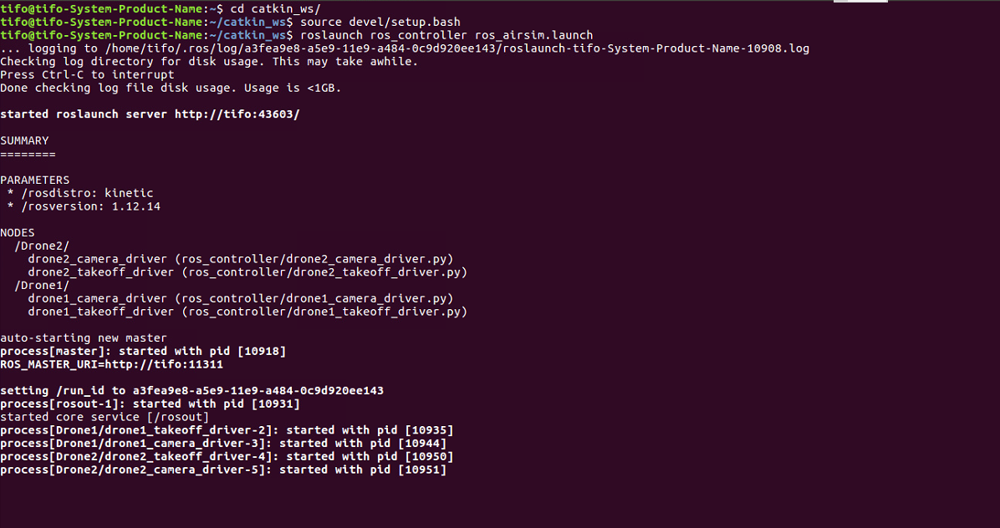

利用rostopic list查看信息，这里自定义的节点订阅和发布的topic就都显示出来了

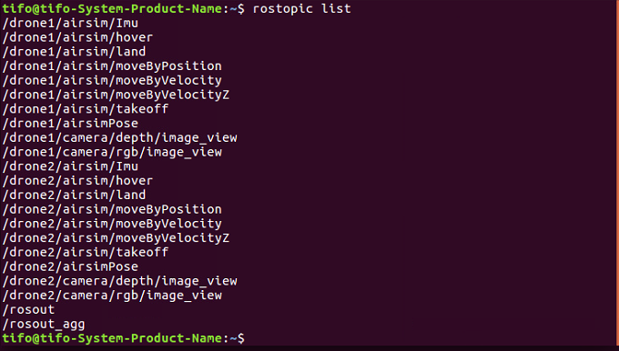

# 参考文献

- rosmsg相关设置：[rosmsg](https://blog.csdn.net/NiYintang/article/details/86043621)
- roslaunch相关设置：[roslaunch](https://blog.csdn.net/Forrest_Z/article/details/52618833)

# 总结

> 因为控制代码使用python语言写的，因此在利用roslaunch启动ros的多个节点时，并不需要在CMakeLists.list和package.xml里面进行相关的配置，但是自定义msg消息类型则是需要进行配置的，至此，就能全部通过ros来控制了，最开始我通过shell命令来启动多个python文件从而来启动多个节点，这种方式不如roslaunch好