## 前言

> 主要参考莫烦大神的代码，对OpenAI gym的CartPole环境进行算法验证，所用算法为2015版本的Nature DQN。[全部代码](https://github.com/ldgcug/DeepReinforcementLearning-Tensorflow/tree/master/Nature%20DQN)

## 一、CartPole说明

> 下图中的动态图没有显示出来，详细信息，点击[CartPole-V0](https://gym.openai.com/envs/CartPole-v0/)

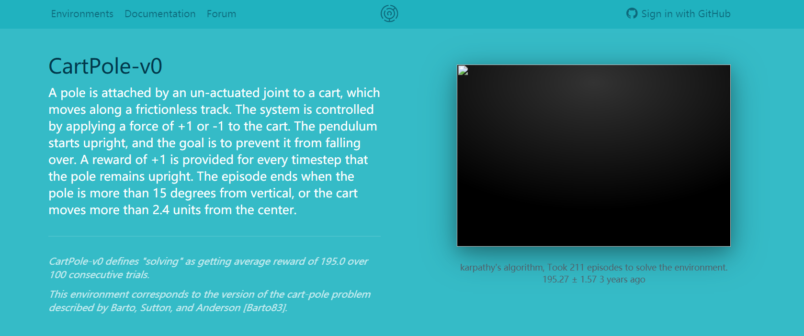

杆通过未致动的接头连接到推车，推车沿着无摩擦的轨道移动。通过向推车施加+1或-1的力来控制系统。钟摆开始直立，目标是防止它倒下。每个时间步长都会提供+1的奖励，以保持杆保持直立。当极点与垂直方向相差超过15度时，该episode结束，或者推车从中心移动超过2.4个单位。

**CartPole的详细说明：**[wiki介绍](https://github.com/openai/gym/wiki/CartPole-v0)

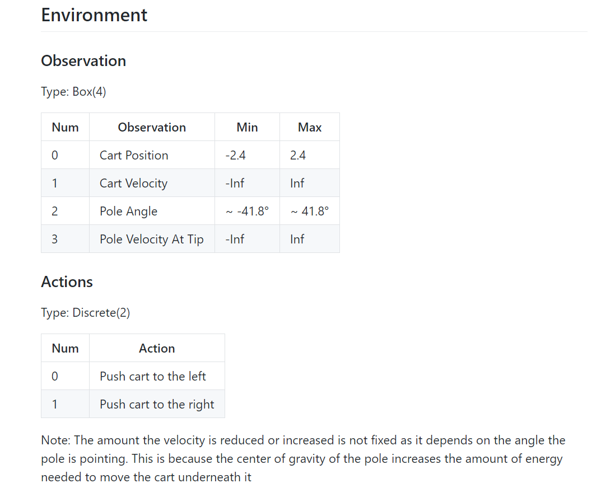

## 二、算法伪代码

> 图片主要来源于[草帽B-O-Y](https://blog.csdn.net/u013236946/article/details/72871858)的博客

**NIPS 2013版本**

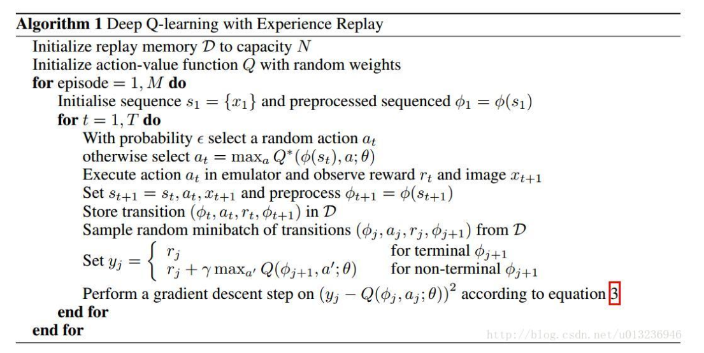

**Nature 2015**：本篇笔记中使用的算法

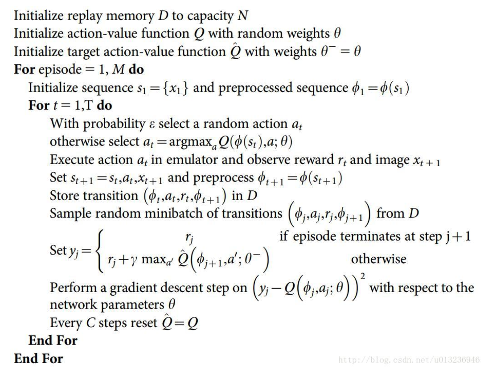

## 三、代码介绍

### 3.1 代码组成

> 主要由两部分组成：dqn.py和run_CartPole.py

### 3.2 DQN实现(dqn.py)

> 主要包含（1）建cnn基本网络和Target目标网络（2）经验回放池数据存储（3）e-greedy行为选择（4）cnn神经网络训练等四部分

#### 3.2.1 程序框架

> 主要包含以下几个函数

```python
import numpy as np 
import tensorflow as tf 
import random
from collections import deque

class DQN(object):
	
    # 初始化
	def __init__(self,
		s_dim,
		a_dim,
		learning_rate = 0.01,
		reward_decay = 0.9,
		e_greedy = 0.9,
		replace_target_iter = 300,
		memory_size = 500,
		batch_size = 32,
		e_greedy_increment = None,
		output_graph = False):
	
    # 创建Q网络和目标网络
	def build_net(self):
	
    # 存储一个transition 
	def store_transition(self,s,a,r,s_,done):
	
    # 根据e-greedy进行行为选择
    def choose_action(self,state):
        
    # 训练cnn网络，并且隔一定步数进行target参数更新
	def learn(self):

    # 将target参数更新单独的写成了一个函数
	def train_target(self):
	
    #输出损失值
	def plot_cost(self):
```

#### 3.2.2 初始化

```python
def __init__(self,
		s_dim,
		a_dim,
		learning_rate = 0.01,
		reward_decay = 0.9,
		e_greedy = 0.9,
		replace_target_iter = 300,
		memory_size = 500,
		batch_size = 32,
		e_greedy_increment = None,
		output_graph = False
	):
		self.s_dim = s_dim	#状态维度（4维）
		self.a_dim = a_dim  #行为维度（2维）
		self.lr = learning_rate #学习率
		self.gamma = reward_decay #折扣因子
		self.epsilon_max = e_greedy # e_greedy的上限
		self.replace_target_iter = replace_target_iter # 经历C步之后更新target参数
		self.memory_size = memory_size  #经验回放池大小
		self.memory_count = 0 # 经验回放池中的个数
		self.memory = deque() # 创建经验回放池
		self.batch_size = batch_size # mini-batch
		self.epsilon_increment = e_greedy_increment #e_greedy的增长速度
		self.epsilon = 0 if e_greedy_increment is not None else self.epsilon_max

		# total learning step
		self.learn_step_counter = 0 #总训练步长

		# consist of [target_net,evaluate_net]
		self.build_net()  #创建Q网络和Target Q网络
		self.sess = tf.Session() #开始会话
		self.sess.run(tf.global_variables_initializer())

		self.cost_his = [] #记录损失函数值
```

#### 3.2.3 创建Q网络和目标网络

> Q网络和Target Q网络最大的不同在于Q网络的输入是$s$，而Target Q网络的输入是$s'$，其他的网络结构和初始化参数全部相同，Q网络的输出用self.q_eval表示，Target Q网络的输出用self.q_next表示。中间层设置为20

```python
def build_net(self):
		# ************************ build evaluate net *****************************
		self.s = tf.placeholder(tf.float32,[None,self.s_dim],name='s_dim') #input
		self.q_target = tf.placeholder(tf.float32,[None,self.a_dim],name='q_target') #for calculating loss

		w_initializer = tf.random_normal_initializer(0.,0.3)
		b_initializer = tf.constant_initializer(0.1)

		with tf.variable_scope('eval_net'):
			c_names = ['eval_net_params',tf.GraphKeys.GLOBAL_VARIABLES]
			
			with tf.variable_scope('layer1'):
				w1 = tf.get_variable('w1',[self.s_dim,20],initializer=w_initializer,collections=c_names)
				b1 = tf.get_variable('b1',[20],initializer=b_initializer,collections=c_names)
				l1 = tf.nn.relu(tf.matmul(self.s,w1)+b1)

			with tf.variable_scope('layer2'):
				w2 = tf.get_variable('w2',[20,self.a_dim],initializer=w_initializer,collections=c_names)
				b2 = tf.get_variable('b2',[self.a_dim],initializer=b_initializer,collections=c_names)
				self.q_eval = tf.matmul(l1,w2) + b2

		with tf.variable_scope('loss'):
			self.loss = tf.reduce_mean(tf.squared_difference(self.q_target,self.q_eval))

		with tf.variable_scope('train'):
			self.train_op = tf.train.RMSPropOptimizer(self.lr).minimize(self.loss)

		# ************************ build target net *****************************
		self.s_ = tf.placeholder(tf.float32,[None,self.s_dim],name='s_') #input
		with tf.variable_scope('target_net'):
			c_names = ['target_net_params',tf.GraphKeys.GLOBAL_VARIABLES]

			with tf.variable_scope('layer1'):
				w1 = tf.get_variable('w1',[self.s_dim,20],initializer=w_initializer,collections=c_names)
				b1 = tf.get_variable('b1',[20],initializer=b_initializer,collections=c_names)
				l1 = tf.nn.relu(tf.matmul(self.s_,w1)+b1)

			with tf.variable_scope('layer2'):
				w2 = tf.get_variable('w2',[20,self.a_dim],initializer=w_initializer,collections=c_names)
				b2 = tf.get_variable('b2',[self.a_dim],initializer=b_initializer,collections=c_names)
				self.q_next = tf.matmul(l1,w2) + b2
```

#### 3.2.4 经验回放池的数据存储

> 这里的存储方式和莫烦的存储方式不太一样，当数量小于回放池的大小时，直接添加；若回放池已经存满，则删除掉最开始的第一个数据，在进行添加。
>
> 我看的网上的很多代码中都用了one_hot_action来表示行为，也不太清楚其功能，我这里没有用

```python
	def store_transition(self,s,a,r,s_,done):
		# transition = np.hstack((s,[a,r],s_,done))
		# # replace the old memory with new memory
		# index = self.memory_count % self.memory_size
		# self.memory[index,:] = transition
		# one_hot_action = np.zeros(self.a_dim)
		# one_hot_action[a] = 1
		transition = (s,a,r,s_,done)
		if self.memory_count < self.memory_size:
			self.memory.append(transition)
			self.memory_count += 1
		else:
			self.memory.popleft()
			self.memory.append(transition)
```

#### 3.2.5 e-greedy行为选择

> 以一定几率选择行为，随训练的进行，逐渐减小随机的可能性，选择最大的值
>
> 由于是采用的epsilon增加的方式，因此，当小于epsilon时，从Q网络中进行选取，否则，随机选取
>
> 这里添加了一个`.reshape(-1,self.s_dim)`，是因为在创建网络时，s_dim的维度已经用占位符更改，而这里接收到的state是直接从env环境中获取的，没有进行任何更改，如果不添加reshape，则会报维度不匹配的错误。

```python
	def choose_action(self,state):

		if np.random.uniform() < self.epsilon:
			return np.argmax(self.sess.run(self.q_eval,feed_dict={self.s:state.reshape(-1,self.s_dim)}))

		return np.random.randint(0,self.a_dim)
```

#### 3.2.6 训练cnn网络

> 首先，检查Target网络是否需要更新，若达到相应的步数了，则更新；
>
> 其次，在从回放池中获取数据时，要进行一下判断，判断当前的回放池数据n是否已经超多mini-batch，若没有，则直接随机采取n个数据，反之，则用mini-batch进行随机采样；
>
> 最后，通过mini-batch求期望获取Q值和Target Q值，并根据这两个值求Loss，并进行优化

```python
def learn(self):
		# cheak ro replace target parameters
		if self.learn_step_counter % self.replace_target_iter == 0:
			self.train_target()
			print('\n target_params_replaces \n')

		# sample batch memory from all memory
		if self.memory_count > self.batch_size:
			mini_batch = random.sample(self.memory,self.batch_size)
		else:
			mini_batch = random.sample(self.memory,self.memory_count)

		states = np.asarray([e[0] for e in mini_batch])
		actions = np.asarray([e[1] for e in mini_batch])
		rewards = np.asarray([e[2] for e in mini_batch])
		next_states = np.asarray([e[3] for e in mini_batch])
		dones = np.asarray([e[4] for e in mini_batch])

		q_next = self.sess.run(self.q_next,feed_dict={self.s_:next_states})
		q_eval = self.sess.run(self.q_eval,feed_dict={self.s:states})
		q_target = q_eval.copy()

		for k in range(len(mini_batch)):
			if dones[k]:
				q_target[k][actions[k]] = rewards[k]
			else:
				q_target[k][actions[k]]	= rewards[k] + self.gamma * np.max(q_next[k])

		loss = self.sess.run(self.loss,feed_dict={self.s:states,self.q_target:q_target})
		self.cost_his.append(loss)
		self.sess.run(self.train_op,feed_dict={self.s:states,self.q_target:q_target})

		# 随着训练时间增加，到后面就更大概率选择最大的action
		self.epsilon = self.epsilon + self.epsilon_increment if self.epsilon < self.epsilon_max else self.epsilon_max
		self.learn_step_counter += 1
```

#### 3.2.7 目标网络参数更新

```python
	def train_target(self):
		t_params = tf.get_collection('target_net_params')
		e_params = tf.get_collection('eval_net_params')
		self.sess.run([tf.assign(t,e) for t,e in zip(t_params,e_params)])
```

### 3.3 主函数（run_CartPole.py）

```python
#!/usr/bin/env python
#-*- coding: utf-8 -*-

import gym
from dqn import DQN  


env = gym.make('CartPole-v0') #使用CartPole-v0环境
env = env.unwrapped   #最好是添加， 不做这个会有很多限制

print(env.action_space) # 查看这个环境中可用的 action 有多少个
print(env.observation_space) # 查看这个环境中可用的 state 的 observation 有多少个
print(env.observation_space.high) # 查看 observation 最高取值
print(env.observation_space.low) # 查看 observation 最低取值

#定义使用DQN算法，设定缓冲区即epsilon增长速度值
RL = DQN(s_dim = env.observation_space.shape[0],
		 a_dim = env.action_space.n,
		 learning_rate = 0.01,
		 e_greedy = 0.9,
		 replace_target_iter = 100,
		 memory_size = 2000,
		 e_greedy_increment = 0.001)

total_steps = 0 #记录步数
total_reward = [] #记录累计奖励

for i_episode in range(200): #迭代100次，200次，300次都可以
	s = env.reset() # 获取回合 i_episode 第一个 observation
	ep_r = 0
	while True:
		env.render() # 刷新显示环境

		a = RL.choose_action(s) # 根据状态选行为
		s_,r,done,info = env.step(a) # 获取下一个 state
		# the smaller theta and closer to center the better
		x, x_dot, theta, theta_dot = s_    # 细分开, 为了修改原配的 reward
        # x 是车的水平位移, 所以 r1 是车越偏离中心, 分越少
		r1 = (env.x_threshold - abs(x))/env.x_threshold - 0.8
        # theta 是棒子离垂直的角度, 角度越大, 越不垂直. 所以 r2 是棒越垂直, 分越高
		r2 = (env.theta_threshold_radians - abs(theta))/env.theta_threshold_radians - 0.5
		r = r1 + r2 # 总 reward 是 r1 和 r2 的结合, 既考虑位置, 也考虑角度, 这样 DQN 学习更有效率
		RL.store_transition(s,a,r,s_,done)  # 保存这一组记忆

		ep_r += r # 统计当前episode的累计奖励

		if total_steps > 1000:
			RL.learn() #学习训练

		if done:
							print('episode:',i_episode,'ep_r:',round(ep_r,2),'epsilon',round(RL.epsilon,2),'buffer_size:',RL.memory_count,'steps:',total_steps)
			total_reward.append(ep_r)
			break

		s = s_
		total_steps += 1

RL.plot_cost() #输出cost曲线

#输出reward曲线
import matplotlib.pyplot as plt
import numpy as np
plt.plot(np.arange(len(total_reward)),total_reward)
plt.ylabel('Total Reward')
plt.xlabel('Episode ')
plt.show()
```

### 3.4 全部代码

> 直接查看[所有代码](https://github.com/ldgcug/DeepReinforcementLearning-Tensorflow/tree/master/Nature%20DQN)

## 四、结果显示

100个episode（某一次）的cost

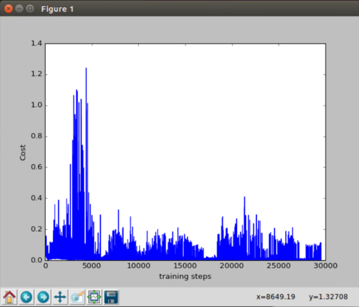

100个episode（另一次）的cost和reward

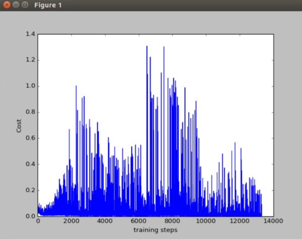

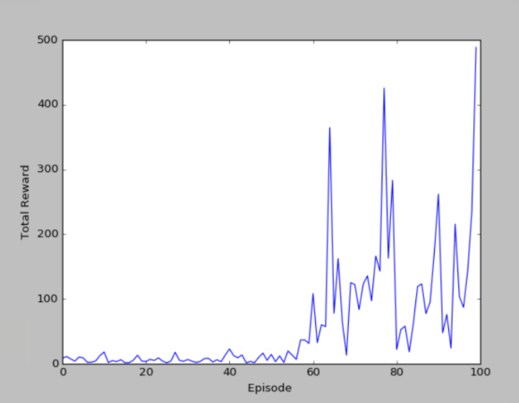

200个episode（另一次）的cost和reward

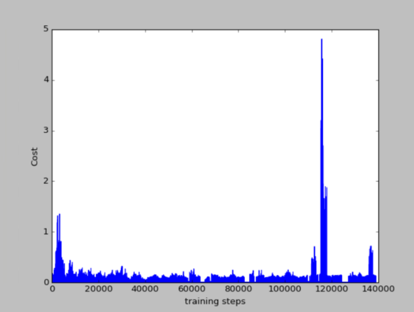

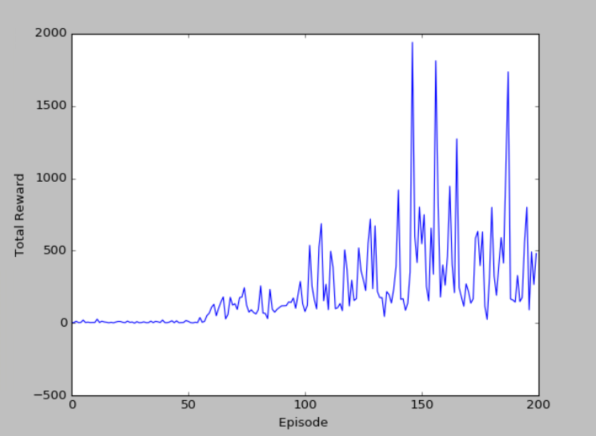

## 五、MountainCar例子

### 5.1 MountainCar问题说明

> [MountainCar](https://gym.openai.com/envs/MountainCar-v0/)

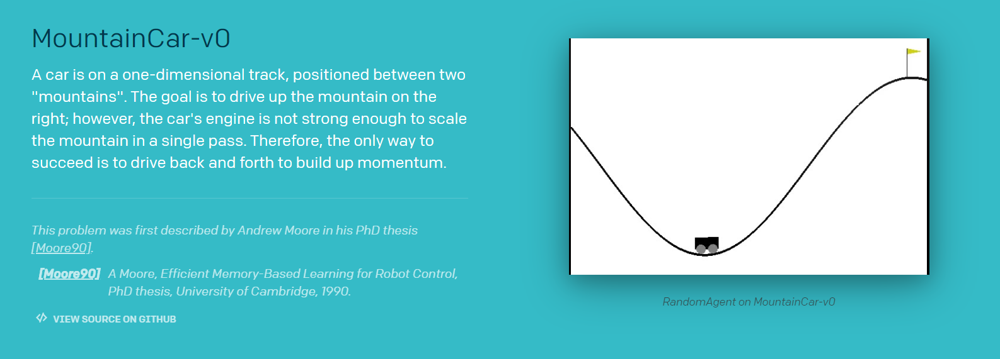

汽车位于一条轨道上，位于两个“山脉”之间。目标是在右边开山;然而，汽车的发动机强度不足以在一次通过中攀登山峰。因此，成功的唯一途径是来回驾驶以增强动力。

[MountainCar环境介绍](https://github.com/openai/gym/wiki/MountainCar-v0)

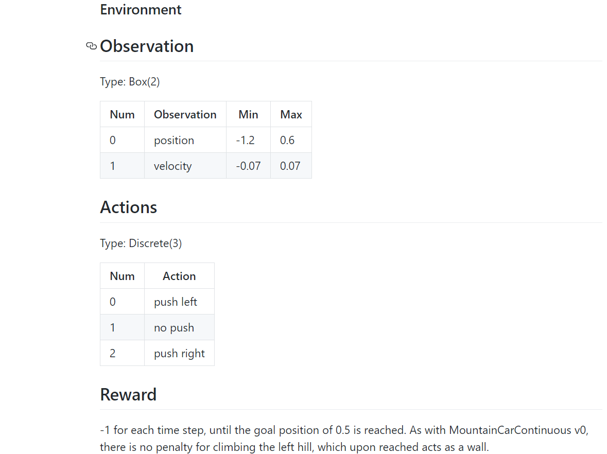

### 5.2 代码部分

> dqn的代码部分不变，变化的知识主函数的代码，和run_CartPole.py的代码很类似，但有点小区别
>
> [run_MountainCar.py](https://github.com/ldgcug/DeepReinforcementLearning-Tensorflow/blob/master/Nature%20DQN/run_MountainCar.py)

下面说下run_MountainCar.py和run_CartPole.py的不同之处

（1）第一处不同（注释的为CartPole，没注释的为MountainCar）

首先，环境不同，因此状态维度和行为维度不相同，这个很正常。但是这里的**学习率**、**目标网络更新步数**、**回放池大小**、**探索的增长速度值**全部不相同。

```python
# RL = DQN(s_dim = env.observation_space.shape[0],
# 		 a_dim = env.action_space.n,
# 		 learning_rate = 0.01,
# 		 e_greedy = 0.9,
# 		 replace_target_iter = 100,
# 		 memory_size = 2000,
# 		 e_greedy_increment = 0.001)

RL = DQN(s_dim =  env.observation_space.shape[0],
		 a_dim =  env.action_space.n,
		 learning_rate = 0.001,
		 e_greedy = 0.9,
		 replace_target_iter = 300,
		 memory_size = 3000,
		 e_greedy_increment = 0.0002)
```

（2）第二处不同（奖励不同）

MountainCar的奖励设置为position，这里加减是为了限定在[0,1]范围内。和前面一样，不同的环境奖励也不相同，这个奖励一般也还好设置。

```
r = abs(position - (-0.5)) # r in [0,1]
```

### 5.3 结果显示

> 我这里的cost的显示图和莫烦的cost的显示图不太一样，但其实在DRL算法中，看中的是累计奖励，即第二幅图和第四幅图。可以看出，累计奖励也是在慢慢的平缓，因为训练到后面，已经知道如何到达目标点，会比较快速的到达，而不用左右来回摇摆，因此是一个下降趋势。

10个episode

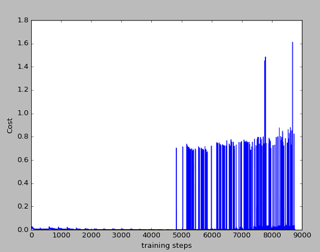

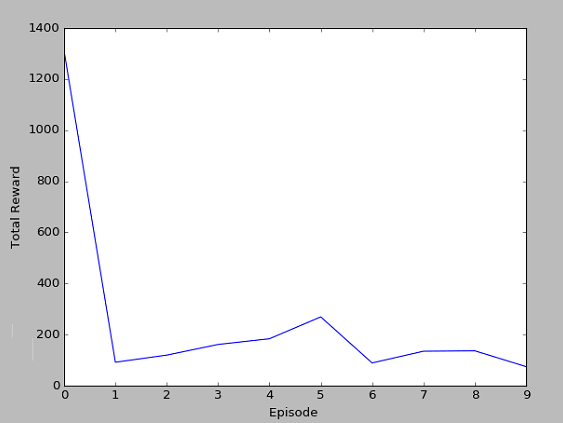

20个episode

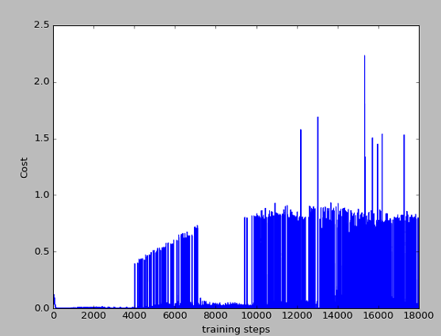

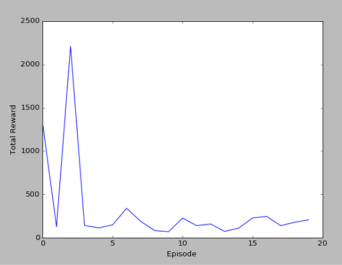

## 总结

> 到后面的时候，cost下降的还是较为明显，但仍然有波动，这可能是随机选择行为导致的结果，从模型中也可以看出有时候不太稳定，因此该算法还需要改进。在实际中，要看重累计奖励而不是损失函数。
>
> 从上面的两个不同例子中可以看出，不同的环境，在主函数中，**学习率、回放池大小、探索的增长速度值、目标网络更新步数**都会有所不同，甚至，在dqn.py中也会改变其**网络结构**，但是这些值又是如何试验找出一个比较合适的值的呢？这是一个问题

## 参考链接

- [莫烦](https://github.com/MorvanZhou/Reinforcement-learning-with-tensorflow/blob/master/contents/6_OpenAI_gym/RL_brain.py)

- [CartPole源代码](https://github.com/openai/gym/blob/master/gym/envs/classic_control/cartpole.py)

- [CartPole详细介绍](https://github.com/openai/gym/wiki/CartPole-v0)

- [MountainCar详细介绍](https://github.com/openai/gym/wiki/MountainCar-v0)

- [MountainCar源代码](https://github.com/openai/gym/blob/master/gym/envs/classic_control/mountain_car.py)