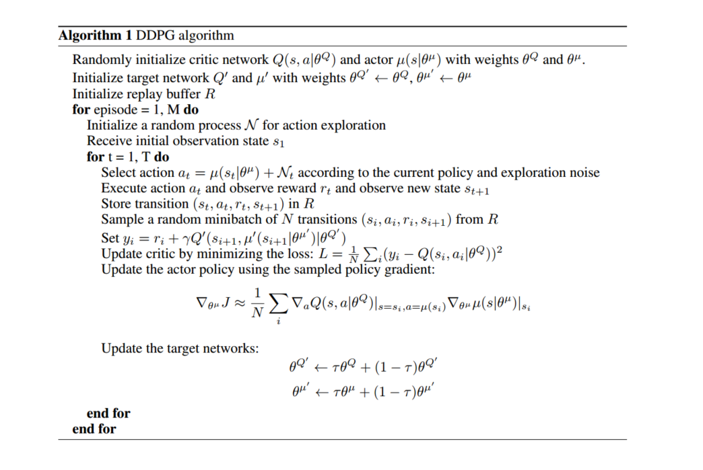

## 前言

> DDPG算法主要是将DPG和DQN的特性结合起来，和前面的AC算法相比，Actor输出的不在是行为的概率，而是具体的行为，用于连续动作的预测。其理论部分请阅读[DRL论文阅读（七）](https://ldgyyf.cn/2019/07/31/论文/深度强化学习/DRL论文阅读（七）之DPG方法/)和[DRL论文阅读（八）](https://ldgyyf.cn/2019/08/04/%E8%AE%BA%E6%96%87/%E6%B7%B1%E5%BA%A6%E5%BC%BA%E5%8C%96%E5%AD%A6%E4%B9%A0/DRL%E8%AE%BA%E6%96%87%E9%98%85%E8%AF%BB%EF%BC%88%E5%85%AB%EF%BC%89%E4%B9%8BDDPG%E7%AE%97%E6%B3%95/)
>
> 本文的代码基于[莫烦大神](https://morvanzhou.github.io/tutorials/machine-learning/reinforcement-learning/6-2-DDPG/)的代码，进行少量修改而成（参考的是简单版，测试过程中，莫烦的DDPG初始版本还存在一点问题）

## 一、实验环境

> 主要使用Pendulum环境，且采用的是连续行为空间

## 二、DDPG算法

**DDPG框架图**


**DDPG算法流程**



## 三、代码部分

> 直接查看[所有代码](https://github.com/ldgcug/DeepReinforcementLearning-Tensorflow/tree/master/DDPG)

### 3.1 代码组成

> 代码主要由两部分组成，一部分是关于DDPG算法结构的py程序，另一部分是关于gym的运行环境

**程序架构**

```python
class DDPG(object):
    # 状态维度，动作维度，连续动作空间，其中关于其他的参数在init中自定义赋值
    def __init__(self,s_dim,a_dim,a_bound):
    
    # 创建Actor网络
    def build_a(self,s,scope,trainable):
    
    # 创建Critic网络
    def build_c(self,s,a,scope,trainable):
    
    # 更新目标网络的参数，这里是使用soft更新方式，和DQN一定步数更新有所区别
    def train_target(self):
    
    # 经验池存储数据
    def store_transition(self,s,a,r,s_,done):
    
    # 选择确定性行为
    def choose_action(self,s):
    
    # DDPG训练
    def learn(self):
```

### 3.2 网络-DDPG.py

**init函数、Actor网络和Critic网络**