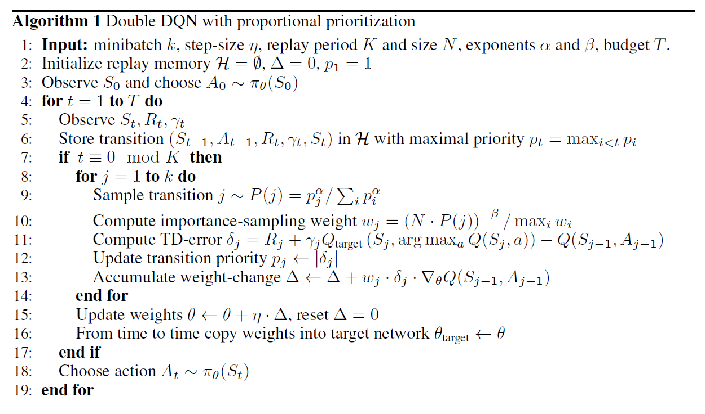

## 前言

> 理论部分，点击[DRL论文阅读（三](https://ldgyyf.cn/2019/07/18/%E8%AE%BA%E6%96%87/%E6%B7%B1%E5%BA%A6%E5%BC%BA%E5%8C%96%E5%AD%A6%E4%B9%A0/DRL%E8%AE%BA%E6%96%87%E9%98%85%E8%AF%BB%EF%BC%88%E4%B8%89%EF%BC%89%E4%B9%8BDQN%E6%94%B9%E8%BF%9B%E9%9A%8F%E6%9C%BA%E9%87%87%E6%A0%B7%EF%BC%88Prioritized-Experience-Replay%EF%BC%89/)）查看
>
> 本文的代码主要参考了[莫烦](https://github.com/MorvanZhou/Reinforcement-learning-with-tensorflow/blob/master/contents/5.2_Prioritized_Replay_DQN/RL_brain.py)和[Fisher's](https://github.com/BlueFisher/Reinforcement-Learning/tree/master/Deep_Q_Network/Prioritized_DQN)的代码，在他们的基础之上，修改为自己习惯能看懂的代码
>
> Prioritized DQN不同于DQN/DDQN的是，它关注的是经验回放池中那些很少但有用的正面信息

## 一、实验环境

> 使用MountainCar环境来对算法进行测试


和之前有所不同的是，这次我们不需要重度改变它的reward。所以只要没有拿到小旗子，reward = -1，拿到小旗子时，定义reward = 10。比起之前的DQN，这个reward定义更加准确。如果使用这种reward定义方式，可以想象Nature DQN会花很久的时间学习，因为记忆库中只有很少很少的+10 的reward可以学习，正负样本不一样，而使用Prioritized DQN，就会重视这种少量的，但值得学习的样本。

## 二、Prioritized Experience Replay

**伪代码**



在该算法中，我们batch抽样时，并不是随机抽样，而是按照Memory中的样本的优先级来抽，这样能更有效的找到我们需要学习的样本。

**SumTree**

由于使用贪婪法来选取优先经验的时间复杂度太高，同时还有其他问题，所以我们用$P(i) = \frac{p_i^\alpha}{\sum_k p_k^\alpha}$来定义某个片段的选取概率，其中我们采用比例优先的方式来计算$p_i$，即$p_i = |\delta_i| + \epsilon$，$\delta_i$为TD-Error，$\epsilon$为一个很小的正数，为了避免TD-Error为0的特殊边缘例子也能被采样到，并用SumTree这种数据结构来表示每个存储的片段。

SumTree是一种二叉树类型的数据结构，所有叶子节点存储优先级$p_i$，所有父节点为子节点之和，所以这棵树的根节点为所有叶子节点的和，如下图所示：


抽样时，我们会将$p_i$的总和除以batch_size，分成batch_size个区间，如上图例子所示，一共有`3、10、12、4、1、2、8、2`等八个优先级节点$p_i$，如果设置batch_size为6，则会分成6个区间，每个区间为：`[0-7],[7-14],[14-21],[21-28],[28-35],[35-41]`，在分别在这6个区间中均匀的随机选取一个数，从根节点依次往下搜索。

如果在第4个区间[21-28]抽取到了24，则将24与根节点的左节点进行比较，因为24 < 29，所以继续向左搜索，将24与29的左节点比较，发现24 > 13，则继续向右搜索，同时 24 - 13 = 11。将11与16的左节点比较，11 < 12，因为12已经是叶子节点，则搜索完毕，选择12这个优先级。

图中叶子节点下面的括号中的区间表示该优先级可以被搜索到的范围，由此可见优先级大的被搜索到的概率就高，同时优先级小的，也有一定的概率被选中。

## 三、代码部分

> 没有按照文中，与Double DQN结合，而是与Nature DQN相结合
>
> 若想要看全部代码，直接查看[所有代码](https://github.com/ldgcug/DeepReinforcementLearning-Tensorflow/tree/master/Prioritized)

### 3.1 代码组成

> 代码由两部分组成，分别为**prioritized.py** 和**run_MountainCar.py**
>
> （1）prioritized.py
>
> ​		这个代码中主要包含三个类：SumTree、Memory(prioritized)、DQNPrioritizedReplay
>
> 后面又重新添加了Double DQN的prioritized.py，这里将不对这个进行说明，毕竟代码改动很少

### 3.2 网络-prioritized.py

#### 3.2.1  SumTree有效抽样

```python
class SumTree(object):

	def __init__(self,capacity):
		self.capacity = capacity # SumTree能存储的最多优先级个数，如之前的SumTree图，则值为8
		self.tree = np.zeros(2 * capacity - 1) # 顺序表存储二叉树，其个数为 2 * capacity -1
		self.data = np.zeros(capacity,dtype=object) # 每个优先级对应的经验片段，dtype必须要添加

		self.size = 0
		self.curr_point = 0

    # 当有新的sample时，添加进tree 和data
	def add(self,data):
		self.data[self.curr_point] = data #存储的为(s,a,r,s_,done)
        
		self.update(self.curr_point,max(self.tree[self.capacity-1:self.capacity+self.size]) + 1)#添加数据时，默认优先级为当前的最大优先级+1

		self.curr_point += 1

		if self.curr_point >= self.capacity:
			self.curr_point = 0

		if self.size < self.capacity:
			self.size += 1
            
	# 当sample被train后，有了新的TD-Error，就在tree中更新
	def update(self,point,weight):
		tree_idx = point + self.capacity - 1 #这样才能得到最下面的叶子节索引
		change = weight - self.tree[tree_idx]

		self.tree[tree_idx] = weight
		parent = (tree_idx - 1) // 2
		while parent >= 0:  #这种方法比递归更快
			self.tree[parent] += change
			parent = (parent -1) // 2

	def total_p(self):
		return self.tree[0] #获取所有的叶子节点之和
	
    #获取最小的优先级，在计算重要性比率中将会使用
	def get_min(self):
		return min(self.tree[self.capacity - 1: self.capacity + self.size -1])
	#根据一个权重进行抽样
	def sample(self,v):
		idx = 0
		while idx < self.capacity-1:
			l_idx = idx * 2 +1
			r_idx = l_idx +1
			if self.tree[l_idx] >= v:
				idx = l_idx 
			else:
				idx = r_idx 
				v = v - self.tree[l_idx]

		point = idx - (self.capacity - 1) #计算叶子节点的索引

		return point,self.data[point],self.tree[idx] / self.total_p()
```

#### 3.2.2 Memory（Prioritized的存储，DQN不采用）

```python
class Memory(object):

	def __init__(self,batch_size,max_size,beta):
		self.batch_size = batch_size #mini_batch的大小
		#self.max_size = 2**math.floor(math.log2(max_size))
		self.beta = beta
		self.sum_tree = SumTree(max_size)

	def store(self,s,a,r,s_,done):
		transitions = (s,a,r,s_,done)
		self.sum_tree.add(transitions)
	
    #采样samples
	def get_mini_batches(self):
		n_sample = self.batch_size if self.sum_tree.size >= self.batch_size else self.sum_tree.size  #采样的个数
		total = self.sum_tree.total_p() #获取所有TD-Error的和

		step = total // n_sample #生成n_sample个区间
		points_transitions_probs = []
		
        #在每个区间均匀随机的抽取一个数，并去SumTree中采样
		for i in range(n_sample):
			v = np.random.uniform(i * step,(i +1) * step -1)
			t = self.sum_tree.sample(v)
			points_transitions_probs.append(t)

		points,transitions,probs = zip(*points_transitions_probs)

		#max_importance_ratio = (n_sample * self.sum_tree.get_min())**-self.beta
		mini_prob = self.sum_tree.get_min() / total #计算最小的p_i
		importance_ratio = [pow(probs[i] /mini_prob,-self.beta) for i in range(len(probs))] #重要性采样的权重
		#tuple(np.array(e) for e in zip(*transitions))
		return points,transitions,importance_ratio
	
    #训练完抽取的samples后，要更新tree中的sample的TD-Error
	def update(self,points,td_error):
		for i in range(len(points)):
			td_error += 0.01 #为了防止TD-Error为0，加一个小的数，如果不加，则会发生除0错误
			self.sum_tree.update(points[i],td_error[i]) #更新TD-Error
```

在伪代码中，重要性采样的权重

$w_j = \frac{(N * P(j))^{-\beta}}{max_i(w_i)} = \frac{(N * P(j))^{-\beta}}{max_i((N * P(i))^{-\beta})} = \frac{(P(j))^{-\beta}}{max_i((P(i))^{-\beta})} = (\frac {p_j}{min_iP(i)})^{-\beta}$

且伪代码中的第十二行赋值实际是$p_j = （|\delta_i| + \epsilon）^\alpha $，如果采用rank-based，则为$rank(i)^{-\alpha}$，我们的代码中$\alpha$设置为了1，因此才会是

```python
td_error += 0.01
```

去更新TD-Error

在莫烦的代码中，$\alpha$设置的为0.6，因此更新为这样

```python
    def batch_update(self, tree_idx, abs_errors):
        abs_errors += self.epsilon  # convert to abs and avoid 0
        clipped_errors = np.minimum(abs_errors, self.abs_err_upper)
        ps = np.power(clipped_errors, self.alpha)
        for ti, p in zip(tree_idx, ps):
            self.tree.update(ti, p)
```

#### 3.3.3 DQNPrioritizedReplay训练

> 只说明添加了Prioritized之后的代码部分

```python
class DQNPrioritizedReplay:
	def __init__(self):
		
		#计算DQN中的experience数量和大小
		self.memory_count = 0
		self.memory_size = memory_size
        
		self.batch_size = batch_size
        
        if self.prioritized:
			self.memory = Memory(batch_size,memory_size,0.9)#Prioritized采用Memory方式
		else:
			self.memory = deque() #DQN自己定义队列
	
    def build_net(self):   
        if self.prioritized:
			self.importance_ratio = tf.placeholder(tf.float32,[None,1],name = 'importance_ratio')#重要性采样的权重占位符
	
    def store_transition(self,s,a,r,s_,done):
		transition = (s,a,r,s_,done)
		if self.prioritized:
			self.memory.store(s,a,r,s_,done)
		else:
			if self.memory_count < self.memory_size:
				self.memory.append(transition)
				self.memory_count += 1
			else:
				self.memory.popleft()
				self.memory.append(transition)

	def learn(self):
        if self.prioritized:
			points,mini_batch,importance_ratio = self.memory.get_mini_batches()
		else:
			# sample batch memory from all memory
			if self.memory_count > self.batch_size:
				mini_batch = random.sample(self.memory,self.batch_size)
			else:
				mini_batch = random.sample(self.memory,self.memory_count)
		
        
        if self.prioritized:
			_ = self.sess.run(self.train_op,feed_dict={self.s:states,self.q_target:q_target,self.importance_ratio:np.array([importance_ratio]).T})
            #这里要计算TD-Error
			td_error = self.sess.run(self.td_error,feed_dict={self.s:states,self.q_target:q_target,self.importance_ratio:np.array([importance_ratio]).T})
			loss = self.sess.run(self.loss,feed_dict={self.s:states,self.q_target:q_target,self.importance_ratio:np.array([importance_ratio]).T})
            #计算完后，要更新samples的TD-Error
			self.memory.update(points,td_error)
		else:
			loss = self.sess.run(self.loss,feed_dict={self.s:states,self.q_target:q_target})
			_ = self.sess.run(self.train_op,feed_dict={self.s:states,self.q_target:q_target})
```

这里的Prioritized DQN和Nature DQN的experience存储方式不同。

但突然想到了一个问题：

Nature DQN是在Memory里面有很多个数据，从里面去均匀随机抽取

而Prioritized DQN好像只存储了mini-batch个数据，并且对这些数据进行替换更新，但是在更新过程中，会不会存在将重要的数据给替换掉了呢？如这重要数据就是正面奖励的数据，而用负面奖励数据去替换掉了？

## 四、结果显示

> 在训练的时候，将env.render()注释掉，首先训练过程会很快
>
> 其次是没有注释时，小车好像很难到达旗子那里去，不知道env.render()的影响为什么这么大
>
> 下面的图片结果都是在注释掉的情况下训练产生的，没有注释时，时间太长，且一直找不到旗子
>
> 注释下，几分钟就可以完成训练（CPU）
>
> 而没注释，20分钟了可能5个episode都没有完成

**（1）DQN下的训练**

某一次训练


另一次训练结果


**（2）Double DQN下的训练**

没有加seed

某一次训练


某一次训练


但是在输出中，步数是不止这么一点的，还不太清楚是为什么没有达到6w步（显示），但是能看出Prioritized 在找到一次正面奖励之后，还是比DQN要训练的快的。

```python
#======================== Double  DQN ======================================
('current steps:', 26000)

('episode:', 0, 'finished')

('current steps:', 36000)

('episode:', 1, 'finished')

('current steps:', 39000)
('episode:', 2, 'finished')

('current steps:', 41000)
('episode:', 3, 'finished')

('current steps:', 42000)

('episode:', 4, 'finished')

('current steps:', 44000)
('episode:', 5, 'finished') 

('current steps:', 45000)

('episode:', 6, 'finished')

('current steps:', 48000)

('episode:', 7, 'finished')

('current steps:', 53000)

('episode:', 8, 'finished')

('current steps:', 54000)

('episode:', 9, 'finished')

('current steps:', 55000)

('current steps:', 56000)
('episode:', 10, 'finished')
('episode:', 11, 'finished')

('current steps:', 57000)

('current steps:', 58000)
('episode:', 12, 'finished')

('episode:', 13, 'finished')

('current steps:', 59000)

('current steps:', 60000)
('episode:', 14, 'finished')

('current steps:', 61000)
('episode:', 15, 'finished')

('episode:', 16, 'finished')

('current steps:', 62000)
('episode:', 17, 'finished')

('current steps:', 63000)
('episode:', 18, 'finished')
('episode:', 19, 'finished')

# ==============================Double DQN withPrioritized ======================
('episode:', 0, 'finished')
('current steps:', 33000)

('current steps:', 37000)
('episode:', 1, 'finished')

('current steps:', 38000)

('episode:', 2, 'finished')

('current steps:', 39000)
('episode:', 3, 'finished')

('episode:', 4, 'finished')

('current steps:', 44000)

('episode:', 5, 'finished')

('current steps:', 45000)
('episode:', 6, 'finished')

('current steps:', 46000)

('episode:', 7, 'finished')

('current steps:', 47000)

('episode:', 8, 'finished')

('current steps:', 48000)

('episode:', 9, 'finished')

 target_params_replaces 

('current steps:', 49000)
('episode:', 10, 'finished')
('episode:', 11, 'finished')

('current steps:', 50000)
('episode:', 12, 'finished')

('episode:', 13, 'finished')

('current steps:', 51000)
('episode:', 14, 'finished')

('episode:', 15, 'finished')

('current steps:', 52000)
('episode:', 16, 'finished')

('episode:', 17, 'finished')

('current steps:', 53000)
('episode:', 18, 'finished')

('episode:', 19, 'finished')
```

从图中可以看出，我们都从两种方法最初拿到第一个`R += 10`奖励的时候算起，看看经历过一次`R += 10`后，他们有没有好好利用这次的奖励，可以看出，有Prioritized replay的可以高效利用这些不常拿到的奖励，并好好学习他们。所以 Prioritized replay会更快结束每个episode，很快就到达了小旗子。

## 总结

> 对代码中seed函数不是太能理解，反正是对随机数产生变化的函数

## 参考链接

- [莫烦解析](https://morvanzhou.github.io/tutorials/machine-learning/reinforcement-learning/4-6-prioritized-replay/)
- [莫烦代码](https://github.com/MorvanZhou/Reinforcement-learning-with-tensorflow/blob/master/contents/5.2_Prioritized_Replay_DQN/RL_brain.py)

- [Fisher's 博客](https://bluefisher.github.io/2018/06/02/Prioritized-Experience-Replay-%E4%BB%A3%E7%A0%81%E5%AE%9E%E7%8E%B0/)
- [Fisher's代码](https://github.com/BlueFisher/Reinforcement-Learning/tree/master/Deep_Q_Network/Prioritized_DQN)
- [刘建平博客](https://www.cnblogs.com/pinard/p/9797695.html)
- [刘建平代码](https://github.com/ljpzzz/machinelearning/blob/master/reinforcement-learning/ddqn_prioritised_replay.py)
- [论文解析](https://stepneverstop.github.io/Prioritized-Experience-Replay.html)

