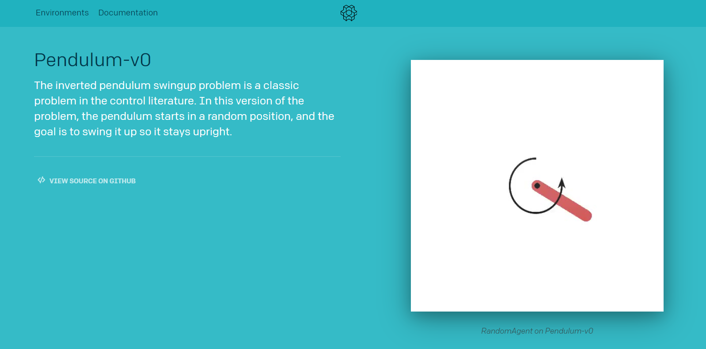

## 前言

> 理论部分，这里将不再强调，直接强调重点部分（理论部分请点击[Double DQN](https://ldgyyf.cn/2019/07/18/%E8%AE%BA%E6%96%87/%E6%B7%B1%E5%BA%A6%E5%BC%BA%E5%8C%96%E5%AD%A6%E4%B9%A0/DRL%E8%AE%BA%E6%96%87%E9%98%85%E8%AF%BB%EF%BC%88%E4%BA%8C%EF%BC%89%E4%B9%8BDQN%E6%94%B9%E8%BF%9B%E7%9B%AE%E6%A0%87Q%E5%80%BC%E8%AE%A1%E7%AE%97%EF%BC%88Double-DQN%EF%BC%89/)）
>
> 经验证，DQN中使用max操作，会使得其Q值会出现过估计的情况，因此提出了DQN的改进算法之一：Double DQN；Double DQN就是将DQN中的目标Q值的动作与计算分离，来减缓过估计情况。
>
> 本文的代码，主要参考[莫烦大神](https://github.com/MorvanZhou/Reinforcement-learning-with-tensorflow/tree/master/contents/5.1_Double_DQN)的代码，只做了少量的修改。

## 一、实验环境

> 总共测试了三种环境，其中CartPole和MountainCar的环境，在[上一节](https://ldgyyf.cn/2019/08/06/%E4%BB%A3%E7%A0%81/DRL/%E4%BB%A3%E7%A0%81%E5%AE%9E%E7%8E%B0%EF%BC%88%E4%B8%80%EF%BC%89%E4%B9%8BNature-DQN/#more)已经介绍过，这一次，添加了一个Pendulum环境。

### 1.1 Pendulum环境简单介绍

**目标说明：**[详细网址](https://gym.openai.com/envs/Pendulum-v0/)



倒立摆摆问题是对照文献中的经典问题。在这个版本的问题中，钟摆以随机位置开始，目标是将其向上摆动，使其保持直立。

**环境介绍：**[详细网址](https://github.com/openai/gym/wiki/Pendulum-v0)，[pendulum源代码](https://github.com/openai/gym/blob/master/gym/envs/classic_control/pendulum.py)


## 二、Double DQN

在**DQN**中，其$Y_t^{DQN}$的计算公式为：
$$
Y_t^{DQN} \equiv R_{t+1} + \gamma \max_a Q(S_{t+1},a; \theta_t^-)
$$
其中，$\theta_t^-$为$Target Q$的网络参数。

正是因为其max操作，使得其Q值可能比真实值要高，导致动作-值函数过估计。

而**Double DQN**中，则对$Y_t^{DQN}$进行了一个小小的改动，改动后如下：
$$
Y_t^{DoubleQ} \equiv R_{t+1} + \gamma Q(S_{t+1},\arg\max_a Q(S_{t+1},a;\theta_t);\theta^-_t)
$$
使用Q网络的参数$\theta$来估计贪婪策略的价值，使用$TargetQ$网络的参数$\theta^-$来公平的评估该策略的价值

## 三、代码部分

> Double DQN的代码相比于DQN，只改动了一处。直接查看[所有代码](https://github.com/ldgcug/DeepReinforcementLearning-Tensorflow/tree/master/DDQN)

### 3.1 代码组成

> 所有代码里面，主要包含6个代码：
>
> （1）ddqn.py和ddqn_truth.py
>
> ​		这两个代码几乎完全一致，不同的是，在ddqn.py中，只包含ddqn的算法；而在ddqn_truth.py中，同时包含了ddqn算法和dqn算法，并且添加了求真实Q-values的值
>
> （2）run_CartPole.py
>
> ​		这个和上一节DQN里面的代码基本完全一致，较之前，多了一个测试环节，测试训练的效果，测试差不多能达到300分。并且主要用于展示损失函数图和累计奖励图
>
> （3）run_MountainCar.py
>
> ​		这个就和上一节的完全一致了，除了调用的是DDQN外，就没有区别了
>
> （4）run_CartPole_truth.py和run_Pendulum.py
>
> ​		这两个主函数里面代用的则是ddqn_truth.py函数，最终用于展示其DQN和Double DQN的过估计情况

### 3.2 网络-ddqn.py

> 主要用来显示损失函数图和累计奖励图

**ddqn.py**

```python
		q_next = self.sess.run(self.q_next,feed_dict={self.s_:next_states})
		q_eval = self.sess.run(self.q_eval,feed_dict={self.s:states})
		# add q_eval_next
		q_eval_next = self.sess.run(self.q_eval,feed_dict={self.s:next_states})
		q_target = q_eval.copy()

		for k in range(len(mini_batch)):
			if dones[k]:
				q_target[k][actions[k]] = rewards[k]
			else:
				# dqn
				# q_target[k][actions[k]]	= rewards[k] + self.gamma * np.max(q_next[k])

				# double dqn
				max_action_next = np.argmax(q_eval_next,axis=1)# argmax Q 
				#print('q_next',q_next)
				q_target[k][actions[k]]	= rewards[k] + self.gamma * q_next[k,max_action_next[k]]
```

**dqn.py**

```python
		q_next = self.sess.run(self.q_next,feed_dict={self.s_:next_states})
		q_eval = self.sess.run(self.q_eval,feed_dict={self.s:states})
		q_target = q_eval.copy()

		for k in range(len(mini_batch)):
			if dones[k]:
				q_target[k][actions[k]] = rewards[k]
			else:
				q_target[k][actions[k]]	= rewards[k] + self.gamma * np.max(q_next[k])
```

Double DQN 和DQN的代码的主要差别如上，很明显：

首先，在Double DQN中，多了一个Q值：q_eval_next

```python
q_eval_next = self.sess.run(self.q_eval,feed_dict={self.s:next_states})
```

这一行对应了公式里面的：$Q(S_{t+1},a;\theta_t)$

值得注意的是，这里仍然用的是Q网络，但是状态为下一状态$S_{t+1}$

然后，在计算时首先求出$argmax$，

```python
max_action_next = np.argmax(q_eval_next,axis=1)
```

这一行则对应了$\arg\max_a Q(S_{t+1},a;\theta_t)$，这样就得到了行为$a$

最后则是计算$Y_t^{DQN}$

```python
q_target[k][actions[k]]	= rewards[k] + self.gamma * q_next[k,max_action_next[k]]
```

通过

```
q_next[k,max_action_next[k]]
```

则直接获取$Q'(s,a)$的值，而不再是用

```
 np.max(q_next[k])
```

获取$\max Q'(s,a)$，要注意这其中的区别

### 3.3 网络-ddqn_truth.py

> 把dqn和ddqn算法全部添加进来，并且计算真实Q-values值，用于展示dqn和ddqn与真实Q-values之间的差别的图形

（1）在init函数里面，主要多了double_q和sess的变量，其中double_q的变量是为了判断是否用ddqn，还是dqn。因为要展示两种算法与真实Q-values之间的差异，因此还需要接收主函数输入的sess

```python
def __init__(self,double_q = True,sess = None):
    self.double_q = double_q #decide to use double q or not
    if sess is None:
		self.sess = tf.Session()
		self.sess.run(tf.global_variables_initializer())
    else:
		self.sess = sess
    # record the truth
	self.q = [] #用来记录真实的Q-values值
	self.running_q = 0 #用于计算真实Q-values值
```

（2）在e-greedy行为选择这里，添加了计算真实Q-values的代码，其真值通过

```python
self.running_q = self.running_q * 0.99 + 0.01 * np.max(actions_value)
```

来实现（为什么？还没有去思考）

```python
	def choose_action(self,state):
		
		actions_value = self.sess.run(self.q_eval,feed_dict={self.s:state.reshape(-1,self.s_dim)})
		self.running_q = self.running_q * 0.99 + 0.01 * np.max(actions_value)
		self.q.append(self.running_q)
		if np.random.uniform() < self.epsilon:
			return np.argmax(actions_value)

		return np.random.randint(0,self.a_dim)
```

（3）在learn函数里面，通过self.double_q来判断是否用double dqn算法

```python
def learn(self):
    # double dqn 需要添加的Q值
    q_eval_next = self.sess.run(self.q_eval,feed_dict={self.s:next_states})
    
	for k in range(len(mini_batch)):
			if dones[k]:
				q_target[k][actions[k]] = rewards[k]
			else:
				if self.double_q:
					# double dqn
					max_action_next = np.argmax(q_eval_next,axis=1)# argmax Q 
					q_target[k][actions[k]]	= rewards[k] + self.gamma * q_next[k,max_action_next[k]]
				else:
					q_target[k][actions[k]]	= rewards[k] + self.gamma * np.max(q_next[k])
```

### 3.4 主函数-run_CartPole.py

> 和第一节有所不同的是，在训练过程中添加了测试的部分

```python
total_steps = 0
total_reward = []

EPISODE = 100
STEP = 300
TEST = 5

for i_episode in range(EPISODE):
	s = env.reset()
	ep_r = 0
	for step in range(STEP):
		env.render()

		a = RL.choose_action(s)
		s_,r,done,info = env.step(a)
		# the smaller theta and closer to center the better
		x, x_dot, theta, theta_dot = s_
		r1 = (env.x_threshold - abs(x))/env.x_threshold - 0.8
		r2 = (env.theta_threshold_radians - abs(theta))/env.theta_threshold_radians - 0.5
		r = r1 + r2
		RL.store_transition(s,a,r,s_,done)

		ep_r += r 


		if total_steps > 1000:
			RL.learn()

		if done:
			print('episode:',i_episode,'ep_r:',round(ep_r,2),'epsilon',round(RL.epsilon,2),'buffer_size:',RL.memory_count,'steps:',total_steps)
			total_reward.append(ep_r)
			break

		s = s_
		total_steps += 1

	# Test every 10 episodes
	if i_episode % 10 == 0:
		total_rewards = 0
		for i in range(TEST):
			state = env.reset()
			for j in range(STEP):
				env.render()
				action = RL.get_action(state) # direct action for test
				state,reward,done,_ = env.step(action)
				total_rewards += reward
				if done:
					break
		ave_reward = total_rewards/TEST
		print ('episode: ',i_episode,'Evaluation Average Reward:',ave_reward)
```

### 3.5 主函数-run_Pendulum.py

> 显示dqn和ddqn算法相比于真实Q-values差异的图像

需要说一下的是，因为需要计算dqn和ddqn的值，并显示，因此在这里需要创建两个RL，通过double_q来判断使用何种算法。

```python
#!/usr/bin/env python
#-*- coding: utf-8 -*-

import gym
import numpy as np
import tensorflow as tf
import matplotlib.pyplot as plt
from ddqn_truth import DDQN 


env = gym.make('Pendulum-v0')
env = env.unwrapped
env.seed(1) # 可重复实验

MEMORY_SIZE = 3000
ACTION_SPACE = 11  # 将原本的连续动作分离成 11 个动作

sess = tf.Session()
with tf.variable_scope('Natural_DQN'):

    natural_DQN = DDQN(s_dim = env.observation_space.shape[0],
             a_dim = ACTION_SPACE,
             learning_rate = 0.005,
             e_greedy = 0.9,
             replace_target_iter = 200,
             memory_size = MEMORY_SIZE,
             e_greedy_increment = 0.001,
             double_q = False,
             sess = sess)

with tf.variable_scope('Double_DQN'):

    double_DQN = DDQN(s_dim = env.observation_space.shape[0],
             a_dim = ACTION_SPACE,
             learning_rate = 0.005,
             e_greedy = 0.9,
             replace_target_iter = 200,
             memory_size = MEMORY_SIZE,
             e_greedy_increment = 0.001,
             double_q = True,
             sess = sess)


sess.run(tf.global_variables_initializer())

def train(RL):
    total_steps = 0
    s = env.reset()

    while True:
        env.render()
        a = RL.choose_action(s)
        f_action = (a-(ACTION_SPACE-1)/2)/((ACTION_SPACE-1)/4)   # convert to [-2 ~ 2] float actions
        s_, r, done, info = env.step(np.array([f_action]))

        r /= 10 # normalize to a range of (-1, 0). r = 0 when get upright
        # the Q target at upright state will be 0, because Q_target = r + gamma * Qmax(s', a') = 0 + gamma * 0
        # so when Q at this state is greater than 0, the agent overestimates the Q. Please refer to the final result.
        RL.store_transition(s,a,r,s_,done)

        if total_steps > MEMORY_SIZE: #learning
            RL.learn()

        if total_steps - MEMORY_SIZE > 20000: # stop game
            break

        s = s_
        total_steps += 1

    return RL.q  

q_natural = train(natural_DQN)
q_double = train(double_DQN)

plt.plot(np.array(q_natural), c='r', label='natural')
plt.plot(np.array(q_double), c='b', label='double')
plt.legend(loc='best')
plt.ylabel('Q eval')
plt.xlabel('training steps')
plt.grid()
plt.show()
```

另外，这里的行为维度a_dim为11，是将原本的连续动作离散化为11个动作，至于为什么离散化为11个动作？

可能是因为在[源码](https://github.com/openai/gym/blob/master/gym/envs/classic_control/pendulum.py)里面，将行为限定在了[-8,2]里面，因此输入的有11维

```python
	self.max_speed=8
    self.max_torque=2.
    u = np.clip(u, -self.max_torque, self.max_torque)[0]	# 这里的u是输入的行为
```

而后面又将获取到的行为做下面操作

```python
 f_action = (a-(ACTION_SPACE-1)/2)/((ACTION_SPACE-1)/4) # convert to [-2 ~ 2] 
```

是因为在环境介绍部分说明了行为的界限范围[-2,2]，所以才做的该操作


至于$r = r /10$，将奖励限定在(-1,0)的操作还没太看懂，我觉得应该是除以20才对，在介绍部分说明了奖励的取值范围为[-16,0]


最后，则显示了两个算法与真实Q-values的差异图像

## 四、结果显示

**DDQN算法**

（1）run_CartPole.py

​	100个episode的损失函数如和累计奖励图


​	（2）run_CartPole_truth.py

100个episode训练过车中的动作-值函数的近似

可以看出Double DQN比 nature DQN的值还是要低一些的，即能缓解其过度估计情况，不知道真实值是多少，只是输出来看看效果


（3）run_MountainCar.py

15个episode的损失函数图和累计奖励图


（4）run_Pendulum.py

​	这个是用莫烦的代码跑的


而下图则是我根据莫烦的代码修改后，测试的，图像当然是差不多的，至少证明了我改写过后的代码是没有问题的（虽然只改动了一点点，但是改为自己习惯的就好）


从这个图中则可以看出，我们的真实Q-values值是0，而Nature DQN在预估的过程中，存在不少高估的情况，改用Double DQN，则会好很多

## 总结

> 通过这个实验对Double DQN有了更加深刻的了解，并且对DQN的高估也有了一个较直观的理解，但是对里面的一些参数是如何确定的，这点还是有点疑惑，目前还是主要以理解算法为主

## 参考链接

- [莫烦-Double DQN](https://github.com/MorvanZhou/Reinforcement-learning-with-tensorflow/tree/master/contents/5.1_Double_DQN)
- [pendulum源码](https://github.com/openai/gym/blob/master/gym/envs/classic_control/pendulum.py)

- [pendulum环境介绍](https://github.com/openai/gym/wiki/Pendulum-v0)

- [pendulum目标介绍](https://gym.openai.com/envs/Pendulum-v0/)