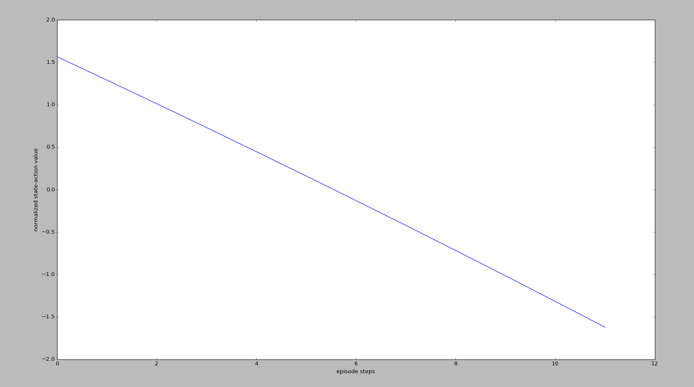
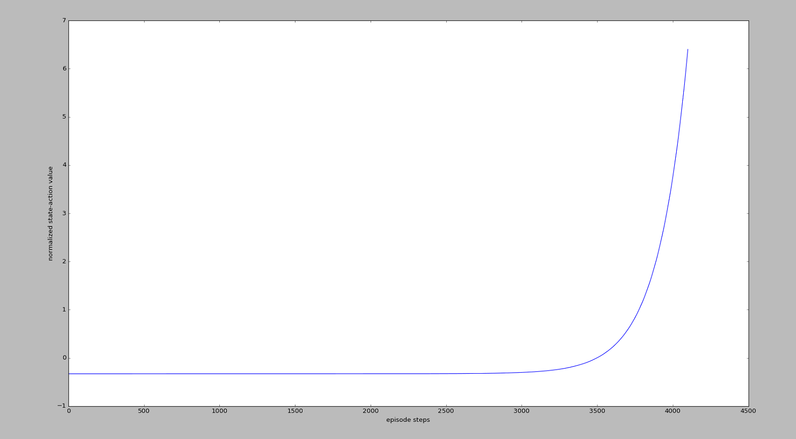

## 前言

> Policy Gradient是RL里面基于Policy-Based的方法，与前面的DQN的基于Value-Based的方法不同。其理论部分，查看[DRL论文阅读（五）](https://ldgyyf.cn/2019/07/23/%E8%AE%BA%E6%96%87/%E6%B7%B1%E5%BA%A6%E5%BC%BA%E5%8C%96%E5%AD%A6%E4%B9%A0/DRL%E8%AE%BA%E6%96%87%E9%98%85%E8%AF%BB%EF%BC%88%E4%BA%94%EF%BC%89%E4%B9%8BPolicy-Gradient%E7%90%86%E8%A7%A3/)
>
> 本篇代码是基于[莫烦](https://github.com/MorvanZhou/Reinforcement-learning-with-tensorflow/tree/master/contents/7_Policy_gradient_softmax)的代码，然后进行了少量的修改，实践中使用的是离散行为空间的softmax策略函数，而不是连续行为空间的高斯策略函数

## 一、实验环境

> 使用CartPole和MountainCar作为实验环境，这里将不再对环境进行说明

## 二、Policy Gradient

**算法伪代码**：采用的是蒙特卡洛策略梯度reinforce算法(不带基数)

它是一个基于整条回合数据的更新，即在训练之前，要先收集整个episode的(s,a,r)，然后在进行参数更新


$\nabla_\theta log \pi_\theta(s,a)*v$ 表示在状态$s$对所选动作 $a$ 的吃惊度，如果 $\pi_\theta(s,a)$ 概率越小，则反向的  $log\pi  _\theta(s,a)$ (即 $-log\pi  _\theta(s,a)$ )越大，如果在 $\pi_\theta(s,a)$ 很小的情况下，拿到了一个大的 $R$ ，也就是大的 $V$ ，则 $-\nabla_\theta log \pi_\theta(s,a)*v$ 就更大，表示更吃惊（我选了一个不常选的动作，结果发现它得到了一个好的reward，那我就得对我这次的参数进行一个大幅度的修改）。这也就是吃惊度的物理意义。

**策略梯度公式**
$$
\nabla_\theta J(\theta) = E_{\pi\theta}[\nabla_\theta log \pi_\theta(s,a) Q^{\pi\theta}(s,a)]
$$
**策略函数：**

- **softmax策略函数**
  $$
  \pi_\theta(s,a) = \frac{e^{\phi(s,a)^T \theta}}{ \sum_{b} e^{\phi(s,b)^T \theta}}
  $$

  $$
  \nabla_\theta log\pi_\theta(s,a) = \phi(s,a) - E_{\pi\theta}[\phi(s,\cdot)]
  $$

  其中，$\phi(s,a)$表示状态-动作对的L维特征向量

- **高斯策略函数**
  $$
  \mu(s) = \phi(s)^T \theta
  $$

  $$
  a \sim N(\mu(s),\sigma^2)
  $$

$$
\nabla_\theta log \pi_\theta(s,a) = \frac{(a-\mu(s)) \phi(s)}{\sigma^2}
$$

## 三、代码部分

> 直接查看[完整代码](https://github.com/ldgcug/DeepReinforcementLearning-Tensorflow/tree/master/Policy%20Gradient)

### 3.1 代码组成

> 代码主要由三部分组成：**policy_gradient.py**、**run_CartPole.py**、**run_MountainCar.py**

### 3.2 网络-policy_gradient.py

```python
#!/usr/bin/env python
#-*- coding: utf-8 -*-

import numpy as np 
import tensorflow as tf 

np.random.seed(1)
tf.set_random_seed(1)

class PolicyGradient(object):

	def __init__(self,
				 s_dim,
				 a_dim,
				 learning_rate = 0.01,
				 reward_decay = 0.95,
				 output_graph = False
	):
		self.s_dim = s_dim
		self.a_dim = a_dim
		self.lr = learning_rate # 学习率
		self.gamma = reward_decay # reward 递减率
        
		self.ep_obs,self.ep_as,self.ep_rs = [],[],[] #用来存储s,a,r

		self.build_net()  # 建立 policy 神经网络

		self.sess = tf.Session()

		if output_graph:
			tf.summary.FileWriter("logs/",self.sess.graph)

		self.sess.run(tf.global_variables_initializer())

	def build_net(self):

		# 输入
		self.s = tf.placeholder(tf.float32,[None,self.s_dim],name='s_dim')   # 接收 observation
		self.tf_acts = tf.placeholder(tf.int32,[None,],name="actions_num") # 接收我们在这个回合中选过的 actions
		self.tf_vt = tf.placeholder(tf.float32,[None,],name="actions_value")# 接收每个 state-action 所对应的 value (通过 reward 计算)
		# 网络参数
		w_initializer = tf.random_normal_initializer(0.,0.3)
		b_initializer = tf.constant_initializer(0.1)

		c_names = ['softmax_output',tf.GraphKeys.GLOBAL_VARIABLES]

		# 隐藏层1 使用relu激活函数
		with tf.variable_scope('fc1'):
			w1 = tf.get_variable('w1',[self.s_dim,20],initializer=w_initializer,collections=c_names)
			b1 = tf.get_variable('b1',[20],initializer=b_initializer,collections=c_names)
			fc1 = tf.nn.relu(tf.matmul(self.s,w1)+b1)

		# 隐藏层最后一层，输出是不需要激活函数的
		with tf.variable_scope('fc2'):
			w2 = tf.get_variable('w2',[20,self.a_dim],initializer=w_initializer,collections=c_names)
			b2 = tf.get_variable('b2',[self.a_dim],initializer=b_initializer,collections=c_names)
			all_act  = tf.matmul(fc1,w2) + b2

		# softmax 输出层，输出每个行为所对应的概率
		self.all_act_prob = tf.nn.softmax(all_act,name='act_prob')  

		with tf.variable_scope('loss'):
             # 最大化 总体 reward (log_p * R) 就是在最小化 -(log_p * R), 而 tf 的功能里只有最小化 loss
			neg_log_prob = tf.nn.sparse_softmax_cross_entropy_with_logits(logits=all_act,labels=self.tf_acts) # 所选 action 的概率 -log 值
			# 或者使用下面这种方式
			# neg_log_prob = tf.reduce_sum(-tf.log(self.all_act_prob)*tf.one_hot(self.tf_acts, self.n_actions), axis=1)
			loss = tf.reduce_mean(neg_log_prob * self.tf_vt) # (vt = 本reward + 衰减的未来reward) 引导参数的梯度下降
		#使用的是Adam优化器
		with tf.variable_scope('train'):
			self.train_op = tf.train.AdamOptimizer(self.lr).minimize(loss)
	
    #根据softmax所输出的概率选择行为
	def choose_action(self,state):
		prob_weights = self.sess.run(self.all_act_prob,feed_dict={self.s:state.reshape(-1,self.s_dim)}) # 所有 action 的概率
		action = np.random.choice(range(prob_weights.shape[1]),p=prob_weights.ravel())  # 根据概率来选 action
		return action
    
	#存储整个episode的s,a,r
	def store_transition(self,s,a,r):
		self.ep_obs.append(s)
		self.ep_as.append(a)
		self.ep_rs.append(r)

	def learn(self):
		# 衰减, 并标准化这回合的 reward
		discounted_ep_rs_norm = self.discount_and_norm_rewards()

		# train on episode
		self.sess.run(self.train_op,feed_dict={
					self.s:np.vstack(self.ep_obs), # shape=[None, n_obs]
					self.tf_acts:np.array(self.ep_as),  # shape=[None, ]
					self.tf_vt:discounted_ep_rs_norm  # shape=[None, ]
			})
		self.ep_obs,self.ep_as,self.ep_rs = [],[],[] # 训练完后，清空，在重新保存
		return discounted_ep_rs_norm # 返回这一回合的 state-action value
	
    #和以往的不同的是，这里是从后向前计算
	def discount_and_norm_rewards(self):
		# discount episode rewards
		discounted_ep_rs = np.zeros_like(self.ep_rs)
		running_add = 0
		for t in reversed(range(0,len(self.ep_rs))): #反转，后向前
			running_add = running_add * self.gamma + self.ep_rs[t]
			discounted_ep_rs[t] = running_add

		# normalize episode rewards
		discounted_ep_rs -= np.mean(discounted_ep_rs)
		discounted_ep_rs /= np.std(discounted_ep_rs)
		return discounted_ep_rs
```

**部分语句解释：**

（1）*.shape[1]和ravel函数

> 这里取prob_weights.shape[1]表示获取prob_weights的列个数，.shape[0]则表示行个数，即行为的维度
>
> ravel函数表示扁平化，即拉成一个维度，[ravel函数详情](https://www.cnblogs.com/mzct123/p/8659193.html)

```python
action = np.random.choice(range(prob_weights.shape[1]),p=prob_weights.ravel())
```

（2）zeros_like函数

> 返回与指定数组具有相同形状和数据类型的数组，并且数组中的值都为0。[函数详情](https://www.cjavapy.com/article/92/)

```python
discounted_ep_rs = np.zeros_like(self.ep_rs)
```

（3）reversed函数

> 反转，PG算法中是前向，不是后向，因此需要反转。[函数详情](https://www.runoob.com/python3/python3-func-reversed.html)

```python
for t in reversed(range(0,len(self.ep_rs))):
```

（4）np.std函数

> 计算矩阵标准差，[函数详情](https://blog.csdn.net/chixujohnny/article/details/51106481)

```python
discounted_ep_rs /= np.std(discounted_ep_rs)
```

（5）np.vstack函数

> 按照垂直方向堆叠数组，[函数详情](https://blog.csdn.net/csdn15698845876/article/details/73380803)

```python
self.s:np.vstack(self.ep_obs),
```

（6）tf.nn.sparse_softmax_cross_entropy_with_logits函数

> 这个地方没怎么搞懂，[函数详情](https://blog.csdn.net/ZJRN1027/article/details/80199248)

```python
neg_log_prob = tf.nn.sparse_softmax_cross_entropy_with_logits(logits=all_act,labels=self.tf_acts)
```

但若是换成这一种表达方式的话就是指：

**self.all_act_prob**表示所有的行为对应的概率；

**tf.log(self.all_act_prob)*tf.one_hot(self.tf_acts, self.n_actions)**这样就能知道我采取的是哪一个行为，而用one_hot则是为了用矩阵相乘，因为前面的是矩阵，one_hot只有被采取的行为为1，其他的为0。

添加负号是因为tf没有最大化，只有最小化，而我们想要实现`log`的最大化，即最小化`-log`

```python
neg_log_prob = tf.reduce_sum(-tf.log(self.all_act_prob)*tf.one_hot(self.tf_acts, self.n_actions), axis=1)
```

**注：疑惑的地方，没弄懂**

（1）这里的这两个输入，为什么是[None,]，后面为什么是空的？

```python
		self.tf_acts = tf.placeholder(tf.int32,[None,],name="actions_num")
		self.tf_vt = tf.placeholder(tf.float32,[None,],name="actions_value")
```

（2）计算损失函数

这里的损失函数，干嘛要求均值呢？即用tf.reduce_mean？

softmax策略函数体现在哪里，只是在前面直接用来求最后的输出层就可以了吗？这样就是用的softmax策略函数？那么前面关于softmax策略函数的梯度公式给出是干啥的呢？$\nabla_\theta log\pi_\theta(s,a) = \phi(s,a) - E_{\pi\theta}[\phi(s,\cdot)]$ 

```python
with tf.variable_scope('loss'):
    neg_log_prob = tf.nn.sparse_softmax_cross_entropy_with_logits(logits=all_act,labels=self.tf_acts)
    # 或者使用下面这种方式
    # neg_log_prob = tf.reduce_sum(-tf.log(self.all_act_prob)*tf.one_hot(self.tf_acts, self.n_actions), axis=1)
    loss = tf.reduce_mean(neg_log_prob * self.tf_vt) # reward guided loss
```

**这里用的损失函数的优化器，选用的是Adam，而不是前面DQN相关的RMSP**

### 3.3 主函数-run_CartPole.py

```python
#!/usr/bin/env python
#-*- coding: utf-8 -*-

import gym
from policy_gradient import PolicyGradient
import matplotlib.pyplot as plt

DISPLAY_REWARD_THRESHOLD = 400 # 当 回合总 reward 大于 400 时显示模拟窗口
RENDER = False # 在屏幕上显示模拟窗口会拖慢运行速度, 我们等计算机学得差不多了再显示模拟


env = gym.make('CartPole-v0')
env.seed(1)  #普通的 PG 方法, 使得回合的 variance 比较大, 所以我们选了一个好点的随机种子
env = env.unwrapped # 取消限制

print(env.action_space)
print(env.observation_space)
print(env.observation_space.high)
print(env.observation_space.low)

RL = PolicyGradient(
		s_dim = env.observation_space.shape[0],
		a_dim = env.action_space.n,
		learning_rate = 0.02,
		reward_decay = 0.99,
		#output_graph = True # output_graph=True,    # 输出 tensorboard 文件
	)

for i_epsiode in range(3000):

	s = env.reset()
	while True:
		if RENDER: env.render()

		a = RL.choose_action(s)
		s_,r,done,info = env.step(a)

		RL.store_transition(s,a,r) # 存储这一回合的 transition

		if done:
			ep_rs_sum = sum(RL.ep_rs)

			if 'running_reward' not in globals():
				running_reward = ep_rs_sum
			else:
                # 对应训练过程中的discount reward
				running_reward = running_reward * 0.99 + ep_rs_sum * 0.01

			if running_reward > DISPLAY_REWARD_THRESHOLD: RENDER = True
			print('episode:',i_epsiode,"reward:",int(running_reward))

			vt = RL.learn()# 学习, 输出 vt
			#这个地方 可以加可以不加
			if i_epsiode == 0:
				plt.plot(vt) 
				plt.xlabel('episode steps')
				plt.ylabel('normalized state-action value')
				plt.show()
			break

		s = s_,
```

### 3.4 主函数-run_MountainCar.py

```python
#!/usr/bin/env python
#-*- coding: utf-8 -*-

import gym
from policy_gradient import PolicyGradient
import matplotlib.pyplot as plt

DISPLAY_REWARD_THRESHOLD = -2000 # renders environment if total episode reward is greater then this threshold
RENDER = False # rendering wastes time

env = gym.make('MountainCar-v0')
env.seed(1)     # reproducible, general Policy gradient has high variance
env = env.unwrapped

print(env.action_space)
print(env.observation_space)
print(env.observation_space.high)
print(env.observation_space.low)

RL = PolicyGradient(
		s_dim = env.observation_space.shape[0],
		a_dim = env.action_space.n,
		learning_rate = 0.02,
		reward_decay = 0.995,
		#output_graph = True
	)

for i_epsiode in range(1000):

	s = env.reset()
	while True:
		if RENDER: env.render()

		a = RL.choose_action(s)
		s_,r,done,info = env.step(a)

		RL.store_transition(s,a,r)

		if done:
			ep_rs_sum = sum(RL.ep_rs)
			if 'running_reward' not in globals():
				running_reward = ep_rs_sum
			else:
				running_reward = running_reward * 0.99 + ep_rs_sum * 0.01
			if running_reward > DISPLAY_REWARD_THRESHOLD: RENDER = True
			print('episode:',i_epsiode,"reward:",int(running_reward))
			vt = RL.learn()
			if i_epsiode == 30:
				plt.plot(vt)
				plt.xlabel('episode steps')
				plt.ylabel('normalized state-action value')
				plt.show()
			break

		s = s_
```

## 四、界面显示

> 参考[莫烦](https://morvanzhou.github.io/tutorials/machine-learning/reinforcement-learning/5-2-policy-gradient-softmax2/)讲解

**run_CartPole.py**



可以看出，左边的$v_t$有较高的值，右边的$v_t$有较低的值，也就说通过$v_t$再说明：

“**请重视我这回合刚开始时的一系列动作，因为前面一段时间杆子还没有掉下来，而且请惩罚我之后的一系列动作，因为后面的动作让杆子掉下来了**”或者是

“**我每次都想让这个动作在下一次增加被选的可能性（$\nabla_\theta log \pi_\theta(s,a)$），但是增加可能性的这种做法是好还是坏呢？这就要由$v_t$告诉我了，所有后一段时间的增加可能性做法并没有被提倡，而前段时间的增加可能性做法是被提倡的。**”

这样，$v_t$就能通过

```python
loss = tf.reduce_mean(neg_log_prob * self.tf_vt)
```

诱导gradient descent朝着正确的方向发展了。

**run_MountainCar.py**



MountainCar这张图的意思是在说：

**“请重视我这回合最后的一系列动作, 因为这一系列动作让我爬上了山. 而且请惩罚我开始的一系列动作, 因为这些动作没能让我爬上山”.**

同样，通过$v_t$来诱导梯度下降的方向。

## 总结

> 和Value-Based相比，网络结构发生了很多变化，并且没有Target网络，也不需要DQN的经验池等等，代码简洁了很多，并且损失函数的优化器不一样。这个只是最基础的PG算法，下面将开始AC算法
>
> 在网络的代码中，PG在build_net、choose_action、store_transition处和之前的Value-Based方法有所改变，并且新添加了discount_and_norm_rewards函数
>
> 

## 参考链接

- [莫烦算法介绍](https://morvanzhou.github.io/tutorials/machine-learning/reinforcement-learning/5-1-policy-gradient-softmax1/)
- [莫烦代码](https://github.com/MorvanZhou/Reinforcement-learning-with-tensorflow/blob/master/contents/7_Policy_gradient_softmax/run_MountainCar.py)
- [刘建平算法介绍](https://www.cnblogs.com/pinard/p/10137696.html)
- [刘建平代码](https://github.com/ljpzzz/machinelearning/blob/master/reinforcement-learning/policy_gradient.py)
- [Fisher's代码介绍](https://bluefisher.github.io/2018/05/10/Actor-Critic-Softmax-Gaussian-Policy-%E4%BB%A3%E7%A0%81%E5%AE%9E%E7%8E%B0/)
- [Fisher's代码（AC含高斯策略函数）](https://github.com/BlueFisher/Reinforcement-Learning/blob/master/Actor_Critic/actor_critic_pendulum.py)

