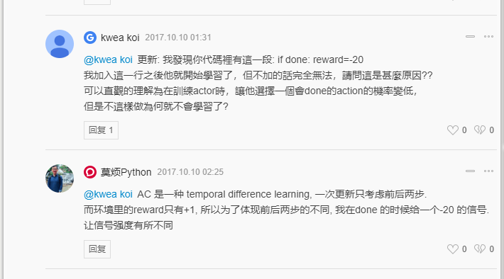
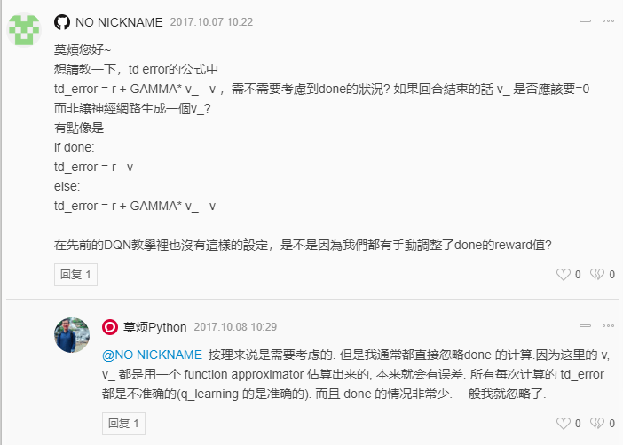
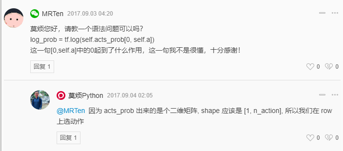
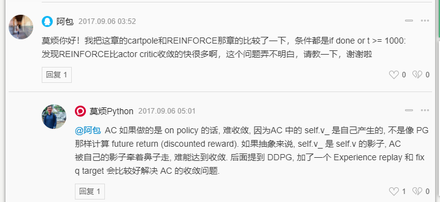
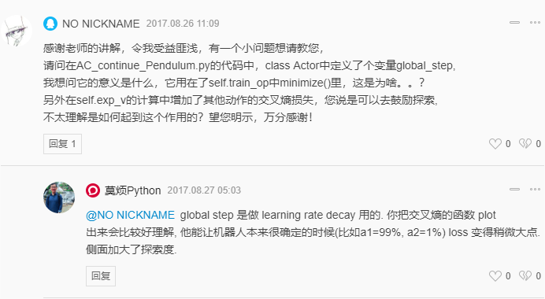

## 前言

> 针对前面PG算法的高方差问题，本篇博客将基于AC算法进行实现。其理论部分请点击[DRL（六）](https://ldgyyf.cn/2019/07/30/%E8%AE%BA%E6%96%87/%E6%B7%B1%E5%BA%A6%E5%BC%BA%E5%8C%96%E5%AD%A6%E4%B9%A0/DRL%EF%BC%88%E5%85%AD%EF%BC%89%E4%B9%8BActor-Critic%E7%AE%97%E6%B3%95%E4%BB%8B%E7%BB%8D/)
>
> 主要在[莫烦代码](https://github.com/MorvanZhou/Reinforcement-learning-with-tensorflow/tree/master/contents/8_Actor_Critic_Advantage)的基础之上，进行更改

## 一、实验环境

> 主要使用两个环境进行训练测试，分别是CartPole环境和Pendulum环境。其中CartPole应用于softmax策略函数的离散行为空间，Pendulum应用于高斯策略函数的连续行为空间。

## 二、Actor-Critic算法

> 主要用$Q_w(s,a)$来代替PG算法中的$v_t$，用来估计行为价值函数$ Q^{\pi_\theta}(s,a)$，即$Q_w(s,a) \approx  Q^{\pi_\theta}(s,a)$，该网络称为Critic网络。

- Critic：更新行为价值函数的参数$w$
- Actor：更新策略的参数θ，更新过程会受到Critic的价值函数的引导

### Actor-Critic 的评估

> Actor-Critic的评估一般有以下几种方法，主要变化的是$Q_w(s,a)$

（1）**基于状态价值：**这和之前的蒙特卡洛策略梯度REINFORCE方法一样，这时Actor的策略函数参数更新的法公式为：
$$
\theta = \theta + \alpha \nabla_\theta log \pi_\theta (s_t,a_t) V(s,w)
$$
（2）**基于动作价值：**在DQN中，我们一般使用的都是动作价值函数Q来做价值评估，这时Actor的策略函数参数更新的法公式为：
$$
\theta = \theta + \alpha \nabla_\theta log \pi_\theta (s_t,a_t) Q(s,a,w)
$$
（3）**基于TD($\lambda$)误差：**一般都是基于后向TD($\lambda$)误差，是TD误差和效用迹E的乘积，这时Actor的策略函数参数更新的法公式是：
$$
\theta = \theta + \alpha \delta(t)E(t)
$$
其中，TD误差$\delta(t) = R_{t+1} + \gamma V(S_{t+1}) - V(s_t)$，$E(t) = \gamma \lambda E_{t-1} + \nabla_\theta log \pi_\theta (s_t,a_t)$

当$\lambda=0$时，就是普通TD方法，即$\theta = \theta + \alpha \nabla_\theta log \pi_\theta (s_t,a_t) \delta(t)$

（4）**基于优势函数（基准函数Baseline）：**和之前Dueling DQN中的优势函数一样，其优势函数A的定义为：$A(S,A,w,\beta) = Q(S,A,w,\alpha,\beta) - V(S,w,\alpha)$，即动作价值函数和状态价值函数的差值，这时Actor的策略函数参数更新的法公式为：
$$
\theta = \theta + \alpha \nabla_\theta log \pi_\theta (s_t,a_t)A(S,A,w,\beta)
$$
**本篇实验过程将基于第三种方法，基于TD($\lambda$)误差进行评估**

## 三、代码部分

> 直接查看[全部代码](https://github.com/ldgcug/DeepReinforcementLearning-Tensorflow/tree/master/Actor-Critic)

### 3.1 代码组成

> 代码主要由四个py程序组成：其中，**run_CartPole.py**对应于**actor_critic.py**，表示对离散行为空间的训练；**run_Pendulum.py**对应于**actor_critic_gaussian.py**表示对连续行为空间的训练

**程序架构：**主要分为Actor和Critic两个类

```python
class Actor(object):
    def __init__(self,s_dim,a_dim,sess,learning_rate=0.001):
        self.build_softmax_network()#建立Actor神经网络
        
    def build_actor_network(self):
    
    def choose_action(self,state):#根据s选择行为
    
    def learn(self,s,a,td):
      	# s,a用于产生Gradient ascent的方向
        # td来自Critic，用于告诉Actor这个方向对不对

class Critic(object):
    def __init__(self,s_dim,sess,learning_rate=0.01,reward_decay=0.9):
        self.build_critic_network()#建立Critic神经网络
    
    def build_critic_network(self):
    
    def learn(self,s,r,s_):
        # 学习状态的价值（state-value），不是行为的价值（action-value）
        # 计算TD-Error = (r+v_) - v
        # 用TD-Error评判这一步的行为有没有带来比平时更好的效果
```

### 3.2 softmax策略函数-离散行为空间

#### 3.2.1 网络-actor-critic.py

**Actor**

训练过程中的一些注意的地方

- **输入：**因为Actor可以单次训练，所以输入只需要是一个状态，一个动作和一个TD-Error
- **网络结构：**和PG算法中的网络结构一样，使用一个双层的全连接神经网络
- **损失函数：**在PG中**loss = -log(prob) * vt**，在这里只是将vt换成了由Critic计算出的**时间差分误差TD-Error**
- **Actor训练：**只需要将状态、动作以及时间差分值喂给网络就可以了
- **选择动作：**和PG一样，根据softmax值进行选择

```python
class Actor(object):
	def __init__(self,s_dim,a_dim,sess,learning_rate=0.001):
		self.s_dim = s_dim
		self.a_dim = a_dim
		self.lr = learning_rate

		self.sess = sess

		self.build_softmax_network()


	def build_softmax_network(self):
		# 因为是单步更新，输入的值是一维的，因此这里用[1,self.s_dim]
        # 如果是回合制更新，则很多个s一起输入进来，因此是用None
		self.s = tf.placeholder(tf.float32,[1,self.s_dim],name='state') #input
		self.a = tf.placeholder(tf.int32,None,name="act")
		self.td_error = tf.placeholder(tf.float32,None,name="td_error")

		# 网络参数
		w_initializer = tf.random_normal_initializer(0.,0.1)
		b_initializer = tf.constant_initializer(0.1)

		c_names = ['actor_network',tf.GraphKeys.GLOBAL_VARIABLES]

		# 隐藏层1 使用relu激活函数
		with tf.variable_scope('fc1'):
			w1 = tf.get_variable('w1',[self.s_dim,20],initializer=w_initializer,collections=c_names)
			b1 = tf.get_variable('b1',[20],initializer=b_initializer,collections=c_names)
			fc1 = tf.nn.relu(tf.matmul(self.s,w1)+b1)

		# 隐藏层最后一层，输出是不需要激活函数的
		with tf.variable_scope('all_act'):
			w2 = tf.get_variable('w2',[20,self.a_dim],initializer=w_initializer,collections=c_names)
			b2 = tf.get_variable('b2',[self.a_dim],initializer=b_initializer,collections=c_names)
			all_act  = tf.matmul(fc1,w2) + b2

		# softmax 输出层，输出每个行为所对应的概率
		self.all_act_prob = tf.nn.softmax(all_act,name='act_prob') 

		with tf.variable_scope('exp_v'):
			#neg_log_prob = tf.log(self.all_act_prob[0, self.a])
            neg_log_prob = tf.reduce_sum(tf.log(self.all_act_prob)*tf.one_hot(self.a, self.a_dim))#log动作概率
			self.exp_v = tf.reduce_mean(neg_log_prob * self.td_error)#log概率*TD方向

		with tf.variable_scope('train'):
			self.train_op = tf.train.AdamOptimizer(self.lr).minimize(-self.exp_v)
            # 因为我们想不断增加这个exp_v（动作带来的额外价值）
            # 所以我们用过 minimize(-exp_v) 的方式达到maximize(exp_v) 的目的
	
    # 根据softmax所输出的概率选择行为
	def choose_action(self,state):
		probs = self.sess.run(self.all_act_prob,feed_dict={self.s:state.reshape(-1,self.s_dim)})# 所有 action 的概率
		action = np.random.choice(range(probs.shape[1]),p=probs.ravel())# 根据概率来选 action
		return action

	def learn(self,s,a,td):
		s = s.reshape(-1,self.s_dim)
		_ = self.sess.run(self.train_op,feed_dict={self.s:s,self.a:a,self.td_error:td})
```

**Critic**

Critic要反馈给Actor一个时间差分值，来决定Actor选择动作的好坏，如果时间差分值大的话，说明当前Actor选择的这个动作的惊喜度较高，需要更多的出现来使得时间差分值减小。

时间差分计算：$\delta(t) = R_{t+1} + \gamma V(S_{t+1}) - V(s_t)$，$V(s_t)$表示将$s$状态输入到Critic网络中得到的Q值。因此Critic的输入也分三个，首先是当前状态，当前奖励，下一状态。**为什么没有动作A？**因为动作A是确定的，是由Actor选择的。

- **输入：**当前状态，当前奖励，下一状态
- **网络结构：**和Actor一样，是一个双层网络，网络最后输出V值
- **损失函数：**$\delta(t) = R_{t+1} + \gamma V(S_{t+1}) - V(s_t)$
- **Critic训练：**将当前状态、当前奖励、下一状态喂给网络即可，并得到TD-Error的值，最后给Actor

```python
class Critic(object):
	def __init__(self,s_dim,sess,learning_rate=0.01,reward_decay=0.9):
		self.s_dim = s_dim
		self.lr = learning_rate
		self.gamma = reward_decay

		self.sess = sess 

		self.build_critic_network()

	def build_critic_network(self):
		# 输入是当前状态、当前奖励、下一状态
		self.s = tf.placeholder(tf.float32,[1,self.s_dim],"state")
		self.v_ = tf.placeholder(tf.float32,[1,1],"v_next")
		self.r = tf.placeholder(tf.float32,None,"r")

		w_initializer = tf.random_normal_initializer(0.,0.1)
		b_initializer = tf.constant_initializer(0.1)

		c_names = ['critic_network',tf.GraphKeys.GLOBAL_VARIABLES]

		# 隐藏层1 
		with tf.variable_scope('critic'):
			w1 = tf.get_variable('w1_c',[self.s_dim,20],initializer=w_initializer,collections=c_names)
			b1 = tf.get_variable('b1_c',[20],initializer=b_initializer,collections=c_names)
			fc1 = tf.nn.relu(tf.matmul(self.s,w1)+b1)

		# 隐藏层最后一层，输出是不需要激活函数的
		with tf.variable_scope('V'):
			w2 = tf.get_variable('w2_c',[20,1],initializer=w_initializer,collections=c_names)
			b2 = tf.get_variable('b2_c',[1],initializer=b_initializer,collections=c_names)
			self.v  = tf.matmul(fc1,w2) + b2


		with tf.variable_scope('squard_TD_error'):
			self.td_error = self.r + self.gamma * self.v_ - self.v #使用时间差分求TD-Error
			self.loss = tf.square(self.td_error)# 均方差求loss

		with tf.variable_scope('train'):
			self.train_op = tf.train.AdamOptimizer(self.lr).minimize(self.loss)


	def learn(self,s,r,s_):
		s = s.reshape(-1,self.s_dim)
		s_ = s_.reshape(-1,self.s_dim)
		v_ = self.sess.run(self.v,feed_dict={self.s:s_})

		td_error = self.sess.run(self.td_error,feed_dict={self.s:s,self.v_:v_,self.r:r})
		_ = self.sess.run(self.train_op,feed_dict={self.s:s,self.v_:v_,self.r:r})

		return td_error
```

#### 3.2.2主函数-run_CartPole.py

> 和之前不一样的是，里面是单步训练

```python
env = gym.make('CartPole-v0')
env.seed(1)     
env = env.unwrapped

N_S = env.observation_space.shape[0]
N_A = env.action_space.n 

DISPLAY_REWARD_THRESHOLD = 400 #奖励值阈值，用于判断是否显示界面
RENDER = False # 刚开始设置为False，不显示

sess = tf.Session()

actor = Actor(s_dim=N_S,a_dim=N_A,learning_rate=0.001,sess=sess)
critic = Critic(s_dim=N_S,learning_rate=0.01,reward_decay=0.9,sess=sess)

sess.run(tf.global_variables_initializer())

for i_episode in range(3000):

	s = env.reset()
	t = 0
	track_r = [] #每回合的所有奖励

	while True:
		if RENDER:env.render()

		a = actor.choose_action(s)
		s_,r,done,info = env.step(a)

		if done: r = -20 #回合结束的惩罚
		track_r.append(r)

		td_error = critic.learn(s,r,s_)# Critic学习，得到TD-Error
		actor.learn(s,a,td_error) # Actor学习，更新行为概率

		s = s_
		t += 1

		if done or t >= 1000:
			ep_rs_sum = sum(track_r)#回合结束，打印回合累积奖励

			if 'running_reward' not in globals():
				running_reward = ep_rs_sum
			else:
				running_reward = running_reward * 0.95 + ep_rs_sum*0.05

			if running_reward > DISPLAY_REWARD_THRESHOLD:RENDER=True
			print('episode:',i_episode,'reward:',int(running_reward))
			break
```

**注意：**
（1）为什么加入这个才能学习？

```python
if done: r = -20 #回合结束的惩罚
```

因为AC在每次更新时，只考虑前后两步，而环境里面的reward只有+1，所以为了体现前后两步的不同，在done的时候给一个-20的信号，让信号强度有所不同



（2）求解TD-Error时，是否需要考虑done的情况？



（3）log概率的代码？如果是下面被注释的那一行，则不太理解

和带有axis的值类似，若axis=0，则沿着纵轴进行操作；axis=1，沿横轴进行操作

```python
#neg_log_prob = tf.log(self.all_act_prob[0, self.a])
neg_log_prob = tf.reduce_sum(tf.log(self.all_act_prob)*tf.one_hot(self.a,self.a_dim))#log动作概率
```



（4）AC收敛好像没有PG快？


### 3.3 Gaussian策略函数-连续行为空间

#### 3.3.1 网络-actor-critic-gaussian.py

```python
class Actor(object):
	def __init__(self,s_dim,action_bound,sess,learning_rate=0.001):
		self.s_dim = s_dim
		self.action_bound = action_bound #对应连续行为，这里不再是维度，而是一个连续空间阈值
		self.lr = learning_rate
		self.sess = sess
		self.build_gaussian_network()

	def build_gaussian_network(self):
		# 输入和Softmax的一样，只是这边a为tf.float32，softmax中也可以设置为float32
		self.s = tf.placeholder(tf.float32,[1,self.s_dim],name='state') #input
		self.a = tf.placeholder(tf.float32,None,name="act")
		self.td_error = tf.placeholder(tf.float32,None,name="td_error")

		w_initializer = tf.random_normal_initializer(0.,0.1)
		b_initializer = tf.constant_initializer(0.1)
		c_names = ['actor_network',tf.GraphKeys.GLOBAL_VARIABLES]

		# 隐藏层1
		with tf.variable_scope('l1'):
			w1 = tf.get_variable('w1',[self.s_dim,30],initializer=w_initializer,collections=c_names)
			b1 = tf.get_variable('b1',[30],initializer=b_initializer,collections=c_names)
			l1 = tf.nn.relu(tf.matmul(self.s,w1)+b1)

		#求均值  隐藏层最后一层
        #和softmax有点区别，这里的输出维度是1维，softmax是n维(因为是离散的)，加了tanh激活函数
		with tf.variable_scope('mu'):
			w2 = tf.get_variable('w2',[30,1],initializer=w_initializer,collections=c_names)
			b2 = tf.get_variable('b2',[1],initializer=b_initializer,collections=c_names)
			mu = tf.nn.tanh(tf.matmul(l1,w2)+b2)

		#求方差  输出层 同样是1个维度，并且以了隐藏层的输出（l1）作为输入
		with tf.variable_scope('sigma'):
			w3 = tf.get_variable('w3',[30,1],initializer=w_initializer,collections=c_names)
			b3 = tf.get_variable('b3',[1],initializer=b_initializer,collections=c_names)
			sigma = tf.nn.softplus(tf.matmul(l1,w3)+b3)

		global_step = tf.Variable(0,trainable=False) #初始化
        # self.e = epsilon = tf.train.exponential_decay(2., global_step, 1000, 0.9)
		self.mu,self.sigma = tf.squeeze(mu*2),tf.squeeze(sigma+0.1)# 均值控制在（-2,2）,因为这个环境的action_bound为2，所以这里直接写的2，方差控制在某个范围内
        #实际应该写为 tf.squeeze(mu*self.action_bound)
		self.normal_dist = tf.distributions.Normal(self.mu,self.sigma)#高斯分布

		self.action = tf.clip_by_value(self.normal_dist.sample(1),self.action_bound[0],self.action_bound[1])

		with tf.variable_scope('exp_v'):
			log_prob = self.normal_dist.log_prob(self.a) # loss without advantage
			self.exp_v = log_prob * self.td_error # advantage (TD_error) guided loss
			self.exp_v += 0.01 * self.normal_dist.entropy()# Add cross entropy cost to encourage exploration

		with tf.variable_scope('train'):
			self.train_op = tf.train.AdamOptimizer(self.lr).minimize(-self.exp_v,global_step)

	def choose_action(self,state):
		return self.sess.run(self.action,feed_dict={self.s:state.reshape(-1,self.s_dim)})

	def learn(self,s,a,td):
		s = s.reshape(-1,self.s_dim)
		_ = self.sess.run(self.train_op,feed_dict={self.s:s,self.a:a,self.td_error:td})

# Critic和softmax的critic一样，主要是Actor有所不同
class Critic(object):
	def __init__(self,s_dim,sess,learning_rate=0.01,reward_decay=0.9):
		self.s_dim = s_dim
		self.lr = learning_rate
		self.gamma = reward_decay

		self.sess = sess 

		self.build_critic_network()

	def build_critic_network(self):

		self.s = tf.placeholder(tf.float32,[1,self.s_dim],"state")
		self.v_ = tf.placeholder(tf.float32,[1,1],"v_next")
		self.r = tf.placeholder(tf.float32,None,"r")

		w_initializer = tf.random_normal_initializer(0.,0.1)
		b_initializer = tf.constant_initializer(0.1)

		c_names = ['critic_network',tf.GraphKeys.GLOBAL_VARIABLES]

		with tf.variable_scope('critic'):
			w1 = tf.get_variable('w1_c',[self.s_dim,30],initializer=w_initializer,collections=c_names)
			b1 = tf.get_variable('b1_c',[30],initializer=b_initializer,collections=c_names)
			l1 = tf.nn.relu(tf.matmul(self.s,w1)+b1)

		with tf.variable_scope('V'):
			w2 = tf.get_variable('w2_c',[30,1],initializer=w_initializer,collections=c_names)
			b2 = tf.get_variable('b2_c',[1],initializer=b_initializer,collections=c_names)
			self.v  = tf.matmul(l1,w2) + b2

		with tf.variable_scope('squard_TD_error'):
			self.td_error = self.r + self.gamma * self.v_ - self.v
			self.loss = tf.square(self.td_error)

		with tf.variable_scope('train'):
			self.train_op = tf.train.AdamOptimizer(self.lr).minimize(self.loss)


	def learn(self,s,r,s_):
		s = s.reshape(-1,self.s_dim)
		s_ = s_.reshape(-1,self.s_dim)
		v_ = self.sess.run(self.v,feed_dict={self.s:s_})

		td_error = self.sess.run(self.td_error,feed_dict={self.s:s,self.v_:v_,self.r:r})
		_ = self.sess.run(self.train_op,feed_dict={self.s:s,self.v_:v_,self.r:r})

		return td_error
```

#### 3.3.2 主函数-run_Pendulum.py

```python
env = gym.make('Pendulum-v0')
env.seed(1)     
env = env.unwrapped

N_S = env.observation_space.shape[0]
A_BOUND = env.action_space.high

DISPLAY_REWARD_THRESHOLD = -100 # renders environment if total episode reward is greater then this threshold
RENDER = False # rendering wastes time

sess = tf.Session()

actor = Actor(s_dim=N_S,action_bound=[-A_BOUND,A_BOUND],learning_rate=0.001,sess=sess)
critic = Critic(s_dim=N_S,learning_rate=0.01,reward_decay=0.9,sess=sess)

sess.run(tf.global_variables_initializer())

for i_episode in range(1000):

	s = env.reset()
	t = 0
	ep_rs = []

	while True:
		if RENDER:env.render()

		a = actor.choose_action(s)
		s_,r,done,info = env.step(a)
		r /= 10

		td_error = critic.learn(s,r,s_)
		actor.learn(s,a,td_error)

		s = s_
		t += 1
		ep_rs.append(r)

		if  t > 200:
			ep_rs_sum = sum(ep_rs)

			if 'running_reward' not in globals():
				running_reward = ep_rs_sum
			else:
				running_reward = running_reward * 0.9 + ep_rs_sum*0.1

			if running_reward > DISPLAY_REWARD_THRESHOLD:RENDER=True
			print('episode:',i_episode,'reward:',int(running_reward))
			break
```

**注意：**

（1）添加了global_step变量，不太清楚干啥？



（2）这个连续行为的训练效果好像并不太好？

​	关于连续行为空间的，还是主要看DDPG和A3C吧

## 总结

> Actor-Critic算法的思路很好，但是不太容易收敛，目前对AC算法进行改进，解决其难收敛的问题主要有DDPG和A3C算法，而且测试的AC在连续行为空间上的效果不太好

## 参考链接

- [莫烦AC算法介绍](https://morvanzhou.github.io/tutorials/machine-learning/reinforcement-learning/6-1-actor-critic/)
- [莫烦AC源代码](https://github.com/MorvanZhou/Reinforcement-learning-with-tensorflow/tree/master/contents/8_Actor_Critic_Advantage)

- [深度强化学习-Actor-Citic算法原理和实现](https://cloud.tencent.com/developer/article/1092347)