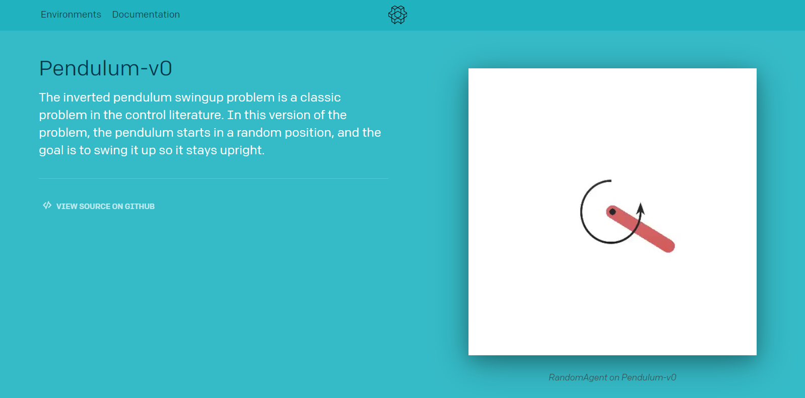
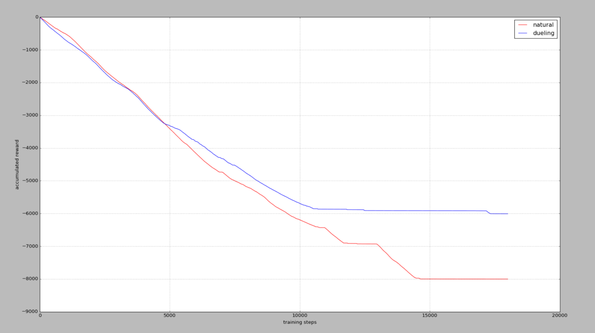
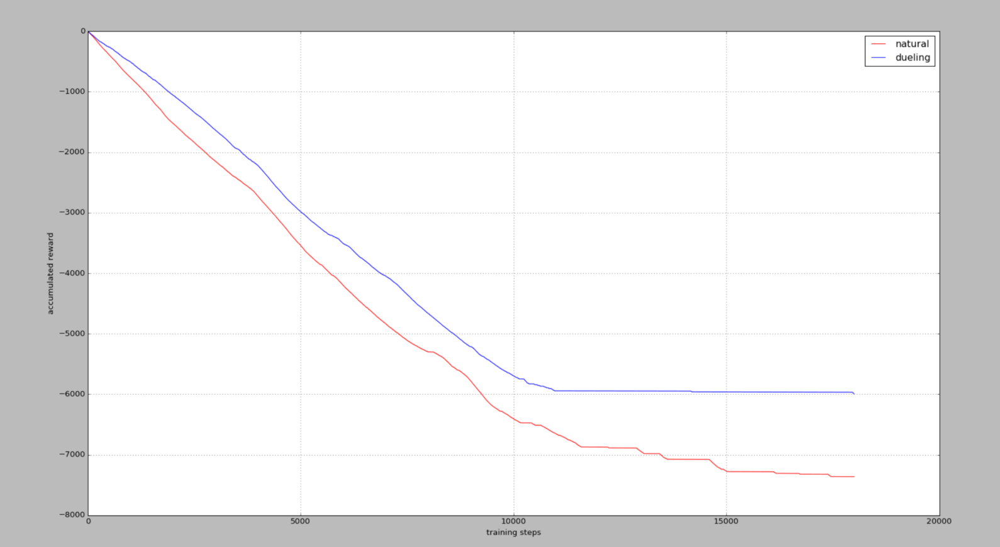
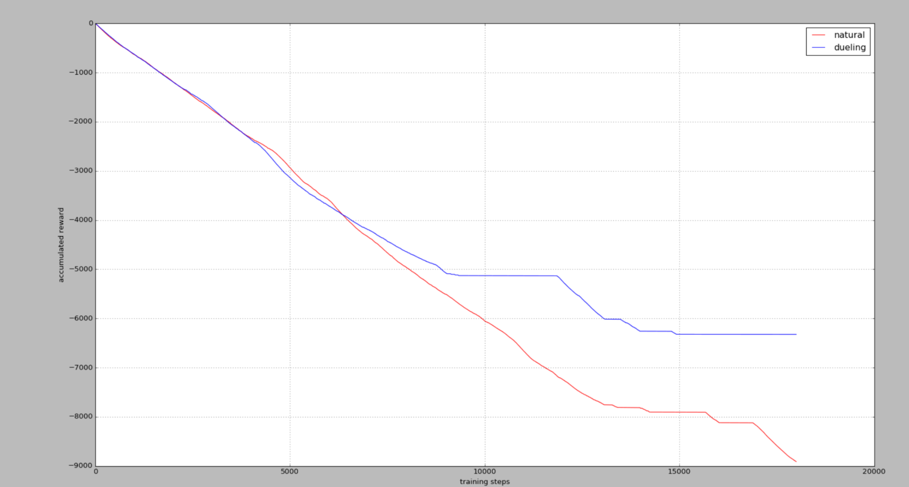
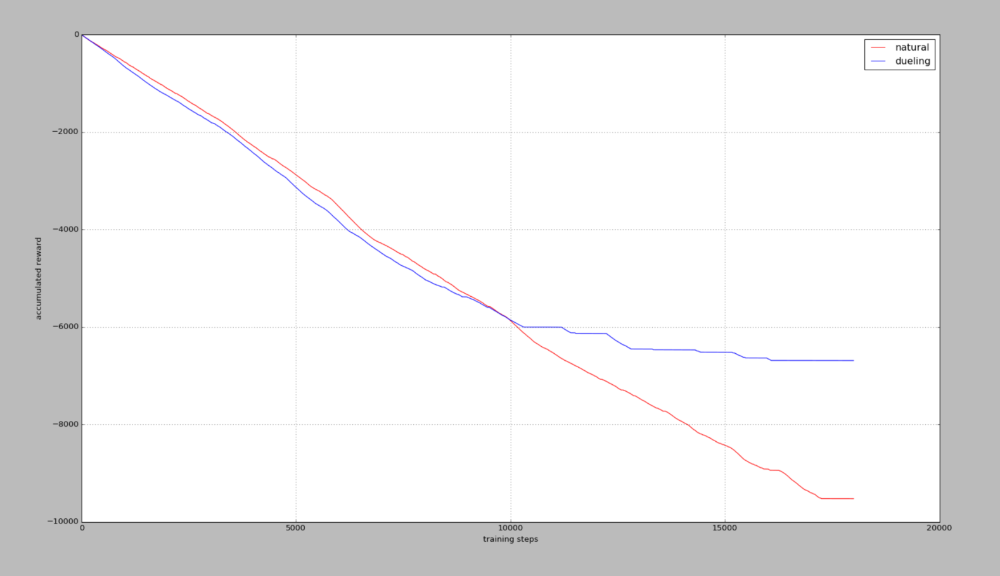

## 前言

> Dueling  DQN 相比较于之前的Double DQN（目标Q值方面的优化）、Prioritized Experience Replay（经验回放池的优化），这次注重的是神经网络的优化，即将最后的Q网络分为V网络和A网络。
>
> 其中，V网络仅仅与状态S有关，与具体要采用的动作A无关，通常称为状态价值函数；
>
> A网络同时与状态S和动作A有关，通常称为动作优势函数。
>
> 其理论部分，点击[DRL论文阅读（四）](https://ldgyyf.cn/2019/07/19/%E8%AE%BA%E6%96%87/%E6%B7%B1%E5%BA%A6%E5%BC%BA%E5%8C%96%E5%AD%A6%E4%B9%A0/DRL%E8%AE%BA%E6%96%87%E9%98%85%E8%AF%BB%EF%BC%88%E5%9B%9B%EF%BC%89%E4%B9%8BDQN%E6%94%B9%E8%BF%9B%E7%BD%91%E7%BB%9C%E7%BB%93%E6%9E%84%EF%BC%88Dueling-DQN%EF%BC%89/)
>
> 本文的代码主要参考[莫烦](https://github.com/MorvanZhou/Reinforcement-learning-with-tensorflow/tree/master/contents/5.3_Dueling_DQN)的代码来修改的。

## 一、实验环境

> 使用Pendulum来作为实验环境



这个实验环境的动作空间是连续的，其范围为[-2,2]。在前面的Double DQN实验中，我们将连续动作空间离散化为11个动作。

在本节的实验中，将分别离散化为5、15、25、35个行为空间来看其效果。

## 二、Dueling DQN

传统的Nature DQN的输出最后是**卷积层**先经过**全连接层**，然后在输出对应于每个动作行为a的值。

而现在的Dueling DQN则是将**最后一个卷积层**的输出分为两部分，分别是**V网络**和**A网络**，如下图下方的分支中，上面的为V网络，下面的为A网络。

其中

- **V(s)**：V(s)表示状态本身的好坏，一般为**一个值**（**标量**）。
- **A(s,a)**：A(s,a)表示当前状态下采取的行为的好坏，一般为**n个值**，因此A网络决定了策略


**Dueling DQN的Q网络计算公式如下：**
$$
Q(s,a;\theta,\alpha,\beta) = V(s;\theta,\beta) + \left(A(s,a;\theta,\alpha) - \frac{1}{|\mathcal{A}|}\sum_{a'} A(s,a';\theta,\alpha) \right)
$$
其中，$\theta$为卷积层参数，$\beta$为V网络全连接层参数,$\alpha$为A网络全连接层参数

## 三、代码部分

> Dueling DQN相比于Nature网络，只在最后的网络结构部分改变了一点点，其他的都没有任何变化
>
> 若想看完整代码，直接[查看所有代码](https://github.com/ldgcug/DeepReinforcementLearning-Tensorflow/tree/master/Dueling%20DQN)

### 3.1 代码组成

> 本节的代码主要包含两个部分：dueling_dqn.py和run_Pendulum.py

### 3.2 网络-dueling_dqn.py

> 只在网络结构部分发生了变化

```python
class DueilingDQN(object):
    def __init__(...,dueling=True,sess=None)
    	self.dueling = dueling #会建立两个DQN，其中一个是Dueling DQN
        
        # 针对建立两个 DQN 的模式修改了 tf.Session() 的建立方式
        if sess is None:
			self.sess = tf.Session()
			self.sess.run(tf.global_variables_initializer())
		else:
			self.sess = sess
    ...
    
    def build_net(self):
		# ************************ build evaluate net *****************************

		with tf.variable_scope('eval_net'):
			c_names = ['eval_net_params',tf.GraphKeys.GLOBAL_VARIABLES]
			
            #第一层，两种DQN都一样
			with tf.variable_scope('layer1'):
				w1 = tf.get_variable('w1',[self.s_dim,20],initializer=w_initializer,collections=c_names)
				b1 = tf.get_variable('b1',[20],initializer=b_initializer,collections=c_names)
				l1 = tf.nn.relu(tf.matmul(self.s,w1)+b1)


			if self.dueling:
				#Dueling DQN
				with tf.variable_scope('Value'): #专门分析state的Value
					w2 = tf.get_variable('w2',[20,1],initializer=w_initializer,collections=c_names)
					b2 = tf.get_variable('b2',[1],initializer=b_initializer,collections=c_names)
					self.V = tf.matmul(l1,w2) + b2

				with tf.variable_scope('Advantage'): #专门分析每种动作的Advantage
					w2 = tf.get_variable('w2',[20,self.a_dim],initializer=w_initializer,collections=c_names)
					b2 = tf.get_variable('b2',[self.a_dim],initializer=b_initializer,collections=c_names)
					self.A = tf.matmul(l1,w2) + b2

				with tf.variable_scope('Q'): # 合并 V 和 A, 为了不让 A 直接学成了 Q, 我们减掉了 A 的均值
					self.q_eval = self.V + (self.A - tf.reduce_mean(self.A,axis=1,keep_dims=True))
			else:
				with tf.variable_scope('Q'): # 普通的 DQN 第二层
					w2 = tf.get_variable('w2',[20,self.a_dim],initializer=w_initializer,collections=c_names)
					b2 = tf.get_variable('b2',[self.a_dim],initializer=b_initializer,collections=c_names)
					self.q_eval = tf.matmul(l1,w2) + b2

		# ************************ build target net *****************************
		# target net 网络和前面的evaluate net网络一样，除了输入由s变为s_，输出self.q_eval变为self.q_next外，没有任何区别
```

在V网络中，因为其输出是一个标量值，因此维度这里为[20,1]

```python
w2 = tf.get_variable('w2',[20,1],initializer=w_initializer,collections=c_names)
```

而A网络的输出，对应的每个a的值，因此维度为[20,self.a_dim]

```python
w2 = tf.get_variable('w2',[20,self.a_dim],initializer=w_initializer,collections=c_names)
```

最后，V和A网络合并，成为Q网络

```python
self.q_eval = self.V + (self.A - tf.reduce_mean(self.A,axis=1,keep_dims=True))
```

### 3.3 主函数-run_Pendulum.py

```python
env = gym.make('Pendulum-v0')
env = env.unwrapped
env.seed(1)

MEMORY_SIZE = 3000
ACTION_SPACE = 15 #将在这里修改行为空间的离散值，可以为5、15、25、35等
```

## 四、结果显示

5个actions



15个actions



25个actions



35个actions



累积奖励reward，在杆子立起来的时候奖励为0，其他时候都是负值，所以当累积奖励没有在降低时2，说明杆子已经被成功立很久了。

我们发现当可用动作越高，学习难度就越大，不过Dueling DQN还是回比Nature DQN学习得更快，收敛效果更好。

## 总结

> 至此，DQN即DQN的三个优化方面的代码已经全部简单测试完毕，并且也差不多了解了其代码，对原理将会更加理解，其中Prioritized Experience Replay的代码部分最为复杂，Double DQN只在最后计算Q值的部分改动了一点点，Dueling  DQN在网络结构部分改变了一点点。
>
> 后面，将会开始Policy Gradient的代码学习。

## 参考链接

- [莫烦Dueling DQN代码部分](https://github.com/MorvanZhou/Reinforcement-learning-with-tensorflow/tree/master/contents/5.3_Dueling_DQN)

- [莫烦Dueling DQN讲解部分](https://morvanzhou.github.io/tutorials/machine-learning/reinforcement-learning/4-7-dueling-DQN/)