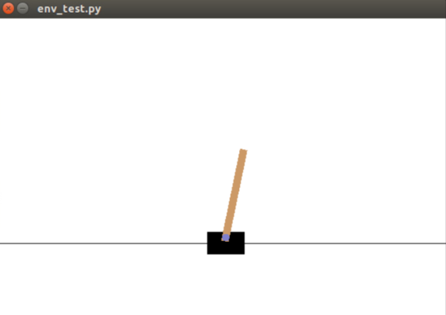
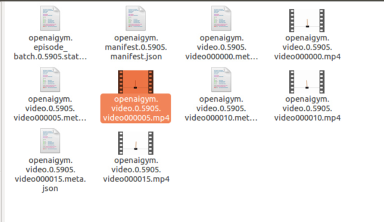
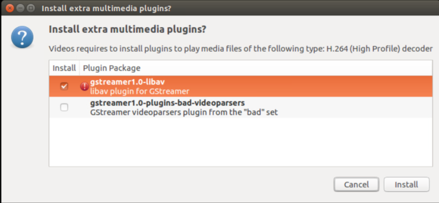

## 前言

> 搭建OpenAI gym环境的目的是为了后面的一系列DRL的强化学习代码的实现，因为OpenAI gym提供了很多的环境，并且训练较快，不用耗很长时间才能看到效果，因此是一个不错的环境。
>
> 我已经在gazebo中基于ardrone实现了一个关于DQN算法的验证，由于机器性能及其他的原因，耗时很长。并且也在airsim中做了一个简单的DQN实验训练，训练结果很好。但是也正是由于目前只会DQN的算法，而其他的DRL算法不会，因此才搭建该环境用于编写DRL算法，以进一步加深自己的理解。

## 一、安装gym环境

> 我这里采用的是pip方式安装，当然也可以git源码进行安装

```python
sudo pip install gym
```

## 二、简单测试

**coding:**

```python
#!/usr/bin/env python
#-*- coding: utf-8 -*-

import gym
env = gym.make('CartPole-v0')	#定义使用gym库中的哪一个环境
env.reset()	#重置环境的状态，返回观察
for i in range(1000):
	env.render() #重绘环境的一帧。默认模式一般比较友好，如弹出一个窗口
	env.step(env.action_space.sample()) #从行为集中，随机选取一个行为并执行

print('action_space',env.action_space)	#查看这个环境中可用的action有多少个
print('observation',env.observation_space)	#查看这个环境中可用的observation有多少个
print('max',env.observation_space.high)	#查看observation最高取值
print('min',env.observation_space.low)	#查看observation最低取值
```

**输出：**

```python
('action_space', Discrete(2))
('observation', Box(4,))
('max', array([4.8000002e+00, 3.4028235e+38, 4.1887903e-01, 3.4028235e+38],
      dtype=float32))
('min', array([-4.8000002e+00, -3.4028235e+38, -4.1887903e-01, -3.4028235e+38],
      dtype=float32))

```



## 三、带返回值的测试

**coding：**

```python
#!/usr/bin/env python
#-*- coding: utf-8 -*-

import gym
env = gym.make('CartPole-v0')
observation = env.reset()
for i in range(1000):
	env.render()
	action = env.action_space.sample()
	observation,reward,done,info = env.step(action)
	print('observation',observation)
	print('reward',reward)
	print('action',action)
	print('info',info)
```

**最后部分输出：**

```python
('observation', array([ -11.94872903,   -0.1539066 , -130.92118709,  -11.77476314]))
('reward', 0.0)
('action', 0)
('info', {'TimeLimit.truncated': False})
('observation', array([ -11.95180716,    0.13505849, -131.15668235,  -11.74811091]))
('reward', 0.0)
('action', 1)
('info', {'TimeLimit.truncated': False})
('observation', array([-1.19491060e+01,  3.22343601e-02, -1.31391645e+02, -1.14306883e+01]))
('reward', 0.0)
('action', 0)
('info', {'TimeLimit.truncated': False})
('observation', array([-1.19484613e+01, -9.94364542e-02, -1.31620258e+02, -1.11078703e+01]))
('reward', 0.0)
('action', 0)
('info', {'TimeLimit.truncated': False})
('observation', array([ -11.95045003,   -0.25909084, -131.84241574,  -10.78671897]))
('reward', 0.0)
('action', 0)
('info', {'TimeLimit.truncated': False})
('observation', array([ -11.95563185,   -0.44371529, -132.05815012,  -10.48063232]))
('reward', 0.0)
('action', 0)
('info', {'TimeLimit.truncated': False})
('observation', array([ -11.96450615,   -0.64896802, -132.26776277,  -10.2072994 ]))
('reward', 0.0)
('action', 0)
('info', {'TimeLimit.truncated': False})
('observation', array([ -11.97748551,   -0.48282207, -132.47190876,  -10.53652414]))
('reward', 0.0)
('action', 1)
('info', {'TimeLimit.truncated': False})
('observation', array([ -11.98714196,   -0.72162235, -132.68263924,  -10.37392887]))
('reward', 0.0)
('action', 0)
('info', {'TimeLimit.truncated': False})
('observation', array([ -12.0015744 ,   -0.5940356 , -132.89011782,  -10.71312018]))
('reward', 0.0)
('action', 1)
('info', {'TimeLimit.truncated': False})
('observation', array([ -12.01345511,   -0.86021586, -133.10438022,  -10.7166571 ]))
('reward', 0.0)
('action', 0)
('info', {'TimeLimit.truncated': False})
```

## 四、保存训练视频

**前提：**需要安装一些依赖库，否则会报错

```python
sudo apt-get install -y python-numpy python-dev cmake zlib1g-dev libjpeg-dev xvfb libav-tools xorg-dev python-opengl libboost-all-dev libsdl2-dev swig
```

**coding:**

```python
#!/usr/bin/env python
#-*- coding: utf-8 -*-

import gym

env = gym.make('CartPole-v0')
env = gym.wrappers.Monitor(env,"CartPole-experiment-1",video_callable=lambda episode_id: episode_id % 5 == 0,force=True)

for episode in range(20):
	observation = env.reset()
	for t in range(100):
		env.render()
		print('observation',observation)
		action = env.action_space.sample()
		observation,reward,done,info = env.step(action)
		if done:
			break
env.close()
```

运行完后，会在同级目录生成一个CatPole-experiment-1的文件夹，文件夹里的文件内容如下：



打开其中的MP4时，提示无法打开，然后按照提示默认安装即可



**注意：**

- video_callable=lambda episode_id: episode_id % 5 == 0：是每隔5秒保存一次，因此文件夹中有4个MP4视频，但是每个视频都很短暂，每个episode保存视频的话，参考[这里](https://github.com/openai/gym/issues/494)
- force=True：是每次运行代码时，将之前生成的json文件和MP4文件直接覆盖掉

目前对这些json文件什么的还不是太清楚，总之是能保存一些训练的视频的。

## 总结

> 这部分主要是做一个OpenAI gym的环境安装及简单测试，并且测试的代码能够看到图形和实际运动的效果即可。后面将开始DRL的代码编写。

## 参考链接

- [莫烦OpenAI gym环境库](https://morvanzhou.github.io/tutorials/machine-learning/reinforcement-learning/4-4-gym/)

- [OpenAI Gym基础教程](https://blog.csdn.net/LK274857347/article/details/83109420)

- [gym官网](https://pypi.org/project/gym/0.7.0/)

- [cartpole官方源码](https://github.com/openai/gym/blob/master/gym/envs/classic_control/cartpole.py)