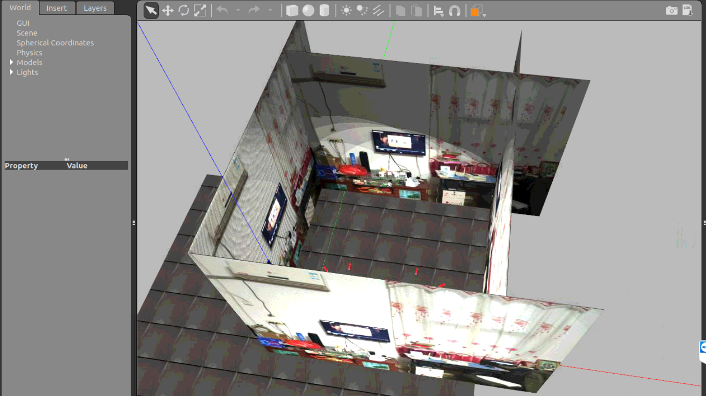
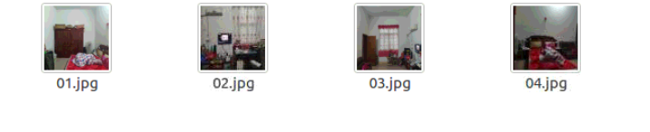
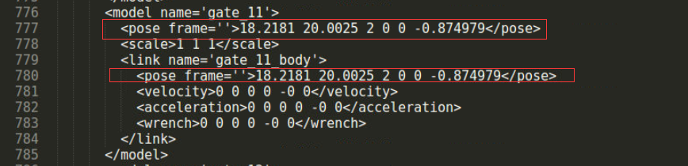
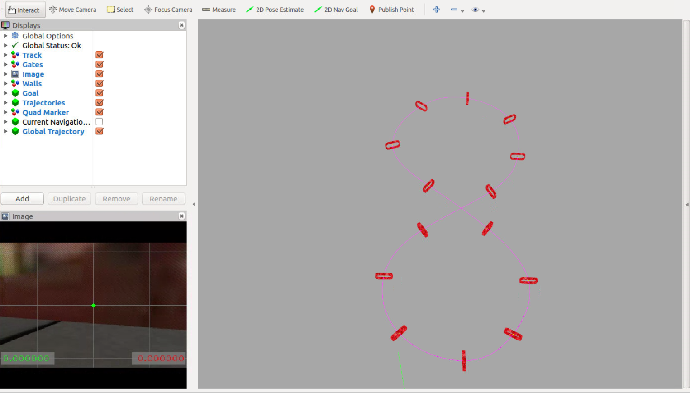
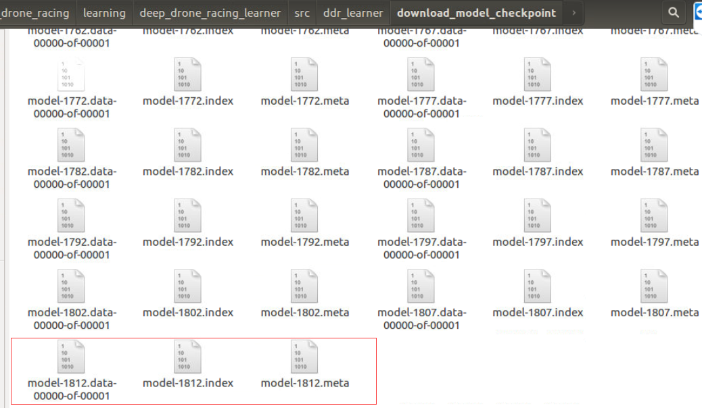

# 前言

> 基于uzh的论文和其代码做的一些相关的无人机竞速实验

# 一、无人机环境配置

> 主要在Linux系统下使用，其安装过程不在这里具体介绍，点击[这里](https://github.com/uzh-rpg/sim2real_drone_racing)，下载代码

- **系统版本：**Ubuntu16.04

- **仿真环境：**Gazebo7.16

  配置好环境后，要确保启动test_racing.launch不报错才行。

# 二、实验相关操作位置说明

## 2.1 训练数据收集测试

> 进入`sim2real_drone_racing/drone_racing/resources/scripts`目录下，运行`collect_data.py`代码，首先验证下能否收集数据，运行不报错，且可以在相关文件夹下生成图像数据和label数据即可，然后停止运行该python代码

​		确保训练数据收集测试无误，再继续执行后面步骤

## 2.2 网络模型保存位置修改

> `train_model.sh`文件，在`sim2real_drone_racing/learning/deep_drone_racing_learner/src/ddr_learner/`目录下
>
> 主要通过修改其中的`checkpoint_dir`的值来更换神经网络模型的保存位置，默认是存放在`/tmp/logs`文件夹下，因为该文件夹是Ubuntu系统的临时文件存放位置，因此可能在重启或其他的误操作后，该文件夹下的内容被清空，所以这里一定要进行修改

```python
#!/bin/bash

train_data=../../data/Training
val_data=../../data/Training

python2.7 train.py --checkpoint_dir=自定义路径  --f=0.5 --train_dir=$train_data --val_dir=$val_data --summary_freq=100 --batch_size=200 --max_epochs=迭代次数 --num_threads=6
```

​		模型保存位置修改后，运行`train_model.sh`文件，测试能否成功训练，操作无误后，继续执行后面步骤

## 2.3 训练背景图修改

> 因为我们训练的背景是根据当前的研究目标而设定的，因此，需要在仿真环境中更改为实际场景背景，该背景图片可以用手机拍摄，也可以通过其他方式来获取，修改过后的训练场景图如图所示



### 2.3.1 图片尺寸大小更改

> 使用python代码，将图片大小全部修改为400*400像素

```python
import os
from PIL import Image

filename = os.listdir("/home/cug/Desktop/image/")
base_dir = "/home/cug/Desktop/image/"
new_dir = "/home/cug/Desktop/image/"

size_m = 400
size_n = 400

for img in filename:
    image = Image.open(base_dir + img)
    image_size = image.resize((size_m,size_n),Image.ANTIALIAS)
    image_size.save(new_dir +img)
```

更改过后的图片数据如下图：



### 2.3.2 训练背景替换

> 在uzh的代码中，主要通过读取特定文件夹下的图片来作为训练背景，因此，只需要找到其文件夹，并将其中的图片替换为自己的图片即可。

​		其训练背景图主要存放在`sim2real_drone_racing/drone_racing/drone_racing/resources/race_track/iros_materials/materials/textures/train_bkgs`目录下，可以将整个`train_bkgs`文件夹拷贝一份，并将复制的文件夹重名为`train_bkgs_init`，保存其初始背景图，然后将`train_bkgs`中的图片数据清空删除，并将上面的`01-04.jpg`图片拷贝到`train_bkgs`文件夹即可。

​		最后可以重新运行`train_model.sh`文件，查看新收集的背景图是否修改来进行验证，也可以通过运行launch文件，并显示Gazebo界面来查看，如何显示Gazebo界面，会在后面进行介绍。

## 2.4 地面纹理图修改

> 原实验是使用的小草图片作为地面纹理，也可根据自己需要修改成其他图片

和2.3节一样，先运行python代码，将图片大小更改，然后进行数据替换。

将`sim2real_drone_racing/drone_racing/drone_racing/resources/race_track/iros_materials/materials/textures`目录和`sim2real_drone_racing/drone_racing/drone_racing/resources/race_track/iros_materials/materials/textures/test_floor_bkgs`目录下的`asphalt.jpg`(小草图片)删除，然后将想要使用的地面纹理图，各拷贝一份到上面的两个目录下，重命名为`asphalt.jpg`

## 2.5 Gazebo界面显示

> Gazebo界面默认是关闭的，但我们平常做一些相关的修改后，想要快速的查看效果，就可以用Gazebo进行界面显示了

​		在`sim2real_drone_racing/drone_racing/drone_racing/launch`目录下，打开`simulation_no_quad_gui.launch`文件，将其中第14行的`value`属性值修改为`true`，即如下代码所示：

```xml
    <arg name="gui" value="true"/>
```

​		然后运行`test_racing.launch`命令，就会显示Gazebo界面了

## 2.6 全局轨迹生成

> 全局轨迹对实验有着至关重要的作用，原代码默认有一个全局轨迹，但当我们修改了仿真平台中的某些数据后，也需要修改其轨迹。

​		仿真环境主要由4部分组成：背景图（4个方向上的墙壁）、地面纹理、门框、门框纹理。

​		其中，背景图和地面纹理的修改已在2.3、2.4节介绍。

​		该节主要介绍门框坐标位置的修改。（修改时，门框的朝向不变）

### 2.6.1 Gazebo环境中修改门框坐标

> 主要通过修改`world`文件来实现
>
> `race_track.world`文件，存放在`sim2real_drone_racing/drone_racing/drone_racing/resources/worlds`目录下



​		总共有14个门框，每个门框都有其自定义的名称，通过修改其中的`pose`属性值，上图中的`18.2181,20.0025,2`表示门框的xyz坐标值，将上图中两处框出来的xyz坐标值都修改，最后的`-0.874979`为门框朝向值，这里不做修改。

​		修改后，可以启动`test_racing.launch`文件，在Gazebo界面中，查看门框的位置

### 2.6.2 RVIZ界面中门框坐标修改

> 在飞行过程中，是通过RVIZ显示无人机、门框以及全局路线的，因此，要在相应的文件中，将门框坐标值与world中的门框坐标值一一对应起来。
>
> `goals.yaml`文件，存放在`sim2real_drone_racing/drone_racing/drone_racing/parameters`目录下

​		RVIZ界面显示如下：



`goals.yaml`中的代码如下：

​		其中，`goal_positions中`的`xyz`坐标值表示`RVIZ`界面中门框的`xyz`坐标值

​		**注意：**

​			（1）`xyz`坐标要与`world`文件中的`xyz`坐标一致

​			（2）修改时，要注意空格，也要注意数字为实数，不是整数

```yaml
goal_positions:
  - {x: 2.7, y: 6.7, z: 2.0, gate: 1.0}
  - {x: 10.6, y: 4.2, z: 2.0, gate: 1.0}
  - {x: 19.0, y: 10.0, z: 1.9, gate: 1.0}
  - {x: 26.6, y: 19.6, z: 2.0, gate: 1.0}
  - {x: 35.1, y: 26.5, z: 2.0, gate: 1.0}
  - {x: 45.0, y: 22.2, z: 1.9, gate: 1.0}
  - {x: 47.4, y: 13.6, z: 2.0, gate: 1.0}
  - {x: 42.4, y: 5.8, z: 2.0, gate: 1.0}
  - {x: 33.7, y: 4.7, z: 1.9, gate: 1.0}
  - {x: 26.0, y: 9.4, z: 2.0, gate: 1.0}
  - {x: 18.2, y: 20.0, z: 2.0, gate: 1.0}
  - {x: 10.2, y: 25.0, z: 2.0, gate: 1.0}
  - {x: 2.1, y: 22.0, z: 1.9, gate: 1.0}
  - {x: -1.1, y: 13.2, z: 2.0, gate: 1.0}

goal_orientations:
  - {yaw: -0.44, offset: 0.0}
  - {yaw: 0.0, offset: 0.0}
  - {yaw: 0.97, offset: 0.0}
  - {yaw: -2.2, offset: 0.0}
  - {yaw: 3.5, offset: 0.0}
  - {yaw: 2.57, offset: 0.0}
  - {yaw: 1.57, offset: 0.0}
  - {yaw: -2.6, offset: 0.0}
  - {yaw: 3.1, offset: 0.0}
  - {yaw: -1.0, offset: 0.0}
  - {yaw: -0.9, offset: 0.0}
  - {yaw: -3.1, offset: 0.0}
  - {yaw: 0.8, offset: 0.0}
  - {yaw: -1.5, offset: 0.0}
```

### 2.6.3 全局轨迹生成

> 在`world`文件和`yaml`文件中，修改了门框坐标后，就可以利用代码生成全局轨迹了
>
> 可能有更好的方式生成，但我这里采用的是比较笨的方法

（1）**`global_trajectory.cpp`文件**，存放在`sim2real_drone_racing/drone_racing/drone_racing/src`目录下

​		全局轨迹生成主要是通过调用`global_trajectory.cpp`文件中的`generateGlobalTrajectory`函数来实现的。

​		主要代码贴出如下：

```c++
  double maximal_des_thrust = 18.0;
  double maximal_roll_pitch_rate = 1.5;
  bool flag = true; //添加的标签
  //if(flag){ //需要生成轨迹时，取消该注释，并将下一行的if判断注释
  if (!load_existing_trajectory_) {
    ......//此处代码省略
    for (int i = 0; i < (n); i++) {
      t = i % n * dt;
      state = polynomial_trajectories::getPointFromTrajectory(trajectory, ros::Duration(t));
      global_trajectory_sampled_.push_back(state);
    }
    saveGlobalTrajectory();//生成轨迹
  } else {
    loadGlobalTrajectory();//加载轨迹
  }
```

​		主要是通过判断`load_existing_trajectory_`值是否为真，来生成轨迹或加载轨迹，但在实验过程中，发现代码无法进入到`if`函数体中，反而都是进入到`else`函数体中了，因此，在`if`上一行，手动添加了一个`flag`标签，并且在需要生成轨迹的时候，使用`if(flag)`进行判断，而不使用`if (!load_existing_trajectory_)`来判断，当重新生成轨迹后，在使用 `if (!load_existing_trajectory_)`来判断。

​		**总结：**在原代码基础上，添加两行代码

```c++
  bool flag = true; //添加的标签
  //if(flag){ //需要生成轨迹时，取消该注释，并将下一行的if判断注释
```

​			（1）生成新全局轨迹，`if(flag)`判断，注释`if (!load_existing_trajectory_)`

​			（2）加载全局轨迹，`if (!load_existing_trajectory_)`判断，注释`if(flag)`

（2）**编译**

> 由于改动了`cpp`文件，因此要重新编译，否则改动无效
>
> 每次改动`cpp`文件后，都必须要重新编译

​	在终端的`drone_racing_ws/catkin_ddr`目录下，执行如下命令：

```python
catkin build
source devel/setup.bash 
```

（3）**启动`test_racing.launch`文件**

> 修改完坐标值，启动launch文件，就可以重新生成轨迹了	

​		启动`launch`文件过程中，注意终端的输出，若终端有大量红色错误信息输出，可能需要重新启动文件测试

​		终端没有输出报错信息，则可以查看`global_trajectory.txt`文件内容，该文件存放在

`sim2real_drone_racing/drone_racing/drone_racing/resources/global_trajectories`目录下，并且该文件存储的是轨迹点上的值，或者在启动`launch`文件之前，直接删除或拷贝一份`global_trajectory.txt`文件，删除的话，则会重新生成一个`txt`文件，若不做任何修改，还需要查看一下`txt`中的值，来判断是否修改成功。

## 2.7 网络模型加载

> 训练了神经网络模型，我们则需要利用神经网络模型进行测试，或接着上次的模型继续训练，因此，需要对网络模型进行加载

​		在原代码中，通过使用`tensorflow`的函数去调用最新训练的网络模型，但我对该函数用的比较少，因此将代码修改为指定的模型。

​		**原代码：**

```python
checkpoint = tf.train.latest_checkpoint(config.checkpoint_dir)
self.saver.restore(sess, checkpoint)
```

​		将`self.saver.restore(sess, checkpoint)`中的`checkpoint`修改为指定模型路径就可以了。

### 2.7.1 接着上次的网络模型训练

> `base_learner.py`文件，存放在`sim2real_drone_racing/learning/deep_drone_racing_learner/src/ddr_learner/models`目录下

​		在`base_learner.py`的`train`函数中，`self.saver.restore()`方法则是接着之前的网络进行训练

```python
        with sv.managed_session(config=gpu_config) as sess:
            print("Number of params: {}".format(sess.run(parameter_count)))
            if config.resume_train:
                ......
                #self.saver.restore(sess, checkpoint)
                self.saver.restore(sess, '/home/cug/drone_racing_ws/catkin_ddr/src/sim2real_drone_racing/learning/deep_drone_racing_learner/src/ddr_learner/download_model_checkpoint/model-1812')#这里将checkpoint修改为了特定路径
```



### 2.7.2 使用训练过的神经网络模型测试

> `Networ.py`文件，存放在`sim2real_drone_racing/learning/deep_drone_racing_learning_node/src/Network`目录下

​		在`Networ.py`的`callback_feedthrough`函数中，`self.saver.restore()`方法则是使用神经网络进行测试

​		这里也没有使用`tf.train.latest_checkpoint()`方法，而是指定神经网络模型路径

```python
    def callback_feedthrough(self, data):
        self.use_network_out = data.data
        if self.use_network_out:
			......
            self.saver.restore(self.sess, '/home/cug/drone_racing_ws/catkin_ddr/src/sim2real_drone_racing/learning/deep_drone_racing_learner/src/ddr_learner/results/best_model/navigation_model/4-lab3/model1002/model-1002')#指定模型路径
            print("Restored checkpoint file {}".format(checkpoint))
```

## 2.8 神经网络模型结构

> 论文中的神经网络模型结构选用的是`DroNet`，也可以使用其他的网络模型结构。
>
> `nets.py`文件，存放在`sim2real_drone_racing/learning/deep_drone_racing_learner/src/ddr_learner/models`目录下

​			代码如下所示，论文使用的是resnet函数中的网络结构，如果要使用其他网络结构，如Vgg16，可以重写一个函数，并将函数方法名修改为resnet即可。

```python
#Vgg16网络结构
def resnet8(img_input, output_dim, scope='Prediction', reuse=False, f=0.25):
    x1 = Conv2D(int(64*f),(3,3),padding='same',activation='relu')(img_input)
    x1 = Conv2D(int(64*f),(3,3),padding='same',activation='relu')(x1)
    x1 = MaxPooling2D(pool_size=(2,2),strides=(2,2),padding='same')(x1)

    x2 = Conv2D(int(128*f),(3,3),padding='same',activation='relu')(x1)
    x2 = Conv2D(int(128*f),(3,3),padding='same',activation='relu')(x2)
    x2 = MaxPooling2D(pool_size=(2,2),strides=(2,2),padding='same')(x2)

    x3 = Conv2D(int(256*f),(3,3),padding='same',activation='relu')(x2)
    x3 = Conv2D(int(256*f),(3,3),padding='same',activation='relu')(x3)
    x3 = MaxPooling2D(pool_size=(2,2),strides=(2,2),padding='same')(x3)

    x4 = Conv2D(int(512*f),(3,3),padding='same',activation='relu')(x3)
    x4 = Conv2D(int(512*f),(3,3),padding='same',activation='relu')(x3)
    x4 = Conv2D(int(512*f),(3,3),padding='same',activation='relu')(x3)
    x4 = MaxPooling2D(pool_size=(2,2),strides=(2,2),padding='same')(x4)

    x5 = Conv2D(int(512*f),(3,3),padding='same',activation='relu')(x4)
    x5 = Conv2D(int(512*f),(3,3),padding='same',activation='relu')(x5)
    x5 = Conv2D(int(512*f),(3,3),padding='same',activation='relu')(x5)
    x5 = MaxPooling2D(pool_size=(2,2),strides=(2,2),padding='same')(x5)

    x6 = Flatten()(x5)

    x7 = Dense(4096,activation='relu')(x6)
    x7 = Dropout(0.5)(x7)
    x7 = Dense(4096,activation='relu')(x7)
    x7 = Dropout(0.5)(x7)

    x8 = Activation('softmax')(x7)
    logits = Dense(output_dim)(x8)

    print('======================')
    #logits = Dense(output_dim)(x)
    print('logits',logits)
    return logits

# resnet8  ，论文的原网络结构  ，名字已修改
def dronet_network(img_input, output_dim, scope='Prediction', reuse=False, f=0.25):
    """
    Define model architecture. The parameter 'f' controls the network width.
    """
    img_input = Input(tensor=img_input)

    with tf.variable_scope(scope, reuse=reuse):
        x1 = Conv2D(int(32*f), (5, 5), strides=[2, 2], padding='same')(img_input)
        x1 = MaxPooling2D(pool_size=(3, 3), strides=[2, 2])(x1)

        # First residual block
        x2 = Activation('relu')(x1)
        x2 = Conv2D(int(32*f), (3, 3), strides=[2, 2], padding='same',
                    kernel_initializer="he_normal",
                    kernel_regularizer=regularizers.l2(1e-4))(x2)

        x2 = Activation('relu')(x2)
        x2 = Conv2D(int(32*f), (3, 3), padding='same',
                    kernel_initializer="he_normal",
                    kernel_regularizer=regularizers.l2(1e-4))(x2)

        x1 = Conv2D(int(32*f), (1, 1), strides=[2, 2], padding='same')(x1)
        x3 = add([x1, x2])

        # Second residual block
        x4 = Activation('relu')(x3)
        x4 = Conv2D(int(64*f), (3, 3), strides=[2, 2], padding='same',
                    kernel_initializer="he_normal",
                    kernel_regularizer=regularizers.l2(1e-4))(x4)
        x4 = Activation('relu')(x4)
        x4 = Conv2D(int(64*f), (3, 3), padding='same',
                    kernel_initializer="he_normal",
                    kernel_regularizer=regularizers.l2(1e-4))(x4)

        x3 = Conv2D(int(64*f), (1, 1), strides=[2, 2], padding='same')(x3)
        x5 = add([x3, x4])

        # Third residual block
        x6 = Activation('relu')(x5)
        x6 = Conv2D(int(128*f), (3, 3), strides=[2, 2], padding='same',
                    kernel_initializer="he_normal",
                    kernel_regularizer=regularizers.l2(1e-4))(x6)

        x6 = Activation('relu')(x6)
        x6 = Conv2D(int(128*f), (3, 3), padding='same',
                    kernel_initializer="he_normal",
                    kernel_regularizer=regularizers.l2(1e-4))(x6)

        x5 = Conv2D(int(128*f), (1, 1), strides=[2, 2], padding='same')(x5)
        x7 = add([x5, x6])

        x = Flatten()(x7)
        x = Activation('relu')(x)
        x = Dropout(0.5)(x)
        x = Dense(int(256*f))(x)
        x = Activation('relu')(x)

        # Output channel
        logits = Dense(output_dim)(x)

    return logits
```

## 2.9 动态门框设置

> 神经网络模型也在动态场景下进行了测试
>
> `main.yaml`文件，存放在`sim2real_drone_racing/drone_racing/drone_racing/parameters`目录下

​		默认设置为`false`，如果需要移动门框，则设置为`true`，另外这里的`gates_dyn_amplitude`属性我也没怎么搞懂

```yaml
# Moving the gates
moving_gates: false                 # triggers dynamically moving gates
gates_dyn_amplitude: 0.3       # max amplitude for moving at test time
speed_moving_gates: 1.8          # max speed moving gates
gates_static_amplitude: 0.0         # max amplitude for statically replacing the gates at new runs
```

# 总结

> 整个代码真的太过复杂，到现在为止，对里面的很多细节还没弄清楚，如
>
> （1）算法收集数据时，如何收集的，封装了topic，又是如何封装的？只知道执行py文件，就可以收集数据了
>
> （2）控制到底是如何实现的？C++代码编写topic？我想要简单的控制无人机，如何给定合适的电机转速值？
>
> （3）ROS与Gazebo的封装性太高了，确实只会用。
>
> （4）除了sim2real_droneracing包，还有那么多的其他包都是干啥的？轨迹生成用到了其他包。

​		下面是对我用到过的文件写个简单的功能介绍：

1. **launch文件**，`sim2real_drone_racing/drone_racing/drone_racing/launch`目录

   `simulation_no_quad_gui.launch`文件中，可以设置属性值，打开Gazebo界面或关闭Gazebo界面

2. **yaml文件，**`sim2real_drone_racing/drone_racing/drone_racing/parameters`目录

   - goals.yaml文件，设置RVIZ界面中门框的坐标值，并图形显示
   - main.yaml文件，设置门框是否移动，默认为false，不移动

3. **resources目录下**，完整目录为`sim2real_drone_racing/drone_racing/drone_racing/resources`

   - global_trajectories文件夹，存放的是全局最优轨迹的txt文件
   - **race_track文件夹**：超级重要的文件夹，仿真环境的所有背景及纹理基本都在该文件夹下，需要多看看
   - scripts文件夹，收集训练数据python代码
   - worlds文件夹，Gazebo`中的模型坐标设置文件`

4. **ddr_learner目录下**，完整目录为`sim2real_drone_racing/learning/deep_drone_racing_learner/src/ddr_learner`

   - train_model.sh文件：训练神经网络，并设置最大迭代次数，以及保存模型文件位置
   - models目录下：
     - base_learner.py：继续上次训练模型参数训练
     - nets.py：可以自己设置神经网络模型结构

5. **Network目录下**，完整目录为`sim2real_drone_racing/learning/deep_drone_racing_learning_node/src/Network`

   - Network.py：使用神经网络进行测试，可以选择训练过的其他网络