# 前言

> 在[上一篇](https://ldgcug.xyz/2020/06/07/%E4%BB%A3%E7%A0%81/Deep%20Learning/uzh%E6%97%A0%E4%BA%BA%E6%9C%BA%E7%AB%9E%E9%80%9F%E5%AE%9E%E9%AA%8C/)博客中，主要介绍了实验的一些操作方法，本篇博客将介绍具体的实验流程

> **本文的所有实验的地面纹理都已修改为瓷砖背景**

# 一、实验一

> **室内背景，且门框形状固定，门框纹理固定，收集训练数据**

（1）将背景修改为真实场景下的训练背景

（2）设置无人机飞行时间，将门框形状和门框纹理进行固定

> 因为是在服务器上运行，服务器上的机器性能不够，测试发现，飞行40s，只能穿越前6个框，进行算法验证测试
>
> 不同的电脑飞行40s，穿越的框应该是不一样的，要根据机器性能实际考虑飞行时间

​	`collect_data.py`，collect_data_in_fixed_env函数，设置飞行时间

```python
def collect_data_in_fixed_env(num_iterations):
    	......
        print("Collecting data...")
        time.sleep(40)#可以通过修改该值，来确定无人机收集数据过程中的飞行时间
```

​	`collect_data.py`，mian函数，固定门框纹理、门框形状

```python
def main():
    ......
    #在相应文件夹下，添加了dimian.jpg，然后以该图片作为地面纹理
    train_goal_fname = '../race_track/iros_materials/materials/textures/dimian.jpg'
    num_loops = 1 #修改为1，表示对每张背景图，都只收集一次数据，总共4张背景图，收集4个数据
	......
    for _ in range(num_loops): #控制循环次数
        for i, bkg_img_fname in enumerate(all_images):
            # Copy new background
            os.system("cp {} {}".format(bkg_img_fname, texture_goal_fname))
            # Copy new asphalt
            # os.system("cp {} {}".format(all_images[-(i+1)], asphalt_goal_fname))
            os.system("cp {} {}".format(train_goal_fname, asphalt_goal_fname))#固定地面纹理，之前是随机替换的
            # Copy new gate background
            #os.system("cp {} {}".format(all_gates_materials[i%9], bkg_goal_fname)) # Use the first 9 for training and the last for testing
             os.system("cp {} {}".format(all_gates_materials[0%9], bkg_goal_fname)) #总共10个门框纹理，设置为0，固定第一个门框纹理
            # Copy new gate shape
            # gate_number = np.random.choice(num_gates)
            gate_number = 0 #总共6个门框形状，固定第一个门框形状
            ......
```

（3）运行py程序，收集数据

> 在相应目录下，执行如下命令

```python
python collect_data.py
```

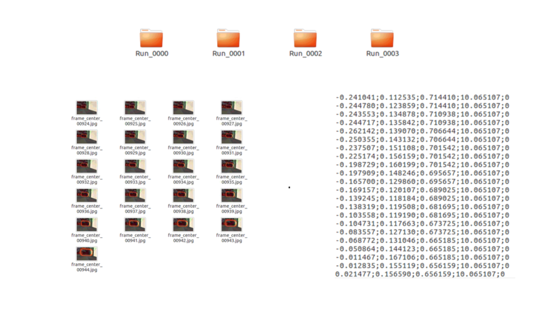

<font color="red">注意：如果收集数据失败时，要重新收集数据，如Run_0001文件夹中图片只有300张，这是明显的失败数据，终端也会有相应提示的输出的，这个点要注意，后面的实验也是一样的，要注意数据收集失败的情况。</font>

（4）修改模型保存位置，设定迭代次数

> 根据自己的需要，设定相应的值

`train_model.sh`,第一次只有4组图片数据，根据机器性能，设置个不用太久就能出结果的次数，默认为100

```sh
#!/bin/bash
......
python2.7 train.py --checkpoint_dir=模型保存路径 --f=0.5 --train_dir=$train_data --val_dir=$val_data --summary_freq=100 --batch_size=200 --max_epochs=最大迭代次数 --num_threads=6
```

（5）训练神经网络模型

> 在相应目录下，执行如下命令

```python
./train_model.sh
```

（6）设置测试时的飞行背景图

> 使用训练背景作为测试背景进行测试，因为目前只是属于算法验证，所以不采用未知背景进行测试

从训练背景图中，随机选择一张图拷贝到test_bkgs文件夹中，并且最好重新命名，命名后的图片在该文件夹中最好属于第一张图片，若test_bkgs文件中有多张图片，则每张图片都会作为测试背景进行测试的。

test_bkgs的完整目录为：`sim2real_drone_racing/drone_racing/drone_racing/resources/race_track/iros_materials/materials/textures/test_bkgs`

（7）设置最后一个checkpoint，作为测试时的网络模型（详情可见[上一篇](https://ldgcug.xyz/2020/06/07/%E4%BB%A3%E7%A0%81/Deep%20Learning/uzh%E6%97%A0%E4%BA%BA%E6%9C%BA%E7%AB%9E%E9%80%9F%E5%AE%9E%E9%AA%8C/)博客的2.7.2节）

（8）飞行测试

​		首先，启动net_controller的launch文件

```python
roslaunch deep_drone_racing_learning  net_controller_launch.launch
```

​		然后，启动test_launch的launch文件

```python
roslaunch test_racing test_racing.launch
```

（9）结果显示

> 在RVIZ界面中，可以看到AI飞手能按照全局轨迹飞行，并且能完美穿越前6个框

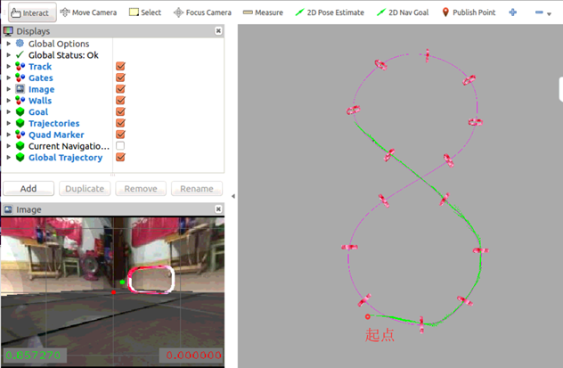

# 二、实验二

> **室内背景，门框形状和门框纹理不固定，收集训练数据**

​		原代码中设置了6种门框形状和10种门框纹理，也可以自己重新定义门框形状和纹理

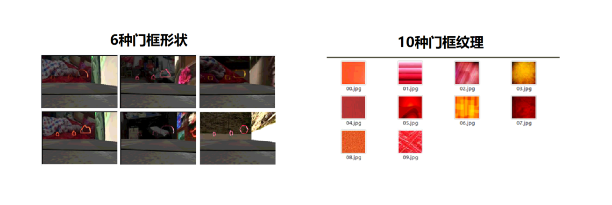

​		**门框形状**：在gate_shapes文件夹下，每个门框形状主要由dae文件和stl文件组成

​			gate_shapes完整目录为：`sim2real_drone_racing/drone_racing/drone_racing/resources/race_track/real_world/gate/meshes/gate_shapes`

​		**门框纹理：**在gate_bkgs文件夹下，其完整目录为：`sim2real_drone_racing/drone_racing/drone_racing/resources/race_track/iros_materials/materials/textures/gate_bkgs`

（1）将背景修改为真实场景下的训练背景

（2）设置无人机飞行时间，随机选择门框形状和门框纹理

> 经测试发现，飞行100s左右，无人机能完成一圈的飞行任务，根据机器性能考虑时间

​	`collect_data.py`，collect_data_in_fixed_env函数中设置

```python
time.sleep(100)#100s时间刚好飞完一圈
```

​	`collect_data.py`，mian函数，随机门框纹理和形状，并设置每张背景图保存的组数

```python
def main():
    ......
    #在相应文件夹下，添加了dimian.jpg，然后以该图片作为地面纹理
    train_goal_fname = '../race_track/iros_materials/materials/textures/dimian.jpg'
    num_loops = 15 #修改为15，每张背景，收集15组数据，总共收集60组数据
	......
    for _ in range(num_loops): #控制循环次数
        for i, bkg_img_fname in enumerate(all_images):
            # Copy new background
            os.system("cp {} {}".format(bkg_img_fname, texture_goal_fname))
            # Copy new asphalt
            # os.system("cp {} {}".format(all_images[-(i+1)], asphalt_goal_fname))
            os.system("cp {} {}".format(train_goal_fname, asphalt_goal_fname))#固定地面纹理，之前是随机替换的
            # Copy new gate background
            os.system("cp {} {}".format(all_gates_materials[i%9], bkg_goal_fname)) # 门框纹理，根据i确定
            # Copy new gate shape
            gate_number = np.random.choice(num_gates)#随机选择门框形状
            ......
```

​		在实际收集过程中，15*4=60组数据中，会有相当一部分数据是失败的，因此最好将num_loops的数值设大一点，这样即使某些数据失败，由于数据量较多，可以将后面的正确数据替换掉失败数据。总之，保证60组数据都是成功且正确的数据即可，并且保证每张背景图都有15组数据，这个要注意。

（3）运行py程序，收集数据

> 总共收集了60组数据，每张背景，15组数据，其门框形状随机选择，纹理（只用到了前4个纹理），由i确定的

```python
python collect_data.py
```

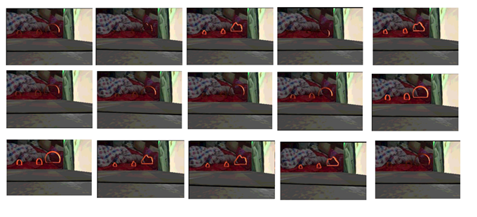

（4）修改模型保存位置，设定迭代次数

（5）接着实验一的模型继续进行训练，参照[上一篇](https://ldgcug.xyz/2020/06/07/%E4%BB%A3%E7%A0%81/Deep%20Learning/uzh%E6%97%A0%E4%BA%BA%E6%9C%BA%E7%AB%9E%E9%80%9F%E5%AE%9E%E9%AA%8C/#more)博客的2.7.1节

（6）训练神经网络模型

```python
./train_model.sh
```

（7）设置测试时的飞行背景图

> 可以进行4种测试：
>
> - 训练背景、训练门框
> - 训练背景、测试门框
> - 测试背景、训练门框
> - 测试背景、测试门框

- 训练背景、训练门框

  > 将训练背景（4张）中的任意一张拷贝到test_bkgs文件夹中

- 训练背景、测试门框

  > 将训练背景（4张）中的任意一张拷贝到test_bkgs文件夹中，同时，要修改相关文件，使用测试门框进行测试

  在启动test.launch文件后，实际是通过读取meshs文件中的dae文件和stl文件，来决定使用哪一个门框形状，其完整目录为

  `sim2real_drone_racing/drone_racing/drone_racing/resources/race_track/real_world/gate/meshes`

  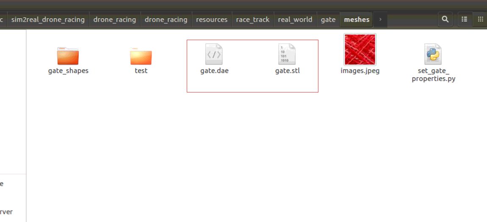

  因此，想要使用六边形门框（测试门框）作为测试时的门框形状，需要将gate_shapes文件夹下的polygon_gate.dae和polygon_gate.stl文件拷贝到meshs文件夹下，并将其重新命名为gate.dae和gate.stl文件，原先的文件可以删除。

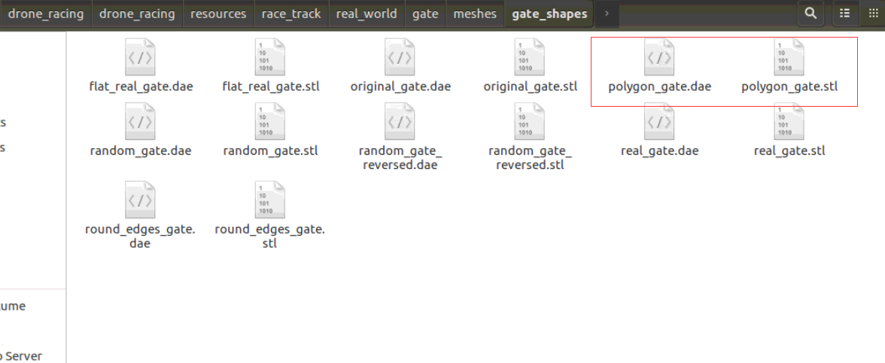

- 测试背景、训练门框

  > 将新的未知背景拷贝到test_bkgs文件夹中，并且重新命名，命名后的排序应该排在首位
  >
  > 同样的，重新从gate_shapes文件中拷贝其他的dae和stl文件至meshs文件夹下，并重新命名

- 测试背景、测试门框

  > 将新的未知背景拷贝到test_bkgs文件夹中，并且重新命名，命名后的排序应该排在首位
  >
  > 同样的，重新从gate_shapes文件中拷贝polygon_gate的dae和stl文件至meshs文件夹下，并重新命名

（8）设置训练中的最后一个checkpoint，作为测试时的网络模型（详情可见[上一篇](https://ldgcug.xyz/2020/06/07/%E4%BB%A3%E7%A0%81/Deep%20Learning/uzh%E6%97%A0%E4%BA%BA%E6%9C%BA%E7%AB%9E%E9%80%9F%E5%AE%9E%E9%AA%8C/)博客的2.7.2节）

（9）飞行测试

​		首先，启动net_controller的launch文件

```python
roslaunch deep_drone_racing_learning  net_controller_launch.launch
```

​		然后，启动test_launch的launch文件

```python
roslaunch test_racing test_racing.launch
```

（10）结果显示

> 在RVIZ界面中，可以看到AI飞手能按照全局轨迹飞行，并且能完美穿越一圈
>
> 因为测试背景，测试门框的效果不好，也就没有在这里显示

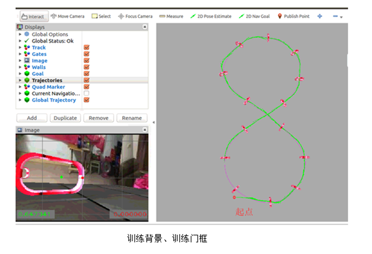

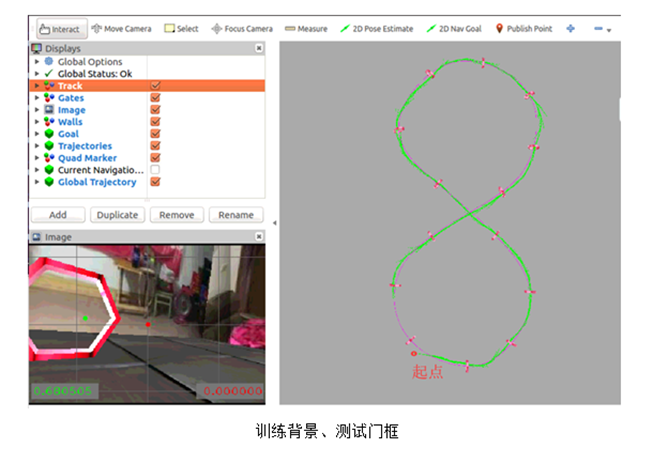

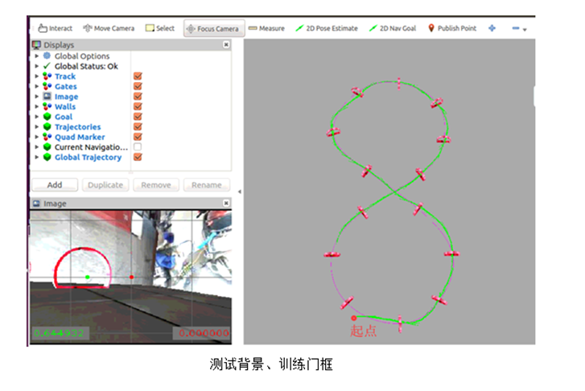

​	其定量分析如下：

|              | 训练背景、训练门框 | 测试背景、训练门框 | 训练背景、测试门框 | 测试背景、测试门框 |
| ------------ | ------------------ | ------------------ | ------------------ | ------------------ |
| 成功率       | 100%               | 100%               | 80%                | 0%                 |
| Passed Gates | 30 + 30+30+30+30   | 30+30 +30 +30+ 30  | 8+30 + 30 + 30+ 30 | 7+11+11+3+11       |

# 三、实验三

> 室内背景，门框形状和纹理不固定，收集多组静态数据组成动态数据

​		实验二提升了神经网络的鲁棒性，增加了门框形状和纹理的种类

​		实验三主要是为了实现动态（移动门框）情境下的穿越任务

（1）将背景修改为真实场景下的训练背景

（2）设置无人机飞行时间（100s），随机选择门框形状和门框纹理

（3）运行py程序，收集数据

​		实验二可以看做是一次静态数据，因此再添加两次静态数据即可。

- 修改门框的x坐标，整体在初始值上向左平移1m（2.7-1 = 1.7m）

  > （1）将每个门框的x坐标整体向左平移1m，其他坐标值及朝向不变（参考[上一篇](https://ldgcug.xyz/2020/06/07/%E4%BB%A3%E7%A0%81/Deep%20Learning/uzh%E6%97%A0%E4%BA%BA%E6%9C%BA%E7%AB%9E%E9%80%9F%E5%AE%9E%E9%AA%8C/#more)博客中的2.6节）
  >
  > （2）重新生成全局轨迹
  >
  > （3）运行代码，收集数据
  >
  > ```python
  > python collect_data.py
  > ```

- 修改门框的x坐标，整体在初始值上向右平移1m（2.7+1=3.7m）

  > （1）将每个门框的x坐标整体向右平移1m，其他坐标值及朝向不变（参考[上一篇](https://ldgcug.xyz/2020/06/07/%E4%BB%A3%E7%A0%81/Deep%20Learning/uzh%E6%97%A0%E4%BA%BA%E6%9C%BA%E7%AB%9E%E9%80%9F%E5%AE%9E%E9%AA%8C/#more)博客中的2.6节）
  >
  > （2）重新生成全局轨迹
  >
  > （3）运行代码，收集数据
  >
  > ```python
  > python collect_data.py
  > ```

（4）修改模型保存位置，设定迭代次数

（5）接着实验二的模型继续进行训练，参照[上一篇](https://ldgcug.xyz/2020/06/07/%E4%BB%A3%E7%A0%81/Deep%20Learning/uzh%E6%97%A0%E4%BA%BA%E6%9C%BA%E7%AB%9E%E9%80%9F%E5%AE%9E%E9%AA%8C/#more)博客的2.7.1节

（6）训练神经网络模型

```python
./train_model.sh
```

（7）设置测试时的飞行背景图

> 以训练背景作为测试背景，不考虑新背景下的测试

（8）设置训练中的最后一个checkpoint，作为测试时的网络模型（详情可见[上一篇](https://ldgcug.xyz/2020/06/07/%E4%BB%A3%E7%A0%81/Deep%20Learning/uzh%E6%97%A0%E4%BA%BA%E6%9C%BA%E7%AB%9E%E9%80%9F%E5%AE%9E%E9%AA%8C/)博客的2.7.2节）

（9）修改设置，让门框进行移动（详情可见[上一篇](https://ldgcug.xyz/2020/06/07/%E4%BB%A3%E7%A0%81/Deep%20Learning/uzh%E6%97%A0%E4%BA%BA%E6%9C%BA%E7%AB%9E%E9%80%9F%E5%AE%9E%E9%AA%8C/#more)博客的2.9节）

> 门框移动速度设置0.3，振幅设为1.5

（10）飞行测试

​		首先，启动net_controller的launch文件

```python
roslaunch deep_drone_racing_learning  net_controller_launch.launch
```

​		然后，启动test_launch的launch文件

```python
roslaunch test_racing test_racing.launch
```

（11）结果显示

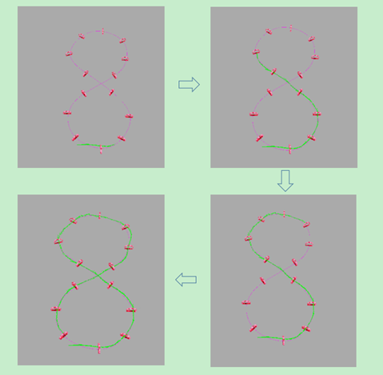

定量分析如下：

| 门框移动速度 | gates_dyn_amplitude | 动态场景飞行任务完成情况 | 成功率 |
| ------------ | ------------------- | ------------------------ | ------ |
| 1.0m/s       | 0.1m/s              | 14/14                    | 100%   |
| 1.0m/s       | 0.2m/s              | 14/14                    | 100%   |
| 1.0m/s       | 0.3m/s              | 14/14                    | 100%   |
| 1.0m/s       | 0.4m/s              | 1/14                     | 0%     |
| 0.1m/s       | 0.4m/s              | 1/14                     | 0%     |
| 1.5m/s       | 0.3m/s              | 14/14                    | 100%   |
| 1.8m/s       | 0.3m/s              | 14/14                    | 80%    |

# 四、实验四

> 和实验二基本一样，不同的是将室内背景修改为室外背景

结果展示：

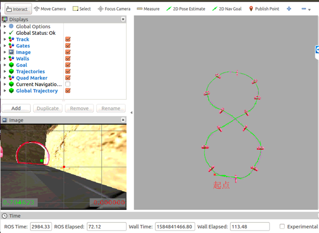

# 五、定量分析

> 前面都是在定性说明，添加了一些定量分析

| 无人机初始位置 | Passed Gates   | 成功率 |
| -------------- | -------------- | ------ |
| x=0            | 30+30+30+30+30 | 100%   |
| x=0.5          | 30+30+30+30+30 | 100%   |
| x=1.0          | 30+30+30+30+30 | 100%   |
| x=1.5          | 1+1+1+1+1      | 0%     |
| x=-0.5         | 30+20+21+30+30 | 100%   |
| x=-1.0         | 30+30+30+30+30 | 100%   |
| x=-1.5         | 30+30+30+30+30 | 100%   |
| x=-2.0         | 30+30+30+30+30 | 100%   |
| x=-2.5         | 30+30+30+30+30 | 100%   |
| x=-3.0         | 30+30+30+30+30 | 100%   |
| x=-3.5         | 30+20+30+30+30 | 100%   |
| x=-4.0         | 30+20+30+30+30 | 100%   |
| x=-4.5         | 7+30+30+30+30  | 80%    |
| x=-5.0         | 30+30+30+7+30  | 80%    |
| x=-5.5         | 30+30+7+30+21  | 80%    |
| x=-6.0         | 30+30+30+30+30 | 80%    |
| x=-6.5         | 1+1+1+1+1      | 0%     |

| 无人机初始角度                                               | Passed Gates   | 成功率 |
| ------------------------------------------------------------ | -------------- | ------ |
| w=1.0                                                        | 30+30+30+30+30 | 100%   |
| w=0.707                                                      | 30+30+30+30+30 | 100%   |
| w=1.3                                                        | 1+1+1+2+1      | 0%     |
| w=1.2                                                        | 30+30+30+30+30 | 100%   |
| w=0.5                                                        | 30+30+30+30+30 | 100%   |
| w=0.3                                                        | 30+30+30+30+30 | 100%   |
| w=0.1前两个框没有穿过，从第三个框还是，第三次中间飞行漏掉了一个框 | 30+30+30+30+0  | 0%     |

# 总结

> 所做的实验基本就是这些，做的都是一些比较简单的实验，但由于训练的模型过于多，找不到合适的了，因此也就不再这里添加checkpoint，这篇博客，也只是大概记录下实验流程，如果还要了解的清楚一点的，还是得结合PPT去看。
>
> 其相关的checkpoint模型，点击[这里](https://github.com/ldgcug/drone_racing)，进行下载，其模型不一定准确，因为训练过的模型确实太多，建议将其中的背景图和网络模型进行测试，看看效果，还是重新训练模型较好。
>
> 最后，说明一点，如果需要在一台机器上同时进行网络训练和数据收集操作，建议最好重新创建文件夹，在不同的文件夹下进行操作。

