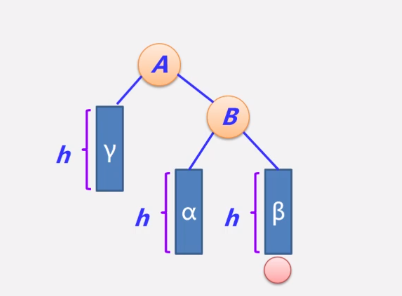

# 树

## 1、为什么需要树？

> 结合了两种数据结构的有点：（1）有序数组（2）链表
>
> 有序数组查找速度快，链表插入和删除速度快

## 2、有序数组中插入数据项为什么慢？

> 首先，要查找到新数据项待插入的位置
>
> 其次，比新数据项大的数据项全部后移，需要进行多次移动，导致很费时

### 2.1、有序数组的插入

> 插入：平均要移动数组中一半的数据项（N/2次移动），删除数据项也需要多次移动，非常耗时

## 3、链表中查找太慢？

> 链表的插入和删除都很快，因为只需要改变引用值就可以了，时间复杂度为O(1)
>
> 但查找，必须从头开始，依次访问链表中的每一个数据项，直到找到该数据为止。
>
> 查找：平均要访问N/2个数据项，把每个数据项的值和要查找的数据项作比较，这个很慢。

# 数据存储结构

> 常见的数据存储方式有两种：（1）顺序存储（数组）（2）非顺序存储（链表）

## 1、有序数组

> 当我们平常在一组相关类型的变量集合中进行查询搜索时，通常使用有序数组的存储方式，因为时间复杂度从O(n)降低为O(log n)，因此查询速度快
>
> 但是在进行相关的增删时，为了保证有序性，可能要进行大量的移动，因此比较耗时

## 2、链表

> 但我们的内存空间并不一定都是连续的，因此就有了另一种存储方式：**链表存储**
>
> 利用链表存储，就能有效的将这些零散的碎片空间存储下来，因为链表中有一块区域是存储的指向下一个数据的指针，因此链表在插入和删除时，比较容易，只需要改变指针指向的位置即可。
>
> 但是在进行查询时，必须要从头一个个向后找，比较耗时。

## 3、二叉查找树（BST）

> 针对有序数组和链表的优点，又引出了一种树形存储结构（二叉查找树），结合了有序数组和链表的优点：
>
> 使得，在树中查找数据时，其速度和在有序数组中查找一样快；
>
> 在插入数据和删除数据时，和在链表中一样快

> 可点击[二叉查找树在线演示](https://www.cs.usfca.edu/~galles/visualization/)，进行实战演示，在比较理想的情况下，二叉查找树可能如下图所示
>
> 从下图中也可以看出，二叉查找树的特点：左子树的节点值比父节点小，右子树的节点值比父节点大。

## 4、平衡二叉树

> 由于二叉查找树的特点，当我们输入的是一组有序序列时，二叉查找树又会退化成链表结构，其时间复杂度又变成O(n)。

> 为了解决这个问题，就引入了平衡二叉树的概念。
>
> 平衡二叉树(balanced binary tree)的定义：
>
> - 又称为AVL树（Adelson-Velskii and Labdis）
> - 一颗平衡二叉树或者是空树，或者是具有下列性质的**二叉排序树**：
>
> （1）**左**子树与**右**子树的**高度之差**的绝对值**小于等于1**
>
> （2）**左**子树和**右**子树也是**平衡**二叉排序树
>
> 这样，在二叉查找树的插入过程中，通过左旋和右旋等操作就能解决二叉查找树的缺点。使得对于有n个节点的平衡树，其最坏的时间查找复杂度也为O(log n)
>
> 可点击[平衡二叉树在线练习](https://www.cs.usfca.edu/~galles/visualization/AVLtree.html)，进行实战演示

### 4.1 如何判断二叉树是否为平衡二叉树？

> 为了方便起见，给每个结点附加一个数字，给出**该结点左子树与右子树的高度差**，这个数字称为结点的**平衡因子**（BF）。
>
> ​					**平衡因子   =   结点左子树的高度  -  结点右子树的高度**
>
> 根据平衡二叉树的定义，平衡二叉树上所有结点的平衡因子只能是**-1**、**0**或者**1**

### 4.2 失衡二叉树

> 在二叉查找树的插入和删除过程中，往往会导致二叉树的失衡，且可能存在多个失衡结点，此时：
>
> ​	当不止一个失衡结点时，失衡结点取最小失衡子树的根结点，如下图中的7和16都为失衡结点，但16的子树结点个数更少，因此选择16作为失衡结点。

> 失衡时，往往会出现如下四种情况，这四种情况也可以称为失衡二叉树

#### 4.2.1 LL型的调整过程

> 以下图为例，**C**表示要插入的新结点，当插入**C**之后，可能会导致**A**失衡，此时**A**称为失衡结点。
>
> 根据二叉排序树的特性，左子树小于根节点小于右子树，可以得出如下信息：
>
> 调整前：**C  < B  < A**，但**A**为根结点（失衡结点）
>
> 调整后：**C  < B  < A**，**B**为根结点，才能保证该树平衡

> 调整过程：
>
> 调整前，下图所示，在**α**后面新增一个结点，满足LL型的插入

> 调整后，如图所示，手写一遍，就明白了，一定要手写，加强理解

#### 4.2.2 RR型的调整过程

> 调整前：**A  < B  < C**，但**A**为根结点（失衡结点）
>
> 调整后：**A  < B  < C**，**B**为根结点，才能保证该树平衡

> 调整前：在**β**后面新加入一个结点，满足RR型

> 调整后：

#### 4.2.3 LR型的调整过程

> 调整前：**B  < C  < A**，但**A**为根结点（失衡结点）
>
> 调整后：**B  < C  < A**，**C**为根结点，才能保证该树平衡

> 调整前：在**β**后面新增一个结点，导致**A**失衡。
>
> 假设**γ**和**β**的高度都为**h**，则**α**和**C**同高度，就都为**h+1**，因此**δ**的高度为**h+1**（因为A的平衡因子为1，左子树要比右子树的高度大1，而**B**的高度为**h+2**，所以**δ**的高度为**h+1**）

> 调整后：

#### 4.2.4 RL型的调整过程

> 调整前：**C  < B  < A**，但**A**为根结点（失衡结点）
>
> 调整后：**C  < B  < A**，**B**为根结点，才能保证该树平衡

> 调整前：

> 调整后，可参考4.2.3小节来模拟（明白LR就可以明白RL了）

### 4.3 平衡二叉树的删除

> 后续在学习

## 5、2-3树

> 因为平衡二叉树要求每个节点的左子树和右子树的高度差不超过1，这个要求实在太严格，导致每次进行插入/删除节点的时候，几乎都会破坏平衡二叉树的第二个规则，因此总是需要左旋和右旋来调整，使之再次成为一颗符合要求的平衡树。
>
> 如果在那种插入、删除很频繁的场景中，平衡树需要频繁的进行调整，会使得平衡树的性能大打折扣；
>
> 那么有没有绝对平衡的一种树呢？没有高度差也不会有平衡因子，没有平衡因子也就不会调整旋转等操作。
>
> 为了解决这个问题，就有了2-3树。2-3树正是一种绝对平衡的树，任意结点到它所有叶子节点的深度都是相等的。

### 5.2.1 2-3树的性质

> 2-3树是一种**多路查找树**，2和3的意思就是2-3树包含两种特点：
>
> （1）**2节点**：包含一个元素（数据域）和两条链接（指针域）
>
> ​				2节点要么有两个孩子，要么没有孩子，不允许只有一个孩子
>
> （2）**3节点**：包含一大一小两个元素（数据域）和三个链接（指针域）（两个元素按大小顺序排序好）
>
> ​				3节点要么有三个孩子，要么就没有孩子，不允许有一个或两个孩子
>
> （3）2-3树所有叶子节点都在同一层次
>
> （4）**插入结点时不能将该节点插入到一个空节点上，新的结点只能通过分裂或者融合产生**
>
> （5）当2-3树只有2节点的时候，其只能是一颗满二叉树（完美二叉树）

### 5.2.2 满二叉树介绍

> 一个二叉树，如果每一个层的节点数都达到最大值，则这个二叉树就是满二叉树

### 5.2.3 完全二叉树介绍

>假设二叉树的深度为h，除第h层外，其他各层（1~h-1）的结点数都达到最大个数，第h层所有的节点都连续集中在最左边，这就是完全二叉树。

### 5.2.4 2-3树的插入

> 插入过程：
>
> 如上图所示，依次插入（1,2,3,4,5）五个元素
>
> （1）插入元素1：创建一个**2节点**（元素为1）
>
> （2）插入元素2：其1,2元素融合暂时形成一个**3节点**，
>
> ​		为什么2元素不能生成一个节点作为1元素所在节点的右孩子？
>
> ​		因为插入结点时不能将该节点插入到一个空节点上，新的结点只能通过分裂或者融合产生。
>
> （3）插入元素3：其1,2,3元素暂时融合形成一个**4节点**
>
> ​		开始分裂，因为这是一颗2-3树，不存在4节点，所以暂时形成的4节点要开始分裂，将中间的元素作为根节点，左右两个元素各位其左右孩子节点，形成一颗满二叉树
>
> （4）插入元素4：根据元素大小，与元素3形成一个**3节点**（新节点不能插入到一个空节点）
>
> （5）插入元素5：根据元素大小，插入到3,4所在的3节点上，暂时形成一个4**节点**
>
> ​		开始分裂，3,4,5开始分裂为：4为根节点，3,5各自作为4的左右孩子
>
> ​		开始融合，根据2-3树的特点：所有叶子节点都在同一层或2-3树只有2节点时，只能是一颗满二叉树的性质，所以2-3树要向上融合满足2-3树的性质，因此将4元素向上融合，与元素2组成一个**3节点**

> 继续插入6,7元素，根据分裂和融合，可以形成最终的上图所在的满二叉树

## 6、红黑树

> 由于将2-3树这种直白的表述写成代码实现起来并不方便，因为需要处理的情况太多，需要维护两种不同类型的节点，将链接和其他信息从一个节点复制到另一个结点，将结点从一种类型转换为另一种类型等等。
>
> 因此，红黑树出现了，红黑树背后的逻辑就是2-3树的逻辑。

### 6.1 红黑树的定义

> （1）红黑树具备二分搜索树的所有性质
>
> （2）红黑树的根节点是黑色的
>
> （3）红黑树的每个节点是红色的，或者是黑色的
>
> ​			**红色表示2-3树中的3节点中的左值**
>
> （4）如果一个节点是红色的，那么它的孩子都是黑色的
>
> （5）每个叶子节点（红黑树中叶子节点为最后的空节点）是黑色的
>
> （6）从任意一个节点到叶子节点经过的黑色节点时一样的

> 红黑树的示意图如下，其叶子节点为NIL的节点，并非其中的10、50、140等等

### 6.2 左倾红黑树与2-3树的等价性

> 红黑树的另一种定义：
>
> （1）**红链接均为左链接**
>
> ​			**红色表示2-3树中的3节点中的左值**
>
> （2）没有任何一个节点同时和两条红链接相连
>
> ​			在2-3树中，不存在永久的4节点，4节点终究要分解，因此2-3树中没有任何一个节点能同时和两条红链接相连
>
> （3）该树是完美黑色平衡的，即任意空链接到根节点的路径上的黑链接数量相同（和2-3树是等价的，任意节点到其叶子节点的高度是相同的）
>
> ​			2-3树是完美平衡的，将3节点转成二叉树只增加了左红链接，其他黑色链接没有什么变化，依然是黑色平衡的。

> 2-3树与红黑树的关系比较
>
> （1）2-3树中的2节点**[a]**转换为红黑树的黑色结点**[a]**
>
> （2）2-3树中的3节点**[b,c]**可以转换为红黑色中的[b,c]，其红黑树中，**c**为黑色节点，b为红色节点。
>
> ​		因为  b < c ,所以b作为c的左孩子下移，使用红色边表示b和c存在并列关系，表示在2-3树中b与c保存在一个3节点中；
>
> ​		在实际代码中，没有必要定义一个边的类，由于节点b和红色边是一一对应关系，**所以可以将节点b标记为红色，表示节点与其唯一的父节点是并列关系。**

> 如上图所示，把这种2-3树转换后，节点分为红黑节点的树称为红黑树。根绝红黑树的转换过程，可以知道**红色节点都是左倾斜的**，这不是推导出来的，而是定义出来的。

### 6.3 2-3树到红黑树的转换规则

> 2-3树有两类节点：2节点和3节点，还有一个临时的4节点

> 2节点：
>
> （1）2-3树：生成一个2节点，存储元素1
>
> （2）红黑树：**对应于一个黑色节点**

> 3节点：
>
> （1）2-3树：生成一个3节点
>
> （2）按照左倾红黑树与2-3树的等价性，且2>1，因此2为黑色根节点，1为红色子节点
>
> ​			对应于红黑树黑色的父节点和红色的左孩子节点

> 临时4节点：
>
> （1）2-3树：生成一个临时4节点，进行分裂
>
> （2）对应于红黑树红色父节点和黑色的左右孩子节点
>
> ​			为什么父节点是红色而不是黑色？是为了符合红黑树中插入任何一个节点默认都是红色的实现方式
>
> ​			如果该父节点是根节点，那么它肯定需要变色这一点就不属于2-3树向红黑树得的变换规则了，而属于红黑树的性质

### 6.4 红黑树的旋转、变色和颜色反转

> 分别向2-3树和红黑树中依次插入（1,2,3）三个元素来看旋转、变色和颜色反转的过程
>
> 红黑树的一个性质：**根节点必须为黑色的**。
>
> 一个实现红黑树的规则：**新插入的节点永远为红色**

> 如上图所示，插入元素1
>
> 2-3树就是一个2节点，不需要做任何改变
>
> 根据红黑树添加的规则：新插入的节点为红色，所以1元素的节点为红色。根据红黑树的性质：根节点必须为黑色，所以1元素的节点需要进行变色。

> 插入元素2：
>
> （1）插入元素2，2-3树会形成一个3节点。
>
> （2）根据2-3树向红黑树的转换规则，需要变为2元素所在的节点为黑色的父节点，1元素所在的节点为红色，并为2元素的左孩子节点。
>
> ​		左旋：根据二分搜索树的性质，插入的2元素会成为1元素的右孩子，这时需要我们对1元素进行左旋转，然后得到如上左旋转后的结果。
>
> ​		变色：再将2元素换为1元素的颜色，然后将1元素变为红色。
>
> ​		为什么这样变色？首先为向上兼容，该字数的根节点需要始终保持原来的颜色，即新的根节点2换成原来的根节点的颜色。其次，根据2-3树中3节点的左值均为红色，需要将1节点的颜色变为红色。

> 插入元素3：
>
> （1）2-3树：生成临时4节点，进行分裂
>
> （2）红黑树：新插入的节点都是红色的，所以，这时会形成一个根节点为2，左右孩子都是红色的节点
>
> ​		颜色反转：根据2-3树向红黑树变化的规则，并不满足。需要进行颜色反转，即将1,3元素变为黑色，2元素变为红色。
>
> ​			为什么这样进行颜色反转？因为在2-3树中，4节点分裂后要向上融合。
>
> ​		变色：这时2元素为根节点，根据红黑树的性质，需要进行变色即可。如果2元素不是根节点，需要向上融合，如6.3所示

#### 6.4.1 旋转

> 在插入或者删除操作中可能会出现右倾或者两条连续的红链接，在向上变换的过程中（恢复）都要调整为左倾。

##### 6.4.1.1 左旋转

> 假设有一条红色的右链接需要转为左链接，如下图所示：
>
> 这个操作叫做左旋转，右链接变成左链接，意味着被红链接指向的节点会变成红色，根节点默认是黑色

##### 6.4.1.2 右旋转

> 右旋转也一样，不过在左倾红黑树中，只有出现两条连续红色的左链接才会进行右旋转。

#### 6.4.2 颜色变换

> 颜色变化是用在临时4-节点上的，不管是向下变换还是向上变换。

### 总结

> 通过上面依次插入（1,2,3）的过程，我们总结一个规律：
>
> （1）右旋：当一个节点的左孩子节点和左孩子节点都是红色的时候，需要右旋
>
> （2）左旋：当一个节点的右孩子是红色节点并且左孩子不是红色，需要左旋
>
> （3）颜色反转：当一个节点的左右孩子节点都是红色的时候需要进行颜色反转

### 6.5 红黑树的删除

> 后续待学习

## 参考：

- [失衡二叉树](https://www.bilibili.com/video/av37955178)
- [2-3树参考1](https://www.jianshu.com/p/31f1708b7306)
- [2-3树参考2（重点参考）](https://www.cnblogs.com/hello-shf/p/11364565.html)
- [2-3树参考3](https://my.oschina.net/u/2862573/blog/3101893)
- [2-3树参考4（重点参考）](https://mp.weixin.qq.com/s/lm3WKiq2BvxRq8Ym03J-yw)