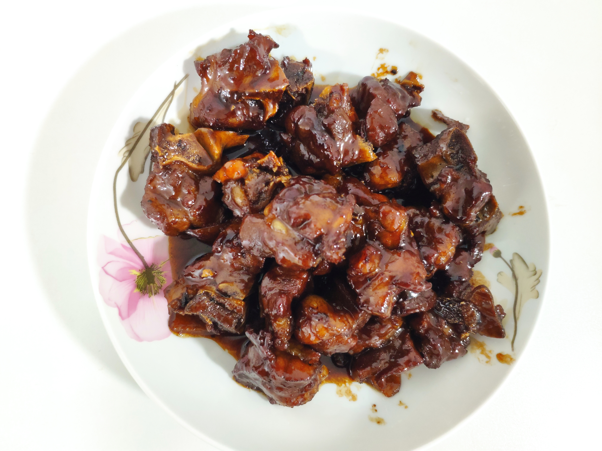
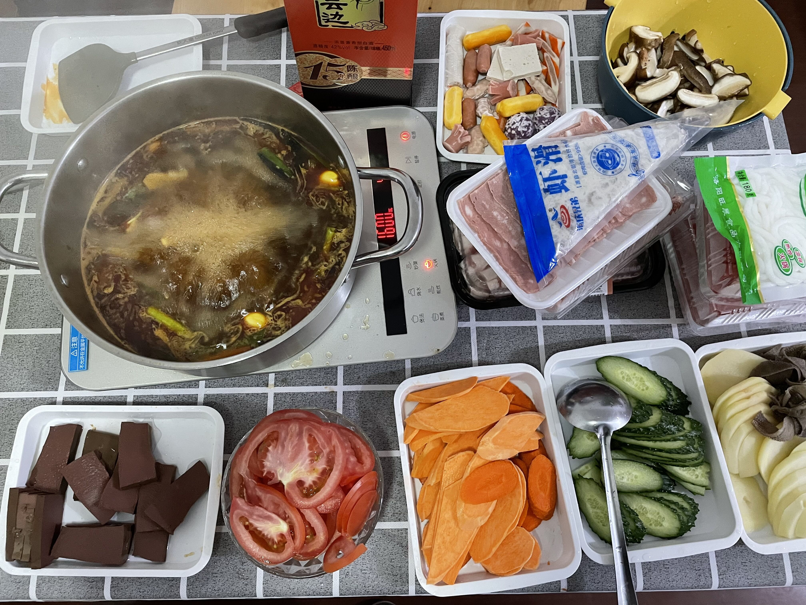

## 前言

> 好的厨艺都是慢慢从家常菜开始练起的......

## 菜品

> 红烧鲫鱼、番茄炒蛋、手撕包菜、猪耳朵、蒜苗炒肉

> 清炒豇豆、花生米

> 清蒸鲈鱼

> 糍粑，还是喜欢家里的绿豆馅

> 可乐鸡腿

> 前腿骨（第一次吃自己熬得汤，贼香）

> 家常的土豆炒肉和鲫鱼，这个时候就发现一个好的器皿显得格外的重要了

> 红烧鱼块，第一次做成功的，还是很有纪念意义的

> 早期做的鲈鱼，色香味看着还是差了一丢丢

> 可乐鸡翅，当时收汁没有收好，历历在目呀

> 青椒炒肉

> 滑藕片，现在回看起来，还是感觉差了一些些

> 第一次做的家常豆腐，第一豆腐没买好，第二做的确实也差，下次得把我张大厨的照片附上......

> 这就是我刚做饭的时候，经常做的千张炒肉、酸辣土豆丝，果然，厨艺还是得多做才行......

> 火锅配酒、天长地久

> 就是这一次熬得汤，最为nice，可惜的是当时还有两个骨头吃不下了，后来放了两天，没时间吃扔掉了。

> 这就是我孙大厨做的酸菜鱼，我也要能做出他这样才行。加油！！！

