## 前言

> 帮朋友搭建配置的，因为配置过程稍微有些复杂，因此还是做个笔记记录一下，说不定以后就会涉及相关的事情

## 一、Opencv下载

>  点击[官网](https://opencv.org/releases/)，下载Opencv，我这里下载的是4.1.0版本

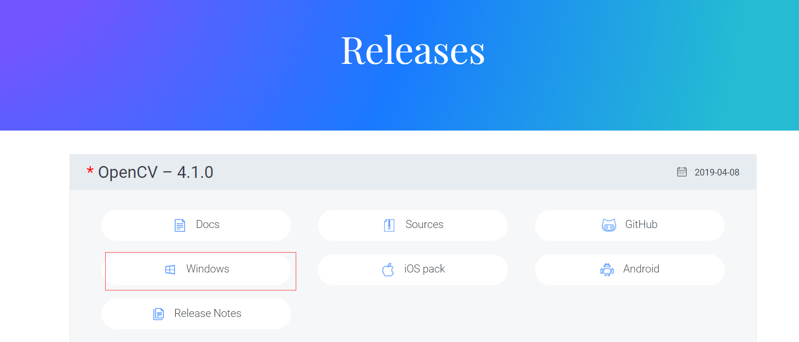

## 二、文件解压并解压到自定义路径位置

> 双击exe文件，进行解压，我解压放在D盘自定义的文件夹下

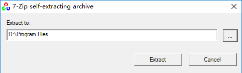

解压完成后，文件内容如下：

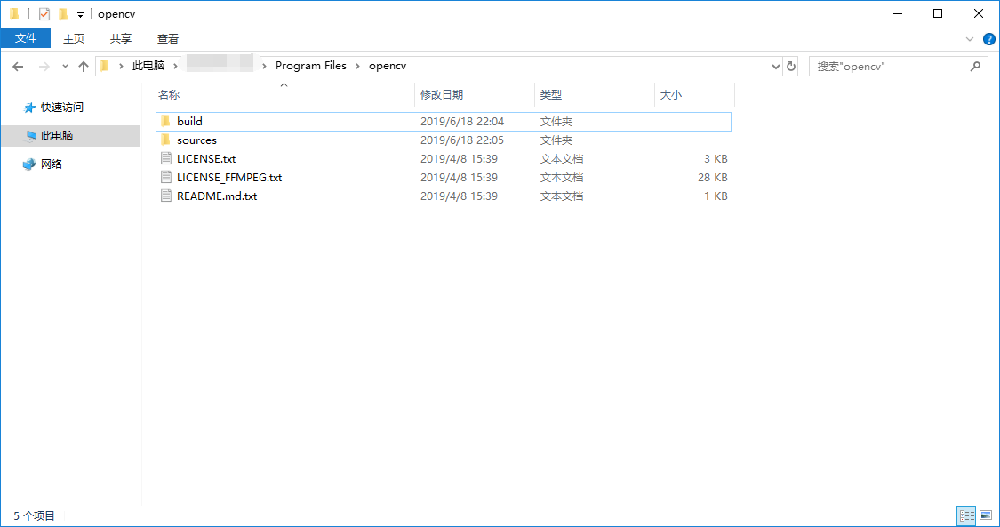

## 三、系统变量配置

> 我下面的界面显示是在Win10系统下，如果是Win7，某些界面会有所区别

右键`此电脑`，点击`属性`，在弹出的界面框中，点击`高级系统设置`，然后选择`环境变量`，最终出现如下界面

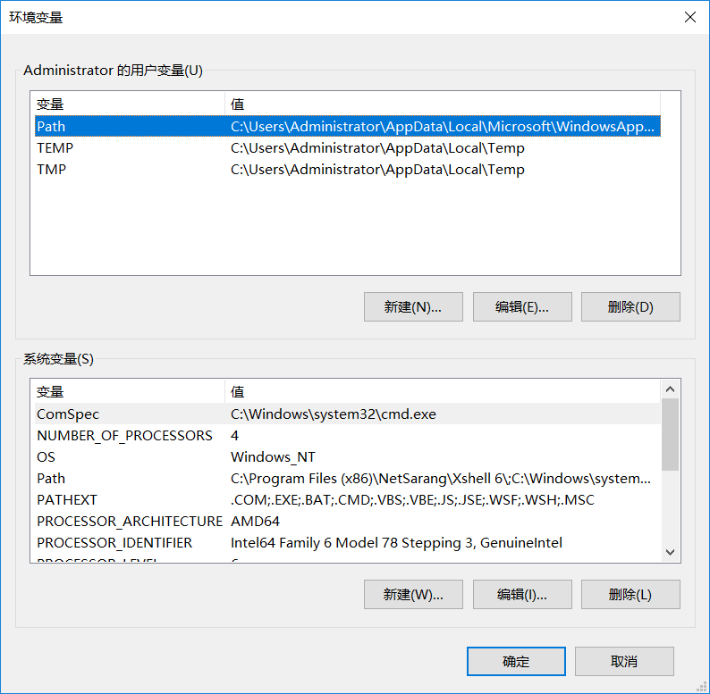

找到系统变量中的`Path`，点击`编辑`，添加opencv相应目录路径，如下图：

> 要添加的路径，就是opencv之前所解压的位置，具体到哪一级目录，看下图中的添加示例

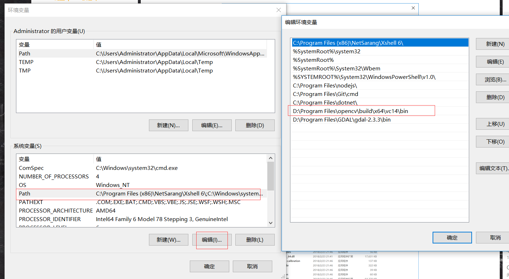

最后，在所有需要点击确定的地方，点击确定以保存

## 四、相关文件配置

> 将第三步添加的bin目录下的两个文件（`opencv_world410.dll、opencv_world410d.dll`）拷贝到`C:\Windows\SysWOW64`文件夹下

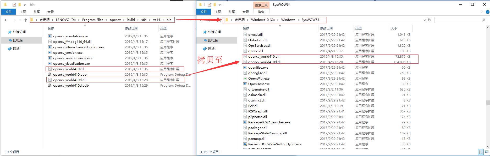

> 将bin目录下的`opencv_ffmpeg410_64.dll`拷贝到`C:\Windows\System32`文件夹下

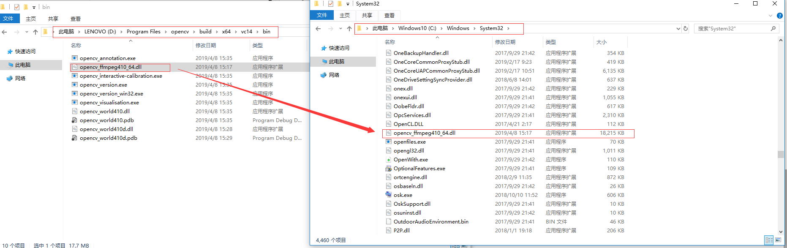

> 如果版本不一致，则添加对应的dll文件即可

## 五、VS2017配置

### 5.1 ，打开VS2017，新建一个c++空项目

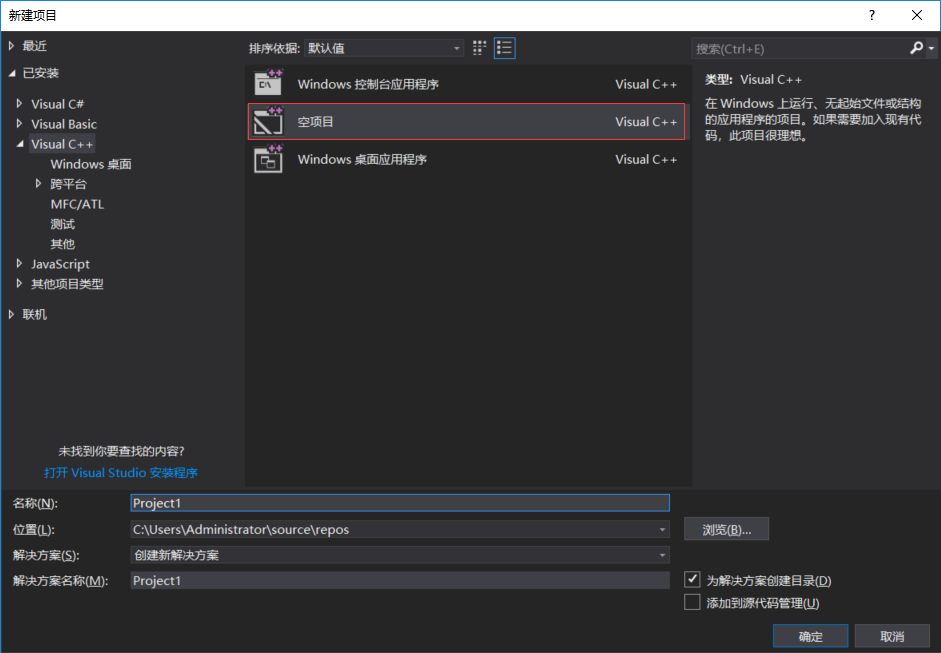

### 5.2 打开属性管理器

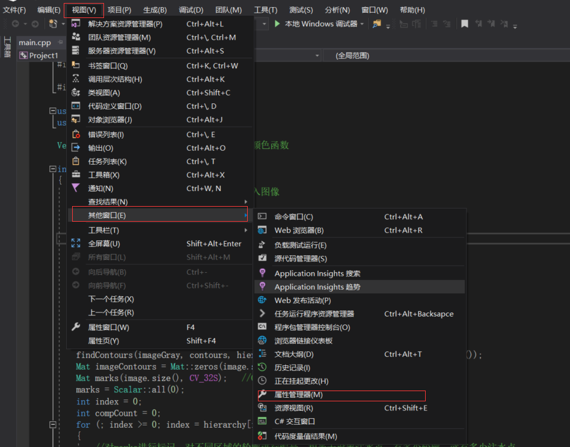

### 5.3 配置Debug|x64

找到`Debug|x64`，右键`Microsoft.CPP.x64.user`，点击`属性`

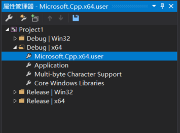

### 5.4 添加包含目录和库目录

> 添加包含目录

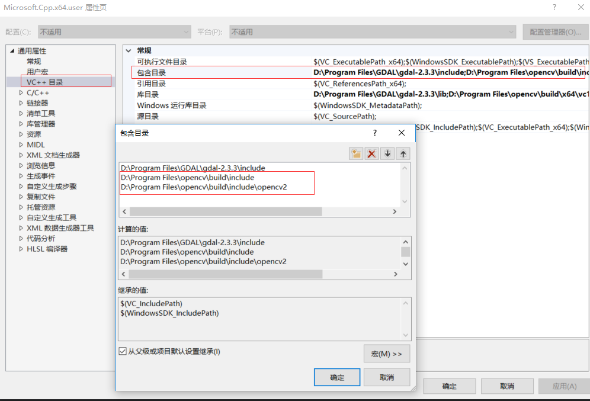

> 添加库目录

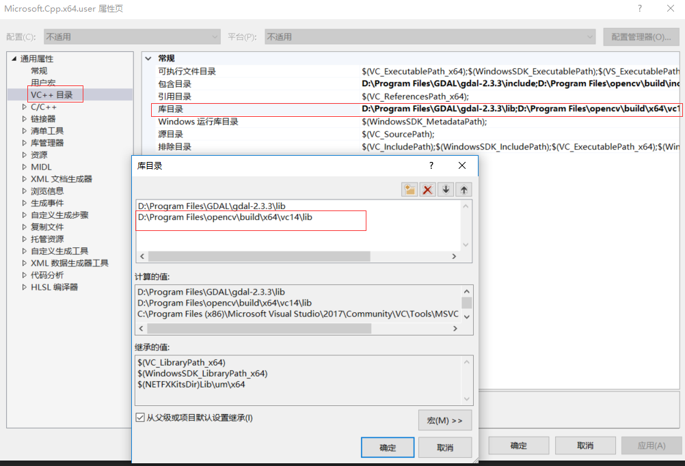

> 在所有需要点击确定的地方，点击确定以保存

### 5.5 添加附加依赖项

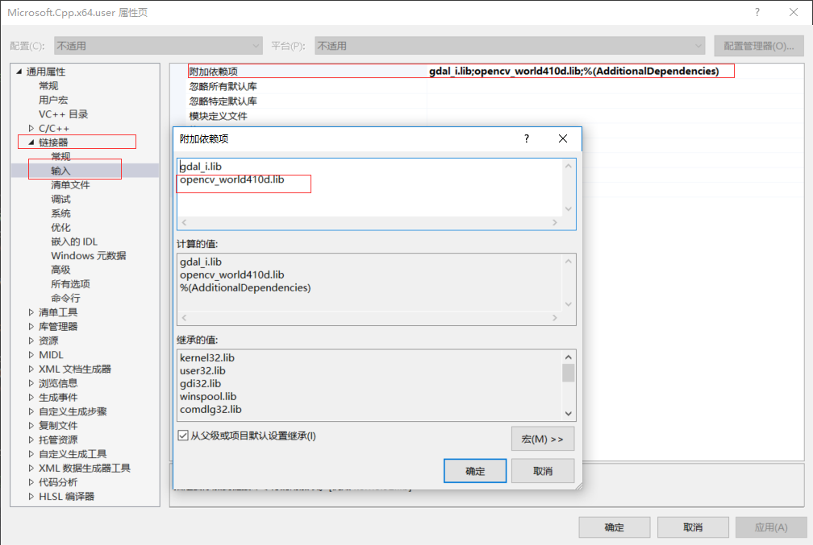

> 在所有需要点击确定的地方，点击确定以保存

### 5.6 解决方案配置

> 在解决方案这里，选择Debug、X64配置

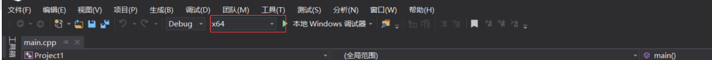

## 六、测试

### 6.1 打开Project1.sln

> 右键`源文件`，点击`添加`，选择`新建项`，创建main.cpp文件

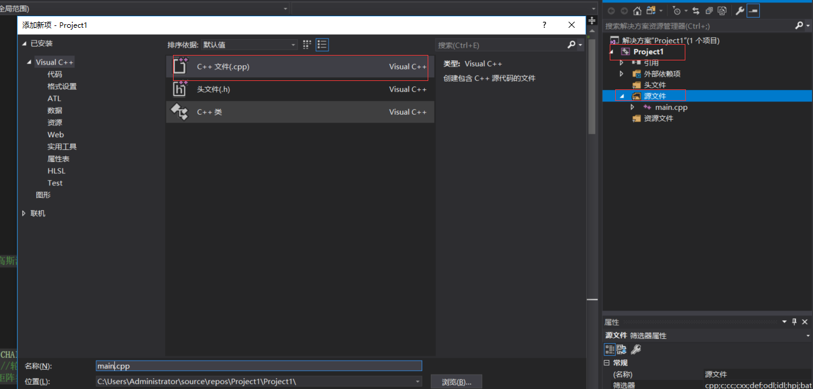

### 6.2 拷贝代码

> 将下面代码拷贝到main.cpp中，需要注意的是，载入图像这里要自己保存一张图片，并能够读取

```c++

#include <opencv2/core/core.hpp>
#include <opencv2/imgproc/imgproc.hpp>    
#include <opencv2/imgproc/types_c.h>
#include <opencv2/highgui/highgui.hpp>
#include <opencv2/highgui/highgui_c.h>

#include <iostream>

using namespace cv;
using namespace std;

Vec3b RandomColor(int value);  //生成随机颜色函数  

int main()
{
	Mat image = imread("20.jpg");    //载入图像  
	imshow("Source Image", image);

	//灰度化，滤波，Canny边缘检测  
	Mat imageGray;
	cvtColor(image, imageGray, CV_RGB2GRAY);//灰度转换  
	GaussianBlur(imageGray, imageGray, Size(5, 5), 2);   //高斯滤波  
	imshow("Gray Image", imageGray);
	Canny(imageGray, imageGray, 80, 150);
	imshow("Canny Image", imageGray);

	//查找轮廓  
	vector<vector<Point>> contours;
	vector<Vec4i> hierarchy;
	findContours(imageGray, contours, hierarchy, RETR_TREE, CHAIN_APPROX_SIMPLE, Point());
	Mat imageContours = Mat::zeros(image.size(), CV_8UC1);  //轮廓     
	Mat marks(image.size(), CV_32S);   //Opencv分水岭第二个矩阵参数  
	marks = Scalar::all(0);
	int index = 0;
	int compCount = 0;
	for (; index >= 0; index = hierarchy[index][0], compCount++)
	{
		//对marks进行标记，对不同区域的轮廓进行编号，相当于设置注水点，有多少轮廓，就有多少注水点  
		drawContours(marks, contours, index, Scalar::all(compCount + 1), 1, 8, hierarchy);
		drawContours(imageContours, contours, index, Scalar(255), 1, 8, hierarchy);
	}

	//我们来看一下传入的矩阵marks里是什么东西  
	Mat marksShows;
	convertScaleAbs(marks, marksShows);
	imshow("marksShow", marksShows);
	imshow("轮廓", imageContours);
	watershed(image, marks);

	//我们再来看一下分水岭算法之后的矩阵marks里是什么东西  
	Mat afterWatershed;
	convertScaleAbs(marks, afterWatershed);
	imshow("After Watershed", afterWatershed);

	//对每一个区域进行颜色填充  
	Mat PerspectiveImage = Mat::zeros(image.size(), CV_8UC3);
	for (int i = 0; i < marks.rows; i++)
	{
		for (int j = 0; j < marks.cols; j++)
		{
			int index = marks.at<int>(i, j);
			if (marks.at<int>(i, j) == -1)
			{
				PerspectiveImage.at<Vec3b>(i, j) = Vec3b(255, 255, 255);
			}
			else
			{
				PerspectiveImage.at<Vec3b>(i, j) = RandomColor(index);
			}
		}
	}
	imshow("After ColorFill", PerspectiveImage);

	//分割并填充颜色的结果跟原始图像融合  
	Mat wshed;
	addWeighted(image, 0.4, PerspectiveImage, 0.6, 0, wshed);
	imshow("AddWeighted Image", wshed);

	waitKey();
}

Vec3b RandomColor(int value)   //生成随机颜色函数
{
	value = value % 255;  //生成0~255的随机数  
	RNG rng;
	int aa = rng.uniform(0, value);
	int bb = rng.uniform(0, value);
	int cc = rng.uniform(0, value);
	return Vec3b(aa, bb, cc);
}

```

### 6.3 编译

> 确保下面编译成功才进行后续的操作，解决方案配置一定要设置为Debug x64

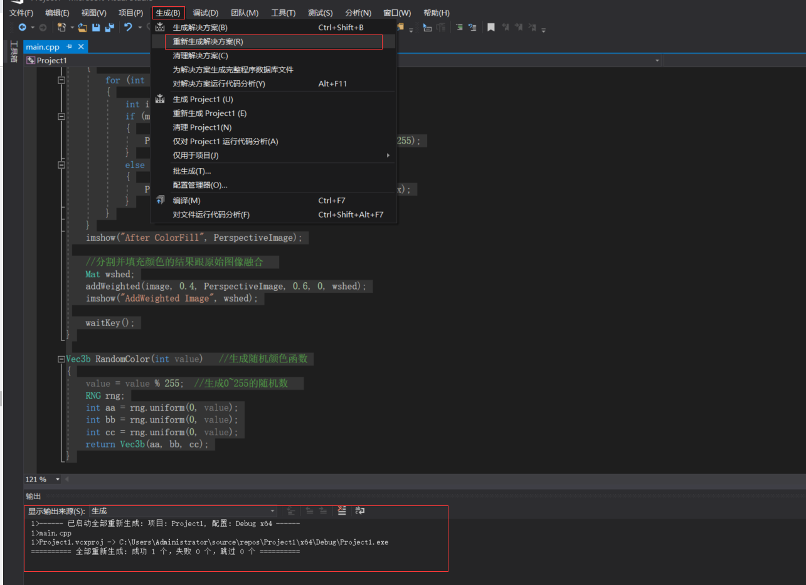

### 6.4 运行

> 按F5键运行，最终出现下图则全部配置完成

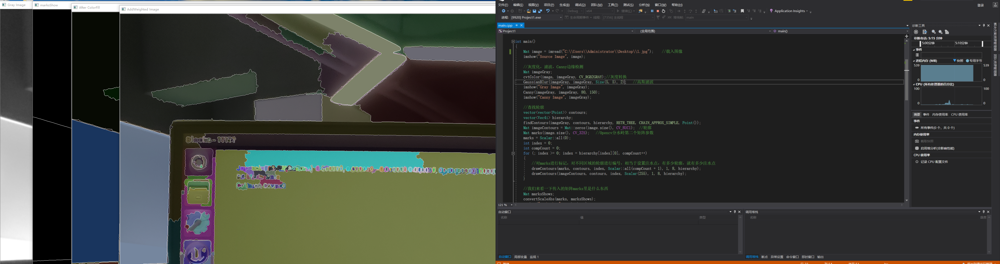

> 为了保证代码完整性，也就是在前面的代码中没有进行删除，否则可以删除部分代码，进行简单一点的测试

## 参考链接：

[csdn博客](https://blog.csdn.net/qq_41175905/article/details/80560429)

## 总结

通过上面的参考链接，没有遇到什么错误的完成了opencv在VS2017上面的配置，感谢别人的付出

