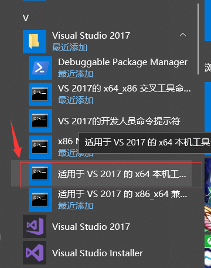

## 前言

> 暂时还不太清楚GDAL是用来干啥的，总之需要用，于是参照网上教程，在VS2017上配置了GDAL，后面再去了解这个的相关作用

## 一、GDAL下载

> 点击[官网](https://trac.osgeo.org/gdal/wiki/DownloadSource)，下载gdal，我这里下载的是2.3.3版本


## 二、文件解压并解压到特定路径

> 我这里是在D盘的Program Files文件夹下，创建了GDAL文件夹，也将解压文件存放在GDAL文件夹下


## 三、GDAL编译安装

### 3.1 修改源代码

> 找到解压地址 D:\Program Files\GDAL\gdal-2.3.3文件夹下的nmake.opt文件，打开，对文件进行修改，保存

> （1）修改第41行的代码为：`MSVC_VER=1910`


> （2）修改第57行的代码为：`GDAL_HOME = “D:\Program Files\GDAL\gdal-2.3.3”`
>
> 注意：这里的地址要根据自己的实际地址设置


> （3）修改第184行的代码为：`#WIN64=YES`
>
> 原来的可能中间有空格，原来可能是这样的`# WIN64=YES`


### 3.2 编译

> 首先，打开适用于VS2017的X64的本级工具命令提示



> 在该窗口，进入到gdal 2.3.3目录下

```
cd D:\Program Files\GDAL\gdal-2.3.3
```

> 然后执行下面代码进行编译

```
nmake /f makefile.vc MSVC_VER=1910 WIN64=yes
```

> 说明：在编译过程中，比较耗时，但是编译过程没有问题

### 3.3 安装GDAL

```
nmake /f makefile.vc install MSVC_VER=1910 WIN64=yes
nmake /f makefile.vc devinstall MSVC_VER=1910 WIN64=yes
```

## 四、VS2017配置GDAL

### 4.1 打开VS2017，新建一个C++空项目

### 4.2 点击   菜单栏->视图->其他窗口->属性管理器

### 4.3 找到  Debug|x64 ，右键 Microsoft.CPP.x64.user，点击属性

### 4.4 在Microsoft.CPP.x64.user属性页中，添加包含目录、库目录

> 添加包含目录


> 添加库目录


> 在所有需要点确定的地方，点击确定以保存

### 4.5 在Microsoft.CPP.x64.user属性页中，添加附加依赖项

> 手动输入：gdal_i.lib，最后记得确定保存


## 五、设置系统变量

> 右键`此电脑`，点击`属性`，在弹出的界面框中，点击`高级系统设置`，然后选择`环境变量`，最终出现如下界面


> 选择系统变量Path，点击编辑


> 保险起见，将电脑重启，确保环境变量生效

## 六、测试

### 6.1 新建main.cpp


### 6.2 拷贝代码

```c++
#include "gdal_priv.h"
#include<iostream>  
using namespace std;
int main()
{
	const char* pszFile;
	GDALAllRegister();
	pszFile = "C:\\Users\\Administrator\\Desktop\\1.jpg";
	GDALDataset *poDataset = (GDALDataset*)GDALOpen(pszFile, GA_ReadOnly);
	GDALRasterBand *poBand = poDataset->GetRasterBand(1);
	int xsize = poBand->GetXSize();
	int ysize = poBand->GetYSize();
	cout << xsize << endl;
	cout << ysize << endl;
	system("pause");

	return 0;
}

```

### 6.3 解决方案配置

> 这一步很重要


### 6.4  编译

> 菜单栏     生成->重新生成解决方案

### 6.5 运行

> 按F5键运行，此时报如下错误：gdal203.dll 等相关的错误

解决方法：

> 将D:\Program Files\GDAL\gdal-2.3.3目录下的gdal203.dll拷贝到C:\Windows\System32文件夹下


> 重新编译运行，成功输出图片大小，则配置成功，此时运行成功后的界面如下：


## 参考链接

- GDAL编译链接参考（前三步）：[csdn博客](https://blog.csdn.net/qq_29413829/article/details/84404677?tdsourcetag=s_pctim_aiomsg#1GDAL_2)
- GDAL在VS2017的配置参考（四五六步）：[csdn博客](https://blog.csdn.net/qq_32153213/article/details/81363588)
- gdal203.dll错误解决参考：[csdn博客](https://blog.csdn.net/Dragonzxc/article/details/80356883)

## 总结

> 相比于opencv，这个稍微复杂了一点，参照的文档多一些忙不过好在还是配置成功