## 前言

> 在windows上下载sublime，一个是为了编辑txt文本文件方便，另一个也能通过Sublime来运行python代码，而不用在cmd窗口或者pycharm上

## 一、Sublime Text3下载

>  Sublime Text3 下载，请点击[官网](https://www.sublimetext.com/3)

有一段时间，不能通过官网下载，每次一点下载的时候，就网页报错，目前还可以下载，当然也是打开了VPN的

## 二、Sublime配置运行python程序

### 2.1 下载Python

> Python下载，请点击[官网](https://www.python.org/downloads/)

我这里下载的是3.73版本，这一段时间，下载一些软件，特别慢，可能是近期比较敏感，因此，我通过在linux下终端翻墙下载，然后在拷贝到本地，进行安装的

linux下终端翻墙下载python的命令如下：

```
 proxychains4 wget https://www.python.org/ftp/python/3.7.3/python-3.7.3-amd64.exe
```


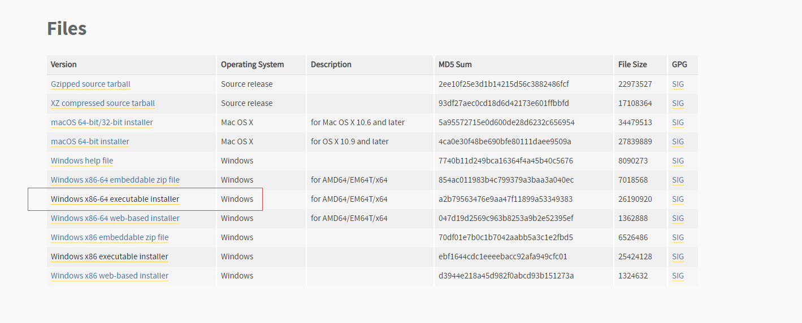

### 2.2 安装Python

> 安装过程中，选择自定义安装，并且在 添加到Path变量中一栏处，打勾，将Python添加到环境变量中。最终Python安装在C:\Program Files\Python37  目录下

### 2.3 测试Python

> 打开cmd窗口，输入python，如果进入python环境，则安装成功

### 2.4 Sublime配置

#### 2.4.1 插件配置

> 选择 `首选项`->`浏览插件`

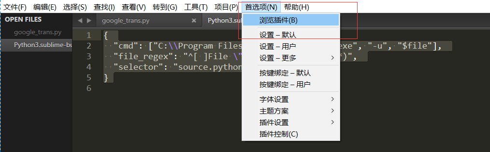

> 在打开的文件夹中，找到Python文件夹，默认是没有的，下图显示的是我已经新建过的Python文件夹

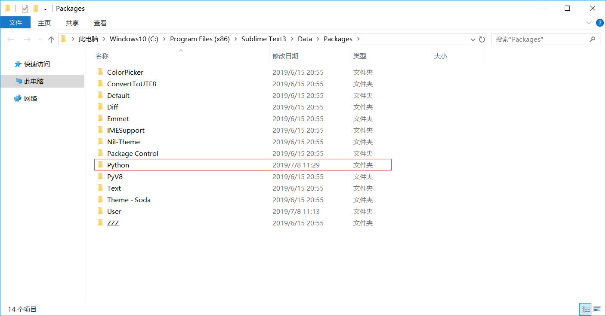

> 在python文件夹下新建一个文件，并且命名为Python3.sublime-build，文件里的内容如下
>
> <font color="red">说明：下图中的路径要修改为自己安装的python路径 </font>

```
{ 
  "cmd": ["C:\\Program Files\\Python37\\python.exe", "-u", "$file"], 
  "file_regex": "^[ ]File \"(…?)\", line ([0-9]*)", 
  "selector": "source.python"
}
```

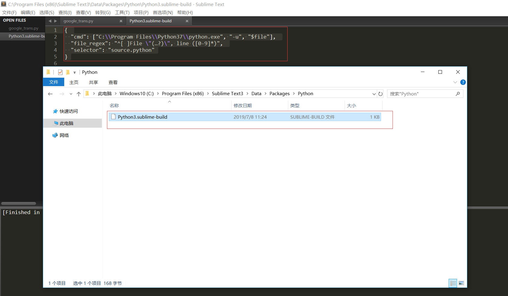

#### 2.4.2  编译配置

> 点击 `工具`->`编译系统`->`自动编译`，这里要选择为自动编译
>
> 说明：在网上的一些教程很多是选择的Python3，而不是自动编译，这个Python3是我们第一步插件配置完成后产生的

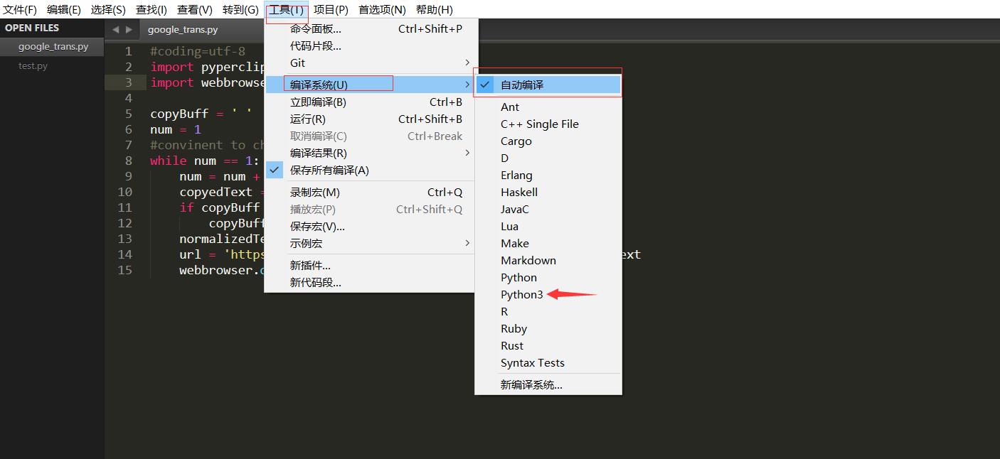

#### 2.4.3 测试

> 新建一个py程序，在py程序中，写入如下代码

```
print('hello world')
```

按快捷键ctrl +b即可运行

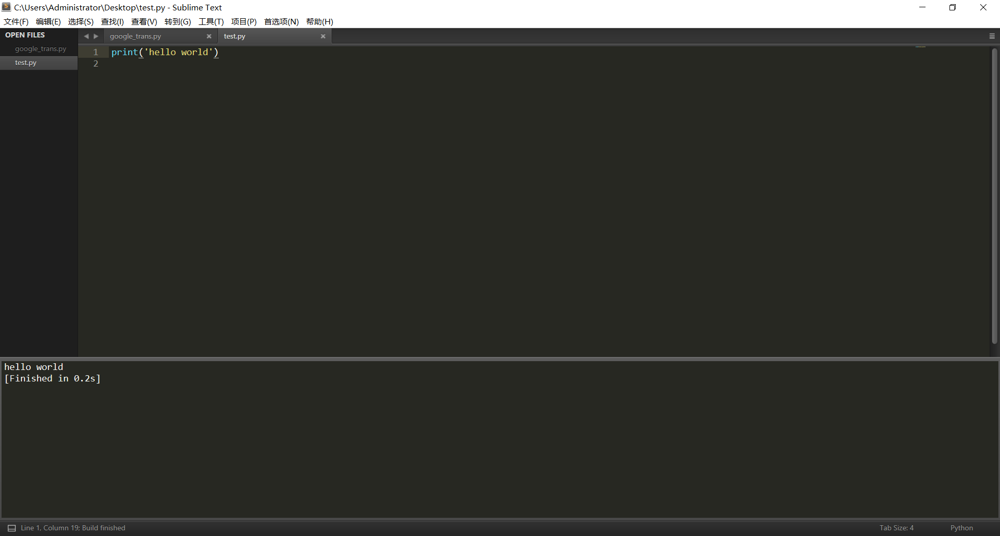

### 2.5 Sublime提示缺少相关python包

> 在写python代码的过程中，可能经常要导入一些包，而这些包也没有安装，又需要在sublime下运行时，此时需要先安装相关python包，如pyperlicp

（1）首先要确保pip已经安装，利用pip来安装依赖包

（2）在windows上搜索命令提示符，右键以管理员身份运行

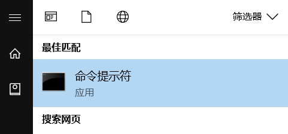

（3）安装pyperclip

```
pip install pyperclip
```

> 一定要在管理员身份权限下进行安装，否则会报权限错误


## 更新

## 三、Sublime 配置sublimeREPL

> 主要问题是写的py程序，在sublime下不能进行input，在运行时会报如下的错误：
>
> **EOFError: EOF when reading a line**，因此参考网上的教程对该问题进行了解决

### 3.1 安装Package Control包管理工具

> 按快捷键 `ctrl + ~`或者 **查看 -> 显示控制栏** 来调出命令界面

然后输入如下代码到命令输入框中

```
import urllib.request,os,hashlib; h = '6f4c264a24d933ce70df5dedcf1dcaee' + 'ebe013ee18cced0ef93d5f746d80ef60'; pf = 'Package Control.sublime-package'; ipp = sublime.installed_packages_path(); urllib.request.install_opener( urllib.request.build_opener( urllib.request.ProxyHandler()) ); by = urllib.request.urlopen( 'http://packagecontrol.io/' + pf.replace(' ', '%20')).read(); dh = hashlib.sha256(by).hexdigest(); print('Error validating download (got %s instead of %s), please try manual install' % (dh, h)) if dh != h else open(os.path.join( ipp, pf), 'wb' ).write(by)
```

稍等一会儿，重启sublime，如果在首选项下看到有Package Control，则安装成功

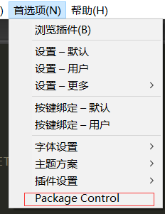

### 3.2 安装sublimeREPL

> <font color="red">下面的所有打开sublime操作，皆在windows的菜单栏搜索sublime，并且以管理员身份打开，否则会无效</font>

> 打开sublime，按快捷键ctrl + shift +p  或者首选项->Package Control，输入install后选择 Package Control:Install Package

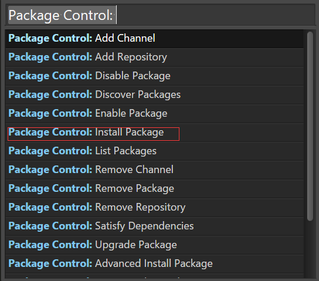

在弹出的界面输入sublimeREPL，回车等待sublimeREPL的安装（我这里因为已经安装了sublimeREPL，所以并没有出现）

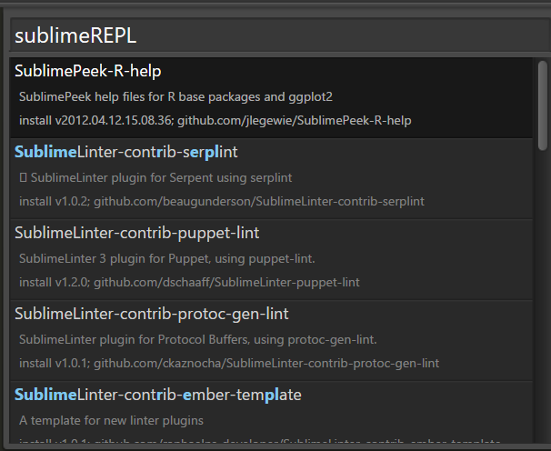

安装完成后，重启sublime，如果在菜单栏工具下出现sublimeREPL，则安装成功

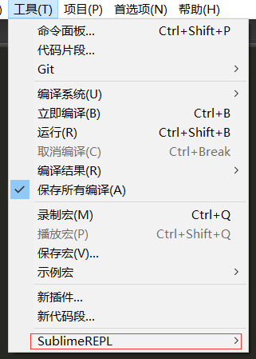

### 3.2 sublimeREPL配置

> 在SublimeText3路径下，我的是C:\Program Files (x86)\Sublime Text3\Data\Packages\SublimeREPL\config\Python中找到Main.sublime-menu文件，然后对文件里面的内容进行修改
>
> 由于直接用sublime打开该文件，保存时会因为权限不够而无法保存，因此我先将该文件拷贝到其他位置，然后修改过后，在重新拷贝过来进行覆盖

（1）修改Main.sublime-menu文件

​	通过搜索repl_python，定位到修改内容所在周围，将cmd里面的内容修改为：

```
"cmd": ["python", "-i", "-u","$file_basename"],
```

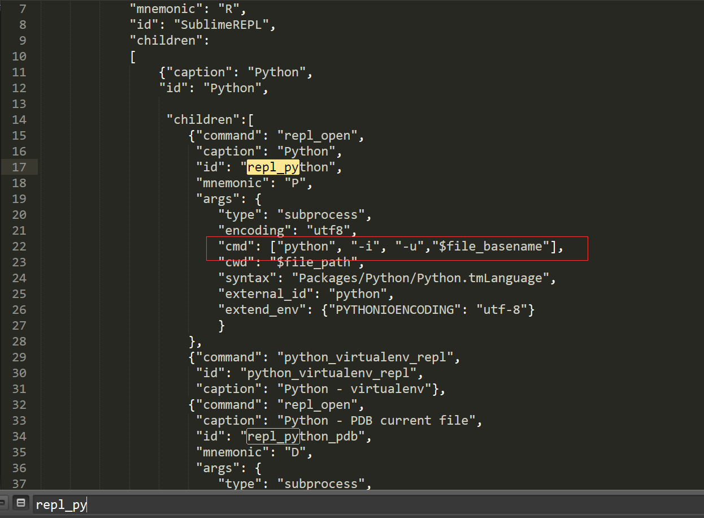

（2）设置快捷键

> <font color="red">仍然需要注意的是，以管理员身份运行sublime</font>

​	打开sublime，然后打开`首选项`->`按键绑定-用户`，然后输入如下代码：

```
[
	 {
    "keys": ["f5"],
    "caption": "SublimeREPL: Python - RUN current file",
    "command": "run_existing_window_command",
    "args": {
        "id": "repl_python_run",
        "file": "config/Python/Main.sublime-menu"}
    },
    {
    "keys": ["f8"],
    "caption": "SublimeREPL: Python - PDB current file",
    "command": "run_existing_window_command",
    "args": {
        "id": "repl_python_pdb",
        "file": "config/Python/Main.sublime-menu"}
    },
]
```

最后进行保存即可

（3）配置单窗口调试

> 打开C:\Program Files (x86)\Sublime Text3\Data\Packages\SublimeREPL\config\Python文件夹下的Main.sublime-menu；和前面一样，仍然是先拷贝到外面进行修改，然后重新拷贝回来进行覆盖，否则会报权限问题而无法保存

打开Main.sublime-meun文件后，通过搜索repl_python_run，快速定位到修改内容周围，然后在下图所示位置添加代码：

```
"view_id":"*REPL* [python]",
```

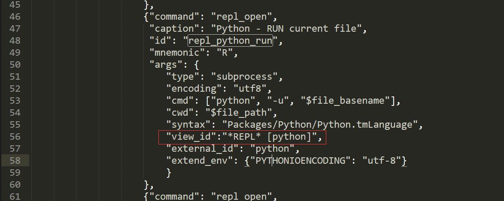

最后对C:\Program Files (x86)\Sublime Text3\Data\Packages\SublimeREPL文件夹下的sublimerepl.py进行修改（先将py拷贝到外面修改，然后拷贝回来覆盖）

通过搜索view.id快速定位到修改内容附近，安徽将view.id() 修改为view.name()

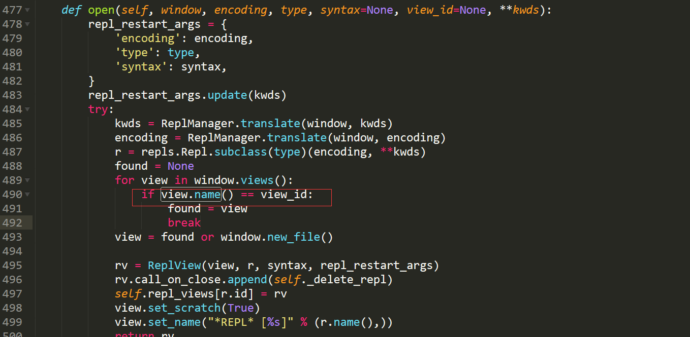

### 3.3 输入测试

> 以管理员身份打开sublime，并新建py文件，然后按F5键进行测试

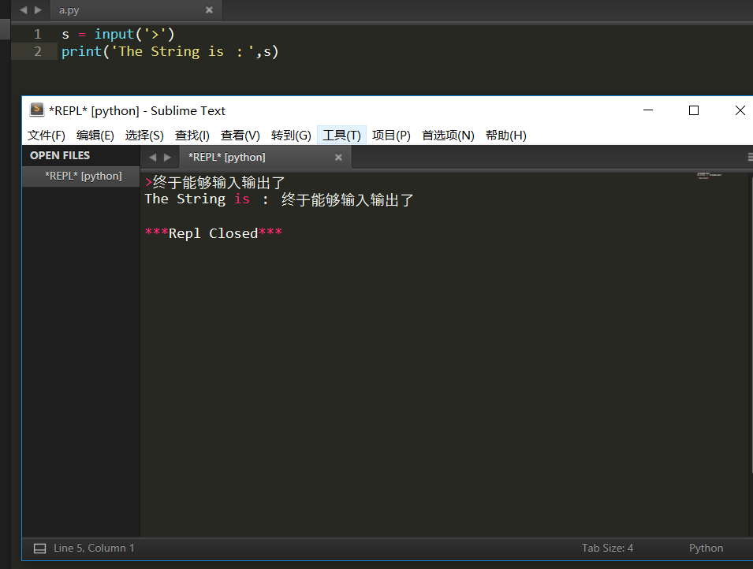

如果不是以管理员身份运行的sublime的，则无法输入输出

## 参考网址

- Sublime配置：[百度经验](https://jingyan.baidu.com/article/d3b74d6418a8381f76e60955.html)
- [Package Control安装](https://packagecontrol.io/installation#st3)
- [Sublime Text3中运行Python提示...](https://blog.csdn.net/yeluffy0601/article/details/41811305)
- [解决sublimeEPL在同一个窗口中调试的问题](https://blog.csdn.net/wuxiangchao_ganlu/article/details/82256933)

## 总结

> Sublime作为一个文本编辑器，既能编辑py代码，又能运行的话，是值得作为py编辑器的，相比较而言，能用Sublime运行py的话，就不要用Pycharm，毕竟轻量很多