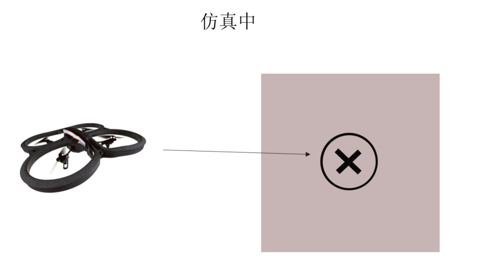
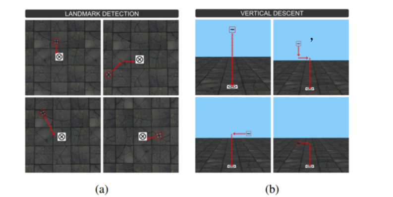
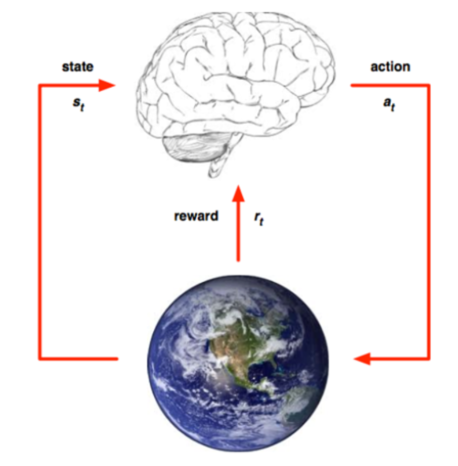
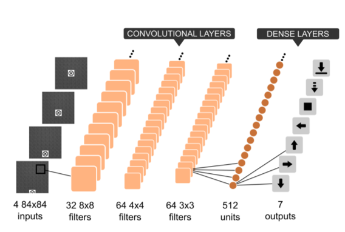
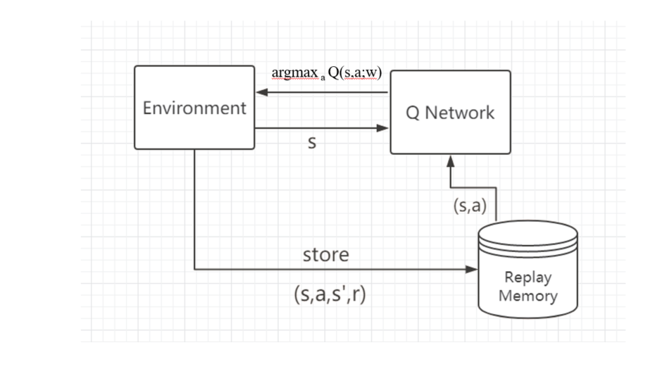
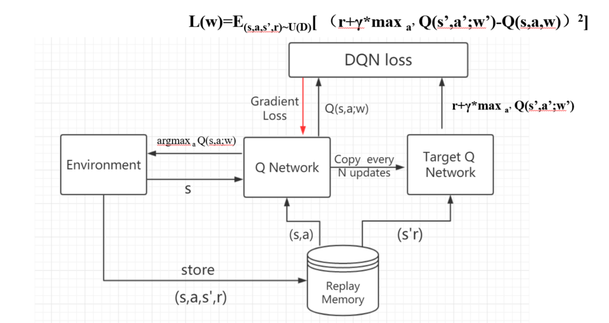
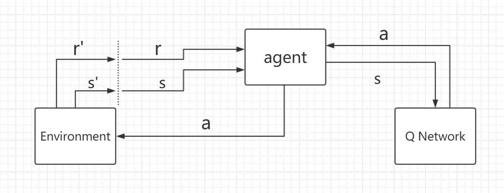
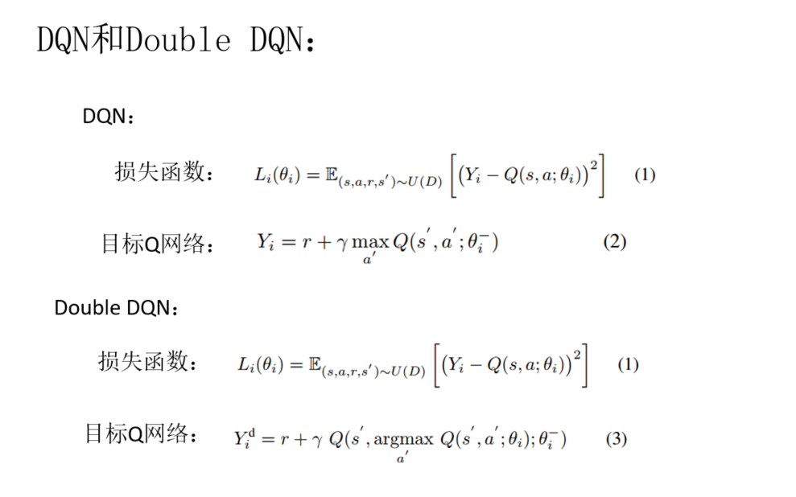
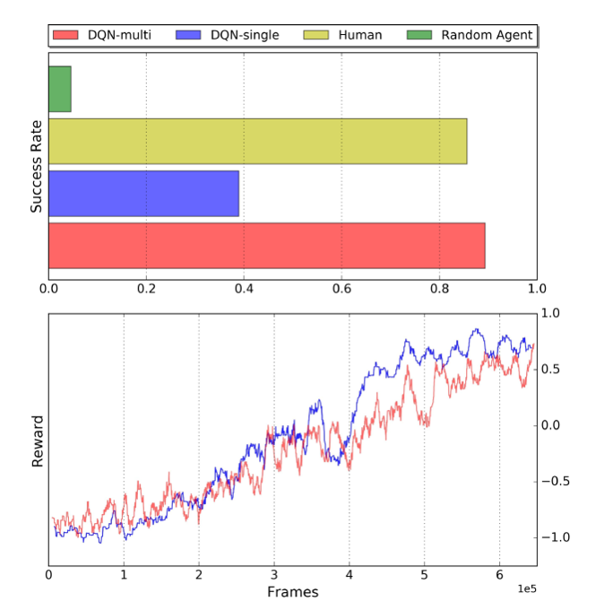
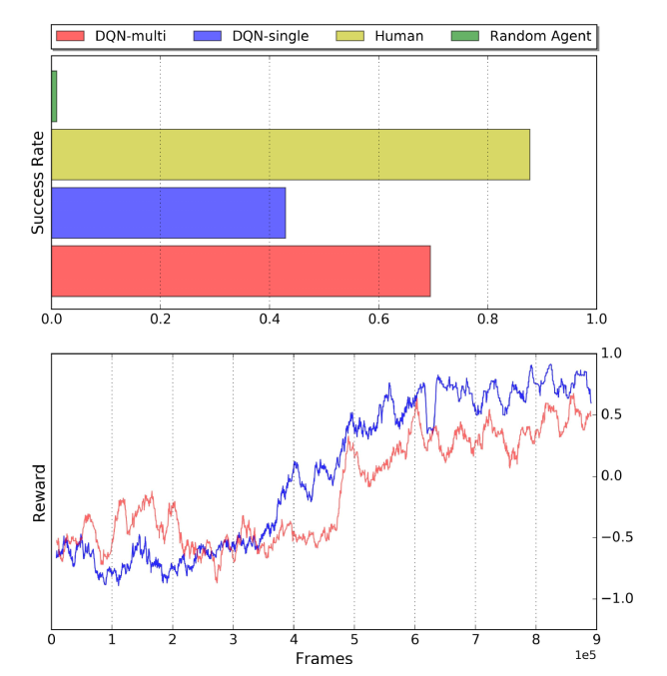

## 前言

> 以往的Q-learning算法只适合解决小问题，如果问题太大，则无法分别学习到所有状态下的所有动作值，因此提出了DQN。DQN的本质上仍然是Q-learning，只是利用了神经网络表示动作值函数，并利用了经验回放和单独设立目标网络这两个技巧，但是DQN本身是无法克服Q-learning本身锁固有的缺点-过估计。过估计是指估计的值函数比真实值函数要大。之所以存在过估计的问题，根源在于Q-learning中的最大化操作

## 一、论文题目

> **Autonomous Quadrotor Landing using Deep Reinforcement Learning** 

## 二、研究目标

> 在仿真中使用DRL方法实现无人机在标记logo上的自主降落

## 三、问题定义

> 地标着陆问题：使无人机精准降落在地标上

- **标记检测**：无人机固定高度，只在xy方向上移动，最终到达标记点正上方
- **垂直下降**：在标记点正上方，慢慢下降，减少无人机与地标的距离
- **降落**：降落在标记点上

## 四、研究方法介绍

> DRL：DQN方法

### 4.1 马尔科夫决策过程

> **目标：**训练一个无人机agent，它从环境中得到状态和奖励，然后选取一个行为，作用于环境

**MDP定义：**

- **状态集：**一般为xy坐标或者图片的集合（本文中为图片集合）
- **行为集：**agent可能采取的动作的集合（本文中一般为前后左右）
- **转换函数：**状态s在行为a下转移到s'的概率（本文中为mode free）
- **奖励函数：**不同的任务一般奖励不同（本文正面奖励：+1，负面奖励：-1，生活成本：-0.01）
- **起始状态：**每次训练之前的agent位置（本文中为固定区域内的随机方向和随机位置）
- **结束状态：**训练完成后的agent位置（本文中为降落到标记点上）
  - ​	**结束条件：**当前episode达到最大步数或者强制截止（超出边界）

### 4.2 CNN网络

> 对于相对较大较复杂的环境，一般Q表无法存储，此时，使用CNN进行函数值逼近

- **输入：**灰度图像（4张）
- **输出：**行为集

### 4.3 DQN（标记检测）

> 主要包含：经验池、CNN Network、CNN Target Netword
>
> 其中target网络和cnn网络局哟相同的网络结构

#### 4.3.1 DQN之经验回放

> 训练DQN网络之前，先要进行随机行为选取，然后将agent执行随机行为产生的数据存储到经验池中，经验池中的数据为（s,a,s',r,done）：当前状态、当前状态采取的动作，执行完动作后的下一个状态，执行完动作后的奖励、执行完动作后当前episode是否结束

在训练的过程中，需要将经验池中的（s,a）作为输入，输入到CNN网络中，每次选取经验池中的一批数据进行输入，然后CNN网络训练参数，最终agent从环境中获取s，输入到训练好的CNN网络中，CNN返回最大概率的行为给agent，agent执行该动作，作用于环境

#### 4.3.2 DQN调参

> 在DQN的两个网络中，target网络和cnn网络具有相同的网络结构，并且初始网络参数相同

训练过程中，cnn网络的参数一直在更新，当执行到一定的步数之后，将cnn网络的参数赋给target网络参数，保持两个网络参数相同，然后在进行cnn网络参数更新，以此往复

#### 4.3.3 DQN网络测试

> 训练好DQN网络之后，agent首先感知环境，从环境中获取状态s，并把状态s作为输入，输入到DQN网络，DQN网络返回动作a给agent，agent执行该动作a作用于环境，环境发生变化，agent会获得新的状态s，以此往复，就能利用DQN网络进行测试了

### 4.4 Double DQN + 优先级经验回放：垂直下降

> 在垂直下降部分，使用的Double DQN方法和优先级经验回放

### 4.5 DQN 与Double DQN比较

> 只是目标Q网络稍有不同，其他一样

## 五、实验环境

- **仿真平台：**Gazebo7
- **ROS版本：**ros kinetic
- **无人机：**Parrot AR Drone2
- **纹理：**自定义的一些纹理图
- **训练硬件**（训练5.2天完成）：
  - 处理器：i7  8核
  - RAM：32G
  - 显卡：NVIDIA Quadro K2200

## 六、实验结果

### 6.1 标记检测

> 标记检测部分，训练的agent能超过人类水平

### 6.2 垂直下降

> 垂直下降部分，训练的agent能接近人类水平

## 七、未来展望

> 未来的工作将会关注仿真和现实中的一些差距方面

## 总结

> DQN方法的创新点（相比于Q-learning）

- **加入神经网络**：DQN利用深度卷积神经网络逼近值函数

  DQN的行为值函数用神经网络逼近，属于非线性逼近。

- **加入经验回放**：DQN利用经验回放训练强化学习过程

  在训练神经网络时，存在的假设是训练数据是独立同分布的，但是通过强化学习采集的数据之间存在关联性，利用这些数据进行顺序训练，神经网络不稳定。经验回放可以打破数据间的关联。

  在强化学习训练过程中，智能体将数据存储到一个经验回放池中，在利用均匀随机采样的方法从经验池中抽取数据，然后利用抽取的数据训练神经网络，这样就打破了数据之间的关联性

- **加入目标网络：**DQN利用目标网络降低当前Q值和目标Q值间的关联性

  在利用神经网络逼近值函数时，计算TD目标的动作值函数所用的网络参数
  $$
  \Theta
  $$
  与梯度计算中要逼近的值函数所用的网络参数相同，这样就存在关联性（数据样本和网络训练之间的相关性）

  为了解决该问题，加入了目标网络，计算值函数逼近的网络表示为
  				
  $$
  \Theta
  $$

  用于动作值函数逼近的网络表示为
  $$
  \Theta'
  $$
  而该动作值函数网络在固定的步数更新一次				
  			

## 参考链接			

- DQN与Double DQN讨论：[DQN方法创新](http://www.broadview.com.cn/article/419382)				
  			

  ​				
  ​				

  