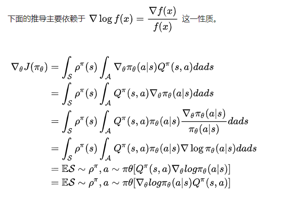
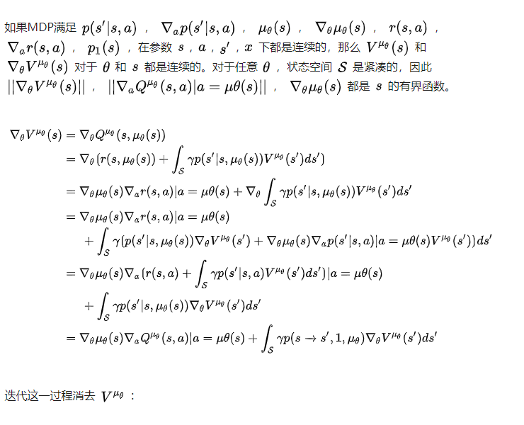
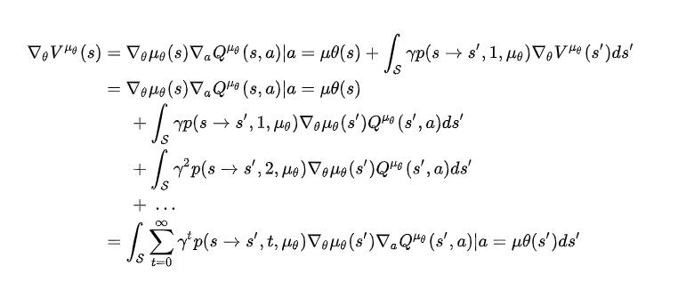
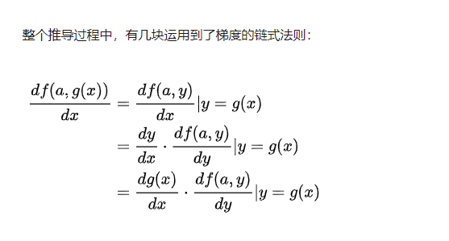
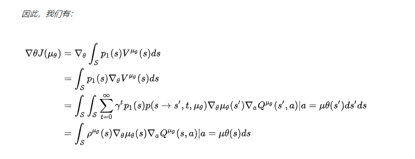
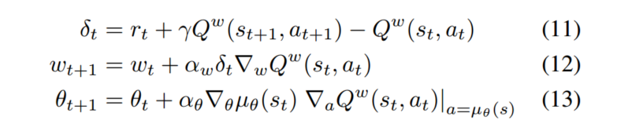
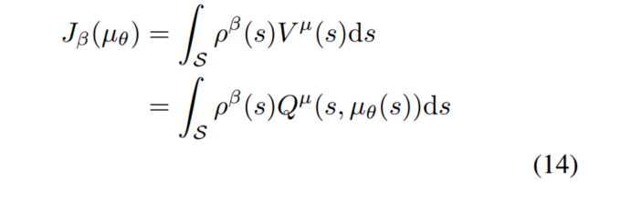
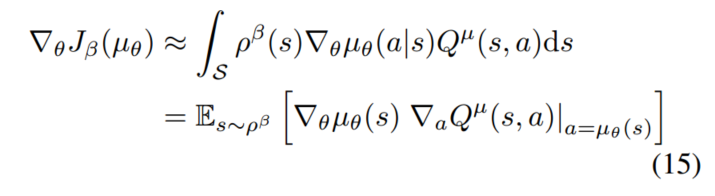
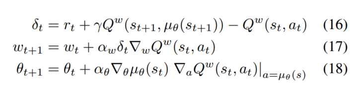
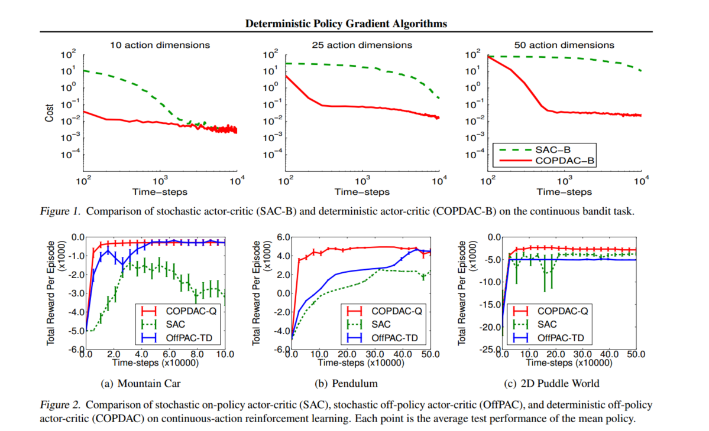

## 前言

> 为什么需要引入确定性策略梯度？
>
> 传统的策略梯度算法以概率形式$\pi_\theta(a|s) = P[a|s;\theta]$来表示一个策略，以此来随机的选择行为。但DPG用一种确定性的策略形式$a=\mu_\theta(s)$。
>
> DPG有着比PG更简单的形式：DPG的策略函数的更新就是action-value的期望，这种简单的形式使得DPG比PG更有效，同时在高维度行为空间也比PG表现更好

## 一、论文题目

> **Deterministic Policy Gradient Algorithms** 

## 二、研究目标

> 研究一种更有效的估计策略梯度以及能在高维度行为空间表现更好的算法

## 三、问题定义

> 对以往的随机策略而言，对于某一些动作集合来说，它可能是连续值，或者非常高维的离散值，这样动作的空间维度很大。如果使用使用随机策略，即像DQN一样研究它所有的可能动作的概率，并计算出各个可能的动作的价值的话，那需要的样本量是非常大才行的。于是有人就想出确定性策略来简化这个问题。

- **随机策略：**在相同的策略下，在同一个状态处，采用的动作是基于一个概率分布$\pi_\theta(a|s) = P[a|s;\theta]$的，即是不确定的。
- **确定性策略：**在同一个状态处，虽然采用的动作概率不同，但是最大概率只有一个，如果我们只取最大概率的动作，去掉这个概率分布，那么则会简化很多，即作为确定性策略。**相同的策略，在同一个状态处，动作是唯一确定的，即$\pi_\theta(s) = a$。**

## 四、DPG方法介绍

### 4.1 知识回顾

#### 4.1.1 随机策略梯度（Stochastic Policy Gradient）

> 策略梯度的根本目的就是使累计奖励最大，即最大化期望reward：

$$
\begin{split} J(\pi_\theta) &= \int_S \rho^\pi(s)\int_A\pi_\theta(s,a)r(s,a)dads \\&= E_{s\sim\rho^\pi,a\sim\pi_\theta}[r(s,a)]\end{split}\tag{1}
$$

策略梯度的基本思想就是沿着$\nabla_\theta J(\pi_\theta)$方向调整参数：
$$
\begin{split} \nabla_\theta J(\pi_\theta) &= \int_S \rho^\pi(s)\int_A\nabla_\theta\pi_\theta(a|s)Q^\pi(s,a)dads \\ &=E_{s\sim\rho^\pi,a\sim\pi_\theta}[\nabla_\theta log\pi_\theta(a|s)Q^\pi(s,a)] \end{split}\tag{2}
$$
**推导过程：**

综上，尽管状态分布$\rho^\pi(s)$依赖于策略的参数，但策略梯度并不依赖于状态分布的梯度

#### 4.1.2 随机Actor-Critic算法（Stochastic Actor-Critic Algorithms）

> 基于策略梯度理论的actor-critic算法是一个被广泛使用的框架，该框架主要由两部分组成：
>
> - actor通过随机梯度上升更新随机策略$\pi_\theta(s)$的参数$\theta$
> - critic来估计行为价值函数$Q^w(s,a) \approx Q^\pi(s,a)$，例如时间差分（TD）算法
>
> 注：我们不知道公式中的真实action-value对应关系的函数$Q^\pi(s,a)$，但是我们使用参数$w$创建近似的价值函数$Q^w(s,a) $，通过合适的策略计算算法，使得$Q^w(s,a) \approx Q^\pi(s,a)$

但是，通常来说，用$Q^w(s,a) $来逼近$ Q^\pi(s,a)$，会引入偏差，为了消除偏差，近似函数应满足：

1. $Q_w(s,a) = \nabla_\theta log \pi_\theta(a|s)^Tw$（对于随机策略的函数逼近为线性）
2. $\varepsilon^2(w) = E_{s\sim\rho^\pi,a\sim\pi_\theta} [(Q^{w}(s,a) - Q^\pi(s,a))^2]$（参数$w$，应该最小化均方差）

则我的策略梯度为：
$$
\nabla_\theta J(\pi_\theta)=E_{s\sim\rho^\pi,a\sim\pi_\theta}[\nabla_\theta log\pi_\theta(a|s)Q^w(s,a)
$$
在实践中，一般放宽条件2，更有利于算法通过时间差分学习到更有效的评估函数。如果条件1、2全部满足的话，整个算法相当于不适用critic。

### 4.2 离线策略（异策略）Actor-Critic（Off-Policy Actor-Critic）

> Off-policy的意思就是我们训练用的数据使用的策略和当前要更新的策略不是一个策略，设数据使用的策略为$\beta$，而当前要训练的策略是$\pi$，这里用到了importance sampling。

即不同于行为策略$\pi$的off-policy（异） 策略$\beta$来选择状态、行为轨迹（trajectories）

目标函数通常修改为目标策略的价值函数：
$$
\begin{split} J_\beta(\pi_\theta) &= \int_S \rho^\beta(s) V^\pi(s)ds \\ &=\int_S\int_A\rho^\beta(s)\pi_\theta(a|s)Q^\pi(s,a)dads \end{split}
$$

Off-policy的 策略梯度为:
$$
\begin{split} \nabla_\theta J_\beta(\pi_\theta) &\approx \int_S\int_A\rho^\beta(s)\nabla_\theta\pi_\theta(a|s)Q^\pi(s,a)dads  \\ &= E_{s\sim\rho^\pi,a\sim\pi_\theta}[ \frac{\pi_\theta(a|s)}{\beta_\theta(a|s)}\nabla_\theta log\pi_\theta(a|s)Q^\pi(s,a)] \end{split}\tag{4\5}
$$
离线（Off-policy）actor-critic算法（OffPAC）使用行为策略（behaviour policy）$\beta(a|s)$来生成轨迹，critic会用状态价值函数$V^v(s)\approx V^\pi(s)$来进行估计，actor用来更新策略的参数$\theta$，actor和critic都是通过离线的轨迹数据来进行训练，和上面公式不同的是，我们在这里用TD-error $\delta_t = r_{t+1} + \gamma V^v(s_{t+1}) - V^v(s_t)$代替上式中的$Q^\pi(s,a)$，这样可以提供真实梯度的近似值。在更新actor和critic时，都需要用重要性采样比率$\frac{\pi_\theta(a|s)}{\beta_\theta(a|s)}$来进行重要性采样，这一比率来判断action到底是根据策略$\pi$还是$\beta $。

### 4.3 确定性策略梯度（Gradients of Deterministic Policies）

> 现在考虑如何将策略梯度扩展到确定性策略，即$a=\mu_\theta (s)$。类似于前面提到的随机策略梯度，确定性策略梯度实际上是随机策略梯度的一个特例

#### 4.3.1 动作-值函数梯度（Action-Value Gradients）

> 绝大多数的model free强化学习算法都是基于一般的策略迭代，即策略评估（policy evaluation）和策略改善（policy improvement）交替进行。策略评估就是估计动作-值函数$Q^\pi(s,a)$或$Q^\mu(s,a)$，比如用MC（蒙特卡洛）或TD来进行估计，然后在进行策略改善，策略改善最常用的方法是用贪心法：$\mu^{k+1}(s) = argmax_a Q^{\mu^k}(s,a)$

但是在连续行为空间中，策略改善环节的贪心法就不可行，因为贪心法需要在每一步都最大化，因此就出现了问题。一个简单的替代方案就是将策略往$Q$的梯度方向移动，而不是全局最大化$Q$。具体来说，对于每一个探索果的状态$s$，策略网络的参数$\theta^{k+1}$以$\nabla_\theta Q^{\mu^k}(s,\mu_\theta(s))$的一定比例来更新。每个不同的状态，都提供了一个更新的方向，所有方向的均值，可以看做$\rho^\mu(s)$。
$$
\theta^{k+1} = \theta^k + \alpha E_{s\sim\rho^{\mu^k}}[\nabla_\theta Q^{\mu^k}(s,\mu_\theta(s))]
$$
策略改善可以分解为动作-值函数的梯度和评估策略的梯度更新，根据导数的链式法则：
$$
\theta^{k+1} = \theta^k + \alpha E_{s\sim\rho^{\mu^k}}[\nabla_\theta \mu_\theta(s) \nabla_a Q^{\mu^k}(s,a)|_{a=\mu_\theta(s)}]
$$
按照惯例，$\nabla_\theta \mu_\theta(s)$是一个雅克比矩阵，也就是说，每一列都是梯度$\nabla_\theta[\mu_\theta(s)]|_d$（d是动作空间的维度）。通过改变策略，不同的状态都会被探索，并且状态分布$\rho^\mu(s)$也会改变。

### 4.4 确定性策略梯度定理（Deterministic Policy Gradient Theorem）

> 现在考虑带有参数向量$\theta \epsilon R^n$的确定性策略$\mu_\theta:S \rightarrow A$

定义：

- 目标函数:$J(\mu_\theta) = E[r_1^\gamma|\mu]$
- 概率分布：$p(s \rightarrow s',t,\mu)$
- 折扣状态分布：$\rho^\mu(s)$

类比于随机策略，因为此时是确定性策略，所以不需要在对行为$a$做积分求期望，则累计奖励期望为：
$$
\begin{split} J(\mu_\theta) &= \int_S \rho^\mu(s)r(s,\mu_\theta(s)) ds \\ &=E_{s\sim\rho^\mu}[r(s,\mu_\theta(s))] \end{split}
$$
如果MDP过程满足$p(s'|s,a)$，$\nabla_ap(s'|s,a)$，$\mu_\theta(s)$，$\nabla_\theta \mu_\theta(s)$，$r(s,a)$，$\nabla_a r(s,a)$，$p_1(s)$在参数$s,a,s',x$下都是连续的，那么意味着$\nabla_\theta \mu_\theta(s)$和$\nabla_a Q^\mu(s,a)$存在且确定性策略梯度存在。那么与随机策略梯度相同，我们使用$Q$值来代替即时奖励，则对于$J$的梯度，即DPG为：
$$
\begin{split} \nabla_\theta J(\mu_\theta) &= \int_S \rho^\mu(s)\nabla_\theta \mu_\theta(s) \nabla_aQ^\mu(s,a)|_{a= \mu_\theta(s)}ds \\ &= E_{s\sim\rho^\mu}[\nabla_\theta \mu_\theta(s)  \nabla_aQ^\mu(s,a)|_{a= \mu_\theta(s)}]  \\ &= E_{s\sim\rho^\mu}[\nabla_\theta Q^\mu(s, \mu_\theta(s))] 
\end{split} \tag{9}
$$
可以发现，与随机策略梯度相比，DPG少了对行为的积分，多了对动作-值函数的梯度，这也使得DPG需要更少的采样却能达到比随机策略梯度更好的效果。

**证明过程**：（我没怎么看懂）

#### 4.4.1 确定性策略是随机策略梯度的极限形式

> DPG公式乍看并不像随机策略梯度公式，但实际上DPG是岁及策略梯度的一种特例情况。假设定义随机策略的参数为$\pi_{\mu_\theta,\delta}$，其中$\delta$是方差参数，也就是说，如果$\delta = 0$，则随机策略等于确定性策略$\pi_{\mu_\theta } \equiv \mu_\theta$，所以可以得出策略梯度的极限形式： 

$$
\lim_{\delta \rightarrow 0} \nabla_\theta J(\pi_{\mu_\theta,\delta}) = \nabla_\theta J(\mu_\theta) \tag{10}
$$

### 4.5 确定性Actor-Critic算法

> 与随机Actor-Critic算法类似，用一个可导的动作-值函数$Q^w(s,a)$来估计$Q^\mu (s,a) $

#### 4.5.1 On-Policy 确定性AC

> 对于同策略（On-Policy）AC，critic使用Sarsa来估计动作-值函数，算法为：

其中，同策略的确定性策略梯度为：

#### 4.5.2 Off-Policy 确定性AC

> 对于异策略来说，在生成样本轨迹时所用的策略可以使任意的随机行为策略$\beta(s,a)$，目标函数$J$为：

梯度为：

critic采用Q-learing的学习策略来估计动作-值函数：

可以看出同策略和异策略的不同之处在于对$a_t$的生成，同策略用的是确定性策略，异策略则用的是一个任意的随机策略。不同的是同策略是选择状态$s_{t+1}$最大的$Q$，而异策略是选择状态$s_{t+1}$和动作$\mu(s_{t+1})$的$Q$。

### 4.6 无偏证明

> 这部分是证明用Q代替期望奖励时如何无偏

## 五、结果

> 红色是本文结果：DAC off-policy > SAC off-policy > SAC on-policy

## 总结

> 好吧，自从看PG以来，关于PG、AC、DPG这里总是感觉有点懂又有一点不懂，作为DDPG以及A3C等的基础，先做一个大概的了解吧，后面看了DDPG和A3C后，在回过来看看，是否会理解更深刻一点

## 参考链接

> 主要参考了下面博客中的前两篇

- [Deterministic Policy Gradient-Fisher's Blog](https://bluefisher.github.io/2018/05/16/Deterministic-Policy-Gradient/)

- [Deterministic Policy Gradient Algorithms阅读笔记（or翻译）](https://zhuanlan.zhihu.com/p/53613085)

- [RL论文阅读七 Deterministic Policy Gradient Algorithms](https://blog.csdn.net/taoyafan/article/details/94363459)

- [文献笔记Deterministic Policy Gradient Algorithms](https://www.cnblogs.com/statruidong/p/10765579.html)

- [强化学习-确定性策略强化学习-DPG&DDPG算法推导及分析](https://blog.csdn.net/weixin_37895339/article/details/84881872)

