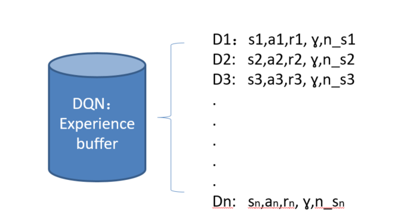
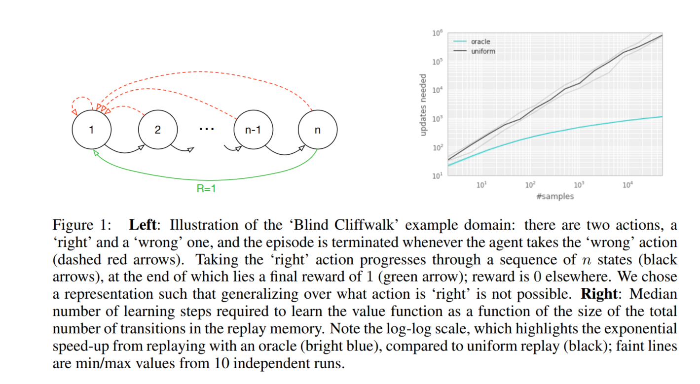
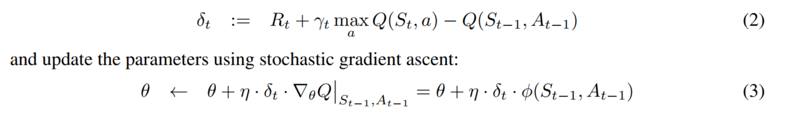
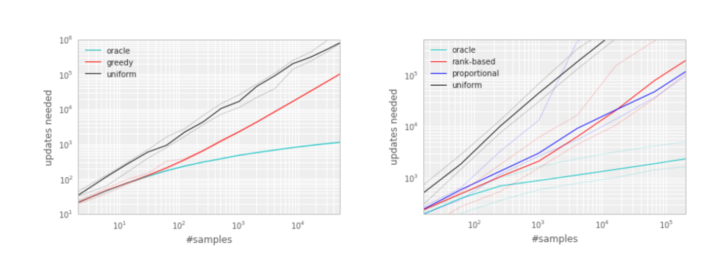
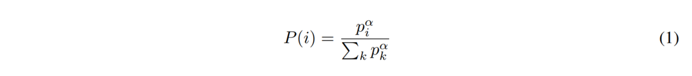
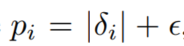
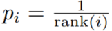
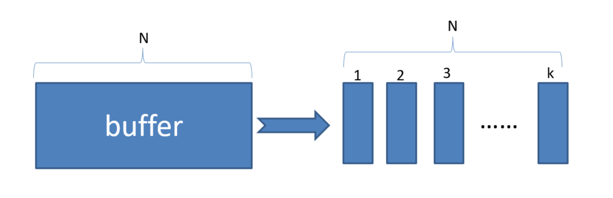
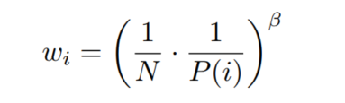
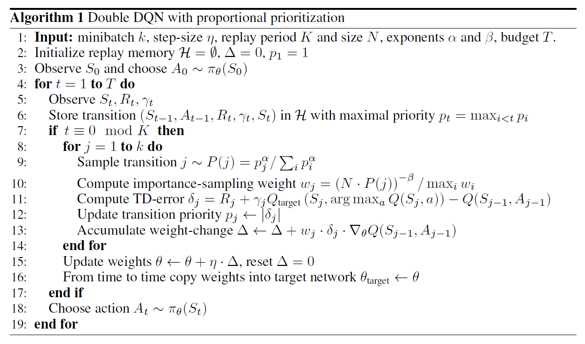

## 前言

> 上一篇介绍了Double DQN对DQN的目标Q值优化，这篇将介绍在DDQN的基础上，对经验回放池的优化

## 一、论文题目

> **PRIORITIZED EXPERIENCE REPLAY** 

## 二、研究目标

> 在DDQN基础上，改进经验回放池的均匀随机采样算法，使得学习更高效

## 三、问题定义

> DDQN的均匀随机采样问题

以往的DQN或DDQN的做法是从buffer中均匀随机采样，这样会导致一些有用的样本可能被抽到的次数少，并且存储数据的空间有限，当空间存满之后，每次放入一个experience就要丢弃先前的一个experience。那么就要思考下面两个问题

- **选择那些experience保存**
- **选择那些experience被回放**

## 四、PRIORITIZED REPLAY 方法介绍

> 作者针对上面的两个问题，着重解决的是第二个问题，即选择那些experience被回放

### 4.1 举例说明

> 如上图所示，本文给出了一个例子来充分的说明优先的潜在好处。引入了称为“Blind Cliffwalk”的环境，来示例说明当奖赏非常 rare的时候，探索所遇到的挑战。假设仅有 n 个状态，这个环境就要求足够的随机步骤直到得到第一个非零奖励；确切的讲，随机的选择动作序列就会有 2^（-n）的概率才能得到第一个非零奖赏。此外，最相关的 experience却藏在大量的失败的尝试当中。

本文利用这个例子来显示了两个agents的学习次数的不同。可以看到这两个agent都从同一个经验回放池中去获取Q-learning的更新，第一个agent随机均匀采样experience，第二个agent唤醒一个oracle来进行优先级experience采样。这个oracle贪婪的选择使得在当前状态下最大化降低全局损失的experience。

从上图右侧，也能看出，按照一定优化序列得到的experience比均匀随机采样要花费很少的尝试步骤，这明显的提升了训练速度。

**注：**这里的oracle可以理解为上帝，文中的意思指的是实验跑完了，回过来看如何如何做最好，相当于一种离线学习，即oracle采样的数据是最好的一组batch

### 4.2 Prioritizing with TD-Error

> **Temporal-difference（TD）error**表示一个experience的惊奇度或出乎意料的程度

**引入TD-Error：**引入TD-Error的目的是给每一个experience添加一个TD-Error标准，在每次进行更新时，从buffer中选择绝对值对打的TD-Error的样例进行回放。然后对该样例进行Q-learning的更新，更新Q值和TD-Error的权重。新的experience到来之后，没有已知的 TD-error，所以我们将其放到最大优先级的行列，确保所有的 experience 至少回放一次。

TD-Error公式如下：

**引入TD-Error后的好处：**

oracle的做法可以极大的降低无用的尝试，加速了算法的执行速度

### 4.3 Stochastic Priorization

> 引入 Stochastic Priorization的目的是为了缓解多样性的损失

在上一步引入TD-Error后会产生两个问题：

- 为了避免消耗太多资源遍历整个memory，我们只为那些被replay的experience更新TD-error；如果一开始就被赋予一个很低的TD-error，在很长一段时间内可能都不会被replay

- 贪婪优先集中于一个小的经验子集，误差收缩的很慢，特别是使用函数估计的时候，意味着初始的高误差转移被经常回放。缺乏多样性使得该系统倾向于 over-fitting

  （为什么丧失多样性造成过拟合：对于DQN，回放就是把经验池中取出的experience中的s状态输入到Q-network中，next state 输入到target Q-network中，然后进行一系列计算loss，反向传播更新网络参数，如果一直重复这一条信息输入，那么我对于训练网络过程来说精度会很高，而当测试的时候，输入别的状态就会使测试精度降低，即过拟合）

- 对 noise spikes 非常敏感，bootstrapping 会加剧该现象，估计误差又会成为另一个噪声的来源

为了解决上述问题，我们引入了一个**随机采样**的方法，该方法结合了 **纯粹的贪婪优先** 和 **均匀随机采样**。我们确保被采样的概率在experience优先级上是单调的，与此同时，确保最低优先级的experience的概率也是非零的。具体的，我们定义采样experience  i 的概率为：

其中，pi 是experience i 的优先级。指数 α 决定了使用多少优先级，当 α 等于 0 的时候是均匀的情况

pi有以下两种变体：

- 直接的、成比例优先（**Proportional Variant**）：

  

  这里的
  $$
  \epsilon
  $$
  是一个很小的数字，这样就保证了有些TD-Error为0的特殊边缘例子也能够被采样到

- 间接的、基于排行的优先（**Rank-based Variant**）：

  

  rank（i）是根据
  $$
  |\delta|
  $$
  排序后，i 的排名

两个分布都是随着误差单调的，但是后者更鲁棒，因为其对离群点不敏感。两个变体相对均匀的baseline来讲都是有很大优势

#### 4.3.1 Proportional Variant

> 本文提出的Sum Tree，Sum Tree是一种树形结构，每片树叶存储每个样本的优先级 `p`, 每个树枝节点只有两个分叉, 节点的值是两个分叉的合, 所以 SumTree 的顶端就是所有 `p` 的合. 正如下面[图片(来自Jaromír Janisch)](https://jaromiru.com/2016/11/07/lets-make-a-dqn-double-learning-and-prioritized-experience-replay/), 最下面一层树叶存储样本的 `p`, 叶子上一层最左边的 13 = 3 + 10, 按这个规律相加, 顶层的 root 就是全部 `p` 的合了.

抽样时, 我们会将 `p` 的总合 除以 batch size, 分成 batch size 那么多区间, (n=sum(p)/batch_size). 如果将所有 node 的 priority 加起来是42的话, 我们如果抽6个样本, 这时的区间拥有的 priority 可能是这样.

[0-7], [7-14], [14-21], [21-28], [28-35], [35-42]

然后在每个区间里随机选取一个数. 比如在第区间 `[21-28]` 里选到了24, 就按照这个 24 从最顶上的42开始向下搜索. 首先看到最顶上 `42` 下面有两个 child nodes, 拿着手中的24对比左边的 child `29`, 如果 左边的 child 比自己手中的值大, 那我们就走左边这条路, 接着再对比 `29` 下面的左边那个点 `13`, 这时, 手中的 24 比 `13` 大, 那我们就走右边的路, 并且将手中的值根据 `13` 修改一下, 变成 24-13 = 11. 接着拿着 11 和 `13`左下角的 `12` 比, 结果 `12` 比 11 大, 那我们就选 12 当做这次选到的 priority, 并且也选择 12 对应的数据.

**注**：上面的说明是参照的网上教程写的，这里在写一下自己的理解

**个人理解：**图片中的所有叶子节点（3、10、12、4、1、2、8、2）对应于每一个experience的TD-Error，然后两个两个组合，构成哈夫曼树，即会生成顶层的根root，并且其值为42。然后在进行分区，分区后再每个区间进行抽值，如抽到的为n。抽值后，从根节点开始找（从上至下，从左至右），如果遇见其子节点m比n大，则走该子节点的路，如果遇见子节点m比n小，则走另一个子节点路，并且n=n-m.，直到找到叶子节点，选择叶子节点中那个比当前n值大的experience。

#### 4.3.2 Rank-based Variant

> 将buffer分为k个等概率的分段，从每一个分段中进行贪婪优先采样

### 4.4  Annealing the bias

> 利用随机更新得来的期望值的预测依赖于这些更新，对应其期望的同样的分布。优先回放引入了误差，因为它以一种不受控的形式改变了分布，从而改变了预测会收敛到的 solution（即使 policy 和 状态分布都固定）。我们可以用下面的重要性采样权重（importance-sample weights）来修正该误差：

**Importance sampling的影响：**

在典型的强化学习场景中，更新的无偏性在训练结束接近收敛时是最重要的，因为由于策略、状态分布和引导目标的改变，有bias会高度不稳定，与未修正的优先重放相比，Importance sampling使学习变得不那么具有侵略性，一方面导致了较慢的初始学习，另一方面又降低了过早收敛的风险，有时甚至是更好的最终结果。与uniform重放相比，修正的优先级排序平均表现更好。

### 4.4 本文采用方法

> 本文将优先回放和 Double Q-learning 相结合，就是将 均匀随机采样 替换为 本文提出的 随机优先和重要性采样方法，具体算法见下图

## 总结

> Prioritized Replay DQN和DDQN相比，收敛速度有了很大的提高，避免了一些没有价值的迭代，因此是一个不错的优化点。同时它也可以直接集成DDQN算法，所以是一个比较常用的DQN算法。

## 参考链接

- 论文理解1：[传送门](https://www.cnblogs.com/wangxiaocvpr/p/5660232.html)

- 论文理解2：[传送门](https://zhuanlan.zhihu.com/p/38358183)

- 代码样例：[传送门](https://www.cnblogs.com/pinard/p/9797695.html)

- 莫烦大神：[传送门](https://morvanzhou.github.io/tutorials/machine-learning/reinforcement-learning/4-6-prioritized-replay/)

- 很不错的网址：[传送门](https://www.echenshe.com/class/rl/4-6-prioritized-replay.html)

- 4.3.1里面的图片来源：[传送门](https://jaromiru.com/2016/11/07/lets-make-a-dqn-double-learning-and-prioritized-experience-replay/)