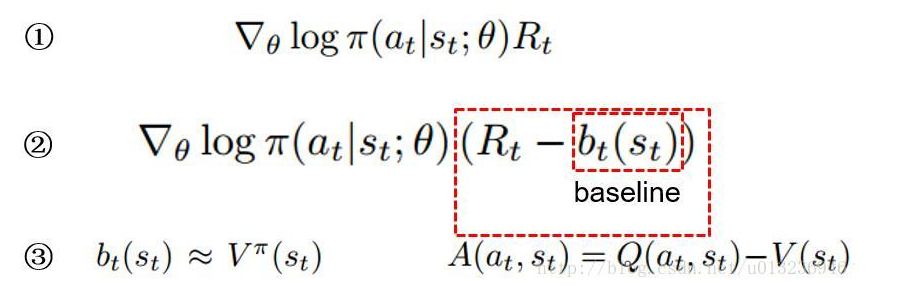
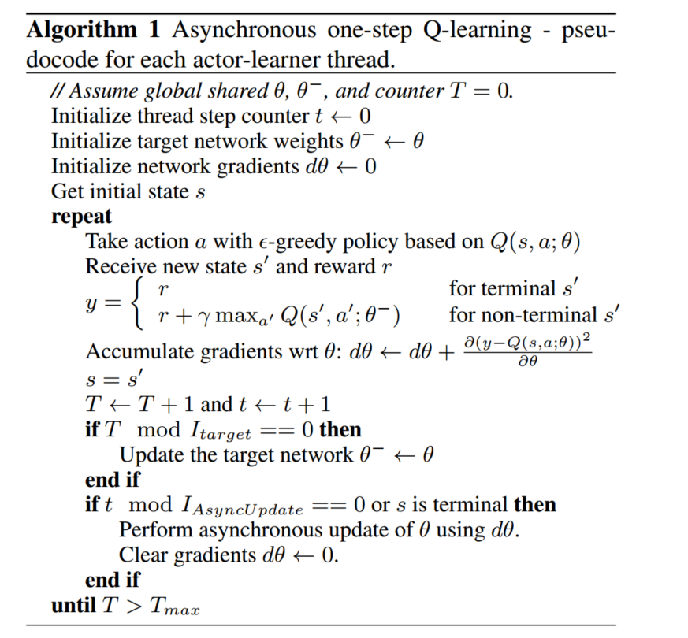
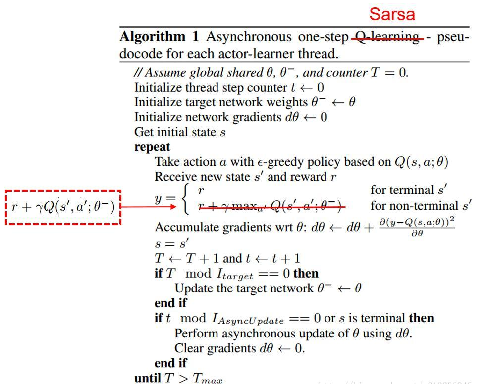
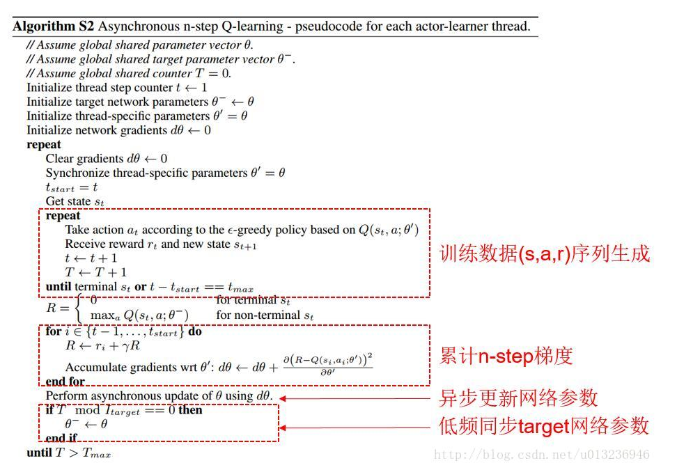
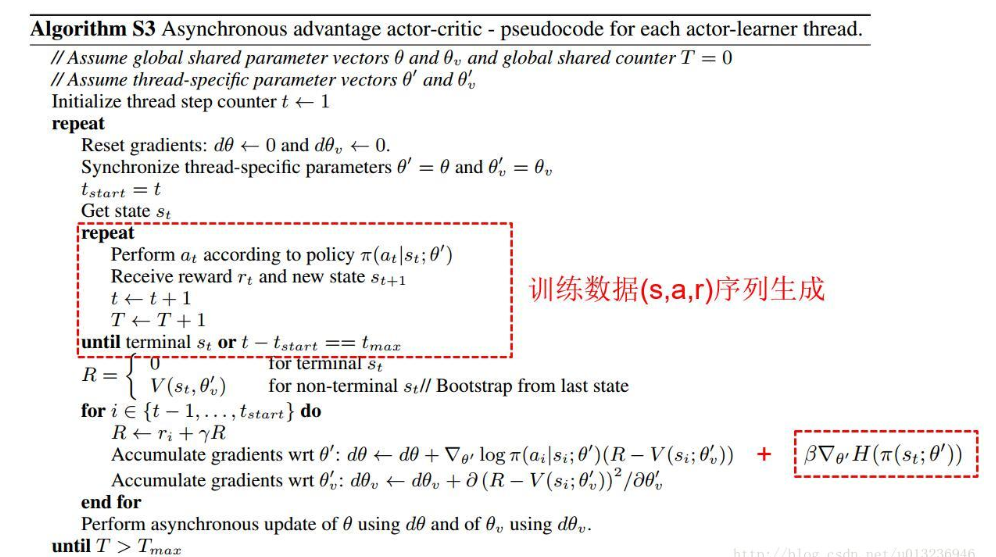

## 前言

> 针对普通AC算法中比较难收敛的问题，DeepMind在*Asynchronous Methods for Deep Reinforcement Learning*一文中，介绍了另一种简单的轻量级深度强化学习框架——异步地进行深度神经网络梯度下降。论文提出了四种标准强化学习算法的异步变体，分别是**Asynchronous  one-step Q-Learning，Asynchronous  one-step Sarsa，Asynchronous  n-stepQ-Learning，Asynchronous Advantage Actor-Critic**，都取得了不错的稳定效果，尤其是最后一个，简称A3C，更是有着最好的性能表现，在多核CPU上学习比在GPU上学习的时间减少了一半。

## 一、论文题目

> **Asynchronous Methods for Deep Reinforcement Learning** 

## 二、研究目标

> 研究一种新的算法架构解决普通AC算法中难收敛的问题及深度神经网络训练中的不稳定性（不使用经验回放机制）

## 三、问题定义

> 以往简单的`online RL`算法与深度神经网络结合是不稳定的，因此许多人提出了多种解决方案来稳定其算法，这些方法有一个共同的想法：一个`online agent`遇到的观测数据序列是`non-stationary` 的，`online RL`的更新是强相关的。因此通过将agent的数据存储在经验回放池（experience replay buffer）中，数据可以从不同的时间步骤上，批处理或随机采样。这种方法可以降低`non-stationary`和其更新的相关性。但同时也将这些算法限制在了`off-policy`的`RL`算法 。

使用经验回放池的方法来解决其不稳定性的算法`有DQN、DDPG`等。

但是经验回放池存在两个问题：

- agent与环境的每次实时交互都需要耗费很多的内存和计算力
- 经验回放机制要求agent采用异策略（off-policy）方法来进行学习，而off-policy方法只能基于就策略生成的数据进行更新

经验回放有什么问题呢？回放池数据相关性太强，用于训练的时候效果很可能不佳。举个例子，我们学习下棋，总是和同一个人下，期望能提高棋艺。这当然没有问题，但是到一定程度就很难在提高了，此时最后的方法就是另寻高手切磋。

此外，以往`DRL`的训练都依赖于计算能力很强的图形处理器（如`GPU`）

## 四、`A3C`算法介绍

> `A3C`算法全称为`Asynchronous Advantage Actor-Critic`，将AC放到多个线程中同步训练，可以有效的利用计算机资源，提升训练效用。简单概括，就是：它会创建多个并行的环境，让多个拥有副结构的agent同时在这些并行环境上更新主结构中的参数。并行中的agent们互不干扰，而主结构的参数更新受到副结构提交更新的不连续性干扰，所以更新的相关性被降低，收敛性提高。

### 4.1 背景知识

> `DRL`算法大致可以分为两个类别：**Value-Based**和**Policy-Based**，Value-Based的经典算法为**Q-Learning**，Policy-Based的经典算法为**Policy Gradient Method**

- **Value-Based**：是预测某个state下所有Action的期望价值（Q值），之后通过选择最大Q值对应的Action执行策略，适合仅有少量离散取值的Action的环境
- **Policy-Based**：是直接预测某个state下应该采取的Action，适合高维连续Action的环境，更通用

根据是否对state的变化进行预测，`RL`又可以分为**model-based**和**model-free**：

- **model-based**：根据state和采取的action预测接下来的state，并利用这个信息训练强化学习模型（知道状态的转移概率）
- **model-free：**不需要对环境状态进行任何预测，也不考虑行动将如何影响环境，直接对策略或action的期望价值进行预测，计算效率非常高

因为复杂环境中难以使用model预测接下来的环境状态，所以传统的`DRL`都是基于model-free。

#### 4.1.1 基本概念

- $s_t $：在t时刻，agent观察到的环境状态，如观察到的环境图像，或agent在环境中的位置、速度、机器人关节角度等

- $a_t$：在t时刻，agent选择的行为（action），通过环境执行后，环境状态由$s_t$转换为$s_{t+1}$

- $r(s_t,a_t)$函数（转移函数）：环境在$s_t$执行行为$a_t$后，返回的单步奖励值

- $R_t$：$：是从当前状态直到将来某个状态，期间所有行为所获得奖励值的加权总和，即discounted future reward
  $$
  R_t = \sum_{i=t}^T \gamma^{i-t} r(s_i,a_i)
  $$
  其中，$\gamma$是discounted rate，表示折扣因子，$\gamma \epsilon[0,1]$，通常取0.99

- 动作-值函数：
  $$
  Q^\pi(s,a) = E[R_t|s_t = s,a]
  $$

- 状态价值函数：
  $$
  V^\pi(s) = E[R_t|s_t = s ]
  $$

#### 4.1.2 Value-Based & model-free

**神经网络近似动作-值函数**：使用参数$\theta$来对动作-值函数进行近似$Q(s,a,\theta)$

**one-step Q-Learning**：

​	损失函数Loss Function：
$$
L_i(\theta_i) = E(r + \gamma  \cdot max_{a'}Q(s',a';\theta_{i-1}) - Q(s,a;\theta_i))^2
$$
​	其中，$r + \gamma  \cdot max_{a'}Q(s',a';\theta_{i-1}^-)$一般称为**Target Q**网络

**n-step Q-Learning：**

​	$Target Q = r_t + \gamma r_{t+1} + ... +\gamma ^{n-1}r_{t+n-1} +  \gamma^n max_{a'}Q(s',a';\theta_{i-1}^-)$

one-step缺点：得到一个奖励r仅仅直接影响了得到该奖励的状态总做对（s,a）的值。其他state action pair的值仅仅间接的通过更新value Q(s,a)来影响，这使得学习过程缓慢，因为许多更新都需要传播一个reward给相关进行的states和actions。

n-step优点：一个奖励r直接影响先前n个state action pair，学习更有效。

#### 4.1.3 Policy-Based & model-free

直接将策略参数化：$\pi(a|s;\theta)$，通过迭代更新$\theta$，使总奖励期望$E[R_t]$梯度上升

具体地：

①中，$\pi(a_t|s_t;\theta)$表示在$s_t,\theta$的情况下选择动作$a_t$的概率。概率的对数乘以该动作的总奖励$R_t$，对$\theta$求梯度，以梯度上升的方式更新$\theta$。该公式的意义在于，奖励越高的动作越努力提高它出现的概率。

但是在某些情况下，每个动作的总回报$R_t$都不为负，那么多有的梯度值都大于等于0，此时每个动作出现的概率都会提高，这在很大程度上减缓了学习的速度，而且使得梯度的方差也很大。因此需要对$R_t$使用某种标准化操作来降低梯度的方差。

②中，可以让$R_t$减去一个基线b(baseline)，b通常设为$R_t$的一个期望估计，即$b_t(s_t) \approx V^\pi(s_t)$，通过求梯度更新$\theta$，总奖励超过基线的动作的概率会提高，反之则降低，同时块还可以降低梯度方差（证明略）。这种方式被叫做**Actor-Critic**体系结构，其中策略$\pi$是actor，基线$b_t$是critic。

③中，$R_t - b_t(s_t)$可以使用动作优势函数$A^\pi(a_t,s_t) = Q^\pi(a_t,s_t) - V^\pi(s_t)$代替，因为$R_t$可以视为$Q^\pi(a_t,s_t)$的估计，基线$b_t(s_t)$视为$V^\pi(s_t)$的估计。

### 4.2 异步RL框架

> 本文提出了多线程的各种算法的异步变种，即：**one-step Q-Learning**，**one-step Sarsa**，**n-step Q-Learning**，以及**advantage actor-critic**。设计这些算法的目的是找到RL算法可以训练深度神经网络策略而不用花费太多的计算资源，但是RL算法又不尽相同，actor-critic算法是on-policy策略搜索算法，但是Q-Learning是off-policy value-based方法，我们利用两种主要的想法来实现四种算法以达到我们的目标。

1. 利用异步actor-learners，利用单机的多CPU线程，将这些learner保持在一个机器上，省去了多个learner之间通信的开销，使得可以利用`Hogwild!`的方式更新而完成训练
2. 利用multiple actor-learners并行性尽可能的去探索环境的不同部分

不同线程的agent，其探索策略不同以保证多样性，不需要经验回放机制，通过各并行agent收集的样本训练降低样本相关性，且学习的速度和线程数大约成线性关系，能适用off-policy、on-policy、离散型、连续性动作。

#### 4.2.1 Asynchronous one-step Q-Learning

**算法大致流程：**有两个全局的$Q(s,a;\theta)$和$Q(s,a;\theta^-)$，每个线程独立的以$\epsilon - greedy$方式进行行为探索，然后根据Q-Learning算法更新$\theta$参数，但这里的更新不是直接将更新提交到全局$Q(s,a;\theta)$网络中，而是先自己保留更新的梯度，在每隔一段时间，将自己的梯度更新到全局神经网络中，同时每隔一段时间将全局神经网络参数同步到自己的参数中。

#### 4.2.2 Asynchronous one-step Sarsa

> 相比较Q-Learning，Sarsa只有一处不同，即$TargetQ = r+\gamma Q(s',a';\theta^-)$;
>
> 且Sarsa是on-policy，Q-Learning是off-policy

#### 4.2.3 Asynchronous n-step Q-Learning

常见的情况下，一般会用后向视角（backward view），即用资格迹（eligibility traces）来更新，但这个算法用不了不大常见的正向视角（forward view），作者解释因为再以动量梯度更新的方式训练神经网络和反向传播过程中，正向视角更加简单。

#### 4.2.4 A3C（Asynchronous advantage actor-critic）

A3C的更新公式有两条，一条**梯度上升**更新策略$\pi$的参数，如前面介绍的actor-critic结构：
$$
\nabla_{\theta'}  log \pi (a_t|st;\theta')A(s_t,a_t;\theta',\theta'_v)
$$
其中，$A(s_t,a_t;\theta',\theta'_v)$是优势函数的估计（算法中表示为$R-V(s_i;\theta'_v)$）
$$
A(s_t,a_t;\theta',\theta'_v) = \sum_{i=0}^{k-1} \gamma^i r_{t+i} +\gamma^kV(s_{t+k};\theta'_v) -V(s_t;\theta'_v)
$$
$\theta'$是策略$\pi$的参数，$\theta'_v$是状态值函数的参数。k是可以变化的，上届由n-step决定，即n。

**在实际操作中，论文在该公式中加入了策略$\pi$的熵项$\beta\nabla_{\theta'}H(\pi(s_t;\theta'))$，防止过早的进入次优策略。**

另一条公式是使用TD方式**梯度下降**更新状态值函数的参数，即算法中的$\partial (R-V(s_i;\theta'_v))^2 / \partial\theta'_v$

**注意**：

上面四个算法都是等所有的异步agent执行完后再用累计的梯度信息更新网络参数。其中n-step的算法（后两个）需要每个agent复制一份子网络，每个agent执行n步后倒退算出每步的总奖励和相关梯度，用累计梯度更新更新主网络参数（如果不复制子网络，则等单个agent执行完n-step耗时太多，而one-step可忽略这个影响）。

## 总结

> A3C解决了Actor-Critic难以收敛的问题，同时更重要的是，它提供了一种通用的异步的并发的强化学习框架，这个框架不止可以用于A3C，还能应用于其他的强化学习算法。

## 参考链接

> 本文主要参考了下面链接中的前两篇

- [深度强化学习--A3C](https://blog.csdn.net/u013236946/article/details/73195035)
- [Fisher's Blog博客](https://bluefisher.github.io/2018/05/17/Asynchronous-Methods-for-Deep-Reinforcement-Learning/)

- [强化学习（十五）A3C](https://www.cnblogs.com/pinard/p/10334127.html)

