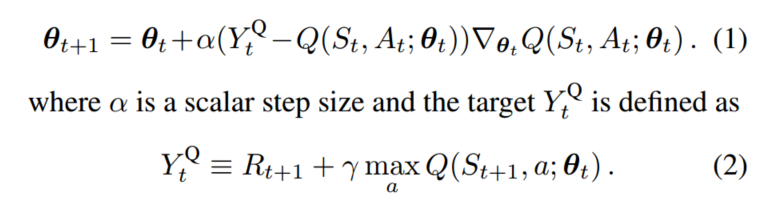
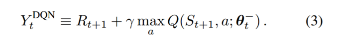
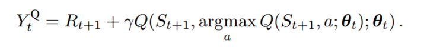
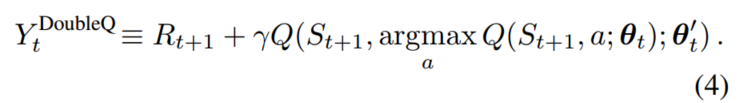
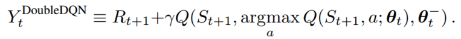
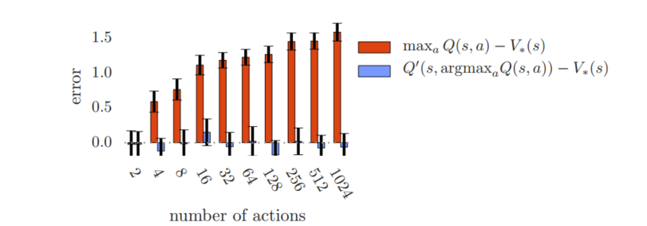
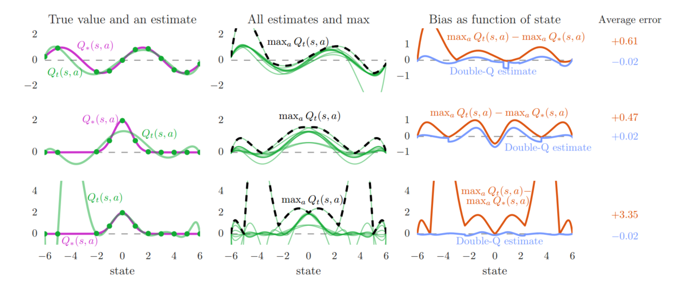
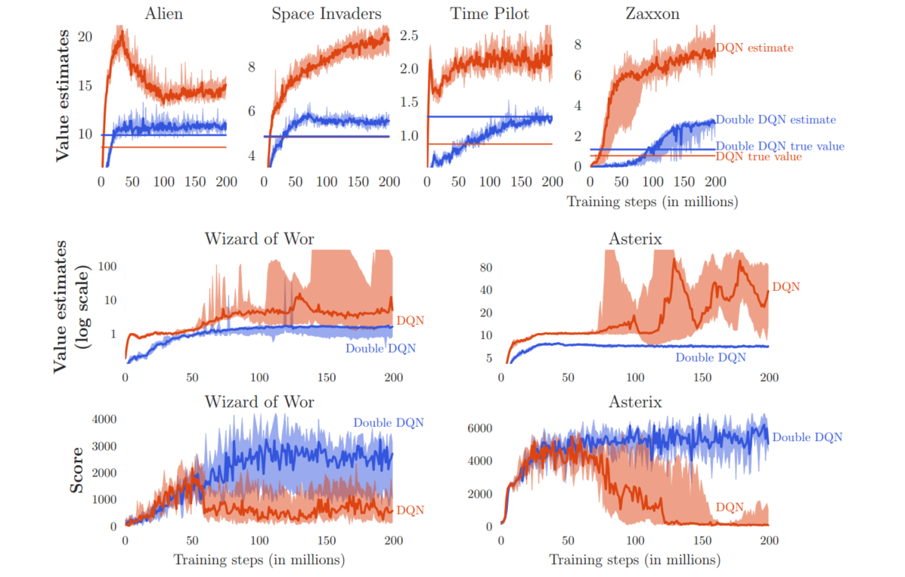

## 前言

> 在DDQN之前，基本所有的目标Q值都是通过贪婪法直接得到，无论是Q-learning还是DQN（Nature）。虽然DQN中用了两个Q网络并使用目标Q网络计算Q值，但是在得到a的过程中，还是使用的贪婪法计算得到。
>
> 使用max虽然可以让Q值向可能的优化目标靠拢，但是很容易过犹不及，导致过度估计，过度估计即最使得估计得值函数比值函数的真实值大，从而可能会影响最终的策略决策，导致最终的策略并非最优，而是次优

## 一、论文题目

> **Deep Reinforcement Learning with Double Q-learning** 

## 二、研究目标

> 改进目标Q网络算法解决DQN存在的过度估计问题

## 三、问题定义

> DQN的过度估计问题

- 如果过度估计确实存在，是否会对实践中的表现产生负面影响

## 四、DDQN介绍

### 4.1 Q-learning参数更新

> Q-learning在参数更新过程中，用于计算动作值函数的`Yt Q`网络的参数与值函数的Q网络参数相同，这样在数据样本和网络训练之间存在相关性

计算时，公式（2）里面是计算出最大的Q值（找出每个a对应的Q值，并求出最大值）

### 4.2 Deep Q Network参数更新

> DQN在Q-learning的基础之上引入了目标Q网络和经验回放，在进行参数更新的过程中，使用`Target Q`来计算动作值函数，`Target Q`网络和值函数的Q网络结构相同，并且初始参数相同，在固定的step下，将值函数的Q网络参数传递给Target Q网络参数，进行更新，打破了数据样本和网络训练之间的相关性

### 4.3 Double DQN 参数更新

#### 4.3.1 Double Q思想

> 在Q-learning和DQN中动作值函数都采用了max操作，可能会导致动作值函数的过度估计。为了防止这种情况，Double Q-leaning通过解耦目标Q值动作的选择与目标Q值的计算这两步，来消除过度估计得问题

可以将公式（2）修改为下图，在计算时，首先求出使得Q值最大的行为a，然后将该a作为当前状态的输入行为，求出Q值

#### 4.3.2 Double Q-learning

> 使用Q网络参数，估计贪婪政策的价值，并用`Target Q`网络的参数来公平的评估该策略的价值

#### 4.3.3 Double DQN

## 五、实验

### 5.1 Q-learning过度估计

> Q-learning的过度估计随着action的增加而增加，而Double Q-learning则是无偏的

### 5.2 真实action下的过度统计

> 过度估计可能会阻碍学习到最优策略，而使用Double Q-learning减少过度估计，策略会得到改善

### 5.3 DQN的过度估计分析

> Double DQN在值函数的准确性和策略质量方面都优于DQN

## 六、讨论

### 6.1 误差来源

- 环境噪声
- 函数近似
- 非平稳性

### 6.2 贡献

- 证明了Q学习在大规模问题中为什么会出现过度估计的情况
- 通过分析Atari游戏里的价值估计，发现这些过度估计在实践中比以前承认的更为普遍与严重
- 证明Double Q-learning可以大规模使用，能成功减少这种过度估计，是学习更加稳定可靠
- 提出了Douuble DQN算法
- 证明了Double DQN能找到更好测策略

## 总结

> Q-learning和DQN中的max操作使得估计得值函数比值函数的真实值大。
>
> 如果值函数每一点的值都被过估计了相同的幅度，即过估计量是均匀的，那么由于最优策略是贪婪策略，即找到最大的值函数所对应的动作，这时候最优策略是保持不变的。也就是说，在这种情况下，即使值函数被过估计了，也不影响最优的策略。强化学习的目标是找到最优的策略，而不是要得到值函数，所以这时候就算是值函数被过估计了，最终也不影响我们解决问题。然而，在实际情况中，过估计量并非是均匀的，因此值函数的过估计会影响最终的策略决策，从而导致最终的策略并非最优，而只是次优。
>
> 为了解决值函数过估计的问题，Double Q-learning 将动作的选择和动作的评估分别用不同的值函数实现

## 参考链接

- Double DQN理解：[传送门](https://www.cnblogs.com/pinard/p/9778063.html)

- Double DQN和DQN讨论：[传送门](http://www.broadview.com.cn/article/419382)

- 代码参考：[传送门](http://www.imooc.com/article/262461)