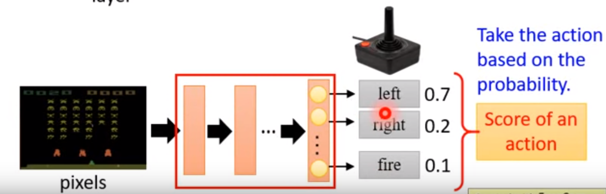
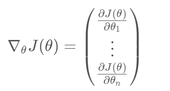
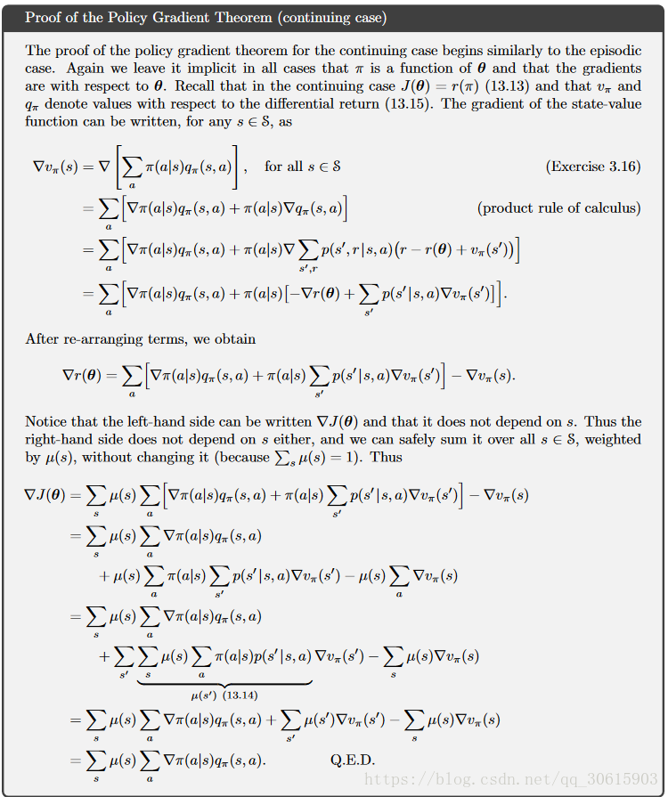
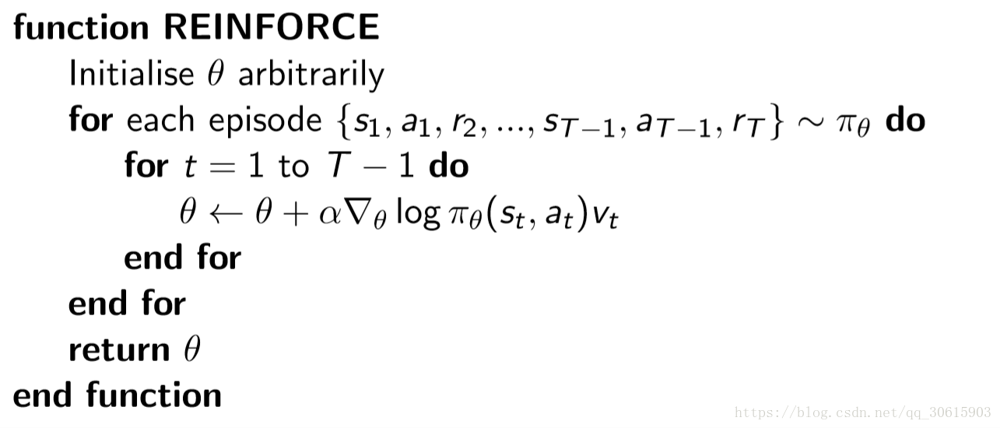

## 前言

> 在前面的四篇DQN强化学习算法中，主要是对价值函数进行了近似表示，这是只一种**基于价值函数（Value Based）**的方法，是基于状态价值函数V(s)或者动作价值函数Q(s,a)的控制问题解法。在确定性的环境中，当我们知道了每个状态价值函数V(s)的数值之后，策略就可以选择使得下一个状态期望状态价值函数最大的行动a。但是在随机的环境中状态价值函数V(s)就不太好用了，因为它不能直接指导我们进行行动的选择。因此，在控制问题中更常用的是动作价值函数Q(s,a)，它描述了在某个状态s下采取不同的行动a产生的期望收益。但是这是一种间接的做法，那有没有更直接的做法呢？
>
> 有！那就是**直接更新策略**。本文将介绍一种更为直接的方式解决强化学习中的控制问题--**策略梯度方法**，它属于另一类，即**基于策略的方法（Policy Based）**。

## 一、论文题目

> **Policy Gradient Methods for Reinforcement Learning with Function Approximation** 

## 二、研究目标

> 研究一种更直接的方法解决强化学习中的控制问题，之前的控制方法是一种间接方法

## 三、问题定义

### 3.1 Value Based方法的局限性

- 首先，它面向的是确定性策略，而最优策略通常是随机的
- 其次，DQN系列方法对连续动作的处理能力不足。如果在一个连续空间内挑选动作，则Q值将会在无穷多的动作中计算价值，从而选择行为，这可吃不消
- 最后，算法收敛障碍。一个行动的估计值的任意小的变化可以导致它被选择或不被选择，这种不连续变化是算法保证收敛的一个关键障碍

### 3.2 Policy Based方法的优缺点

**优点：**

- 连续的动作空间（高维空间）中更加高效
- 可以实现随机化的策略
- 某种情况下，价值函数可能比较难以计算，而策略函数比较容易

**缺点：**

- 通常收敛到局部最优而非全局最后
- 评估一个策略通常低效（这个过程可能慢，但是具有更高的可变性，其中也会出现很多并不有效的尝试，且方差高）

## 四、Policy Gradient算法介绍

### 4.1 Value Based网络

> 在Value Based强化学习方法中，我们对价值函数进行了近似表示，引入了一个动作价值函数Q，这个函数由参数w描述，并接受状态s与动作a的输入，计算后得到近似的动作价值，即：

$$
Q(s,a,w)\equiv\pi(s,a)
$$

### 4.2 Policy Network

> Policy Gradient 基本思想就是通过更新Policy Network来直接更新策略

**Policy Network：**实际上就是一个神经网络，**输入是状态，输出直接就是动作（不是Q值）**

输出一般有以下两种方式：

- **概率方式：**输出某一个动作的概率
- **确定性方式：**输出具体的某一个动作

举例如下图所示：输入当前的状态，输出action的概率分布，选择概率最大的一个action作为要执行的操作。

在Policy Based强化学习方法下，我们采样类似的思路，只不过这时我们对策略进行近似表示。此时策略π可以被描述为一个包含参数θ的函数,即：
$$
\pi_\theta(s,a) = P(a|s,\theta) \equiv\pi(a|s)
$$
**Policy Based的方法就是使用参数θ来逼近拟合状态值函数V_π（s）和状态动作值函数Q_π（s，a）的分布。**
$$
V_\theta(s) \equiv V_\pi(s)
$$

$$
Q_\theta(s,a) \equiv Q_\pi(s,a)
$$

将策略表示成一个连续的函数后，我们就可以用连续函数的优化方法来寻找最优的策略了。而最常用的方法就是**梯度上升法**了，那么这个梯度对应的优化目标如何定义呢？

### 4.3 更新Policy Network

> Policy Gradient不通过误差反向传播，它通过观测信息选出一个行为直接进行反向传播，当然出人意料的是他并没有误差，而是利用reward奖励直接对选择行为的可能性进行增强和减弱，好的行为会被增加下一次被选中的概率，不好的行为会被减弱下次被选中的概率。

如果要更新 Policy Network 策略网络，或者说要使用梯度上升的方法来更新网络，需要有一个目标函数，且此时的策略Policy参数化为
$$
\pi_\theta(s,a) = P(a|s,\theta) \equiv\pi(a|s)
$$
使用model-free的方法，不借助与agent做决策而是将agent丢入不确定的动态环境下，不提供动态环境的信息，让agent自己瞎溜达根据所获得的策略信息更新参数。

对于所有强化学习的任务来说，其实**目标都是使所有带衰减 reward 的累加期望最大**。即如下式所示
$$
J(\theta) = E{(r_1 + \gamma*r_2 + \gamma^2 * r_3 +...|\pi_\theta)}
$$

#### 4.3.1 策略梯度的目标函数

> 策略梯度的目标函数主要有以下三种方式

（1）最简单的目标函数就是初始状态收获的期望，即目标函数为：
$$
J_1(\theta) = V_{\pi\theta}(s1) = E_{\pi\theta}[v1]
$$
（2）有的问题没有明确的初始状态，那么我们的目标函数可以定义为平均价值，即
$$
J_{av}V(\theta) = \sum_s d^{\pi\theta}(s)V^{\pi\theta}(s)
$$
其中，$d^{\pi\theta}(s)$是基于策略πθ生成的马尔科夫链关于状态的静态分布

（3）使用每次time-step的平均奖励：
$$
J_{av}R(\theta) = \sum{_s}d^{\pi\theta}(s)\sum{_a}\pi_{\theta}(s,a)R^a_s
$$
为了改进策略，我们希望能够按照`J(θ)`的正梯度方向对π函数进行更新。假设θ是策略函数π的参数，本文的**第一个基本结论**为，无论上面哪种形式的`J(θ)`，其梯度都可以被表示为（后面会稍微证明一下）:
$$
\nabla_\theta J(\theta) = E_{\pi\theta}[\nabla_\theta log\pi_\theta (s,a)Q_\pi(s,a)]
$$
其中的
$$
\nabla_\theta log\pi_\theta (s,a)
$$
我们一般称为分值函数（score function）

我们暂定使用初始值法做目标函数
$$
J(\theta) = V^{\pi\theta}(s1) = E_{\pi\theta}[v1] = E(r_1 + \gamma * r_2 + \gamma^2 *r_3 + ......|\pi_\theta )
$$
对该目标函数进行最大化也就是在搜索一组参数向量θ，使得目标函数最大。这实际做的事改变策略概率而非改变行动轨迹的工作，所以我们接下来就要使用梯度下降求解
$$
\nabla_\theta J(\theta)
$$

在连续策略上选用Gaussian Policy，在离散策略下采用softmax Policy

#### 4.3.2 策略梯度定理（The policy gradient theorem）

> 由于我们是基于model-free的所以无法事先知道动态环境的状态分布，而奖励函数又依赖于动作和状态分布，所以无法进行求导，所以我们需要把奖励采用无偏估计的方法计算出来，首先随机采样然后取均值来估计

假设一个只有一步的MDP，对它使用策略梯度下降。πθ(s,a)表示关于参数θ的函数，映射是P(a|s,θ)。它在状态s所执行-a动作的奖励为r = R(s,a)。那么选择动作a的奖励为πθ(s,a) * R(s,a)：表示在该策略下所获得的奖励，在状态s的加权奖励为
$$
J(\theta) = \sum_{a \epsilon A}\pi_\theta(s,a)R(s,a)
$$
**推导过程如下：**

由于
$$
J(\theta) = E_{\pi\theta}[R(s,a)]
$$
因此
$$
J(\theta) = \sum_{s\epsilon S}d(s) \sum_{a \epsilon A } \pi_\theta(s,a) R(s,a)
$$
梯度为：
$$
\nabla_\theta J(\theta) = \nabla_\theta  \sum_{s\epsilon S}d(s) \sum_{a \epsilon A } \pi_\theta(s,a) R(s,a)
$$

$$
\nabla_\theta J(\theta) =\sum_{s\epsilon S}d(s)\sum_{a \epsilon A } \nabla_\theta \pi_\theta(s,a) R(s,a)
$$

假设策略πθ为零的时候可微，则
$$
\because (log_a y)' = \frac{y' }{y * ln  a} 
$$

$$
\therefore \nabla_\theta \pi_\theta(s,a) = \pi_\theta(s,a) * \frac{\nabla_\theta \pi_\theta(s,a)}  {\pi_\theta(s,a)} = \pi_\theta(s,a) *  \nabla_\theta log \pi_\theta(s,a)
$$

$$
\therefore \nabla_\theta J(\theta) = \sum_{s\epsilon S}d(s) \sum_{a \epsilon A } \pi_\theta(s,a)  \nabla_\theta log \pi_\theta(s,a)  R(s,a)
$$

其中，d(s)是策略中的状态分布，π(s,a)是当前状态的动作概率分布，所以可以将策略梯度恢复成期望形式
$$
\nabla_\theta J(\theta) = E[\nabla_\theta log \pi_\theta(s,a)  R(s,a)]
$$
且
$$
\nabla_\theta log \pi_\theta(s,a)
$$
为分值函数（score function）

然后在将似然率方式的策略梯度方法应用到多步MDPs上，此时因为奖励值应该为过程中的多步奖励值之和，在这里使用Qπ(s,a)代替单步奖励值R(s,a)，对于任意可微的**策略梯度**如下（**策略价值计算公式**）：
$$
\nabla_\theta J(\theta) = E_{\pi\theta}[\nabla_\theta log \pi_\theta(s,a) Q^{\pi\theta}(s,a)]
$$
策略梯度定理详细推导过程如下

策略梯度公式已经求出，并且我们的分值函数也能求出，但是关于策略函数πθ(s,a)又是如何确定的呢？

#### 4.3.3 策略函数的设计

> 常用的策略函数有两种，分别是softmax策略函数和高斯策略函数

现在回头看前面策略函数πθ(s,a)的设计，在之前它一直都是一个数学符号

- **softmax策略函数：**主要应用于**离散空间**，softmax策略函数使用描述状态和行为的特征
  $$
  \phi (s,a)
  $$
  与参数θ的线性组合来权衡一个行为发生的几率，即：
  $$
  \pi_\theta(s,a) = \frac{e^{\phi(s,a)^T \theta}}{ \sum_{b} e^{\phi(s,b)^T \theta}}
  $$
  其中，
  $$
  \phi_{sa}
  $$
  表示状态-动作对的L维特征向量

  所以，其分值函数为：
  $$
  \nabla_\theta log\pi_\theta(s,a) = \phi(s,a) - E_{\pi\theta}[\phi(s,\cdot)]
  $$
  
- **高斯策略函数：**应用于**连续行为空间**的一种常用策略，通常对于均值有一个参数化的表示，同样也可以是一些特征的线性代数和：
  $$
  \mu(s) = \phi(s)^T \theta 
  $$
  方差可以是固定值，也可以用参数化表示

  行为对应于一个具体的数值，该数值以从
  $$
  \mu(s)
  $$
  为均值，
  $$
  \sigma
  $$
  为标准差的高斯分布中随机采样产生：
  $$
  a \sim N(\mu(s),\sigma^2)
  $$
  对应的分值函数是：
  $$
  \nabla_\theta log \pi_\theta(s,a) = \frac{(a-\mu(s)) \phi(s)}{\sigma^2}
  $$
  有了策略梯度和策略函数，我们就可以得到第一版的策略梯度算法了

### 4.4 蒙特卡洛策略梯度reinforce算法(不带基数)

> 针对具有完整Episode的情况，我们应用策略梯度理论，使用随机梯度上升来更新参数，对于公式里的期望，我们通过采样的形式来替代，即时候用t时刻的奖励（return）作为当前策略下行为价值的无偏估计，表现为：返回v(t)作为Qπ（st，at）的无偏估计，使用价值函数V(s)近似代替了Qπ（s,a）

策略梯度就可以为：
$$
\Delta \theta_t = \alpha \nabla_\theta log \pi_\theta (s_t,a_t) v_t
$$
参数更新：
$$
\theta_{t+1} = \theta +\alpha \nabla_\theta log \pi_\theta (s_t,a_t) v_t
$$
**算法描述：**先随机初始化策略函数的参数θ，对当前策略下的一个Episode：
$$
{(s_1,a_1,r_2,...,s_{T-1},a_{T-1},r_T) \sim \pi_\theta}
$$
从t=1 到t = T-1的每一个时刻，计算个体获得的奖励v(t) ,然后更新参数θ。如此重复每一个Episode，直到结束.

算法伪代码如下：

需要注意的是：

- 只有当一个Episode结束之后，我们才能得到该轨迹上各个状态对应的v(t)。因此该方法需要先采样一个完整的轨迹，然后在倒回来对每个状态更新参数
- 上面描述的Vt就是奖励，使用v而不是G可能考虑的是用它作为价值的期望，从这里也能看出这是有噪声的采样

但是该方法虽然是无偏的，但是方差非常大，所以运行速度也很慢。这个时候可以提出一个baseline来减少方差，那么如何选择baseline？

### 4.5 蒙特卡洛策略梯度reinforce算法（带基数）

> 在某些情况下，可能会出现每一个动作的奖励值都是正数，但是由于我们是通过采样的方式进行更新的，所以这时候可以引入一个基数b，则原式需要修改为

$$
\nabla_\theta J(\theta) = E_{\pi\theta}[\nabla_\theta log \pi_\theta (s,a)[Q^{\pi\theta} (s,a) - b(s)]]
$$

## 总结

> PG算法主要是直接对策略进行更新，看过原文，对原文中有很多都没有较好的理解，因此就在网上浏览了很多的博客加强自己的理解，现在仍然比较懵，可能也是刚开始的原因，后面就要开始真真学习DRL的Policy Based方法了

## 参考链接

- [第七讲：强化学习策略梯度类方法](http://sealzhang.tk/iQuant/chapter_7.html)
- [强化学习笔记（3）-从Policy Gradient 到A3C](https://wulc.me/tags/%E5%BC%BA%E5%8C%96%E5%AD%A6%E4%B9%A0/)
- [Policy Gradient算法详解](https://blog.csdn.net/qq_30615903/article/details/80747380)
- [深入浅出介绍策略梯度](https://www.ibm.com/developerworks/cn/analytics/library/ba-lo-deep-introduce-policy-gradient/index.html)

- [文献笔记](https://www.cnblogs.com/statruidong/p/10663988.html)

- [强化学习 第七讲 策略梯度](https://zhuanlan.zhihu.com/p/28348110)