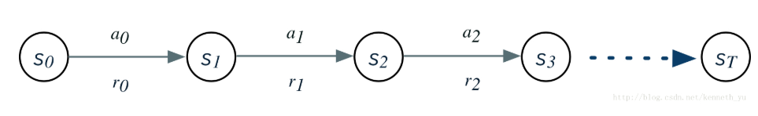
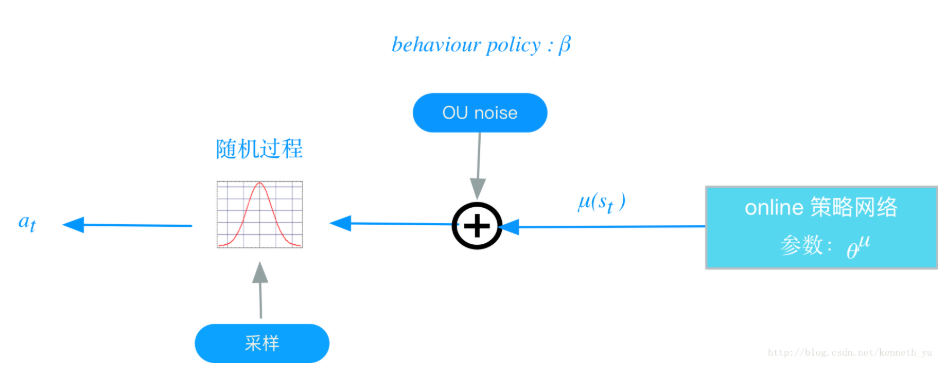
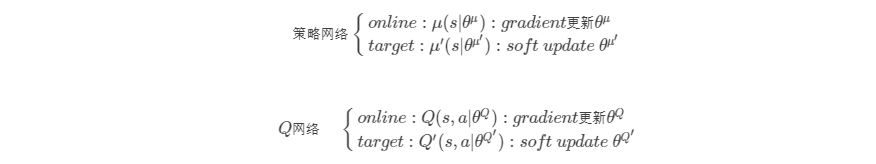
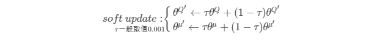
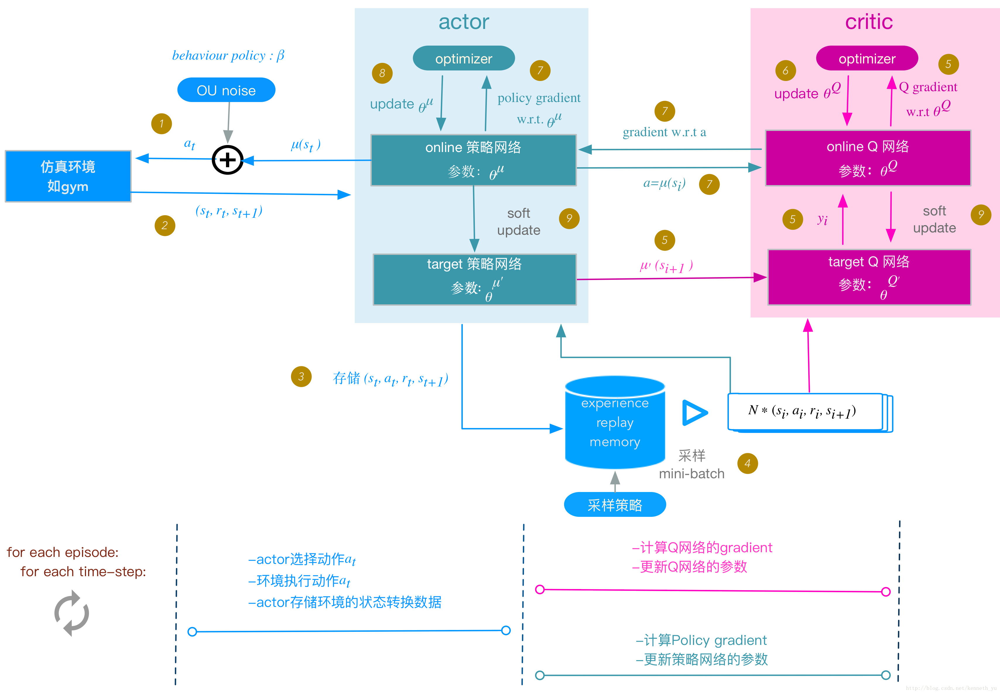
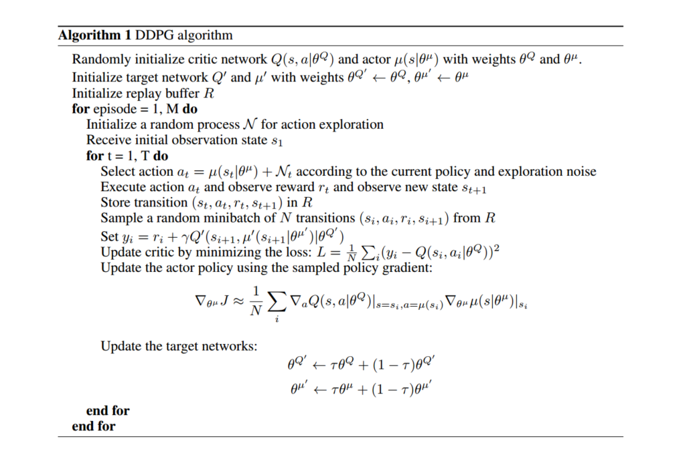
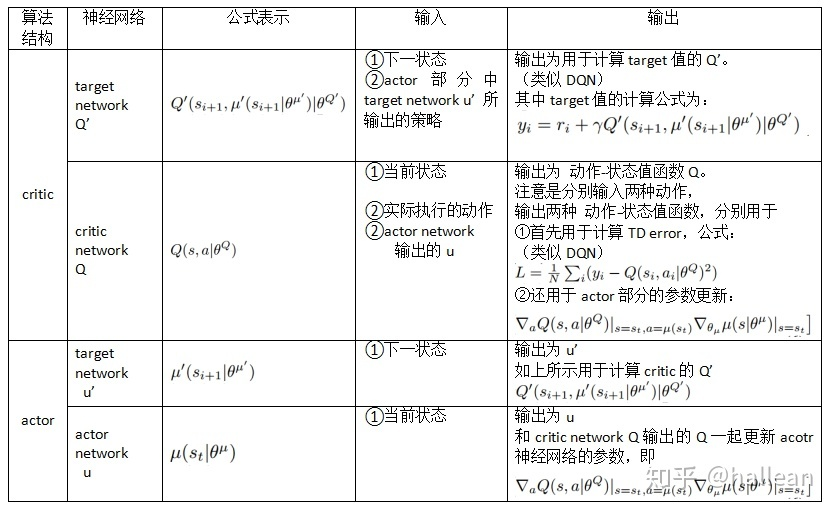

## 前言

> DDPG （Deep Deterministic Policy Gradient）算法是一种model-free（无环境模型），off-policy（产生行为的策略和进行评估的策略不一样）的强化学习算法，且使用了深度神经网络用于函数近似。相比较于DQN（model-free、off-policy），DQN只能解决离散、低维的动作空间，而DDPG可以解决**连续动作空间**的问题。

**背景：**

- **RL要解决的问题**：让agent学习在一个环境中如何选择行为动作（action），从而获得最大的奖励值总和（total reward）。这个奖励值一般与agent定义的任务目标关联
- **agent的主要学习内容**：第一是行为策略（action policy），第二是规划（planning）。其中行为策略的学习目标是最优策略，也就是使用这样的策略，可以让agent在特定的环境中的行为获得最大的奖励值，从而实现其目标任务。
- **行为（action）划分：**
  - 连续的：如赛车游戏中的方向盘角度、油门、刹车控制信号，机器人的关节伺服电机控制信号
  - 离散的：如围棋，贪吃蛇游戏。Alpha Go就是一个典型的离散行为agent

DDPG是针对连续行为的策略学习方法

## 一、论文题目

> **CONTINUOUS CONTROL WITH DEEP REINFORCEMENT LEARNING**

## 二、研究目标

> 研究一种新算法，解决Actor-Critic算法中难收敛和DQN算法中难以解决连续高维空间的问题

## 三、问题定义

- **DQN：**只能处理离散的、低维的动作空间

  > DQN不能直接处理连续动作空间的原因是因为它依赖于在每一次最优迭代中寻找动作-值函数的最大值（变现为在Q神经网络中输出每个动作的值函数），针对连续动作空间的DQN没有办法输出每个动作的动作-值函数

  如：一个具有6个关节的机械臂，每个关节的角度输出是连续值，假设范围是0~360度，归一化为（-1,1）。若把每个关节角取值范围离散化，比如精确到0.01，则一个关节有200个取值，那么6个关节共有$200^6$个取值，若进一步提升这个精度，取值的数量将成倍增加，而且动作的数量将随着自由度的增加成指数型增长。因此在连续的高维的控制问题中，无法用传统的DQN方法解决。

- **Actor-Critic：**DPG中的Actor-Critic算法相对较难以收敛

## 四、DDPG算法介绍

> DDPG组成：D（Deep） + D（Deterministic） + PG（Policy Gradient）
>
> - Deep：更深层次的网络结构
> - PG：策略梯度算法，能够在连续的动作空间根据所学习到的策略（动作分布）随机筛选动作
> - Deterministic：它的作用就是用来帮助PG不让它随机选择，只输出一个动作值

### 4.1 随机性策略和确定性策略

- **随机性策略**：策略输出的是动作的概率，使用一个正态分布对动作进行采样选择，即每个动作都有概率被选到
  - 输出：动作的概率，$\pi_\theta(a|s) = P[a|s;\theta]$
  - 优点：将策略探索和策略改进集中在一个策略中
  - 缺点：需要大量的训练数据
- 确定性策略：策略的输出是动作
  - 输出：确定的动作，$\pi_\theta(s) = a$
  - 优点：需要采样的数据少
  - 缺点：无法探索环境

在真实场景下机器人的操控任务中，在线收集并利用大量训练数据会产生十分昂贵的代价，并且动作连续的特性使得在线抽取批量轨迹的方式无法达到令人满意的覆盖面，这些问题会导致**局部最优解**的出现。

然后使用**确定性策略无法探索环境**，如何解决？

利用off-policy学习方法：off-policy是指采样的策略和改进的策略不是同一个策略。类似于DQN，使用随机策略产生样本存放到经验回放机制中，训练时抽取样本，改进的是当前的确定性策略。这个确定性策略的学习框架采用的是AC方法。

### 4.2 基本概念

- $s_t$：在t时刻，agent观察到的环境状态，如观察到的环境图像，或agent在环境中的位置、速度、机器人关节角度等

- $a_t$：在t时刻，agent选择的行为（action），通过环境执行后，环境状态由$s_t$转换为$s_{t+1}$

- $r(s_t,a_t)$函数（转移函数）：环境在$s_t$执行行为$a_t$后，返回的单步奖励值

  上面的关系可以用一个状态转换图来表示：

  

- $R_t$：是从当前状态直到将来某个状态，期间所有行为所获得奖励值的加权总和，即discounted future reward
  $$
  R_t = \sum_{i=t}^T \gamma^{i-t} r(s_i,a_i)
  $$
  其中，$\gamma$是discounted rate，表示折扣因子，$\gamma \epsilon[0,1]$，通常取0.99

- 动作-值函数（Q值）：
  $$
  Q^\pi(s_t,a_t) = E_{s\sim E,a\sim \pi}[R_t|s_t,a_t]
  $$
  用贝尔曼公式表达为：
  $$
  Q^\pi(s_t,a_t) = E_{r_t,s_{t+1}\sim E}[r(s_t,a_t) + \gamma E_{a_{t+1} \sim \pi}[Q^\pi(s_{t+1},a_{t+1})]]
  $$
  

### 4.3 策略梯度

#### 4.3.1 Policy Gradient（随机策略梯度）

> 通过一个概率分布函数$\pi_\theta(s_t|\theta^\pi)$，来表示每一步的最优策略，在每一步根据该概率分布进行action采样，获取当前的最佳action取值，即：$a_t \sim \pi_\theta(s_t|\theta^\pi)$

生成action的过程，本质上是一个随机过程，最后学习到的策略，也是一个随机策略（Stochastic policy）

**随机策略梯度的梯度计算公式**为：
$$
\begin{split} \nabla_\theta J(\pi_\theta) &= \int_S \rho^\pi(s)\int_A\nabla_\theta\pi_\theta(a|s)Q^\pi(s,a)dads \\ &=E_{s\sim\rho^\pi,a\sim\pi_\theta}[\nabla_\theta log\pi_\theta(a|s)Q^\pi(s,a)] \end{split}
$$
其中，$\rho^\pi$表示状态的采样空间，$\nabla_\theta log\pi_\theta(a|s)$是socre function，可以看出随机策略梯度需要在整个动作空间$\pi_\theta$进行采样

#### 4.3.2 DPG（确定性策略梯度）

> DPG每一步的行为通过函数$\mu$直接获得确定的值：$a_t = \mu(s_t|\theta^\mu)$

这个函数$\mu$即最优行为策略，不在是一个需要采样的随机策略。

为何需要确定性策略？简单来说，PG方法有以下缺陷：

1. 即使通过PG学习到了随机策略之后，在每一步行为时，我们还需要对得到的最优策略概率分布进行采样，这样才能获得action的具体值；而action通常是高维的向量，比如25维、50维，在高维的action空间中频繁采样，无疑是很耗费计算能力
2. 在PG的学习过程中，每一步计算policy gradient都需要在整个action 空间中进行积分：

$$
 \nabla_\theta J(\pi_\theta) = \int_S \rho^\pi(s)\int_A\nabla_\theta\pi_\theta(a|s)Q^\pi(s,a)dads
$$

​		这个积分部分一般通过蒙特卡洛采样来进行估算，需要在高维的action空间进行采样，耗费计算能力

但如果采取简单的Greedy策略，即每一步求解$argmax_aQ(s,a)$也不可行，因为在连续的、高维度的action空间中，如果每一步都求全局最优解，太耗费计算性能。

在这之前，业界普遍认为，环境模型无关（model free）的确定性策略是不存在的，在DPG的论文中，被证明存在。然后将DPG算法融合进AC框架，结合Q-learning或Gradient Q-learning这些传统的Q函数学习方法，经过训练得到一个确定性的最优行为策略函数。

**确定性策略梯度的梯度计算公式（on-policy）**为：
$$
\begin{split} \nabla_\theta J(\mu_\theta) &= \int_S \rho^\mu(s)\nabla_\theta \mu_\theta(s) \nabla_aQ^\mu(s,a)|_{a= \mu_\theta(s)}ds \\ &= E_{s\sim\rho^\mu}[\nabla_\theta \mu_\theta(s)  \nabla_aQ^\mu(s,a)|_{a= \mu_\theta(s)}]  \\ &= E_{s\sim\rho^\mu}[\nabla_\theta Q^\mu(s, \mu_\theta(s))] 
\end{split}
$$
跟随机策略梯度的式子相比，少了对动作的积分，多了回报Q函数对动作的导数

### 4.4 DDPG

> DDPG是将深度学习神经网络融合进DPG的策略学习方法。相对于DPG的核心改进是：采用卷积神经网络作为策略函数$\mu$和$Q$函数的模拟，即策略网络和$Q$网络；然后使用深度学习的方法来训练上述神经网络。
>
> Q函数的实现和训练方法，采用了DQN方法

#### 4.4.1 DDPG相关概念

- **策略改善：**用来更新策略，对应AC框架中的actor

  - 确定性行为策略$\mu$：定义一个函数，每一步的行为可以通过$a_t = \mu(s_t)$计算获得

  - 策略网络：用一个卷积神经网络对$\mu$函数进行模拟，这个网络我们称为策略网络，其参数为$\theta^\mu$

  - behavior policy（行为策略）$\beta $：在RL训练过程中，我们要兼顾2个e：exploration和exploit；exploration的目的是探索潜在的更优策略，所以训练过程中，我们为action的决策机制引入随机噪声：

    将action的决策从确定性过程变为一个随机过程，再从这个随机过程中采样得到action。下达给环境执行

    过程如下如所示：

    

    以上这个策略叫做behavior策略，用$\beta$来表示，这时RL的训练方式叫做off-policy。

    DDPG中，使用Uhlenbeck-Ornstein随机过程（简称UP过程），作为引入的随机噪声：UO过程在时序上具备很好的相关性，可以使agent很好的探索具备动量属性的环境。

    **注意：**

    - 这个$\beta$不是我们想要得到的最优策略，仅仅是在训练过程中，生成下达给环境的action，从而获得我们想要的数据集，比如状态转换（transitions）、或者agent的行走路径等，然后利用这个数据集去训练策略$\mu$，以获得最优策略
    - 在test和evaluation时，使用$\mu$而不会再使用$\beta$

- **策略评估：**用来逼近动作-值函数，并提供梯度信息，对应AC框架中的critic

  - 动作-值函数（Q函数）：即action-value函数，定义在状态$s_t$下，采取动作$a_t$后，且如果继续执行策略$\mu$的情况下，所获得的$R_t$期望值，用贝尔曼等式来定义：
    $$
    Q^\mu(s_t,a_t) = E[r(s_t,a_t) + \gamma Q^\mu(s_{t+1},\mu(s_{t+1}))]
    $$
    该公式的期望只与环境有关，所以用off-policy来学习$Q^\mu$，即用一个不同的随机策略$\beta$来生成状态行为轨迹。

  - Q网络：DDPG中，我们用一个卷积神经网络对Q函数进行模拟，这个网络我们称为Q网络，其参数为$\theta^Q$，采用了DQN相同的方法

  - 如何评估一个策略$\mu$的表现：用一个目标函数$J$来评估，我们叫做performance objective，针对off-policy学习的情况，目标函数定义如下：
    $$
    \begin{split} J_\beta(\mu) &= \int_S \rho^\beta(s) Q^\mu(s,\mu(s))ds \\
    &= E_{s \sim \rho^\beta}[Q^\mu(s,\mu(s))] \end{split}
    $$
    其中：

    - s是环境的状态，这些状态（或者说agent在环境中走过的状态路径）是基于agent的behavior策略产生的，它们的分布函数为$\rho^\beta$
    - $Q^\mu(s,\mu(s))$是在每个状态下，如果都按照$\mu$策略选择action时，能够产生的Q值，即$J_\beta(\mu)$是在$s$根据$\rho ^\beta$分布时，$Q^\mu(s,\mu(s))$的期望值

  - 训练的目标：最大化$J_\beta(\mu)$，同时最小化Q网络的Loss（后面给出）

  - 最优行为策略$\mu$的定义：即最大化$J_\beta(\mu)$的策略：
    $$
    \mu = argmax_\mu J(\mu)
    $$
    训练$\mu$网络的过程，就是寻找$\mu$网络参数$\theta^\mu$的最优解的过程，我们使用SGA（stochastic gradient asent）的方法，即随机梯度上升方法。

  - 最优Q网络定义：具备最小化的Q网络Loss；

    训练Q网络的过程，就是寻找Q网络参数$\theta^Q$的最优解的过程，我们使用SGD的方法

    **Q网络的Loss定义**：参考Q-learning、DQN 的方法，使用类似于监督学习的方法，定义loss为MSE：mean squared error：
    $$
    L = \frac{1}{N} \sum_i(y_i - Q(s_i,a_i|\theta^Q)^2)
    $$
    其中，$y_i = r_i + \gamma Q'(s_{i+1},\mu'(s_{i+1}|\theta^{\mu'})|\theta^{Q'})$，$y_i$可以看做为标签

    注意：

    - $y_i$的计算，使用的是target的策略网络$\mu'$和target Q网络$Q'$，这样做是为了Q网络参数的学习过程更加稳定，易于收敛
    - 这个标签本身依赖于我们正在学习的target策略，这是区别于监督学习的地方

#### 4.4.2 DDPG实现框架和算法

**online和target网络**

以往的实践证明，如果只使用单个“Q神经网络”的算法，学习过程很不稳定，因为Q网络的参数在频繁gradient update的同时，又用于计算Q网络和策略网络的gradient。基于此，DDPG分别为策略网络、Q网络各创建两个神经网络拷贝，一个叫做online，一个叫做target：

在训练完一个mini-batch的数据之后，通过SGA/SGD算法更新online网络的参数，然后再通过soft update算法更新target网络的参数，soft update是一种running average的算法：

- 优点：target网络参数变化小，用于在训练过程中计算online网络的gradient，比较稳定，训练易于收敛
- 缺点：参数变化小，学习过程慢

**DDPG框架图：**

**DDPG算法流程**

> 初始化AC的online神经网络参数:$\theta^Q$，$\theta^\mu$
>
> 将online网络的参数拷贝给对应的target网络参数：$\theta^{Q'} \leftarrow \theta^Q $，$\theta^{\mu'} \leftarrow \theta^\mu$
>
> 初始化Replay menory buffer $R$：（后面简称buffer）
>
> for each episode：
>
> ​	初始化UO随机过程；
>
> ​	for t = 1 , T：
>
> ​	下面额度步骤与上面图片（DDPG框架）中的步骤编号对应：
>
> ​		1、actor根据behavior策略选择一个$a_t$，下达给gym执行该$a_t$
> $$
> a_t = \mu(s_t | \theta^\mu) + N_t
> $$
> ​			behavior策略是一个根据当前online策略$\mu$和随机UO噪声生成的随机过程，从这个随机过程中采样获			得$a_t$的值
>
> ​		2、gym执行$a_t$，返回reward $r_t$和新的状态$s_{t+1}$
>
> ​		3、actor将这个状态转换过程（transition）:$(s_t,a_t,r_t,s_{t+1})$存入buffer $R $中，作为训练online网络的				数据集
>
> ​		4、从buffer $R$中，随机
>
> 采样$N$个transition数据，作为online策略网络、online Q网络的一个mini-			batch训练数据，我们用$(s_i,a_i,r_i,s_{i+1})$表示mini-batch中的单个transition数据
>
> ​		5、计算online Q网络的梯度
>
> ​			Q网络的loss：
> $$
> L = \frac{1}{N} \sum_i(y_i - Q(s_i,a_i|\theta^Q)^2)
> $$
> ​			其中，$y_i = r_i + \gamma Q'(s_{i+1},\mu'(s_{i+1}|\theta^{\mu'})|\theta^{Q'})$
>
> ​			基于反向传播，就可以求得$L $针对$\theta^Q$的梯度：$\nabla_{\theta^Q} L$
>
> ​		6、更新online Q网络：采用Adam optiminzer更新$\theta^Q$
>
> ​		7、计算策略网络的梯度
>
> ​			策略网络的梯度：
> $$
> \nabla_{\theta^\mu} J_\beta(\mu) \approx E_{s \sim \rho^\beta} [\nabla _a Q(s,a|\theta^Q)|_{a=\mu(s)}  \cdot \nabla_{\theta^\mu}\mu(s|\theta^\mu)]
> $$
> ​			即policy gradient是在$s$根据$\rho^\beta$分布时，$\nabla_a Q \cdot \nabla_{\theta^\mu} \mu$的期望值。我们用蒙特卡洛方法来估算这个期望			值：
>
> ​				在buffer中存储的（transition）：$(s_i,a_i,r_i,s_{i+1})$是基于agent的behavior策略$\beta$产生的，它们的			分布函数为$\rho^\beta$，所以当我们从buffer随机采样获得mini-batch数据时，根据蒙特卡洛方法，使用mini-			batch数据代入上述policy gadient公式，可以作为上述期望值的一个无偏估计，所以policy gradient			可以改写为：
> $$
> \nabla_{\theta^\mu} J_\beta(\mu) \approx \frac{1}{N} \sum_i(\nabla_aQ(s,a|\theta^Q)|_{s=s_i,a=\mu(s_i)} \cdot \nabla_{\theta^\mu}\mu(s|\theta^\mu)|_{s=s_i})
> $$
> ​		8、更新online 策略网络：采用Adam optimizer更新$\theta^\mu$
>
> ​		9、soft update target网络$\mu'$和$Q'$：
>
> ​			使用running average的方法，将online的参数，soft update给target网络的参数：
> $$
> \theta^{Q'} \leftarrow \tau \theta^Q + (1-\tau)\theta^{Q'}
> $$
> ​			
> $$
> \theta^{\mu'} \leftarrow \tau\theta^\mu + (1-\tau)\theta^{\mu'}
> $$
> ​			其中，$\tau$一般取值0.001
>
> ​	end for time step
>
> end for episode 

**原文DDPG算法流程**

**DDPG的输入输出图解**：

## 五、DDPG对于DPG的关键改进

- 使用卷积神经网络来模拟策略函数和Q函数，并用深度学习的方法来训练，证明了在RL方法中，非线性模拟函数的准确性和高性能、可收敛；

  而DPG中，可以看成使用线性回归的机器学习方法：使用带参数的线性函数来模拟策略函数函数和Q函数，然后使用线性回归的方法进行训练

- experience replay memory的使用：actor同环境交互时，产生的transition数据序列是在时间上高度关联的，如果这些数据直接用于训练，会导致神经网络的过拟合，不易收敛

- target网络和online网络的使用，使学习过程更加稳定，收敛更有保障

## 总结

> DDPG结合DQN和DPG的算法，解决了DQN只能运用在离散行为空间上的局限，同时借鉴DQN的神经网络、经验回放和设置target网络使DPG中的Actor-Critic算法更容易收敛
>
> 并且DDPG在对target网络的更新时和DQN有所区别：DQN中，每隔一定的迭代次数后，将online网络的参数复制给target网络；而DDPG中target网络的参数每次迭代都以微小量逼近online的参数

## 参考链接

> 主要参考了下面链接中的第一二条链接

- [Deep Reinforcement Learning-1.DDPG原理和算法](https://blog.csdn.net/kenneth_yu/article/details/78478356)

- [深度强化学习--连续动作控制DDPG、NAF](https://blog.csdn.net/u013236946/article/details/73243310)

- [DDPG论文笔记](https://zhuanlan.zhihu.com/p/26754280)
- [强化学习-DDPG算法详解](https://blog.csdn.net/qq_30615903/article/details/80776715)