## 前言

> DDQN对DQN的目标Q值进行优化，去除max操作来减少过度估计的问题，Prioritized Replay DQN对DQN的经验回访池进行优化，给每个experience一个权重值，并按权重采样来优化算法提高训练速度，而这篇博客即将介绍的是Dueling DQN，对DQN的神经网络结构进行优化

## 一、论文题目

> **Dueling Network Architectures for Deep Reinforcement Learning** 

## 二、研究目标

> 改进DQN的神经网络结构来加快学习速率

## 三、问题定义

> DQN的神经网络结构优化问题

- 以往的DQN网络最后的输出为每个action的Q-values值（在某个确定的状态下）。但是对于许多状态，根本没有必要去预测每个action对应的Q-value值

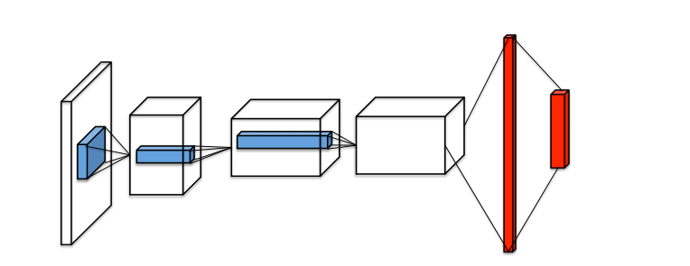

## 四、Dueling DQN方法介绍

> Dueling DQN将Q网络分成两部分:
>
> 第一部分仅仅与状态S有关，与具体要采用的动作A无关，这部分称为状态价值函数部分，记
> $$
> V(s;\theta,\beta)
> $$
> 第二部分同时与状态S和动作A有关，这部分称为动作优势函数，记
> $$
> A(s,a;\theta,\alpha)
> $$
> 其中，theta是卷积层参数，alpha和beta分别是两只路的全连接层参数

### 4.1 Dueling DQN网络结构

> Dueling DQN的网络结构如下图第二个网络结构

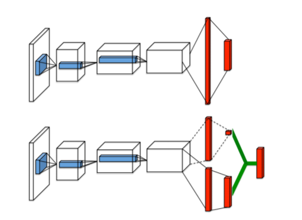

如上图所示，第一个网络结构是一般的DQN网络模型(**输入层**->**三个卷积层**->**两个全连接层**->**输出每个动作的Q值**)

而第二个网络结构则是本文即将介绍的Dueling DQN网络模型，Dueling DQN将卷积层提取的抽象特征分流到两个支路中。其中上路代表的是状态价值函数V（s），表示静态的状态环境下本身具有的价值，它表明了状态的好坏程度；下路代表的是依赖状态的动作优势函数A（s，a），表示在某个状态下，选择某个action额外带来的价值，它表明了在这个状态下各个动作的相对好坏程度。最后这两路聚合在一起得到每个动作的Q值。

最终Dueling DQN可以如下图：

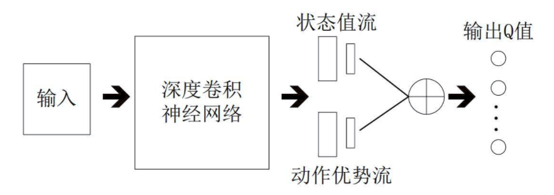

**注：**

- **V（s）：**V（s）表示状态本身的好坏，一般为**一个值**（标量）

- **A（s，a）：**A（s，a）表示当前状态下采取的行动的好坏，一般为**n个值**，因此A（s，a）决定了策略

### 4.2 Dueling DQN的Q值

> 由前面可知，Q值由V(s) 和A(s，a)合并得到，其Q值的公式如下

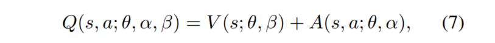

其中，theta是卷积层参数，beta是V(s)的全连接层参数，alpha是A(s，a)的全连接参数

但是上面的公式也存在一些问题，效果并不好，因为它不具备可辨识性：**通过Q值无法反过来确定V和A。**

因此，可以强制令所选择的贪婪动作优势函数为0：

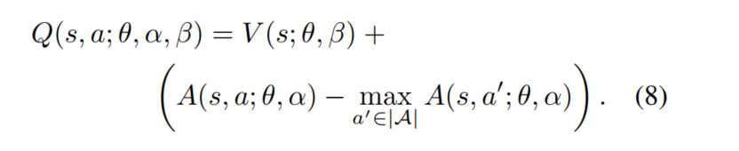

这样我们就能得到唯一的值函数：

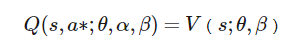

其中，a*如下：

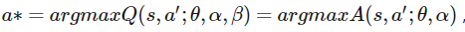

**说明：**在公式（8）中减去了一个最优的a所对应A值，这样A-A就为0了，A本身就是要寻找到最合适的a，然后确定A值，这样Q值就等于V值，并且V网络给出了最优V-值的估计，那么相应的A网络也给出了A的估计

但是在实际操作中，我们采用的方法是减去A的平均，本文的Dueling DQN方法就是采用的这种方式，因此，公式（8）修改为公式（9）：

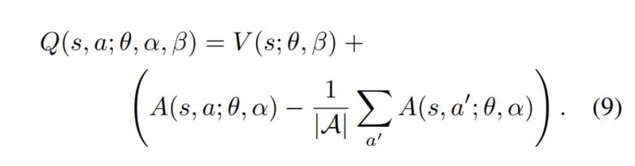

虽然这样得到的V和A不在是具有真实意义的V和A，但是能增加稳定性（因为采用 `-max`会在更新时损害最优A的值），并且通过减去A的平均能有以下三个优点：

- 平均值和最大值的测试结果非常类似，但是平均值公式比较简洁
- 没有改变A(s,a)的相对顺序，保证了该状态下各个动作的优势函数相对顺序不变，保留了Dueling DQN的Q值的所有性质
- 能够去除多余的自由度，提高算法的稳定性

### 4.3 举例说明

> Dueling DQN能学习到在没有动作的影响下环境状态的价值V(s)。如下图

下图中的左右两列分别表示V(s)和A(s,a)，图中的红色区域表示V(s)和A(s,a)所关注的地方

在训练过程中，V(s)关注地平线上是否有车辆出现（此时动作的选择影响不大）以及分数，如下图第一行；而A(s,a)则更关心会立即造成碰撞的车辆，此时动作的选择很重要，如下图第二行

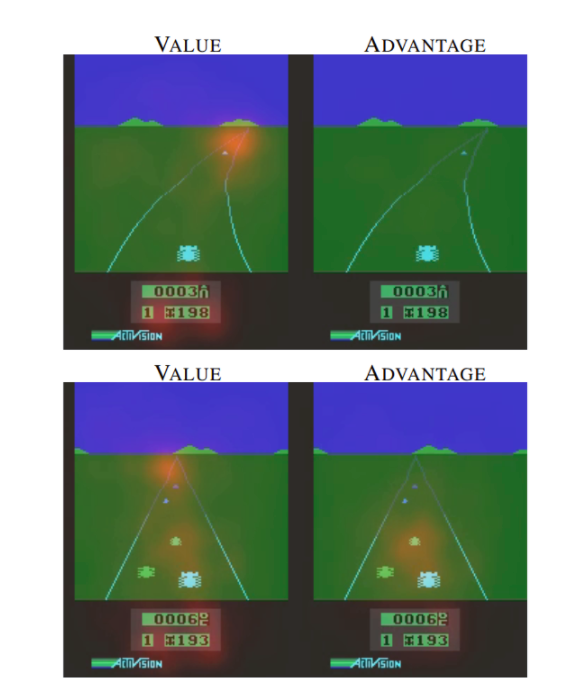

## 五、实验

### 5.2 实验方法

> 采用方法：Dueling DQN + DDQN + Prioritized Replay DQN

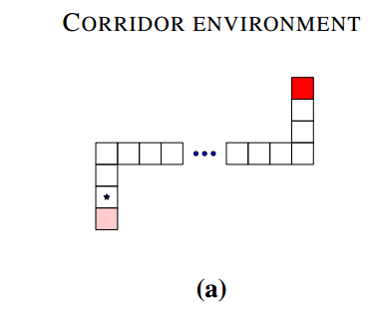

**MDP：**

- **状态集：**70（水平50，两垂直各10）
- **行为集：**5（上、下、左、右、无操作）
- **转换函数：**model free
- **奖励函数：**红点获得正面奖励
- **起始状态：**左下角
- **结束状态：**右下角

### 5.2 实验结果

> 当行为越多时，dueling DQN的性能就更好

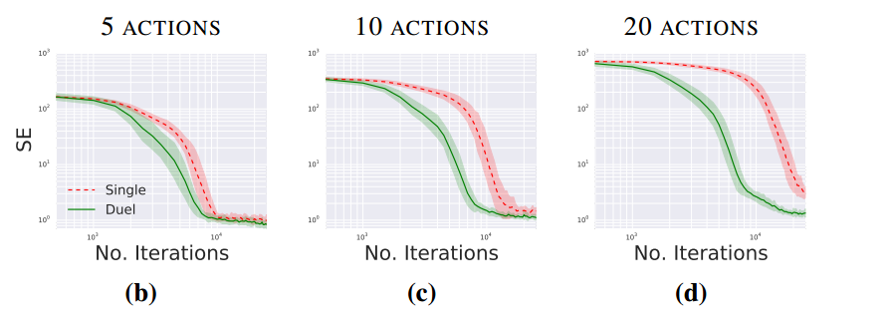

其中，5,10,20的含义是：5个行为时表示上下左右、无操作共五个，而10和20则分别是在5个行为的基础之上添加了5个和15个无操作行为。SE表示平方误差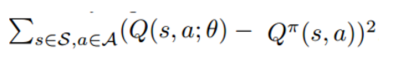

## 六、结论

> Dueling DQN的优势部分在于其有效学习状态值函数的能力

- V函数可以得到更多的学习机会，因为以往一次只更新一个动作对应的Q值
- V函数的泛化性更好，当动作越多时，优势越明显。直观上看，当有新动作加入时，它并不需要从零开始学习
- 因为Q函数在动作和状态的维度上的绝对值往往差很多，这会引起噪声和贪婪策略的突变，使用Dueling DQN可以改善这个问题

## 总结

> 到目前为止，关于DQN的方法和有关DQN的优化方面，算是已经全部阅读完了，后续要在开始看其他的DRL论文，后面要加强的是这几种方法的一些小训练测试

## 参考链接

- Dueling DQN论文理解：
  - [博文1](https://blog.csdn.net/u013236946/article/details/73161586)
  - [博文2](https://www.cnblogs.com/pinard/p/9923859.html)
  - [博文3](https://www.jianshu.com/p/0fb311d96da4)
  - [博文4](https://www.jianshu.com/p/0fb311d96da4)

- DQN代码（还没有测试过）：[博文1](http://lanbing510.info/2018/07/17/DQN.html)

