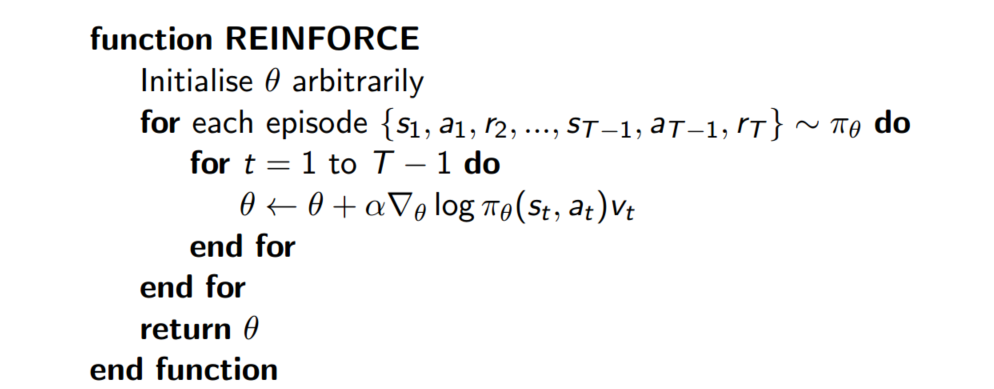
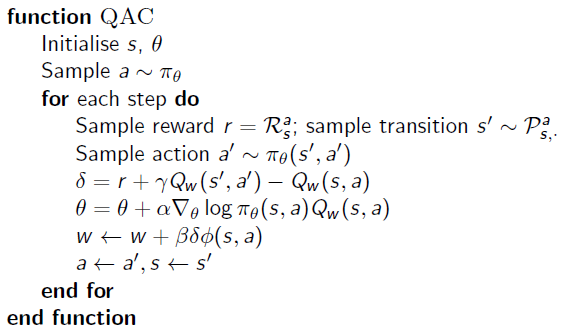
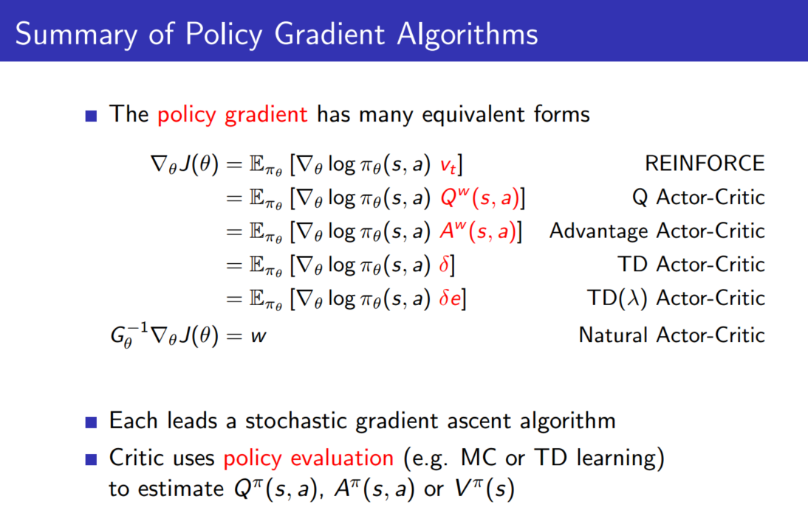
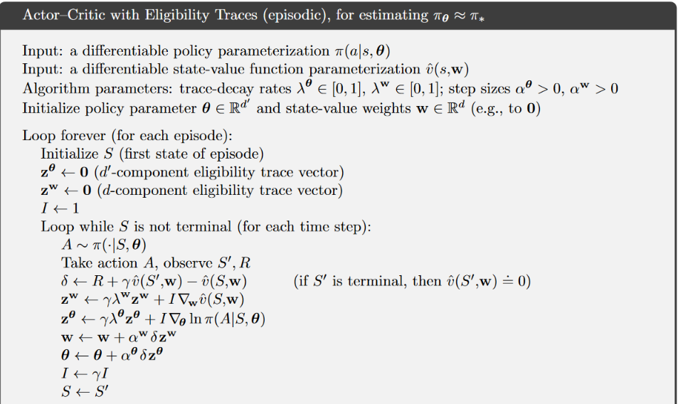

## 前言

> 在上一节中，讲到了基于Policy Based的强化学习方法，最后也涉及到了模特卡洛策略梯度reinforce算法，但是在计算之前，需要提前知道完整的状态序列，同时还需要单独对策略函数进行迭代更新，不太容易收敛，并且方差较大。
>
> 因此本篇笔记将讨论策略（Policy Based）和价值（Value Based）相结合的方法：Actor-Critic算法

## 一、Policy Gradient回顾

> 基于策略梯度的强化学习方法的基本思路是直接更新策略，即直接将参数策略化，并对策略进行近似表示。用公式表示为$\pi_\theta (s,a)= P(a|s,\theta)\approx \pi(a|s)$。利用参数化的线性、非线性函数表示策略，寻找最优策略，而这个最优策略的搜索即是要将某个目标函数最大化

### 1.1 策略目标函数

> 策略梯度的目标函数主要有以下三种方式

（1）Start Value：在能够产生完整episode的环境下，即agent可以达到某个终止状态时，可以用start value来衡量策略的优劣，就是初始状态s1的累计奖励：
$$
J_1(\theta) = V_{\pi \theta}(s1) = E_{\pi \theta}[v1]
$$
（2）Average Value：有的问题没有明确的初始状态，我们可以使用个状态的价值函数平均值：
$$
J_{av} V(\theta) = \sum_s d^{\pi \theta}(s) V^{\pi\theta}(s)
$$
（3）Average Reward per Time-Step：使用每一时间步长下的平均奖励：
$$
J_{av}R(\theta) = \sum_s d^{\pi \theta}(s) \sum_a\pi_\theta(s,a) R^a_s
$$
其中，$d^{\pi \theta}(s)$是关于策略$\pi\theta$生成的马尔科夫链关于状态的静态分布

**似然比（Likelihood Ratios）**：假设策略$\pi_\theta$是可导的且不等于0 ，则似然比为：
$$
 \nabla_\theta \pi_\theta(s,a) = \pi_\theta(s,a) * \frac{\nabla_\theta \pi_\theta(s,a)}  {\pi_\theta(s,a)} = \pi_\theta(s,a) *  \nabla_\theta log \pi_\theta(s,a)
$$
为了改进策略，我们希望能够按照$J(\theta)$ 的正梯度方向对$\pi_\theta$函数进行更新，因此无论是上面的哪一种目标函数，其**策略梯度**都可以被表示为
$$
\nabla_\theta J(\theta) = E_{\pi\theta}[\nabla_\theta log\pi_\theta (s,a)Q_\pi(s,a)]
$$

其中，$\nabla_\theta log\pi_\theta(s,a)$叫做Score Function

### 1.2 策略函数 

> 对于不同的情况，策略函数的选取也有所不同，对于**离散动作**，采用**Softmax Policy**，对于**连续动作**，采用**Gaussian Policy（高斯策略）**。

（1）**Softmax Policy：**用于离散动作：

​	
$$
\pi_\theta(s,a) = \frac{e^{\phi(s,a)^T \theta}}{ \sum_{b} e^{\phi(s,b)^T \theta}}
$$

$$
\nabla_\theta log\pi_\theta(s,a) = \phi(s,a) - E_{\pi\theta}[\phi(s,\cdot)]
$$

（2）**Gaussian Policy（高斯策略）**：用于连续动作：

​	均值为$\mu(s) = \phi(s) ^T \theta$，方差可以固定为$\sigma^2$，也可以参数化
$$
a \sim N(\mu(s),\sigma^2)
$$

$$
\nabla_\theta log \pi_\theta(s,a) = \frac{(a-\mu(s)) \phi(s)}{\sigma^2}
$$

### 1.3 策略梯度定理

（1）**单步（one-step）MDP**：初始状态$s\sim d(s)$，只经历一步得到一个即时奖励 $r = R_{s,a}$就终止，由于是单步MDP，所以三种目标函数都是一样的，使用似然比 来计算策略梯度：
$$
J(\theta) = E_{\pi \theta}[r] = \sum_{s \epsilon S}d(s) \sum_{a \epsilon A}\pi_\theta(s,a) R_{s,a}
$$

$$
\nabla_\theta J(\theta) = \sum_{s\epsilon S}d(s) \sum_{a \epsilon A } \pi_\theta(s,a)  \nabla_\theta log \pi_\theta(s,a)  R_{s,a} = E_{\pi \theta} [\nabla_\theta log \pi_\theta(s,a) r]
$$

（2）**多步（multistep）MDP：**如果是多步MDP，我们要用长时价值$Q^\pi(s,a)$来代替即时奖励r，并且有如下定理：对于$ J = J_1 ,J_{av}R,\frac{1}{1-\gamma} J_{av}V$ ，策略梯度都有
$$
\nabla_\theta J(\theta) = E_{\pi\theta}[\nabla_\theta log\pi_\theta (s,a)Q_\pi(s,a)]
$$
这样有了期望公式，我们就可以用蒙特卡洛采样的方法求出近似期望，用$v_t$ 作为$Q^\pi(s,a)$的无偏采样样本，则传统REINFORCE算法为：

**算法描述：**先随机初始化策略函数的参数$\theta$，对当前策略下的一个Episode：
$$
{(s_1,a_1,r_2,...,s_{T-1},a_{T-1},r_T) \sim \pi_\theta}
$$
从 t = 1 到 t =T-1的每一时刻，计算个体获得的奖励v(t)，然后更新参数$\theta$。如此重复每一个Episode，直到结束。

其中的策略梯度可以表示为：
$$
\Delta \theta_t = \alpha \nabla_\theta log \pi_\theta (s_t,a_t) v_t
$$
参数使用梯度上升法更新：
$$
\theta_{t+1} = \theta +\alpha \nabla_\theta log \pi_\theta (s_t,a_t) v_t
$$

## 二、Actor-Critic

> 蒙特卡洛策略梯度方法有着很高的方差，所以用一个Critic来估计行为价值函数
>
> $Q_w(s,a) \approx Q^{\pi_\theta}(s,a)$。所以Actor_Critic算法包含两种参数：
>
> - Critic：更新行为价值函数的参数w
> - Actor：更新策略的参数$\theta$，更新过程会受到Critic的价值函数的引导
>
> 加入了Actor-critic后的策略梯度公式则变为：
> $$
> \nabla_\theta J(\theta) \approx E_{\pi\theta}[\nabla_\theta log\pi_\theta (s,a)Q_w(s,a)]
> $$
>
> $$
> \Delta \theta = \alpha \nabla_\theta log \pi_\theta (s_t,a_t) Q_w(s,a)
> $$

### 2.1 简单描述Actor-Critic

- actor：行动者，对应policy
- critic：评论者，对应value function函数

### 2.2 为何引入Actor-Critic

- actor-only：将policy参数化，可以在算法过程中直接优化，因此action可以是连续的。优化方法通常为policy gradient方法，该方法的缺点是在估计梯度的是将会产生较大的方差，因为其更新的方式是回合制更新，因此导致学习速度较慢。

- critic-only：使用temporal difference（时间差分法）学习方法，估计过程中方差小。通常用greedy（贪心算法）或者$\varepsilon-greedy$（$\varepsilon$贪心算法）。$\varepsilon-greedy$可以有效的平衡exploration-exploitation的关系，即能探索新的action又能利用原有的经验生成最优的action，但通过greedy算法搜索最优action的计算量非常大，尤其是在action是连续的情况下，因此，critic-only通过将连续的action进行离散化，将优化问题变成一个枚举问题。
- actor-critic：整合了上诉两个方法的有点。低方差，连续action 。critic对当前的state以及cation的表现进行估计，得到value function，用来给actor更新梯度。低方差的代价实在学习开始时，由于critic的估计不够准确而使算法具有较大的偏差 。policy-gradient占了该算法的绝大部分，其中可以分为两种standard gradient以及natural gradient，另一部分更新actor。

### 2.3 Actor Critic策略梯度

> 因为蒙特卡洛策略梯度方法有着很高的方差，因此用一个Critic来估计行为价值函数$Q_w(s,a) \approx Q^{\pi_\theta}(s,a)$

Critic要做的事情其实我们已经见过：策略评估，他要告诉个体，在由参数$\theta$确定的策略$\pi _\theta$到底表现的怎么样。所以Actor_Critic算法包含两种参数：

- Critic：更新行为价值函数的参数w
- Actor：更新策略的参数$\theta$，更新过程会受到Critic的价值函数的引导

（1）一个简单的actor-critic算法可以使用基于行为价值的critic，它使用一个**线性价值函数**来近似状态行为价值函数：

​		$Q_w(s,a) = \phi(s,a)^Tw$

​		这里的$\phi(s,a)$是描述状态和行为的特征（L维向量），个人理解：一般可以看作为输入（即图像），然后进行矩阵转置，乘以参数$w$就表示为线性价值函数了。其中Critic通过线性近似的TD（0）更新$w$，Actor通过策略梯度更新$\theta$。

算法流程如下：

注：该算法仅是基于线性价值函数的近似的Actor-Critic算法。这是一个在线实时算法，针对每一步进行更新，不需要等到Episode结束。

用特征的线性组合来近似$Q_w(s,a)$进而求解策略梯度的方法引入了偏倚，一个偏倚的价值下得到的策略梯度不一定能最后找到较好的解决方案，例如当近似价值函数的$Q_w(s,a)$ 使用可能会引起状态重名的特征时，就不一定能解决问题了。不过幸运的是，如果我们小心设计近似的 $Q_w(s,a)$函数，是可以避免引入偏倚的，这样我们相当于遵循了准确的策略梯度。

（2） **兼容近似函数Compatible Function Approximation**

那怎么样才算是小心设计的$Q_w(s,a)$呢？需要满足下面两个条件：

- 近似价值函数的梯度完全等同于策略函数对数的梯度，即不存在重名（兼容）情况:
  $$
  \nabla_wQ_w(s,a) = \nabla_\theta log \pi_\theta(s,a)
  $$

- 价值函数参数$w$使得均方差最小		
  $$
  \varepsilon = E_{\pi \theta} [(Q^{\pi_\theta}(s,a) - Q_w(s,a))^2]
  $$
  符合这两个条件，则认为策略梯度是准确的，此时：
  $$
  \nabla_\theta J(\theta) \approx E_{\pi\theta}[\nabla_\theta log\pi_\theta (s,a)Q_w(s,a)]
  $$
  **证明过程**：

  ​	由于要估计Critic，即需要最小化均方差，如果要用参数$w$来使得均方差最小，则$w$一定为0 ，因此：
  $$
  \nabla_w \varepsilon = 0
  $$
  ​	
  $$
  \therefore \nabla_w \varepsilon = \nabla_w E_{\pi \theta}(s,a) [(Q^{\pi_\theta} - Q_w(s,a))^2] = E_{\pi \theta} [(Q^{\pi_\theta}(s,a) - Q_w(s,a))\nabla_wQ_w(s,a)] = 0
  $$
  ​	
  $$
  此时，如果  \nabla_wQ_w(s,a) = \nabla_\theta log \pi_\theta(s,a)
  $$
  ​	
  $$
  \therefore E_{\pi \theta} [(Q^{\pi_\theta}(s,a) - Q_w(s,a))\nabla_\theta log \pi_\theta(s,a)] = 0
  $$

  $$
  \therefore E_{\pi \theta}[Q^{\pi_\theta}(s,a) \nabla_\theta log \pi_\theta(s,a)] = E_{\pi \theta}[Q_w(s,a) \nabla_\theta log \pi_\theta(s,a)] 
  $$

  因此，就会认为策略梯度是准确的。但是如果两个条件都满足的话，整个算法相当于不需要使用critic，也就变成了传统的REINFORCE算法。所以在实践中，一般放宽条件2，更有利于通过时间差分学习到更有效的评估函数。所以策略评估通常使用蒙特卡洛策略评估、TD学习以及TD$(\lambda) $等，当然也可以使用最小方差法。具体见2.5节。

（3）**总结**

加了Actor Critic的策略梯度公式变为
$$
\nabla_\theta J(\theta) \approx E_{\pi\theta}[\nabla_\theta log\pi_\theta (s,a)Q_w(s,a)]
$$

梯度更新公式为：
$$
\theta = \theta + \alpha \nabla_\theta log \pi_\theta (s_t,a_t) Q_w(s,a)
$$
Actor Critic相比于之前的蒙特卡洛策略梯度REINFORCE方法，这里的$\nabla_\theta log \pi_\theta (s_t,a_t)$是我们的socre function，不变。变化的是原来的$v_t$不在是由蒙特卡洛方法采样得到，而是由Critic得到。

而对于Critic来说，这块知识是新的，不过我们可以参考之前DQN的做法，即用一个Q网络来作为critic，这个Q网络的输入可以是状态，输出是每个动作的价值或者最优动作的价值。

**总的来说，就是Critic通过Q网络计算状态的最优价值$v_t$，而Actor利用$v_t$这个最优价值迭代更新策略函数的参数$\theta$，进而选择动作，并得到反馈和新的状态，Critic使用反馈和新的状态更新Q网络参数w。**

### 2.4 Actor-Critic要点概括

**一句话概括Actor Critic方法**

> 结合了Policy Gradient（Actor）和Function Approximation（Critic）的方法。Actor基于概率选行为，Critic基于Actor的行为评判行为的得分，Actor根据Critic的评分修改选行为的概率。

- **Actor Critic方法优势：**可以进行单步更新，比传统的Policy Gradient要快
- **Actor Critic方法劣势：**取决于Critic的价值判断，但是Critic难收敛，在加上Actor的更新，就更难收敛。为了解决收敛问题，Google Deepmind提出了 Actor Critic升级版 Deep Deterministic Policy Gradient。后者融合了DQN的优势，解决了收敛难的问题。

### 2.5 Actor-Critic 的评估

> Actor-Critic的评估一般有以下几种方法，主要变化的是$Q_w  (s,a)$

（1）基于状态价值：这和之前的蒙特卡洛策略梯度REINFORCE方法一样，这时Actor的策略函数参数更新的法公式为：
$$
\theta = \theta + \alpha \nabla_\theta log \pi_\theta (s_t,a_t) V(s,w)
$$
（2）基于动作价值：在DQN中，我们一般使用的都是动作价值函数Q来做价值评估，这时Actor的策略函数参数更新的法公式为：
$$
\theta = \theta + \alpha \nabla_\theta log \pi_\theta (s_t,a_t) Q(s,a,w)
$$
（3）基于TD（时序差分法）误差：这时Actor的策略函数参数更新的法公式为：
$$
\theta = \theta + \alpha \nabla_\theta log \pi_\theta (s_t,a_t) \delta(t)
$$
​	其中，$\delta(t) = R_{t+1} + \gamma V(S_{t+1}) - V(s_t)$ 或者$\delta(t) = R_{t+1} + \gamma Q(S_{t+1} ,A_{t+1})-Q(S_t,A_t)$

（4）基于优势函数：和之前Dueling DQN中的优势函数一样，其优势函数A的定义为：$A(S,A,w,\beta) = Q(S,A,w,\alpha,\beta) - V(S,w,\alpha)$，即动作价值函数和状态价值函数的差值，这时Actor的策略函数参数更新的法公式为：
$$
\theta = \theta + \alpha \nabla_\theta log \pi_\theta (s_t,a_t)A(S,A,w,\beta)
$$
（5）基于TD($\lambda$)误差：一般都是基于后向TD($\lambda $)误差，是TD误差和效用迹E的乘积，这时Actor的策略函数参数更新

的法公式是：
$$
\theta = \theta + \alpha \delta(t)E(t)
$$
​		其中，$\delta(t) = R_{t+1} + \gamma V(S_{t+1}) - V(s_t)$，$E(t) = \gamma \lambda E_{t-1} + \nabla_\theta log \pi_\theta (s_t,a_t)$

​		当$\lambda = 0$时，就是第（2）步的普通TD方法

对于Critic本身的模型参数w，一般都是使用均方误差损失函数来做迭代更新，类似于之前DQN中所讲到的迭代方法。如果我们使用的是最简单的线性Q函数，比如$Q(s,a,w) = \phi(s,a)^T w$，则Critic本身的模型参数w的更新公式可以表示为：
$$
\delta(t) = R_{t+1} + \gamma Q(S_{t+1} ,A_{t+1})-Q(S_t,A_t)
$$

$$
w = w + \beta \delta\phi(s,a)
$$

通过对均方误差损失函数求导可以很容易的得到上式，当然实际应用中，一般不使用线性Q函数，而使用神经网络表示状态和Q值的关系。

### 2.6 Actor-Critic算法流程

> 在网上找的关于Actor-Critic的算法流程

而这个是刘建平博客里的算法流程介绍：

算法流程这一块，暂时也不好理解，也确实没有搜到到底哪一个才是真正的算法流程，后面再看代码去加深理解吧

## 总结

> 首先，在网上找的关于Actor-Critic的论文阅读，阅读过程一脸懵逼，没办法，后来又在网上找了很多的博客，通过浏览别人的博客进行理解。
>
> 阅读的原论文题目是：**Actor-Critic Algorithms** ，然后网上又有好多的论文笔记是关于这一篇的：**Soft Actor-Critic: Off-Policy Maximum Entropy Deep Reinforcement Learning with a Stochastic Actor** 具体的，我也不知道是看哪一篇，只知道前一篇Actor-Critic Algorithms的引用次数多。因此阅读的前一篇，后面的一篇soft的暂时还没有阅读。

## 参考链接

> 主要参考了刘建平的博客笔记和Fisher's Blog，还有一些其他人的博客笔记，感谢他们的笔记

- [策略梯度 Policy Gradient](https://bluefisher.github.io/2018/05/10/%E7%AD%96%E7%95%A5%E6%A2%AF%E5%BA%A6-Policy-Gradient/)

- [强化学习（十四）Actor-Critic](https://www.cnblogs.com/pinard/p/10272023.html)

- [Actor Critic（Tensorflow）-莫烦](https://morvanzhou.github.io/tutorials/machine-learning/reinforcement-learning/6-1-actor-critic/)

- [强化学习actor-critic算法](https://blog.csdn.net/zkq_1986/article/details/80328264)

- [强化学习 Actor-Critic算法详解](https://blog.csdn.net/qq_30615903/article/details/80774384)

- [UCL的强化学习第7讲](http://www0.cs.ucl.ac.uk/staff/d.silver/web/Teaching_files/pg.pdf)

- [强化学习第七讲策略梯度](https://zhuanlan.zhihu.com/p/28348110)

相关笔记：

- [演员-评论家方法（Actor-Critic）](https://www.jianshu.com/p/c2920d207275)

- [Actor-Critic算法小结](https://zhuanlan.zhihu.com/p/29486661)

- [强化学习--策略梯度与Actor-Critic算法](https://zhuanlan.zhihu.com/p/36494307)