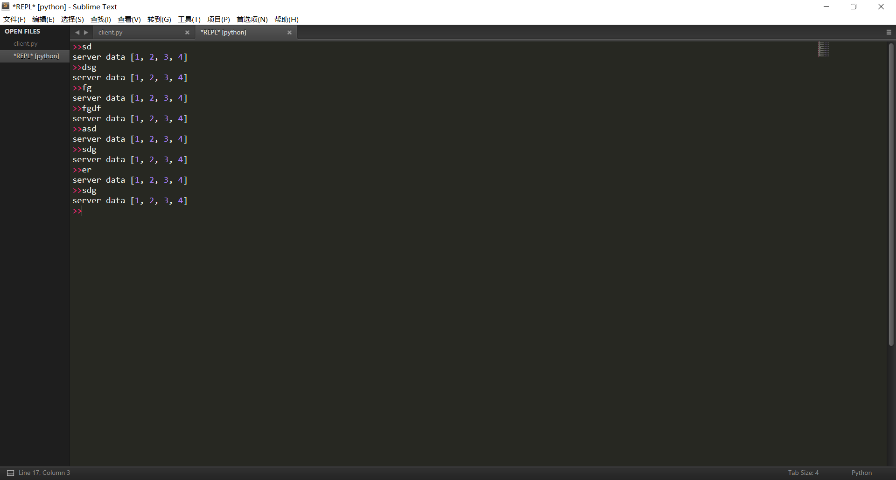
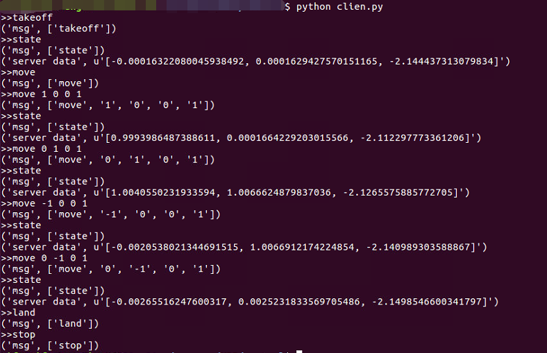
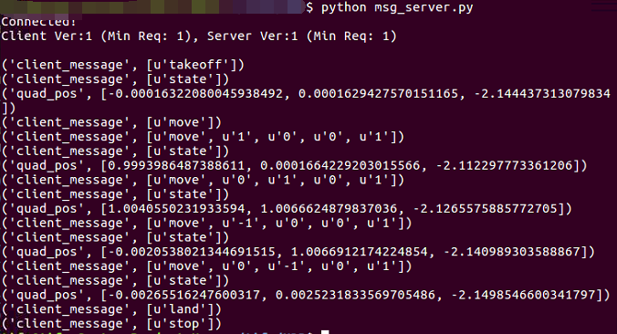
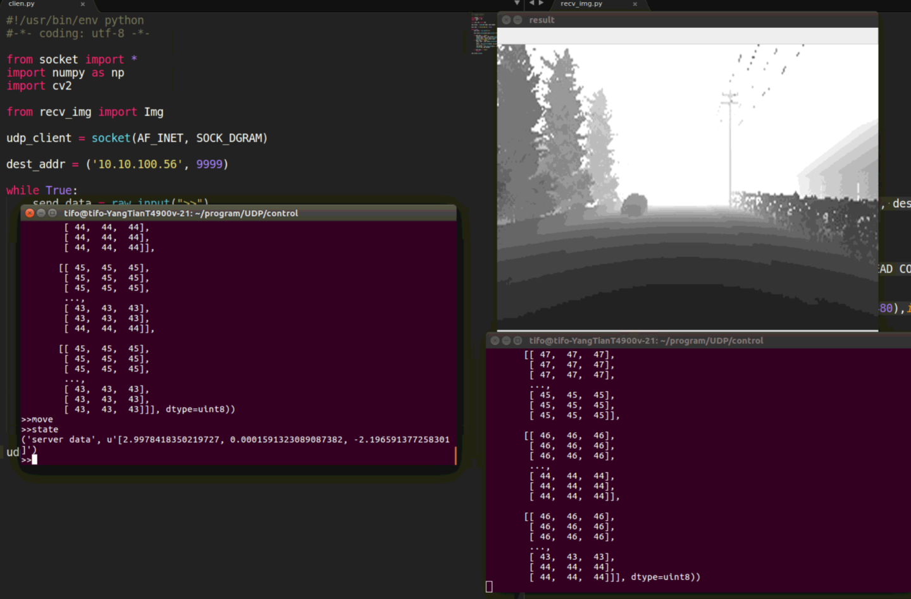

## 前言

> 在机器人的运动控制过程中，关于多机通信控制，除了用ros外，还可以进行网络编程，这里就用的是UDP编程实现两台电脑间的通信

## 两台电脑信息

> A电脑用于服务端，B电脑用于客户端

- A电脑：10.10.100.56
- B电脑：10.10.100.54

**注：两台电脑必须在同一个局域网内**

## 一、UDP简单样例

### 1.1 本地测试（服务端单向接收客户端数据）

- server.py

  > 服务端，用于接收客户端传来的数据

  ```python
  #-*- coding: utf-8 -*-
  from socket import *
  
  udp_server = socket(AF_INET, SOCK_DGRAM) # 创建UDP套接字(SOCK_DGRAM为UDP)
  local_addr = ('127.0.0.1', 9999) #由于是本地，ip可以设置为127.0.0.1，并且自定义设置端口
  udp_server.bind(local_addr)	# 绑定ip和端口
  
  while True:
  	client_data,addr = udp_server.recvfrom(1024) #1024表示本次接收的最大字节数
  	client_data = client_data.decode('utf-8') #对client传过来的数据进行解码
  	print(client_data) #client_data 为client传过来的数据信息
  	print(addr) #addr为client的ip和端口
      
  	if client_data == "stop":
  		break
  udp_server.close() #关闭套接字
  ```

- client.py

  > 客户端，用于发送数据给服务端

  ```python
  #-*- coding: utf-8 -*-
  from socket import *
  
  udp_client = socket(AF_INET, SOCK_DGRAM) # 创建udp套接字(SOCK_DGRAM为UDP)
  #设置服务端的IP地址和端口
  dest_addr = ('127.0.0.1', 9999)  # 注意 是元组，ip是字符串，端口是数字
  
  while True:
  	send_data = input(">>") #待发送的数据，从键盘获取
  	udp_client.sendto(send_data.encode('utf-8'), dest_addr) # 发送数据到指定的电脑上的指定程序中
  	if send_data == "stop": 
  		break
  udp_client.close() #关闭套接字
  ```

###  1.2 两台电脑间通信（同时发送与接收）

- server.py

  > 使用A电脑作为服务端，服务端ip为10.10.100.56

  ```python
  #-*- coding: utf-8 -*-
  
  from socket import *
  udp_server = socket(AF_INET, SOCK_DGRAM)
  local_addr = ('10.10.100.56', 7996)
  udp_server.bind(local_addr)
  
  while True:
  	client_data,addr = udp_server.recvfrom(1024) #接收来自client的数据
  	client_data = client_data.decode('utf-8')
  	print(client_data)
  	print(addr) 
      
      udp_server.sendto(client_data,addr) #数据原样返回给客户端
  	if recv_result == "stop":
  		break
  udp_server.close()
  ```

  

- client.py

  > B电脑作为客户端，客户端ip地址为10.10.100.54

```python
#-*- coding: utf-8 -*-
from socket import *

udp_client = socket(AF_INET, SOCK_DGRAM) 
dest_addr = ('10.10.100.56', 7996)  #这里的ip和端口要保持和server一致

while True:
	send_data = input(">>") 
	udp_client.sendto(send_data.encode('utf-8'), dest_addr) #发送数据到服务端
    server_data,addr = udp_client.recvfrom(1024)# 接收服务端数据
    server_data = server_data.decode("utf-8")
    print('server data',server_data)
	if send_data == "stop": 
		break
udp_client.close() 
```

- 运行结果显示

  ```python
  >>state
  server data state
  >>takeoff
  server data takeoff
  >>move
  server data move
  >>state
  server data state
  >>land
  server data land
  >>
  ```

## 二、UDP发送列表数据（json）

> 在第一步的样例中，UDP发送和接收的都是一串字符串数据，而有时候服务端返回的数据是一个列表信息，如坐标（x,y,z），此时用字符串信息返回就比较麻烦，需要在客户端和服务端都做一些相应的转化。因此，为了解决该问题，可以使用python的json库

### 2.1 python对象转换为json字符串（json.dumps函数）

> 下面的是自己的电脑与B电脑进行通信测试的，不是A与B之间的通信

将B电脑作为服务端：10.10.100.54，进行测试

- server.py

```python
#!/usr/bin/env python
#-*- coding: utf-8 -*-

from socket import *
import json

udp_server = socket(AF_INET, SOCK_DGRAM)
local_addr = ('10.10.100.54', 7996) 
udp_server.bind(local_addr)


while True:
	client_data,addr = udp_server.recvfrom(1024) 
	client_data = client_data.decode('utf-8')
	print(client_data)
    
    # json样例测试
	mylist = [1,2,3,4]
	json_string = json.dumps(mylist)
	udp_server.sendto(json_string,addr)

	if recv_result == "stop":
		break
udp_socket.close()
```

- client.py不变

结果显示



### 2.2 json字符串转换为python对象（json.loads函数）

> 这里将只给出核心部分
>
> 为什么要做json字符串转python对象？因为有时候从客户端发送过去的数据也是一个列表信息，如发送xyz的速度控制，要根据xyz值的不同进行相应的操作，此时就最好是传输python对象比较好

- server.py

  ```python
  import json
  
  while True:
  	client_data,addr = udp_server.recvfrom(1024) 
  	client_data = client_data.decode('utf-8')
      client_data = json.loads(client_data)
      print('client_message',client_data)
      
      if client_data[0] == 'state':
          quad_pos = ...
          print('quad_pos',quad_pos)
      	json_string = json.dumps(quad_pos) #python对象转json字符串
          udp_server.sendto(json_string,addr)
      elif client_data[0] == 'takeoff':
          ...
      elif client_data[0] == 'move' and len(client_data) == 5:
          vx,vy,vz,t = int(client_data[1]),int(client_data[2]),int(client_data[3]),int(client_data[4])
          ...
  ```

- client.py

  ```python
  import json
  while True:
  	send_data = input(">>")
  	msg = send_data.split(' ')
  	print('msg',msg)
  	json_string = json.dumps(msg) #转换成json字符串
  	udp_client.sendto(json_string, dest_addr)
      
  	if send_data == 'state':
  		server_data,addr = udp_client.recvfrom(1024)
  		server_data = server_data.decode("utf-8")
  		print('server data',server_data)
  
  	if send_data == "stop":
  		break
  ```

  结果显示：

  - 客户端的输入输出显示

    

  - 服务端的输出显示
  
    


## 三、UDP传输图像

> 用opencv来读取和显示，因此需要先安装opencv

```python
sudo proxychains4 pip install opencv-python
```

### 3.1 Python获取本地摄像头并显示

```python
import cv2
import numpy as np

cap = cv2.VideoCapture(0)
while(1):
	if cap.isOpened():
	    # get a frame
	    ret, frame = cap.read()
	    # show a frame
	    cv2.imshow("capture", frame)
	    if cv2.waitKey(1) & 0xFF == ord('q'):
	        break
cap.release()
cv2.destroyAllWindows() 
```

### 3.2 UDP传输图片并显示（小尺寸图片）

> 如果图片太大，则下面的代码将会报错

- server.py

  ```python
  # -*- coding: utf-8 -*-
  
  import socket
  import cv2
  import numpy as np
  
  s = socket.socket(socket.AF_INET, socket.SOCK_DGRAM)
  
  # 绑定端口:
  s.bind(('10.10.100.54', 9999))
  
  print('Bind UDP on 9999...')
  
  while True:
      # 接收数据:
      data, addr = s.recvfrom(400000)
      print('Received from %s:%s.' % addr)
      #解码
      nparr = np.fromstring(data, np.uint8)
      #解码成图片numpy
      img_decode = cv2.imdecode(nparr, cv2.IMREAD_COLOR)
      cv2.imshow('result',img_decode)
      cv2.waitKey()
      reply = "get message!!!"
      s.sendto(reply.encode('utf-8'), addr)
      cv2.destroyAllWindows()
  ```

- client.py

  ```python
  # -*- coding: utf-8 -*-
  import socket
  import cv2
  import numpy as np
  
  s = socket.socket(socket.AF_INET, socket.SOCK_DGRAM)
  
  img = cv2.imread('view.jpg')
  img_encode = cv2.imencode('.jpg', img)[1]
  data_encode = np.array(img_encode)
  data = data_encode.tostring()
  
  # 发送数据:
  s.sendto(data, ('10.10.100.54', 9999))
  # 接收数据:
  print(s.recv(1024).decode('utf-8'))
  
  s.close()
  ```

### 3.3 UDP传输视频流信息

- server.py

  ```python
  # -*- coding: utf-8 -*-
  import cv2
  import numpy
  import socket
  import struct
  
  HOST='10.10.100.54'
  PORT=9999
  buffSize=65535
  
  server=socket.socket(socket.AF_INET,socket.SOCK_DGRAM) #创建socket对象
  server.bind((HOST,PORT))
  print('now waiting for frames...')
  while True:
      data,address=server.recvfrom(buffSize) #先接收的是字节长度
      if len(data)==1 and data[0]==1: #如果收到关闭消息则停止程序
          server.close()
          cv2.destroyAllWindows()
          exit()
      if len(data)!=4: #进行简单的校验，长度值是int类型，占四个字节
          length=0
      else:
          length=struct.unpack('i',data)[0] #长度值
      data,address=server.recvfrom(buffSize) #接收编码图像数据
      if length!=len(data): #进行简单的校验
          continue
      data=numpy.array(bytearray(data)) #格式转换
      imgdecode=cv2.imdecode(data,1) #解码
      print('have received one frame')
      cv2.imshow('frames',imgdecode) #窗口显示
      if cv2.waitKey(1)==27: #按下“ESC”退出
          break
  server.close()
  cv2.destroyAllWindows()
  ```

- client.py

  ```python
  # -*- coding: utf-8 -*-
  import cv2
  import numpy
  import socket
  import struct
  
  HOST='10.10.100.54'
  PORT=9999
  
  server=socket.socket(socket.AF_INET,socket.SOCK_DGRAM) #socket对象
  server.connect((HOST,PORT))
  print('now starting to send frames...')
  capture=cv2.VideoCapture(0) #VideoCapture对象，可获取摄像头设备的数据
  try:
  	while True:
  		if capture.isOpened():
  			success,frame=capture.read()
              #frame = cv2.imread('normal.jpg) 以图片形式发送
  			result,imgencode=cv2.imencode('.jpg',frame,[cv2.IMWRITE_JPEG_QUALITY,50])  #编码
  			server.sendall(struct.pack('i',imgencode.shape[0])) #发送编码后的字节长度，这个值不是固定的
  			server.sendall(imgencode) #发送视频帧数据
  			print('have sent one frame')
  except Exception as e:
  	print(e)
  	server.sendall(struct.pack('c',1)) #发送关闭消息
  	capture.release()
  	server.close()
  ```

## 四、Arisim的UDP通信代码实例

### 4.1 服务端

- connect_simulator.py

  > 用于连接Airsim

  ```python
  #!/usr/bin/env python
  #-*- coding: utf-8 -*-
  
  import airsim
  
  class Connect(object):
  
  	def __init__(self):
  		self.client = airsim.MultirotorClient()
  		self.client.confirmConnection()
  		self.client.enableApiControl(True)
  		self.client.armDisarm(True)
  ```

  

- msg_server.py

  > 接收client传来的特定的消息，并根据适当的消息返回姿态数据和图像数据

  ```python
  #!/usr/bin/env python
  #-*- coding: utf-8 -*-
  
  # python library
  from socket import *
  import json
  from PIL import Image 
  import numpy as np 
  import cv2
  import threading
  
  # airsim
  from connect_simulator import Connect 
  import airsim
  
  # udp
  dest_ip = '10.10.100.56'
  msg_port = 9999
  
  # connect the airsim simulator
  client = Connect().client
  
  
  # image transform
  def transform_input(responses, img_height, img_width):
  	img1d = np.array(responses[0].image_data_float, dtype=np.float)
  	img1d = np.array(np.clip(255 * 3 * img1d, 0, 255), dtype=np.uint8)
  	img2d = np.reshape(img1d, (responses[0].height, responses[0].width))
  	image = Image.fromarray(img2d)
  	image = np.array(image.resize((img_width, img_height)).convert('L'))
  	#cv2.imwrite('b.png', image)
  	# image = np.float32(image.reshape(1, img_height, img_width, 1))
  	# image /= 255.0
  	return image
  
  def receive_msg(recv_msg):
  	while True:
  		client_data,addr = recv_msg.recvfrom(1024)
  		client_data = client_data.decode('utf-8')
  		client_data = json.loads(client_data)
  		print('client_message',client_data)
  		if client_data[0] == 'state':
  			quad_pos = client.getMultirotorState().kinematics_estimated.position
  			quad_pos = [quad_pos.x_val,quad_pos.y_val,quad_pos.z_val]
  			print('quad_pos',quad_pos)
  			json_string = json.dumps(quad_pos)
  			recv_msg.sendto(json_string,addr)
  
  		elif client_data[0] == 'takeoff':
  			client.takeoffAsync().join()
  
  		elif client_data[0] == 'land':
  			client.landAsync().join()
  
  		elif client_data[0] == 'move' and len(client_data) == 5:
  			vx,vy,vz,t = int(client_data[1]),int(client_data[2]),int(client_data[3]),int(client_data[4])
  			#client.moveByVelocityAsync(1,0,0,1).join()
  			client.moveByVelocityAsync(vx,vy,vz,t).join()
  			client.moveByVelocityAsync(0,0,0,0.1).join()
  
  		elif client_data[0] == 'image':
  			responses = client.simGetImages([airsim.ImageRequest(1,airsim.ImageType.DepthVis,True)]) #image
  			observation = transform_input(responses,144,256)
  			img = observation
  			img_encode = cv2.imencode('.jpg', img)[1]
  			data_encode = np.array(img_encode)
  			data = data_encode.tostring()
  			recv_msg.sendto(data,addr)
  
  		elif client_data[0] == 'stop':
  			break
  	recv_msg.close()	
  
  
  def main():
  	recv_msg = socket(AF_INET,SOCK_DGRAM)
  	recv_msg.bind((dest_ip,msg_port))
  	receive_msg(recv_msg)
  
  if __name__ == '__main__':
  	main()
  ```

- img_server.py

  > 启动这个py，在客户端启动相应的py，则可以观看Airsim的图像流信息

  ```python
  #!/usr/bin/env python
  #-*- coding: utf-8 -*-
  
  # python library
  from socket import *
  import json
  from PIL import Image 
  import numpy as np 
  import cv2
  import threading
  
  # airsim
  from connect_simulator import Connect 
  import airsim
  
  # udp
  dest_ip = '10.10.100.56'
  img_port = 7996
  
  # connect the airsim simulator
  client = Connect().client
  
  # image transform
  def transform_input(responses, img_height, img_width):
  	img1d = np.array(responses[0].image_data_float, dtype=np.float)
  	img1d = np.array(np.clip(255 * 3 * img1d, 0, 255), dtype=np.uint8)
  	img2d = np.reshape(img1d, (responses[0].height, responses[0].width))
  	image = Image.fromarray(img2d)
  	image = np.array(image.resize((img_width, img_height)).convert('L'))
  	#cv2.imwrite('b.png', image)
  	# image = np.float32(image.reshape(1, img_height, img_width, 1))
  	# image /= 255.0
  	return image
  
  
  def send_img(recv_img):
  	while True:
  		client_data,addr = recv_img.recvfrom(1024)
  		client_data = client_data.decode('utf-8')
  		responses = client.simGetImages([airsim.ImageRequest(1,airsim.ImageType.DepthVis,True)]) #image
  		observation = transform_input(responses,144,256)
  		img = observation
  		img_encode = cv2.imencode('.jpg', img)[1]
  		data_encode = np.array(img_encode)
  		data = data_encode.tostring()
  		recv_img.sendto(data,addr)
  	recv_img.close()
  
  
  
  def main():
  	recv_img = socket(AF_INET,SOCK_DGRAM)
  	recv_img.bind((dest_ip,img_port))
  	send_img(recv_img)
  
  
  if __name__ == '__main__':
  	main()
  ```

### 4.2 客户端

- client.py

  > 在这个py程序中，输入相应的指令，然后服务端相应，目前是手动的，后面会改成自动的

  ```python
  #!/usr/bin/env python
  #-*- coding: utf-8 -*-
  
  from socket import *
  import numpy as np
  import cv2
  import json
  
  from recv_img import Img
  
  udp_client = socket(AF_INET, SOCK_DGRAM)
  
  dest_addr = ('10.10.100.56', 9999)  
  
  while True:
  	send_data = raw_input(">>")
  	msg = send_data.split(' ')
  	print('msg',msg)
  	json_string = json.dumps(msg)
  
  	#udp_client.sendto(send_data.encode('utf-8'), dest_addr)
  	udp_client.sendto(json_string, dest_addr)
  	if send_data == 'state':
  		server_data,addr = udp_client.recvfrom(1024)
  		server_data = server_data.decode("utf-8")
  		print('server data',server_data)
  	if send_data == 'image':
  		data, addr = udp_client.recvfrom(400000)
  		#解码
  		nparr = np.fromstring(data, np.uint8)
  		#解码成图片numpy
  		img_decode = cv2.imdecode(nparr, cv2.IMREAD_COLOR)
  		print('img',img_decode)
  
  	if send_data == "stop":
  		break
  
  udp_client.close()
  ```

- recv_img.py

  > 启动该py程序，并在服务端启动了对应的py程序后，则能看到窗口

  ```python
  #!/usr/bin/env python
  #-*- coding: utf-8 -*-
  
  from socket import *
  import numpy as np
  import cv2
  
  udp_client = socket(AF_INET, SOCK_DGRAM)
  
  dest_addr = ('10.10.100.56', 7996) 
  
  class Img():
      img = None
  
  def main():
      img = Img().img
      while True:
          udp_client.sendto('image'.encode('utf-8'), dest_addr)
          data, addr = udp_client.recvfrom(400000)
          #解码
          nparr = np.fromstring(data, np.uint8)
          #解码成图片numpy
          img_decode = cv2.imdecode(nparr, cv2.IMREAD_COLOR)
          img = img_decode
          print('img',img)
          img_decode = cv2.resize(img_decode,(640,480),interpolation=cv2.INTER_CUBIC)
          cv2.imshow('result',img_decode)
          cv2.waitKey(1)
          #cv2.destroyAllWindows()
  
      udp_client.close()
  
  if __name__ == '__main__':
      main()
  
  ```

### 4.3 结果显示



## 总结

> 基于UDP传输的基本样例，并且用到的暂时只有这么多，在机器人控制中，服务端主要返回机器人的图像信息和姿态信息，而客户端要发送的主要是机器人的控制信息，如何控制等等，但是我在测试的过程中，如果要在客户端时刻显示机器人的相机信息，则需要新建一个server.py程序，设置一个端口，然后在客户端也新建一个client.py信息，通过这个client来时刻显示视频。当然，如果不需要显示画面的话，则不需要新建

## 参考链接

- python对象转换为json字符串：[python socket编程传输列表数据](https://zhidao.baidu.com/question/1047863020856370819.html)

- json字符串转换为python对象：[python对象和json互相转换](https://blog.csdn.net/tterminator/article/details/63289400)
- [UDP传输图片并显示](https://blog.csdn.net/qq_36852276/article/details/90761122)
- [UDP传输视频流信息](https://www.twblogs.net/a/5b805dee2b71772165a73660/zh-cn)

