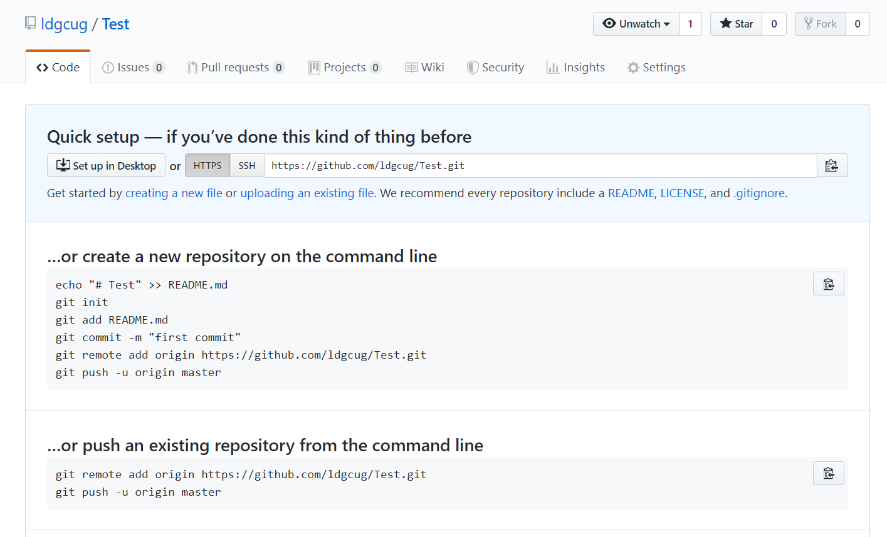

## 前言

> 有时候，在将代码上传到Github时，不可避免的会使用到Git相关的教程，本篇博客将暂时记录一下，Git使用过程中遇到过的一些问题，后面有时间会好好的学一学Git。

## 一、Git上传文件至Github

### 1.1 git配置

> 这里将不再介绍如何安装git，及git的一些相关配置，如有需要，可以直接查看[该文](https://ldgyyf.cn/2019/05/14/Hexo/Hexo-Github%E5%88%9B%E5%BB%BA%E5%8D%9A%E5%AE%A2%E8%BF%87%E7%A8%8B%E4%B8%AD%E8%B8%A9%E8%BF%87%E7%9A%84%E5%9D%91/)

### 1.2 Github创建new repository

> 在github上创建新的repository，创建后将出现如下界面



### 1.3 git上传文件

> 需要先创建一个新文件夹，然后在该文件夹下使用git bash打开git窗口，依次执行如下命令

（1）使用`git init`命令，将这个目录变成git可以管理的仓库

```nginx
git init # 对新的文件夹 都需要执行该操作
```

（2）使用`git add`命令，告诉Git，将文件添加到仓库

```nginx
git add README.md # 将单个文件README.md添加到git仓库
git add .  # 将该文件目录下的所有文件添加到git仓库
```

（3）使用`git commit`命令，把文件提交到仓库

``` nginx
git commit -m "对本次提交的注释"
```

（4）使用`git remote`命令，关联远程仓库

``` nginx
git remote add origin https://github.com/ldgcug/Test.git # 一定要注意链接地址
```

（5）使用`git push`命令，将本地仓库的内容推送到远程仓库

```nginx
git push -u origin master
```

**注：若已经执行过git init，且以前将文件也推送到远程仓库后，需要添加新的文件上传到远程仓库时，只需要执行下面的三条命令即可**

```nginx
git add README.md # 将单个文件README.md添加到git仓库
git commit -m "对本次提交的注释"
git push -u origin master
```

